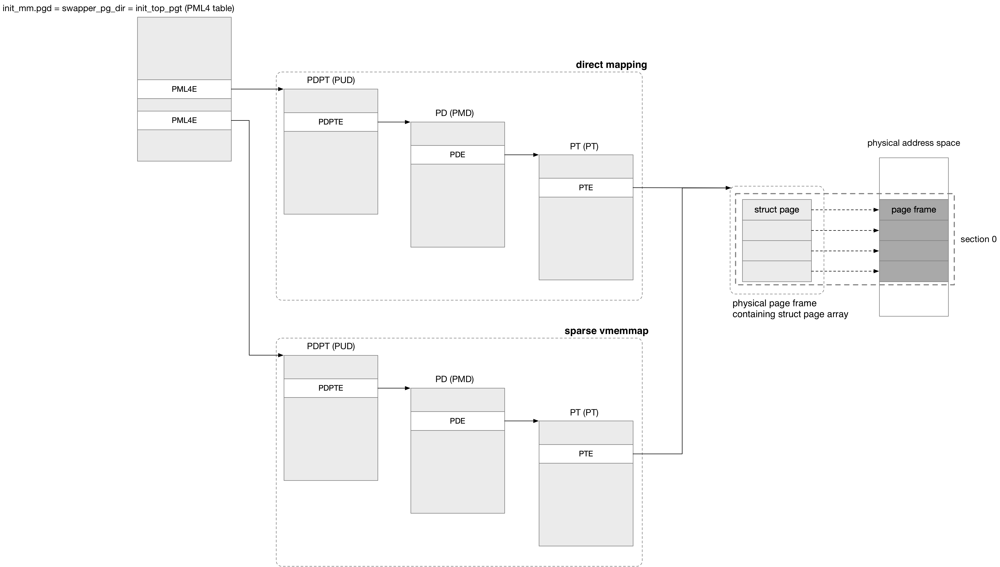

title:'MM - 03 Memory Model'
## MM - 03 Memory Model

内存子系统需要为每个 physical page frame 分配对应的 struct page 描述符，这些描述符需要在系统初始化的时候就全部静态分配完成

Memory Model 以 CPU 的视角描述了物理内存的布局情况，并因此影响了 struct page 描述符的布局情况

- UMA 系统通常使用 flat memory model
- NUMA 系统通常使用 sparse memory model 或 discontig memory model


如之前所述，内存子系统需要为每个 physical page frame 分配对应的 struct page 描述符，Memory Model 描述了这些描述符的布局情况，同时描述符布局情况的不同，自然也影响了  pfn (page frame number) 与对应的 struct page 描述符之间的映射，也就是 page_to_pfn()/pfn_to_page() 宏的实现方式

- 使用 page_to_pfn() 宏实现 struct page 到对应的 page frame number 的映射
- 使用 pfn_to_page() 宏实现 page frame number 到对应的 struct page 的映射

```c
#define page_to_pfn __page_to_pfn
#define pfn_to_page __pfn_to_page
```


### Flat Memory Model

> memory layout

flat memory model 将物理内存看作是一片连续的物理地址空间，适用于 UMA 系统

因而 flat memory model 中只有一个 node 描述符即 contig_page_data，此时使用静态定义的 @mem_map[] 全局数组管理系统的所有 struct page 描述符

```c
unsigned long max_mapnr;
struct page *mem_map;
```

flat memory model 中 page frame 的物理地址相对于内存的起始物理地址的偏移，与对应的 struct page 描述符在 mem_map[] 数组中的 index，具有一一对应的关系，因而可以非常方便地实现 pfn 与对应的 struct page 描述符之间的映射关系


> pfn/page mapping

```c
#define __pfn_to_page(pfn)	(mem_map + ((pfn) - ARCH_PFN_OFFSET))

#define __page_to_pfn(page)	((unsigned long)((page) - mem_map) + ARCH_PFN_OFFSET)
```

其中 ARCH_PFN_OFFSET 描述内存的起始物理地址对应的 pfn，其值是架构相关的


### Discontig Memory Model

> memory layout

在 NUMA 系统中，通常不同 node 之间的内存的物理地址并不连续，此时使用 discontig memory model 描述 NUMA 系统中的内存

此时维护一个 @node_data[] 数组描述 NUMA 系统中的所有 node 描述符

```c
extern struct pglist_data *node_data[];
```

```c
typedef struct pglist_data {
	struct page *node_mem_map;
	unsigned long node_start_pfn;
	...
} pg_data_t;
```

此时

- 每个 node 描述符的 @node_mem_map[] 数组管理该 node 下的物理内存对应的 struct page 描述符
- node 描述符的 @node_start_pfn 字段描述该 node 下的物理内存的起始 pfn


discontig memory model 的预设前提是，虽然不同 node 之间内存的物理地址不连续，但是同一个 node 下的内存的物理地址连续，即此时同一个 node 下采用 flat memory model


> pfn/page mapping

```c
#define __pfn_to_page(pfn) \
({unsigned long __pfn = (pfn);\
	unsigned long __nid = arch_pfn_to_nid(__pfn);  \
	NODE_DATA(__nid)->node_mem_map + arch_local_page_offset(__pfn, __nid);\
})
```

- arch_pfn_to_nid 宏将 pfn 转化为对应的 node number，其实现是架构相关的
- arch_local_page_offset 宏计算 pfn 在所在的 node 中的 pfn offset，其实现是架构相关的


```c
#define __page_to_pfn(pg)	 \
({const struct page *__pg = (pg); \
	struct pglist_data *__pgdat = NODE_DATA(page_to_nid(__pg)); \
	(unsigned long)(__pg - __pgdat->node_mem_map) + \
	 __pgdat->node_start_pfn; \
})
```

- page_to_nid() 返回当前 struct page 描述符所在的 node number，page 描述符的 flags 字段存储有该 page frame 所在的 node id


### Sparse Memory Model

discontig memory model 虽然适用 NUMA 系统，但是并不适用于内存可以 hotplug 的场景，在这一场景下同一个 node 下的内存的物理地址仍可能是不连续的，因而内核使用 sparse memory model 来适配这一场景

sparse memory model 中将系统整个的内存物理地址空间划分为一个个的 section，由于 section 的粒度更小，只要使得 section 的粒度小于热插拔的内存单元的大小，就可以使得单个 section 内部的内存物理地址必定是连续的，而不会存在任何空洞

discontig memory model 实际依赖于“整个 node 的内存的物理地址是连续的”这一假设，因而实际上是将 discontig memory model 与 NUMA 这两个概念绑定在一起，即 discontig memory model 只适用于 NUMA 架构；而 sparse memory model 则是以 section 为单位，从而摆脱了与 node 之间的联系，因而同时适用于 UMA 与 NUMA 架构


> section

section 的大小由 SECTION_SIZE_BITS 描述 ，其值是架构相关的，x86-64 架构下 SECTION_SIZE_BITS 的值为 27，即 section 的大小为 128 MB

```c
/*
 * SECTION_SIZE_BITS		2^n: size of each section
 */
#define SECTION_SIZE_BITS	27 /* matt - 128 is convenient right now */
```


struct mem_section 描述一个 section，其 @section_mem_map 字段指向一个 struct page 描述符数组，该数组维护该 section 下的所有 page 描述符

```c
struct mem_section {
	unsigned long section_mem_map;
	...
};
```


#### normal sparse layout

在一开始的实现中，系统静态定义一个 struct mem_section 数组，即 mem_section[]

```c
struct mem_section mem_section[NR_SECTION_ROOTS][SECTIONS_PER_ROOT];
```

此时

- SECTIONS_PER_ROOT 的值为 1
- NR_SECTION_ROOTS 的值为 NR_MEM_SECTIONS 即系统最多能够容纳的 section 的数量，其值是架构相关的，x86-64 架构下 Linux 最多支持 4096TB 的物理内存，每个 section 的大小为 128 MB，因而此时将整个内存的物理地址空间划分为 32M 个 section


因而 @mem_section[] 实际上相当于是一个一维的数组，这个数组的大小就是系统最多能够容纳的 section 的数量


@mem_section[] 数组是静态定义的，但是每个 section 的 @section_mem_map 字段指向的一段存储 struct page 描述符的内存却是动态分配的，这段内存就用于存储该 section 对应的所有 struct page 描述符


> pfn/page mapping

```c
#define __pfn_to_page(pfn) \
({unsigned long __pfn = (pfn); \
	struct mem_section *__sec = __pfn_to_section(__pfn); \
	__section_mem_map_addr(__sec) + __pfn; \
})
```

- __pfn_to_section() 返回当前 pfn 对应的 struct mem_section 描述符，首先计算该 pfn 对应的 section number，之后使用该 section number 作为 @mem_section[] 数组的 index，即可得到该 pfn 对应的 struct mem_section 描述符
- struct mem_section 描述符的 @section_mem_map 字段指向一个 struct page 描述符数组，因而根据当前 pfn 在该 section 中的 local offset，即可获得该 pfn 对应的 page 描述符

这里需要注意的是 struct mem_section 描述符的 @section_mem_map 字段存储的实际是 (mem_map's address - start_pfn)，即 (page 描述符数组的基地址 - 该 section 的 start pfn)，因而这里 @section_mem_map 直接加上 pfn 就得到该 pfn 对应的 page 描述符


```c
#define __page_to_pfn(pg)	\
({const struct page *__pg = (pg); \
	int __sec = page_to_section(__pg); \
	(unsigned long)(__pg - __section_mem_map_addr(__nr_to_section(__sec))); \
})
```


#### extremely sparse layout

以上介绍的 normal sparse layout 格式相当于静态定义了一个一维的 struct mem_section 数组，此时无论该物理地址处的内存是否已经插入，该物理地址对应的 struct mem_section 都已经被分配而占用一定的内存空间，当系统的物理内存布局非常稀疏时，这就会带来一定的内存浪费

因而一种改进的实现为，静态定义一个 struct mem_section 指针数组，只有当特定物理地址处的内存插入时，才动态分配一个 page frame 以作为 struct mem_section 数组

```c
struct mem_section *mem_section[NR_SECTION_ROOTS];
```

这里 NR_SECTION_ROOTS 的值是

```
(NR_MEM_SECTIONS / (PAGE_SIZE / sizeof (struct mem_section)))
```

也就是 @mem_section[] 数组的一个指针指向一个 page frame，这个 page frame 全部用于存储 (PAGE_SIZE / sizeof (struct mem_section)) 数量的 struct mem_section 描述符

该特性由 CONFIG_SPARSEMEM_EXTREME 配置项控制


#### sparse vmemmap

以上介绍的 normal sparse layout 与 extremely sparse layout，为了实现 page_to_pfn() 宏，需要在 page 描述符的 flags 标志位存储该 page frame 所在的 section number；而为了实现 pfn_to_page() 宏，需要在 pfn 的 high bits 存储该 page frame 所在的 section number

这种方式称为 classic sparse，由于 page 描述符的 flags 标志位通常还需要存储其他的各种标志位，例如 page frame 所在的 node number 等，因而这会给 flags 标志位的可用位数造成一定压力

一种改进的方式是使用 sparse vmemmap，其主要思想是，在内存 hotplug 的时候，和以前一样会动态地分配 physical page frame 用于 struct page 描述符数组，这些 physical page frame 已经实现 direct memory mapping

此时在 direct memory mapping 的基础上额外分配一个虚拟地址区间。假设系统的整个物理地址空间 (从 0 地址开始) 都用于内存，即需要为系统的整个物理地址空间分配一个一维的 page 描述符数组，那么这个额外分配的虚拟地址区间就映射向这个一维的 page 描述符数组，即这个虚拟地址区间的起始处映射为 pfn 0 对应的 struct page 描述符，其后的是 pfn 1 对应的 struct page 描述符，以此类推




sparse vmemmap 方案需要额外占用一块较大的虚拟地址区间，因而该特性通常只用于 64 bit 架构，例如 x86_64 架构下这块虚拟地址区间为 (ffffea0000000000 ~ ffffeaffffffffff)，一共占用 1 TB 大小

此时从这块额外的虚拟地址区间来看，整个系统只使用一个一维的 page 描述符数组，其相当于 flat memory model，因而可以大大简化 page 描述符与对应 pfn 之间的计算过程，从而提高一定的性能


> pfn/page mapping

```c
/* memmap is virtually contiguous.  */
#define __pfn_to_page(pfn) (vmemmap + (pfn))
#define __page_to_pfn(page) (unsigned long)((page) - vmemmap)
```

```c
#define vmemmap ((struct page *)VMEMMAP_START)
```

vmemmap 即为 virtual memory mapping 虚拟地址区间的起始地址 (x86_64 架构下的值为 0xffffea0000000000)，并表现为一个 struct page 数组

此时以 pfn 作为 index，在 vmemmap[] 数组中即可找到该 page frame 对应的 struct page 描述符；根据 struct page 描述符在 vmemmap[] 数组中的偏移，即可计算出该 page frame 对应的 pfn
