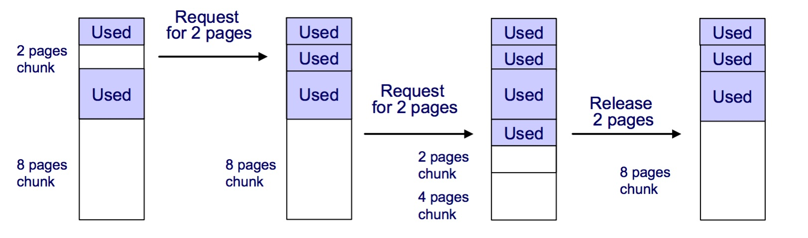
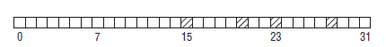
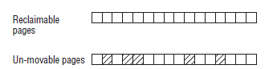
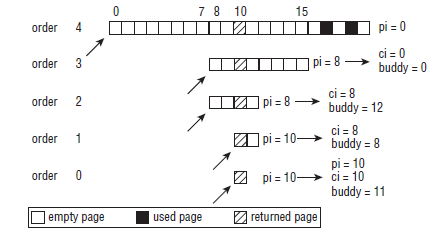
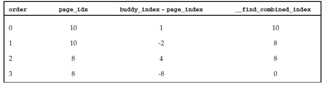

## MM - 2 Buddy System


外碎片（external fragmentation）是内存管理的一个重要问题。外碎片是指当频繁请求和释放不同大小的一组连续页框时，导致在已分配页框的块内分散着许多小块的空闲页框，从而导致即使存在足够多的空闲页框，但是由于这些空闲页框过于分散，导致无法满足大块的连续页框的分配请求

解决外碎片问题的方法有两种

1. 利用 MMU 的分页单元将一组非连续的空闲页框映射至连续的线性地址空间，例如 vmalloc
2. 优化内存分配和释放的算法，以尽量避免为满足小块内存的分配请求而对大块内存进行分割，例如利用伙伴算法分配和释放内存


伙伴系统（buddy system）是一种管理、分配和释放内存的算法，主要用于解决内存的外碎片问题

buddy system 中内存分配的基本单位为 page frame，算法分配的实际上是 2^k (k=0,1,2...10) 个连续 page frame 组成的内存块





系统维护一组（11 个）链表以管理所有的空闲页框。每个链表将大小为 2^k (k=0,1,2...10) 的连续页框的内存块组织在一起，即该组链表分别包含大小为 1，2，4...1024 个页的连续内存块


### Concept

#### buddy system

buddy system 是 per-zone 的，每个 node 的每个 zone 都维护有一个 buddy system，也就是说各个 zone 的内存管理是相对独立的

之前介绍过，buddy system 分配的是一个连续的内存块，这些内存块的大小可以是 2^k (k=0,1,2...10) 个 page frame 大小

buddy system 中维护 MAX_ORDER 即 11 组链表来管理一个 zone 下不同大小的内存块，其中的每组链表管理 2^k 个 page frame 大小的内存块，即这 11 组链表依次管理大小为 1、2、4 ... 1024 个 page frame 的内存块

```c
struct zone {
	struct free_area	free_area[MAX_ORDER];
	...
}
```


zone 描述符的 free_area[] 数组就描述这些链表，该数组的第 k 个元素就用于组织大小为 2^k 页的空闲内存块，该元素的 @free_list 链表用于组织所有这些空闲内存块，@nr_free 字段描述这些空闲内存块的数量

```c
struct free_area {
	struct list_head	free_list[MIGRATE_TYPES];
	unsigned long		nr_free;
};
```

free_area 的 @free_list 字段实际上包含一组链表，也就是说相同大小的内存块实际上也是按照迁移类型组织为多个链表


#### migrate type

Buddy System 只能在页帧回收的时候通过合并 buddy 内存块来减少外部碎片，然而其对分配的页块的位置不作限制，因而当分配的页块在物理内存中稀疏分布时，就会带来外部碎片问题



上图中分配的 4 个页帧在物理内存中稀疏分布，从而导致无法分配较大的物理连续的内存


Linux 引进物理内存的 migrate type 概念，例如将物理内存分为 movable、unmovable 类型，当分配内存时优先分配对应类型的内存，例如当需要分配 unmovable 类型的内存时优先分配该类型的内存，此时 unmovable 类型内存的外部碎片问题就不会影响其它类型的内存




##### migrate type

```c
enum {
	MIGRATE_UNMOVABLE,
	MIGRATE_RECLAIMABLE,
	MIGRATE_MOVABLE,
	MIGRATE_HIGHATOMIC,
	MIGRATE_TYPES
};
```

linux 按照物理内存是否可以迁移的属性将其分为多个类型

MIGRATE_UNMOVABLE 描述不可移动的页帧，通常为内核态程序使用的页帧

MIGRATE_RECLAIMABLE 描述可回收的页帧，这种页帧不可移动但可以删除后将数据自动迁移到其它页帧，通常为内核缓存使用的页帧，例如 page cache

MIGRATE_MOVABLE 描述可移动的页帧，通常为用户态程序使用的页帧，此时当需要移动该页帧时只需修改该应用态程序的页表以修改页帧与线性地址的映射关系

MIGRATE_HIGHATOMIC 描述预留的以应对 low memory emergency 的页帧


##### fallback type

一般情况下 Buddy System 会优先分配相应类型的内存，当该类型的内存当前不存在相应大小的空闲页块时，会根据该类型的 fallback list 依次在相应类型的内存中寻找合适的空闲页块

```c
static int fallbacks[MIGRATE_TYPES][4] = {
	[MIGRATE_UNMOVABLE]   = {MIGRATE_RECLAIMABLE, MIGRATE_MOVABLE,     MIGRATE_RESERVE},
	[MIGRATE_RECLAIMABLE] = {MIGRATE_UNMOVABLE,   MIGRATE_MOVABLE,     MIGRATE_RESERVE},
	[MIGRATE_RESERVE]     = {MIGRATE_RESERVE}, /* Never used */
};
```

例如当 unmovable 类型的内存不存在相应大小的空闲页块时，将依次在 reclaimable、movable、reserve 类型的内存中寻找合适大小的空闲页块


##### migrate type lists

之前介绍过，一个 struct free_area 就用于管理特定大小的内存块，其中的 @free_list 字段实际上包含一组链表，为了进一步减小外碎片问题，所有的内存块根据其是否可以被释放或迁移而归类于其中一个链表，例如所有具有不可迁移属性的内存块被组织于 @free_list[MIGRATE_UNMOVABLE] 链表中

```c
struct free_area {
	struct list_head	free_list[MIGRATE_TYPES];
	...
};
```


#### list organization

之前介绍过，buddy system 中使用链表组织各种大小、各种迁移类型的内存块，这些链表中的 page 描述符实际上是这个内存块的起始 page frame 对应的 page 描述符

```c
struct page {
	union {
		struct {	/* Page cache and anonymous pages */
			/**
			 * @lru: Pageout list, eg. active_list protected by
			 * zone_lru_lock.  Sometimes used as a generic list
			 * by the page owner.
			 */
			struct list_head lru;
			/**
			 * @private: Mapping-private opaque data.
			 * Usually used for buffer_heads if PagePrivate.
			 * Used for swp_entry_t if PageSwapCache.
			 * Indicates order in the buddy system if PageBuddy.
			 */
			unsigned long private;
			...
		};
	};
	...
}
```

当将一个内存块添加到 buddy system 的时候，这个内存块中起始 page frame 对应的 page 描述符被添加到 buddy system 对应的链表中，其中 @private 字段保存该内存块的 order，通过 @lru 字段添加到对应的链表中


由于 buddy system 管理的 physical page frame block 都是物理地址连续的，因而在确定起始 page frame 以及该 page frame block 的大小之后，即可确定该 page frame block 对应的 pfn 区间，此时通过 memory model 即可获取该 pfn 区间对应的所有 page 描述符


### Routine

#### fill buddy system

系统初始化阶段会从 device tree (ARM)、BIOS (x86) 等获取系统的物理内存拓扑信息，并保存在 meminfo 中；之后 buddy system 初始化的时候，将 meminfo 中保存的物理内存区间统一填充到 buddy system 中，即将各个大小、各个迁移类型的内存块填充到各个 free list 中

例如 ARM 下的路径为

```
start_kernel
    mm_init
        free_unused_memmap
        free_all_bootmem
        free_highpages
```

实际上最终都是调用 __free_page() 将内存块填充到 buddy system 中


#### free pages

释放内存块的入口为 __free_pages()

```
__free_pages
    __free_pages_ok
        free_one_page
            __free_one_page
```

释放的主要操作在 __free_one_page() 中进行

- 在一个 while 循环中寻找当前可以释放的最大内存块，只要当前释放的内存块的 order 小于 MAX_ORDER-1，就继续寻找当前释放的内存块的 buddy 内存块
    - 调用 __find_buddy_index() 寻找当前释放的内存块的 buddy 内存块
    - 若该 buddy 内存块当前不是空闲状态则退出循环，否则将该 buddy 内存块从其所属的 free list 中移除，并将当前需要释放的内存块的 order 加 1
    - 重复以上循环
- 最终需要释放的内存块的大小为 2^order，此时当其对应的 2^(order+1) 的 buddy 内存块处于空闲状态时，说明当前 2^order 大小的内存块释放后，在不久之后很有可能与其 2^(order+1) 的 buddy 内存块相合并，因而在释放时将当前 2^order 大小的内存块添加到对应的 free list 的尾部，以防止该内存块被释放后又马上被分配
- 否则只是将当前 2^order 大小的内存块添加到对应的 free list 的头部


以上函数中会调用到 __find_buddy_index() 寻找当前内存块的 buddy 内存块，其中当前内存块的起始 page frame 的 pfn 为 @page_idx，其大小为 2^order，函数返回 buddy 内存块的起始 page frame 的 pfn

```c
static inline unsigned long
__find_buddy_index(unsigned long page_idx, unsigned int order)
{return page_idx ^ (1 << order);
}
```

其计算过程为

- 其 buddy 内存块的起始 page frame 的 pfn 为 (page_idx ^ (1 << order))
- 其 parent 内存块的起始 page frame 的 pfn 为 (page_idx & ~(1 << order))






例如上例中需要释放的 内存块 的 order 为 0，其 page_idx 为 10，则其 buddy block 的 page_idx 为 11


#### allocate pages

分配内存块的入口为 rmqueue()，从相应 zone 分配相应 migrate type 的 order 大小的空闲内存块

```
rmqueue
    __rmqueue
```

__rmqueue() 中

- 调用 __rmqueue_smallest() 扫描该 zone 中 migratetype 类型的空闲页块链表，寻找合适的空闲页块
- 若 __rmqueue_smallest()失败，则调用 __rmqueue_fallback() 扫描其他迁移类型的空闲页块链表以寻找合适的页块
- 若 __rmqueue_fallback() 失败，则从预留的内存区块分配页块


> __rmqueue_smallest

__rmqueue_smallest() 在当前 zone 的 migratetype 类型的空闲页块链表中寻找 2^order 大小的空闲页块，函数返回寻找到的相应空闲页块的起始页的页描述符

- 若此时没有该大小的空闲页块，则寻找 2^(order+1) 大小的空闲页块，并依此类推，直到寻找 2^MAX_ORDER 大小的空闲页块
- 调用 expand()，若最终找到的空闲页块的大小大于 2^order，则在找到的空闲页块中拆分出 2^order 大小的页块，并将其余部分返回给 buddy system，即将其添加到相应的 free_list 链表中


> __rmqueue_fallback

__rmqueue_fallback() 从当前 migrate type 的 fallback list 指定的 migrate type 中寻找合适大小的空闲页块

- 在第一层 for 循环中从最大 order 开始寻找合适大小的空闲页块，即 buddy system 在 fallback 中倾向于找到尽可能大的空闲页块，以缓解外部碎片问题
- 在第二层 for 循环中从当前 migrate type 的 fallback list 指定的 migrate type 中依次寻找合适大小的空闲页块
- 若当前遍历的 migrate type 为 MIGRATE_RESERVE，则跳过当前过程，继续遍历下一个 migrate type
- 若当前遍历的 migrate type 中没有相应 order 大小的空闲页块，则跳过当前过程，继续遍历下一个 migrate type
- 否则获取当前遍历的 migrate type 中 order 大小的空闲页块的首页帧的页描述符
- 若当前实际分配的页块为 large block (其中 large block 的标准由 pageblock_order 宏界定，其值一般为 11，即当 order 大于等于 5 时该内存块即为 large 内存块)，则调用 move_freepages_block() 将当前分配的页块的 migrate type 修改为分配所需的 migrate type，即将该页块移到之前短缺的 migrate type 的 free list 中；当实际分配的页块不是 large block 时，说明当前 migrate type 的内存储备也已经不足，因而此时就不能将当前分配的页块修改为其它 migrate type
- 同时当最初需要分配的内存块的 migrate type 为 MIGRATE_RECLAIMABLE，则同样执行以上操作
- 最后从该内存块中分配所需大小的内存块，由于当前实际分配的页块的大小很有可能大于所需的页块大小，则调用 expand() 对其进行拆分


