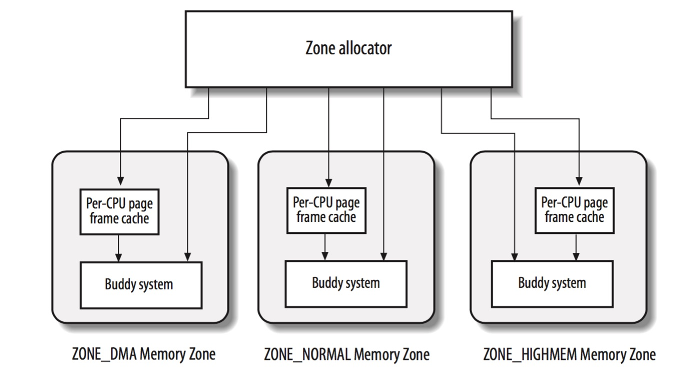

title:'MM - 3 Zoned Page Frame Allocator'
## MM - 3 Zoned Page Frame Allocator


zoned page frame allocator 在 buddy system 的基础上以 page frame 为单位动态分配或释放连续内存块，相当于 buddy system 是内部实现，而 zoned page frame allocator 是对外的接口

当接收到分配请求时，zoned page frame allocator 根据请求分配的内存地址选择符合要求的 zone，之后由各个 zone 的 buddy system 负责内存分配的具体操作




### API

#### Descriptor based Interface

```c
struct page *alloc_pages(unsigned int gfp_mask, unsigned int order);
```

alloc_pages() 分配 2^order 个连续的 page frame，gfp_mask 描述需要分配的 page frame 的性质

分配成功返回第一个 page frame 的描述符, 失败返回 NULL

alloc_pages() 可以分配 lowmem page frame，也可以分配 highmem page frame

- 当分配 lowmem page frame 时，由于 global page table 已经实现 lowmem 的 virtual address 与 physical address 的映射，因而分配的 lowmem page frame 已经具有对应的 virtual address
- 当分配 highmem page frame 时，由于 global page table 中只实现 lowmem 的 virtual address 与 physical address 的映射，因而分配的 highmem page frame 只有 physical address，而没有对应的 virtual address


```c
struct page *alloc_page(unsigned int gfp_mask);
```

alloc_page() 与 alloc_pages() 相似，只是分配一个 page frame
 

```c
void __free_pages(struct page *page, unsigned int order);
```

__free_pages() 释放特定 page frame 描述符起始的一个或多个的 page frame


```c
void __free_page(struct page *page);
```

__free_page() 与 __free_pages() 相似，只是释放一个 page frame


```c
void *page_address(struct page *page);
```

page_address() 返回特定 page frame 的线性地址，当该 page frame 处于高端内存范围内同时尚未进行映射时，函数返回 NULL


#### Linear Address based Interface

```c
unsigned long __get_free_pages(unsigned int gfp_mask, unsigned int order);
```

__get_free_pages() 分配 2^order 个连续的 page frame，gfp_mask 描述需要分配的 page frame 的性质
分配成功返回第一个 page frame 的线性地址, 失败返回 0

__get_free_pages() 不能用于分配 highmem page frame，因而分配的 highmem page frame 尚未映射对应的 virtual address


```c
unsigned long __get_free_page(unsigned int gfp_mask);
```

__get_free_page()与 __get_free_pages() 相似，只是分配一个 page frame


```c
unsigned long __get_zeroed_page(unsigned int gfp_mask);
```

__get_zeroed_page()与 __get_free_page() 相似，同时初始化 page frame 的内容全为 0


```c
unsigned long __get_dma_pages(unsigned int gfp_mask, unsigned int order);
```

__get_dma_pages()与 __get_free_pages() 相似，只是分配适用于 DMA 操作的 page frame


```c
void free_pages(unsigned long addr, unsigned int order);
```

free_pages() 释放特定线性地址起始的一个或多个的 page frame


```c
void free_page(unsigned long addr);
```

free_page()与 free_pages() 相似，只是释放一个 page frame


### Routine

#### allocate pages

zoned page frame allocator 分配内存块的接口为 alloc_pages()，其中会调用 buddy system 提供的接口 rmqueue() 完成实际的分配工作

```
alloc_pages
    alloc_pages_node
        __alloc_pages
            __alloc_pages_nodemask
                get_page_from_freelist
                    rmqueue
                __alloc_pages_slowpath
```

分配的主要操作在 __alloc_pages_nodemask() 中完成，其中包含两条路径

1. fast path，调用 get_page_from_freelist() 直接从 free list 中申请分配 order 大小相应 migrate type 类型的 page block
2. slow path，当 fast path 分配 page block 失败时，调用 __alloc_pages_slowpath()，在执行唤醒 kswapd 线程 (page swap daemon) 换出一些不经常使用的页、内存压缩 (memory compact)、内存回收 (memory reclaiming) 等操作之后，再重新尝试分配


#### free pages

zoned page frame allocator 释放内存块的接口为 __free_pages()，这同时就是 buddy system 释放内存块的入口


### gfp_mask flags

通过 zoned page frame allocator 分配内存块的时候，需要传入 gfp_mask 标志位，该标志位决定了接下来分配过程的行为

gfp_mask 标志位可以划分为多个部分

#### zone modifier

zone modifier 描述从哪个 zone 分配内存，其决定 free page frame 的搜索路径

zone modifier | 描述
------- |------
__GFP_DMA | 从 ZONE_DMA 分配
__GFP_DMA32 | 从 ZONE_DMA32 分配
__GFP_HIGHMEM | 依次从 ZONE_HIGHMEM/ZONE_NORMAL/ZONE_DMA32/ZONE_DMA 分配

1. 当存在 __GFP_DMA 标志时，只能从 ZONE_DMA 区域分配
2. 当存在 __GFP_DMA32 标志时，只能从 ZONE_DMA32 区域分配
3. 否则当存在 __GFP_HIGHMEM 标志时，将依次从 ZONE_HIGHMEM、ZONE_NORMAL、ZONE_DMA32 以及 ZONE_DMA 区域分配
4. 否则即默认情况下将依次从 ZONE_NORMAL、ZONE_DMA32 以及 ZONE_DMA 区域分配

因而默认情况下当未指定 zone modifier 时，通常从 ZONE_NORMAL 分配内存


此外 zone modifier 中还可以指定分配的内存的迁移类型

zone modifier | 描述
------- |------
__GFP_MOVABLE | 从 buddy system 的 MIGRATE_MOVABLE 链表分配内存
__GFP_RECLAIMABLE | 从 buddy system 的 MIGRATE_RECLAIMABLE 链表分配内存

默认情况下当未指定以上标志位时，通常从 buddy system 的 MIGRATE_UNMOVABLE 链表分配内存


#### watermark modifier

watermrk modifier |
---- |
__GFP_ATOMIC |
__GFP_HIGH |
__GFP_MEMALLOC |
__GFP_NOMEMALLOC |


#### reclaim modifier

reclaim modifier |
---- |
__GFP_IO |
__GFP_FS |
__GFP_DIRECT_RECLAIM |
__GFP_KSWAPD_RECLAIM |
__GFP_RECLAIM |
__GFP_NORETRY |
__GFP_RETRY_MAYFAIL |
__GFP_NOFAIL |


> __GFP_KSWAPD_RECLAIM

alloc page slow path 中，当设置有 __GFP_KSWAPD_RECLAIM 标志时，会唤醒 kswapd 线程（page swap daemon），换出一些不经常使用的页


> __GFP_DIRECT_RECLAIM

alloc page slow path 中，当设置有 __GFP_DIRECT_RECLAIM 标志时，会在当前进程上下文中执行内存压缩（direct memory compact）、内存回收（direct memory reclaiming）等操作，以释放一些页


> __GFP_RECLAIM

\_\_GFP_RECLAIM 实际上是 (\_\__GFP_DIRECT_RECLAIM|___GFP_KSWAPD_RECLAIM)


> __GFP_NORETRY

alloc page slow path 中，在以上 wakeup kswapd、direct memory compact、direct memory reclaiming 等操作之后，如果还是分配失败，那么默认如果之前执行的 direct memory compact、direct memory reclaiming 操作是有进展的，也就是说之前执行的这些操作有回收一定数量的页，那么会重复循环执行之前的 direct memory compact、direct memory reclaiming 操作，之后再尝试分配内存

但是如果设置有 __GFP_NORETRY 标志，那么就不会走以上逻辑，而是直接返回失败


> __GFP_RETRY_MAYFAIL

上文介绍过有可能会 loop 执行 direct memory compact、direct memory reclaiming 操作

如果当前申请分配的 page frame 数量小于等于 (2^PAGE_ALLOC_COSTLY_ORDER) 即 8 个，那么默认就会走上文 loop 执行 direct memory compact、direct memory reclaiming 的路径

但是如果当前申请分配的 page frame 数量超过了这个限制 (2^PAGE_ALLOC_COSTLY_ORDER)，那么默认不会走这个 loop 路径，而是直接返回失败，除非设置有 __GFP_RETRY_MAYFAIL 标志

事实上无论是因为当前申请分配的 page frame 数量小于等于 (2^PAGE_ALLOC_COSTLY_ORDER)，还是因为当前设置有 __GFP_RETRY_MAYFAIL 标志，只有之前执行的 direct memory compact、direct memory reclaiming 操作有进展的情况下才会 loop 执行 direct memory compact、direct memory reclaiming 操作，否则会直接再次申请分配内存，但是这次分配内存是有“风险”的，如果这次内存分配再次失败，那么之后很有可能会触发 oom killer

这也是 __GFP_RETRY_MAYFAIL 标志命名中 "may fail" 的由来


> __GFP_NOFAIL

zoned page frame allocator 中当内存分配失败时，默认会返回错误退出，但是如果设置有 __GFP_NOFAIL 标志，那么还会

- 尝试从 MIGRATE_HIGHATOMIC freelist 即预留的内存中分配
- 如果以上尝试也失败了，那么会调用 cond_resched() 让出调度；之后恢复调度后，重复之前从普通 migratetype 的 freelist 中分配内存，从而构成一个循环

也就是说当设置 __GFP_NOFAIL 标志时，会在一个循环中分配内存


> __GFP_IO

alloc page slow path 中会执行 direct memory reclaiming 操作，其中有可能将 anonymous page 写到 swap 区域，从而释放这些 anonymous page 内存

然而以上将 anonymous page 写到 swap 区域的过程中会触发 IO 操作，如果当前正是在 IO 路径中分配内存的时候触发的 alloc page slow path，此时就会形成循环依赖，从而造成死锁

因而只有在指定 __GFP_IO 标志时，direct memory reclaiming 中才会执行以上这些可能触发 IO 的操作，例如将 anonymous page 写到 swap 区域


> __GFP_FS

alloc page slow path 中会执行 direct memory reclaiming 操作，其中有可能将 dirty file mapped page 回写，从而释放这些 file mapped page 内存

然而以上将 dirty file mapped page 回写的过程中会触发文件系统的操作，如果当前正是在文件系统的路径中分配内存的时候触发的 alloc page slow path，此时就会形成循环依赖，从而造成死锁

因而只有在指定 __GFP_FS 标志时，direct memory reclaiming 中才会执行以上这些可能触发文件系统的操作，例如将 dirty file mapped page 回写


#### action modifier

action modifier 描述内核应当如何分配所需的内存

action modifier |
---- |
__GFP_NOWARN |
__GFP_COMP |
__GFP_ZERO |


#### group flag

group flag 是一些常用的 gfp_mask 标志位的组合，实际上 zoned page frame allocator 接口传入的 gfp_mask 参数大部分是 group flag

group flag | 描述
--------|------
GFP_ATOMIC |	__GFP_HIGH, __GFP_ATOMIC, __GFP_KSWAPD_RECLAIM
GFP_KERNEL | __GFP_RECLAIM, __GFP_IO, __GFP_FS
GFP_NOWAIT | __GFP_KSWAPD_RECLAIM
GFP_NOIO | __GFP_RECLAIM
GFP_NOFS | __GFP_RECLAIM, __GFP_IO
GFP_USER | __GFP_RECLAIM, __GFP_IO, __GFP_FS, __GFP_HARDWALL

GFP_ATOMIC 原子地分配内存，不会睡眠，用于中断处理程序、下半部、持自旋锁的进程上下文
GFP_KERNEL 常规分配方式，可能睡眠，用于睡眠安全的进程上下文中


