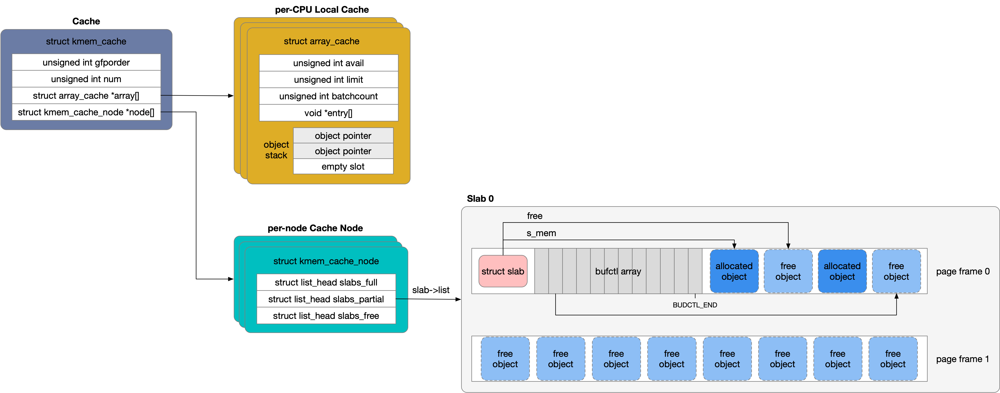
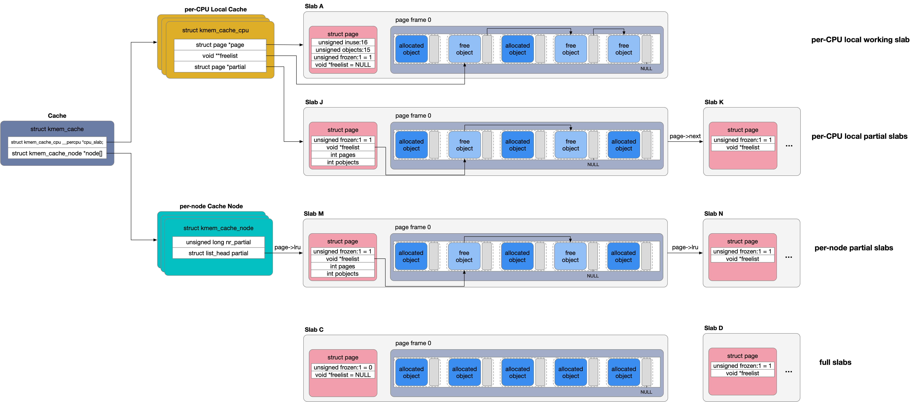

## MM - 4 Slab Allocator


Slab Allocator 用于分配小块的内存，即小于 page frame 的内存块，通常用于一定大小的内存块（例如 32、64、128 字节大小）或特定数据结构的分配

当前 Linux 中 Slab Allocator 具有 slab、slub、slob 三种实现


### slab

slab 即为 classic slab allocator，即最早版本的 slab allocator




#### architecture

slab 中主要存在四个重要的数据结构

1. cache descriptor
2. per-CPU local cache descriptor
3. per-node cache node descriptor
4. slab descriptor


##### cache descriptor

描述一个缓存有特定大小的通用内存块或特定数据结构的缓存

```c
struct kmem_cache
```

##### per-node cache node descriptor

NUMA 架构下一个 cache 在每个 memory node 下都会分配一个 cache node，cache node 用于管理该 memory node 下的 slab descriptor，即当通过 slab allocator 分配内存时，将优先在当前 CPU 所在的 memory node 下分配内存，即优先通过当前 CPU 所在的 memory node 对应的 cache node descriptor 分配内存

cache descriptor 的 node[] 指针数组即指向该 cache 对应的一组 per-node cache node descriptor

```c
struct kmem_cache {
	...
	struct kmem_cache_node *node[MAX_NUMNODES];
};
```

每个 cache node descriptor 维护三个链表以管理该 memory node 下的所有 slab descriptor

```c
struct kmem_cache_node {
	struct list_head slabs_partial; /* partial list first, better asm code */
	struct list_head slabs_full;
	struct list_head slabs_free;
	...
};
```

- full list 链表管理所有 object 都已经分配出去的 slab descriptor
- free list 链表管理所有 object 都尚未被分配的 slab descriptor
- partial list 链表管理部分 object 分配出去，而部分 object 则尚未被分配的 slab descriptor


##### slab descriptor

当 slab 中的 object 已经全部分配出去而需要分配新内存时，实际依赖于 zoned page frame allocator 以 page frame 为单位分配新内存

这些一次性分配的一个或多个 page frame 共同构成一个 slab，由 slab descriptor 描述，因而相当于以 slab 为单位管理 slab allocator 中的所有内存，即当 object 已经全部分配出去时就分配一个新的 slab


> num of page frame per slab

一个 slab 包含的 page frame 的数量即一次性分配的 page frame 的数量，由该 slab allocator 缓存的 object 的大小决定，其算法为

- 由于 zoned page frame allocator 可以分配 2^k, k = 0,1,...,10 个连续的 page frame，因而假设 slab 一次性分配 1 个连续的 page frame，则
    - 在分配的连续 page frame 中去除 slab descriptor、bufctl array 占用的内存空间后，剩余的内存空间用于存储 object，此时计算可以存储的 object 的数量 (num_of_objects)
    - 在分配的连续 page frame 中去除 slab descriptor、bufctl array 以及所有 object 占用的内存空间后，计算剩余的内存空间的大小 (remain_in_bytes)
    - 此时若 num_of_objects 大于 0，同时 remain_in_bytes 小于等于 1/8 的连续 page frame 的大小，则认为当前选择的连续 page frame 的数量合理
- 否则继续尝试分配 2 个连续的 page frame，重复以上算法过程，一直到尝试分配 10 个连续的 page frame


因而以上算法过程实际可以概括为

1. slab 包含的 page frame 的数量与 zoned page frame allocator 保持同步，但优先从比较小的数值开始
2. 分配的连续 page frame 至少可以存储一个 object，同时内部碎片必须足够小，即剩余浪费的内存空间必须小于等于分配的总内存的 1/8

cache 创建过程中会计算该 cache 的一个 slab 包含的连续 page frame 的数量，并将计算结果保存在 cache desriptor 的 gfporder、num 字段，其中

- 一个 slab 包含的连续 page frame 的数量即为 (2^gfporder)
- num 字段描述一个 slab 中可以包含的 object 的最大数量


slab allocator 实际以 slab 为单位分配新内存，slab allocator 只要内存不够就会在当前申请分配 object 的 CPU 所在的 memory node 下分配一个新的 slab，即在当前 CPU 所在的 memory node 下分配 page frame，新分配的 slab 会被添加到对应 cache node descriptor 的 free list 链表中

slab allocator 可以无限制地一直分配新的 slab，直到系统出现 low memory


> structure of slab

一个 slab 包含的连续 page frame 中存储以下几种数据

1. slab descriptor

slab descriptor 可以保存在 slab 内部，即保存在 slab 分配的连续 page frame 的头部；也可以保存在 slab 外部，此时使用专门分配 slab descriptor 的 cache 分配 slab descriptor 

2. object

3. bufctl array

在 slab descriptor 与 object 之间需要维护一个 bufctl array，bufctl array 其实是一个 int 数组，该数组中包含的 int 元素的个数与该 slab 中包含的 object 的数量保持一致，即为该 slab 中的每个 object 维护一个 int 元素

bufctl array 实际将该 slab 中的所有 free object 组织成一个单向链表，其中

- slab descriptor 的 s_mem 字段描述该 slab 中第一个 object 的虚拟地址
- slab descriptor 的 free 字段描述该 slab 中第一个 free object 在所有 object 中的偏移，由于一个 slab 中 object 的存储是连续的，即所有 object 相当于组成一个数组，此时在数组的基地址（slab descriptor 的 s_mem 字段）以及第一个 free object 在数组中的偏移（slab descriptor 的 free 字段）已知的情况下，就可以计算 slab 中第一个 free object 的虚拟地址
- 若一个 free object 在数组中的偏移为 i，那么 bufctl_array[i] 就存储下一个 free object 在数组中的偏移，相似地就可以计算下一个 free object 的虚拟地址，从而将一个 slab 中的所有 free object 组织成一个单向链表
- 该单向链表中的最后一个 object 在 bufctl array 中对应元素的值为 BUFCTL_END，以标记链表尾部


##### per-CPU local cache

per-node cache node descriprtor 中维护当前 memory node 下的所有 slab descriptor，而同一个 memory node 下的所有 CPU 在分配或释放 object 时，都需要竞争同一个 cache node descriprtor 中用于保护 full/partial/free list 链表的 spinlock

因而为了减小锁的竞争，slab allocator 引入 per-CPU local cache，即对每个 CPU 最近使用过的 object 进行缓存

cache descriptor 的 array[] 指针数组即指向该 cache 对应的一组 per-CPU local cache


local cache descriptor 中实际维护一个 entry[] 数组，该数组实际为一个 object stack，其中 entry[0] 为栈底，同时

- local cache descriptor 的 limit 字段描述该 object stack 最多能够容纳的 object 的数量
- local cache descriptor 的 avail 字段描述该 object stack 中实际容纳的 free object 的数量

此时 entry[--avail] 实际即为 object stack 的栈顶，即下一个可用的 obejct


#### init slab framework

slab allocator 用于分配特定大小的通用内存块或特定的数据结构，slab framework 初始化时会创建几个默认的 cache，包括

- 用于分配 cache descriptor 的 boot cache
- 用于分配特定大小的通用内存块的 kmalloc cache，一共 13 种共 26 个，分别用于分配大小为 (2^n, n = 5, 6, ..., 17) 字节的通用内存块，相同大小的 cache 都分为两组，其中一组适用于 ISA DMA
- 用于分配 per-CPU local cache descriptor、per-node cache node descriptor 以及 slab descriptor 的 cache，这些 cache 实际复用这些数据结构大小对应的 kmalloc cache


#### create a cache

```c
struct kmem_cache *
kmem_cache_create(const char *name, size_t size, size_t align,
		  unsigned long flags, void (*ctor)(void *));
```

kmem_cache_create() 接口用于创建一个 cache

@size       该 cache 需要分配的 object 的大小
@align      该 cache 需要分配的 object 的对齐要求
@ctor       该 cache 会调用该回调函数初始化分配的 object


cache 创建过程中，会通过专门的 cache 创建对应的 cahce descriptor、per-node cache node descriptor 与 per-CPU local cache descriptor

cache 刚刚创建完成时，尚未分配任何 slab descriptor 及对应的 page frame


#### alloc one object

```c
void *kmem_cache_alloc(struct kmem_cache *cachep, gfp_t flags);
```

kmem_cache_alloc() 接口用于分配一个 object


> alloc from local cache

object 分配过程中

1. 优先从当前 CPU 的 local cache 中分配 object，per-CPU local cache descriptor 的 entry[--avail] 即为当前可用的 object
2. 若 local cache descriptor 的 avail 为 0，则向当前 CPU 所在的 memory node 的 cache node 申请分配一定量的 object 填充到当前 CPU 的 local cache 中，这些 object 填充到 object stack 的顶部，object 的数量由 local cache descriptor 的 batchcount 字段描述，之后再从当前 CPU 的 local cache 中分配 object


> alloc from cache node

object 分配过程中会优先从当前 CPU 的 local cache 中分配 object，而如果当前 CPU 的 local cache 中的 object stack 为空，则必须从当前 CPU 所在的 memory node 的 cache node 申请分配一定数量的 object 填充到当前 CPU 的 local cache 中

1. 从 cache node 分配一个 object 的过程中
    - 将优先从 partial list 链表头部的 slab 分配 object
    - 若 partial list 为空，则从 free list 链表头部的 slab 分配 object
    - 若 free list 也为空，则需要新分配一个 slab，新分配的 slab 会被添加到 cache node 的 free list 链表，之后再重复以上遍历过程
2. 之后从选择的 slab 中分配一个 object


> alloc one slab

从 cache node 分配一个 object 的过程中，首先需要选择该 cache node 下的一个 slab，之后才能从选择的 slab 中分配一个 object，在这过程中将优先选择 partial list 中的 slab，之后是 free list 中的 slab，而若 free list 为空，则必须新分配一个 slab

分配一个新的 slab 的过程为

- 向 zoned page frame allocator 申请分配一组连续 page frame，分配的 page frame 的数量由 cache descriptor 的 gfporder 字段决定，这一字段的值在 cache 初始化时被设置
- 分配 slab descriptor，若 slab descriptor 在 slab 内部，则此时 slab descriptor 存储在该 slab 分配的一组 page frame 的起始位置，而不需要再分配其他内存；若 slab descriptor 在 slab 外部，则必须通过对应大小的 kmalloc cache 分配一个 slab descriptor
- 初始化 slab 中的 object，对其中的每个 object 调用 cache 创建过程中用户传入的 ctor() 回调函数以初始化 object
- 初始化 slab 的 bufctl array，刚初始化时，object 在 bufctl array 中对应元素的值即为与该 object 相邻的下一个 object 的偏移，例如 bufctl_array[0] 的值为 1，bufctl_array[1] 的值为 2，以此类推

最后将新分配的 slab 添加到对应 cache node descriptor 的 free list 链表中


slab allocator 实际调用 zoned page frame allocator 的接口分配 page frame，page frame 分配过程中使用 GFP flags 来自两个部分

1. GFP flags 一部分来自 kmem_cache_alloc() 的 GFP flags 参数
2. GFP flags 另一部分来自创建 slab cache 时 kmem_cache_create() 的 flags 参数
    - 若 flags 参数包含 SLAB_RECLAIM_ACCOUNT/SLAB_TEMPORARY，即该 slab cache 分配的 object 是可以回收的，则 GFP flags 中添加 __GFP_RECLAIMABLE
    - 若 flags 参数包含 SLAB_CACHE_DMA 即该 slab cache 必须从 DMA zone 分配内存，则 GFP flags 中添加 GFP_DMA


> alloc from slab

从 cache node 分配一个 object 的过程中，首先需要选择该 cache node 下的一个 slab，之后才能从选择的 slab 中分配一个 object

从一个 slab 分配一个 object 的过程为

- slab descriptor 的 s_mem 字段描述该 slab 中第一个 object 的虚拟地址，而 free 字段描述该 slab 中第一个 free object 在所有 object 中的偏移，因而可以计算第一个 free object 的虚拟地址
- 更新 slab descriptor 的 free 字段，将其更新为下一个 free object 的偏移，实际将其更新为 bufctl_array[free]（这是因为 bufctl_array[free] 即描述了当前分配的 free object 的下一个 free object 的偏移）


#### free one object

```c
void kmem_cache_free(struct kmem_cache *cachep, void *objp);
```

kmem_cache_free() 接口用于释放一个 object


> free to local cache

object 释放过程中

1. 优先将 object 缓存到当前 CPU 的 local cache 的 object stack 中，即将该 object 的地址保存在 entry[avail++]
2. 而如果当前 CPUlocal cache 的 avail、limit 字段的值相等，即 object stack 已满，则必须将 object stack 中的部分 object 转移回对应的 slab 以使得 object stack 空出一些位置，需要转移的 object 的数量由 local cache desriptor 的 batchcount 字段决定，由于 object stack 的栈顶实际为 hot object，栈底为 cold object，因而优先从栈底开始转移 batchcount 个 object，转移完成之后再将需要释放的 object 缓存到 object stack 中


> free to slab

object 释放过程中优先将 object 缓存到当前 CPU 的 local cache 的 object stack 中，而如果 object stack 已满，就必须将其中的一部分 object 返回到对应的 slab 中

在将一个 object 释放回对应的 slab 的过程中

- 根据该 object 的虚拟地址可以计算其所在的 page frame，对应的 page 描述符的 slab_page 字段指向该 page frame 所在的 slab descriptor
- 根据该 object 的虚拟地址可以计算该 object 在该 slab 所有 object 中的偏移，从而更新该 object 在 bufctl array 中对应的元素，以及 slab descriptor 的 free 字段，从而将该 object 添加到该 slab 的 free object 单向链表的头部（即使得 slab descriptor 的 free 字段为该 object 的偏移），同时将 slab descriptor 的 inuse 计数加 1
- 最后需要更新该 slab descriptor 在其所在的 cache node 中的位置
    - slab descriptor 的 inuse 计数描述该 slab 中已分配的 object 的数量
    - 若该计数为 0，则将该 slab descriptor 转移到 cache node 的 free list 链表
    - 否则将该 slab descriptor 转移到 cache node 的 partial list 链表


### slub

slab 的设计存在以下缺陷

1. 为系统中的每个 CPU、每个 memory node 都维护一个或多个链表以管理系统中的所有 slab，NUMA 架构下当 CPU、memory node 的数量呈指数级增长时，系统中维护的链表数量以及因此消耗的内存也急剧增长
2. 每个 slab 除了存储 object 之外，还需要维护 per-slab metadata 即 slab descriptor，同时 slab descriptor 的存在还会为之后 object 的对齐带来一定的复杂性


Christoph Lameter 在 Linux Kernel 2.6.22 版本引入 slub

1. slub allocator 保留了 slab allocator 中 slab 的概念，即将一个或多个连续的 page frame 封装为一个 slab，其中存储有多个 object
2. 减少 slab 链表的数量，同时简化各个数据结构
3. 移除 slab descriptor，将 per-slab metadata 内嵌在 struct page 描述符中

据称相对于 slab allocator，slub allocator 具有 5~10% 的性能提升




#### architecture

slub 中主要存在三个重要的数据结构

1. cache descriptor
2. per-CPU local cache descriptor
3. per-node cache node descriptor


##### slab

> size of slab

slub allocator 中保留 slab 的概念，一个 slab 包含的 page frame 的数量由以下几个因素共同决定

- 一个 slab 包含的 object 的最小数量即 slub_min_objects，若该参数的值过小那么就需要频繁地分配新的 slab，从而降低效率，因而该参数的值应该尽可能地大
- 一个 slab 包含的 page frame 的最大数量即 (2 ^ slub_max_order)，slab 存在内部碎片的问题，即只要 slab 中有一个 object 被占用，整个 slab 都不能被释放，因而若该参数的值过大那么内部碎片的问题就越严重，因而该参数的值不能过大
- 一个 slab 中内部碎片的占比，在 slub allocator 中一个 slab 在存储 object 之后会剩余部分内存，即称为内部碎品，一个 slab 的内部碎片对整个 slab 的占比不能过高

综合以上因素，确定一个 slab 包含的 page frame 的数量的算法为

- slub_min_objects 的初始值可以由 bootargs 的 "slub_min_objects=<>" 字段指定，当未指定时其默认值为 (4 * (first_significant_bit(number_of_CPUS) + 1))
- slub_max_order 的初始值可以由 bootargs 的 "slub_max_order=<>" 字段指定，当未指定时其默认值为 PAGE_ALLOC_COSTLY_ORDER 即 3
- 内部碎片占比的初始值为 1/16

- 首先判断这三个参数均为初始值时能否满足条件（例如 slub_min_objects 为初始化值时，能否满足 slub_max_order、内部碎片占比这两个参数的要求（slub_min_objects、object size 已知的情况下，可以计算一个 slab 需要的 page frame 的最小数量以及内部碎片的大小））
- 否则按照以下顺序进行调整，直到这三个参数同时满足条件
    - 根据 slub_min_objects 可以计算一个 slab 需要的 page frame 的最小数量，在此基础上增加一个 slab 可以包含的 page frame 的数量，步长为 1，但不能超过 slub_max_order 参数规定的 page frame 的数量
    - 放宽内部碎片占比的要求，按照顺序依次为 1/16、1/8、1/4
    - 放宽 slub_min_objects 的要求，即减小 slub_min_objects 的值，步长为 1，但 slub_min_objects 的最小值只能为 2


> structure of slab

此时一个 slab 下的所有 page frame 都用于存储 object，每个 object 之后紧跟着一个 void * 指针，若当前 object 为 free object，则该指针指向下一个 free object，从而将一个 slab 中的所有 free object 组织为一个单向链表；该链表中的最后一个 free object 对应的 void * 指针的值则为 NULL，以标记链表的结尾

slub allocator 中将 per-slab metadata 内嵌在 slab 对应的一组 page frame 的起始 page frame 对应的 page 描述符中，此时

- 该 page 描述符的 freelist 字段指向该 slab 的 free object 链表中的第一个 free object
- page 描述符的 objects 字段描述该 slab 中 object 的数量
- page 描述符的 inuse 字段描述该 slab 中 allocated object 的数量


##### per-node cache node

slab allocator 中 per-node cache node descriptor 中会维护 free/partial/full 三个链表，而 slub allocator 中 per-node cache node descriptor 中只维护 partial 这一个链表

- cache node descriptor 中只维护一个 partial 链表，以组织该 memory node 下的所有 partial slab，此时 partial slab 复用 page 描述符的 lru 字段，以将该 partial slab 添加到 per-node prtial slab 链表中
- 事实上一个 memory node 下的 full slab 并不需要组织成一个链表，因为 allocator 从来不需要对所有的 full slab 进行遍历，而只是根据分配的 object 的虚拟地址推算出其所在的 slab，这一过程只是涉及到 page frame 描述符及其虚拟地址之间的换算，因而 slub 中同一个 memory node 下的所有 full slab 实际上并不存在任何链表结构
- 事实上也不被需要将所有的 free slab 组织成一个链表，slub 中 object 分配过程中新分配的 slab 会马上变成 partial slab，而 object 释放过程中若 partial slab 中的最后一个 allocated object 被释放，而导致该 partial slab 变成 free slab，此时会立即释放该 free slab；因而整个过程中都不再存在 free slab


##### per-CPU local cache

slab allocator 中 per-CPU local cache 需要维护一个专门的 object stack 以缓存该 CPU 使用的 object，per-CPU object stack 会带来一定的内存开销，同时每次 batchcount 数量的 object 在 object stack 与 slab 之间的转移会带来一定的复杂度与性能开销

slub allocator 中 per-CPU local cache 则以整个 slab 为单位进行缓存，local cache 中缓存有多个的 partial slab

- local cache descriptor 的 page 字段指向当前 CPU 使用的 working partial slab，当前 CPU 会从 working partial slab 中分配 object，同时将 object 释放会 working partial slab 中
- local cache 将 working partial slab 除外的其他所有 partial slab 组织为一个单向链表，其中 local cache descriptor 的 partial 字段指向链表中的第一个 partial slab，此时其中的每个 partial slab 对应的 page 描述符的 next 字段指向链表中的下一个 partial slab


此外在 partial slab 链表中，链表头部的第一个 partial slab 的起始 page frame 对应的 page 描述符中还内嵌有相关字段描述该 partial slab 链表的相关的 metadata，其中

- 该 page 描述符的 pages 字段描述该 partial slab 链表中包含的 partial slab 的数量
- 该 page 描述符的 pobjects 字段描述该 partial slab 链表中的所有 partial slab 包含的 free object 的总数量


#### init

slub allocator 兼容 slab allocator 的接口，因而 slub framework 初始化以及创建一个 slub cache 的行为都与 slab allocator 非常相似

#### object alloc & free

1. alloc one object on start

slub allocator 在分配一个 object 时，将按照以下优先级分配 object

- 优先从当前 CPU local cache 的 working partial slab 中分配 object
- 其次从当前 CPU local cache 的 partial slab 链表的其中一个 partial slab 分配
- 其次从当前 CPU 所在的 memory node 或指定的 memory node 下的 partial slab 链表的其中一个 partial slab 分配


> allocate a new slab

在 slub cache 刚刚创建完成时分配一个 object，此时以上三个选项均为空，此时需要创建一个新的 slab，其中会在对应的 memory node 下分配一定数量的连续的 page frame

- 首先确定 memory node，当使用 kmem_cache_alloc()接口时将默认选择当前 CPU 所在的 memory node，当使用 kmem_cache_alloc_node() 接口时将选择传入的 node 参数指定的 memory node
- 需要分配的连续 page frame 的数量在 slub cache 创建时由相应算法计算获得
- 调用 ctor() 回调函数初始化 slab 中的所有 object
- 初始化所有 object 之后的 void * 指针，以将该 slab 中的所有 free object 组织为一个单向链表；在新分配的 slab 中，该 slab 下的所有 object 均为 free object，此时第一个 object 之后的 void * 指针指向第二个 object，第二个 object 之后的 void * 指针指向第三个 object，以此类推
- 将 slab 包含的第一个 page frame 对应的 page 描述符的 freelist 字段指向 slab 中的第一个 object


> load working slab

当一个新的 slab 创建完毕时，需要将其“安装”到 per-CPU local cache 中并作为 working partial slab，其安装过程实际为将 local cache descriptor 的 freelist 字段的值设置为安装的 slab 对应的 page 描述符的 freelist 字段的值，此时 local cache descriptor 的 freelist 字段即指向 working partial slab 中的第一个 free object，相当于从此时开始由 per-CPU local cache“接管”working partial slab 中的所有 free object


> allocate one object from working slab

之后即可以从 working partial slab 中分配一个 object

- local cache descriptor 的 freelist 字段指向 working partial slab 中的第一个 free object，也就是我们当前用于分配的 object
- 之后更新 freelist 字段的值，当前分配的 object 对应的 void * 指针指向其下一个 free object，因而将 freelist 字段的值更新为当前分配的 object 对应的 void * 指针的值


2. alloc one object from working slab directly

之后当需要再次分配 object 时，就可以通过当前 CPU local cache 的 working partial slab 直接进行分配


3. alloc one object when working slab is full

当通过当前 CPU local cache 的 working partial slab 直接分配 object 时，若此时 local cache descriptor 的 freelist 字段的值为 NULL，即当前的 working partial slab 已满，同时 per-CPU partial slab 链表与 per-node partial slab 链表均为空，此时就需要分配一个新的 slab

此时只需要分配一个新的 slab，并将 full slab 从 CPU local cache 中移除，将新分配的 slab 挂载到 CPU local cahce 中并作为新的 working slab，之后即按照一样的流程从新的 working slab 中分配 object

同时卸载的 full slab 不会被组织为任何结构


4. alloc one object from different memory node

object 分配过程中，通常通过当前 CPU local cache 的 working partial slab 直接分配 object，但是前提是

- 当前需要分配的 object 所在的 memory node 必须与 working partial slab 所在的 memory node 相一致
- 同时当前需要分配的 object 的 GFP flags 也与 working partial slab 的 GFP flags 相一致


由于 per-CPU local cache 中缓存有来自各个 memory node 的 slab，若当前分配的 object 所在的 memory node 与 working partial slab 所在的 memory node 不一致，就必须在指定的 memory node 下创建一个新的 slab 以满足当前的分配需求

其中当前需要分配的 object 所在的 memory node 由以下算法决定

- 当使用 kmem_cache_alloc() 接口时将默认选择当前 CPU 所在的 memory node
- 当使用 kmem_cache_alloc_node() 接口时将选择传入的 node 参数指定的 memory node


其主要流程为

- 首先将当前的 working partial slab 从 CPU local cache 移除，其中
    - 若此时 working partial slab 已满，即实际为 full slab，则只是将其从 CPU local cache 移除
    - 否则若此时 working partial slab 已空，即实际为 free slab，则将其转移到 per-node partial slab 链表中，同时与 8 中相类似，若此时 per-node partial slab 链表中 partial slab 的数量已经超过 slub cache descriptor 的 min_partial 字段描述的阈值，则直接释放该 free slab
    - 否则只是将该 working partial slab 转移到 per-node partial slab 链表中
- 之后与 10、11 中相类似，从 CPU local cache partial slab 链表或 per-node partial slab 链表中选择一个符合当前 memory node 要求的 partial slab 作为新的 working partial slab，当以上两个链表均为空时则在选定的 memory node 下创建一个新的 slab 并作为新的 working partial slab，之后与 1 中相类似从新的 working partial slab 分配 object


5. free one object to working slab

object 释放过程中，若当前释放的 object 刚好属于当前 CPU local cache 的 working slab，此时直接将该 object 释放回该 working slab 中

其中将当前释放的 object 添加到 working slab 的 free object 单向链表的头部，即将 CPU local cache descriptor 的 freelist 字段的值更新为当前释放的 object 的地址，并使当前释放的 object 对应的 void * 指针指向 CPU local cache descriptor 的 freelist 字段原先的值


6. free one object to full slab

object 释放过程中，若当前释放的 object 不属于当前 CPU local cache 的 working slab，即当前释放的 object 属于 full slab 或其他 partial slab，此时

- 根据当前释放的 object 的虚拟地址推算其所在的 slab 的起始 page frame 对应的 page 描述符
- working slab 的起始 page frame 对应的 page 描述符的 freelist 字段的值通常为 NULL，而除此之外的其他 slab（包括其他 partial slab 和 full slab）的起始 page frame 对应的 page 描述符的 freelist 字段的值指向该 slab 中的下一个 free object
- 此时与 5 中类似地，将当前释放的 object 添加到其所在的 slab 的 free object 单向链表的头部

同时若此前 slab 的起始 page frame 对应的 page 描述符的 freelist 字段的值为 NULL，则说明当前释放的 object 属于一个 full object，在当前的 object 释放完成后，该 full slab 实际转变为 partial object，此时需要将该 partial slab 添加到 per-CPU local cache 的 partial 字段指向的 partial slab 链表的头部，并更新该 partial slab 的起始 page frame 对应的 page 描述符的 pages、pobjects 字段，以更新该 partial slab 链表的元数据


7. flush CPU partial slabs to node when freeing

以上 6 中需要将 full slab 转变而来的 partial slab 添加到 per-CPU local cache 维护的 partial slab 链表，但是 CPU local cache partial slab 链表不能无限增长，当该链表中 partial slab 的数量达到一定阈值时，就必须将 CPU local cache partial slab 链表中的所有 partial slab 转移到对应的 per-node partial slab 链表中

- CPU local cache partial slab 的起始 page frame 对应的 page 描述符的 pobjects 字段描述该 partial slab 链表中所有 partial slab 包含的 free object 的总数
- slub cache descriptor 的 cpu_partial 字段描述 CPU local cache partial slab 能够容纳的 partial slab 的最大数量
- 以上在将由 full slab 转变而来的 partial slab 添加到 CPU local cache partial slab 链表之前，若 pobjects 字段的值大于 cpu_partial 字段的值，则必须首先从 CPU local cache partial slab 链表的头部开始，将其中的所有 partial slab 依次转移到对应的 per-node partial slab 链表的尾部


8. free one object to node partial slab

object 释放过程中，若当前释放的 object 属于 per-node partial slab，则与 6 中相类似地，将当前释放的 object 添加到其所在的 slab 的 free object 单向链表的头部

之后通过 slab 的起始 page frame 对应的 page 描述符的 inuse 字段获取该 slab 中 allocated object 的数量，此时若该字段的值不为 0，则返回；否则说明该 object 释放操作完成后，对应的 partial slab 转变为 free slab，当 per-node partial slab 链表中 partial slab 的数量足够多时，可以考虑释放该 free slab

- per-node cache node descriptor 的 nr_partial 字段描述该 memory node 下的 partial slab 链表中 partial slab 的数量
- 此时当 per-node partial slab 链表中 partial slab 的数量超过 slub cache descriptor 的 min_partial 字段的值时，则可以释放该 free slab，此时将该 free slab 从所在的 per-node partial slab 链表中移除


9. free one object to CPU partial slab

object 释放过程中，若当前释放的 object 属于 per-CPU local cache partial slab，则释放过程与 8 中相类似，只是当其所在的 partial slab 转变为 free slab 时，该 free slab 不会被释放，即 CPU local cache 中的 free slab 不会被释放


10. alloc one object from per-CPU partial slab

object 分配过程中，优先从当前 CPU local cache 的 working partial slab 直接分配 object，此时若 working partial slab 为空或已满，则需要从 CPU local cache 的 partial slab 链表中选择一个 partial slab 作为新的 working partial slab

- 直接将 CPU local partial slab 链表头部的 partial slab 作为新的 working partial slab
- 之后与 2 中相类似地，直接从新的 working partial slab 分配 object


11. alloc one object from per-node partial slab

object 分配过程中，优先从当前 CPU local cache 的 working partial slab 直接分配 object，此时

- 若 working partial slab 为空或已满，则需要从 CPU local cache 的 partial slab 链表中选择一个 partial slab 作为新的 working partial slab
- 而此时若 CPU local cache partial slab 也为空，则需要从 per-node partial slab 链表中选择一个 partial slab 作为新的 working partial slab

从 per-node partial slab 链表中选择 partial slab 的过程为

- 从符合 memory node 要求的 per-node partial slab 链表的头部开始依次遍历其中的 partial slab，将 per-node partial slab 链表头部开始的一个或多个 partial slab 依次转移到 CPU local cache partial slab 链表中，直到转移的所有 partial slab 中包含的 free object 的总数已经超过 slub cache descriptor 的 cpu_partial 字段的一半（cpu_partial 字段描述 CPU local cache partial slab 能够容纳的 partial slab 的最大数量）


### slob

slob 更适用于小型系统，其分配算法经过一定的简化，因而其相关数据结构占用更少的内存空间，但是其分配性能也有一定的损耗
