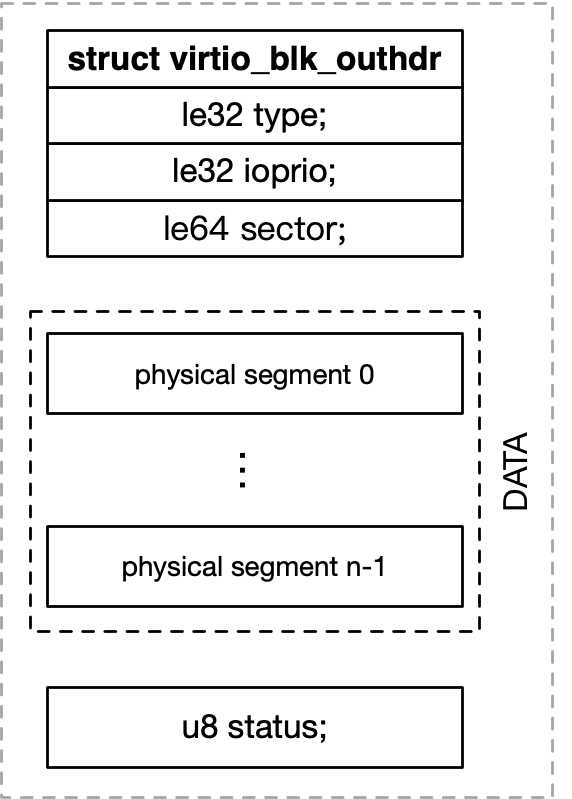
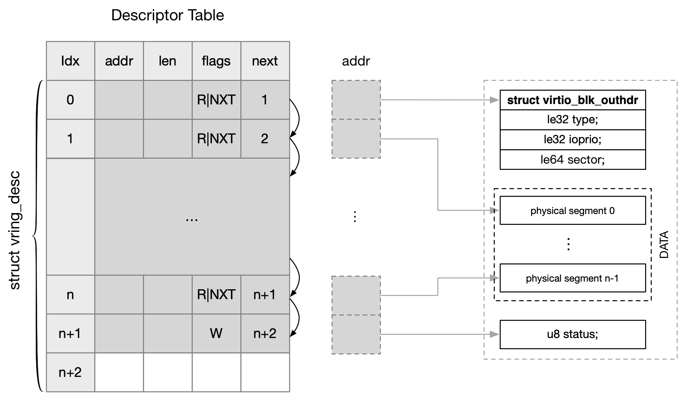
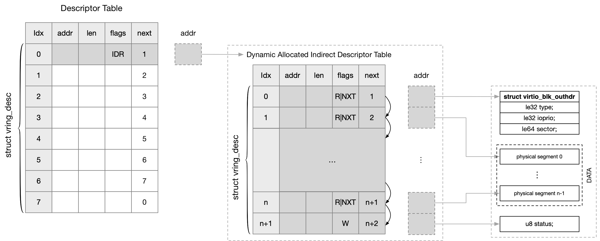

## Virtqueue - Indirect Descriptors

本文将介绍 virtqueue Descriptor Table 中描述符的两种格式，classic descriptor 与 indirect descriptor，其中 virtqueue 的格式均是以 Split Virtqueue 为例

为了方便叙述，将以 virtio-blk 为例介绍两种格式下 Descriptor Table 描述符的差异，在此之前简单介绍 virtio-blk 的描述符格式


### virtio-blk request descriptor

为了后文更好地展开，本小节简单介绍 virtio-blk 的描述符格式



如上图所示为 virtio_blk 中一个 request 的描述符，其中主要由三个部分构成

> header

描述符的头部由一个 struct virtio_blk_outhdr 结构描述

```c
struct virtio_blk_outhdr {
	/* VIRTIO_BLK_T* */
	__virtio32 type;
	/* io priority. */
	__virtio32 ioprio;
	/* Sector (ie. 512 byte offset) */
	__virtio64 sector;
};
```

@type 字段描述当前 request 操作的类型

```c
#define VIRTIO_BLK_T_IN	0
#define VIRTIO_BLK_T_OUT	1
#define VIRTIO_BLK_T_SCSI_CMD       2
#define VIRTIO_BLK_T_FLUSH          4
#define VIRTIO_BLK_T_GET_ID         8
#define VIRTIO_BLK_T_DISCARD        11
#define VIRTIO_BLK_T_WRITE_ZEROES   13
```

@sector 字段描述当前 request 操作的起始 sector 编号


> data

之后的 data 区域包含当前 request 包含的所有 physical segment


> status

后缀的 @status 用于 device 描述该 request 的执行结果

```c
u8 status;
```

device 在完成一个 request 之后，需要在该 request 对应的 @status 字段写入该 request 的执行结果

```c
#define VIRTIO_BLK_S_OK         0
#define VIRTIO_BLK_S_IOERR      1
#define VIRTIO_BLK_S_UNSUPP     2
```


### virtqueue classic descriptor

当设备不支持 indirect descriptor 特性时，一个 virtio_blk 的 request 会消耗 Descriptor Table 中的多个描述符

例如一个 request 中包含 n 个 physical segment，那么这个 request 就会消耗 Descriptor Table 中的 (n+2) 个描述符

- prefix 的描述符指向 struct virtio_blk_outhdr
- 中间的 n 个描述符，每个描述符就指向 request 中包含的一个 physical segment
- postfix 的描述符指向 u8 status




### virtqueue indirect descriptor

Descriptor Table 中的一个描述符就用于描述一个 physical segment，有些高性能的 virtio 设备同时处理的请求可能包含很多条 physical segment，这样就很容易将 Descriptor Table 中的描述符资源用尽

因而 virtio 标准引入 indirect descriptor 特性来解决这一问题
VIRTIO_F_RING_INDIRECT_DESC (28) feature bit 描述设备是否支持这一特性

以 virtio_blk request 为例，无论 request 中包含多少个 physical segment，这个 request 都只会消耗 Descriptor Table 中的一个描述符，从而大量节省描述符资源



其原理就是再动态分配一个描述符数组，以 virtio_blk request 为例，如果 request 包含 n 个 physical segment，那么动态分配的描述符数组中就包含 (n+2) 个描述符，接下来和 classic descriptor 中一样初始化动态分配的描述符数组，使其指向 request 中包含的 physical segment

最后真正的 Descriptor Table 中只会占用一个描述符，这个描述符指向之前动态分配的描述符数组

同时需要注意的是，Descriptor Table 中这种用于 indirect descriptor 的描述符，会打上 VRING_DESC_F_INDIRECT 标志

