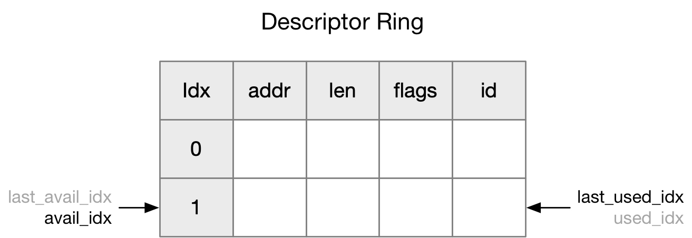
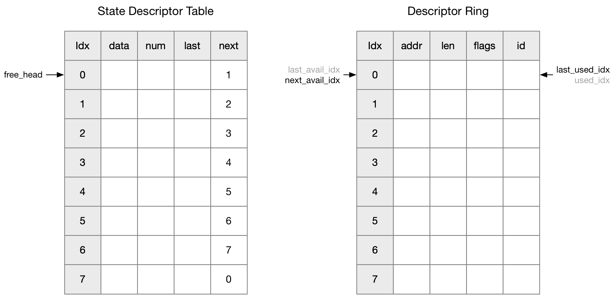

## Virtqueue - Packed Virtqueues

virtio v1.0 及之前版本只支持 Split Virtqueues 格式的 virtqueue，v1.1 版本引入 Packed Virtqueues 格式，此时设备需要实现两种格式中的任一种

VIRTIO_F_RING_PACKED(34) feature bit 描述设备是否支持这一特性

Linux 在 v5.0 版本支持 Packed Virtqueues 格式


### Concept

#### Background

virtio v1.0 及之前版本只支持 Split Virtqueues 格式的 virtqueue，Split Virtqueues 的特点是整个 virtqueue 包含 Descriptor Table、Avail Ring、Used Ring 三块相互分离的内存

由于整个 virtqueue 的元数据分散在三块内存区域，因而对于软件实现的后端，经常发生 cache miss/cache contention；而对于硬件实现的后端，同一个描述符的处理需要发起多个 PCI transaction；也就是说 Split Virtqueues 的内存布局影响了 virtqueue 的性能上限


#### packed queue

为了解决 Split Virtqueues 的这一问题，virtio 在 v1.1 版本引入 Packed Virtqueues 格式，实际上就是将原先 Split Virtqueues 中的 Descriptor Table、Avail Ring、Used Ring 合并为一个 Descriptor Ring


首先简单介绍一下 Packed Virtqueues 中描述符的格式

```c
struct vring_packed_desc {
	/* Buffer Address. */
	__le64 addr;
	/* Buffer Length. */
	__le32 len;
	/* Buffer ID. */
	__le16 id;
	/* The flags depending on descriptor type. */
	__le16 flags;
};
```

@addr/len 还是描述一个需要进行数据传输的 physical segment

> buffer ID

@id 字段描述对应的 buffer ID

buffer 的概念是指一个完整的 request，其中可能包含 0 或多个需要向设备写入数据的 physical segment，以及 0 或多个需要从设备读取数据的 physical segment；以 virtio_blk 为例，一个 virtio_blk request 就称为一个 buffer

因而一个 buffer（例如 virtio_blk request）会映射为 Descriptor Ring 中的多个描述符，这些描述符就具有相同的 @id 字段

virtio 协议并不关心 @id 字段的具体含义，只是当设备完成某个描述符描述的请求时，在对应的 completion event 中会返回对应的 @id 字段，以区分当前这个 completion event 对应之前的哪一个描述符

guest virtio driver 负责为这些 buffer 分配并管理唯一的 buffer ID，linux 实现中通常是这个 buffer 在 State Descriptor Table 中占用的描述符链表中第一个描述符的 index


#### avail/used flags

Packed Virtqueues 中原先的三块内存被合并为一块 Descriptor Ring，相当于原先的 Avail Ring、Used Ring 复用 Descriptor Table，这个时候空的描述符 (empty)、前端驱动提交的请求 (avail)、以及后端设备完成的请求 (used) 这三类描述符都混合存储在一个 Descriptor Ring 中，因而此时必须提供某种机制以区分 Descriptor Ring 中的描述符到底处于何种状态 (empty/avail/used)

描述符中的 @flags 字段就用于标识该描述符处于何种状态


```c
#define VRING_PACKED_DESC_F_AVAIL   7
#define VRING_PACKED_DESC_F_USED    15
```

描述符 @flags 字段的 bit 7 用于 avail 标志，bit 15 用于 used 标志

- 前端驱动在设置好描述符之后需要设置 avail | ~used 标志，即设置 avail 标志并清空 used 标志，从而提交该请求
- 后端设备在完成请求后需要设置 avail | used 标志，即同时设置上 avail 和 used 标志


> example

接下来举例说明这两个标志是如何运用的

1. 假设 Descriptor Ring 的大小为 2

刚开始初始化的时候，Descriptor Ring 是空的


这里复用 Split Virtqueues 中的概念

- Avail idx 由前端驱动维护，指 Available Ring 中下一个可写的描述符的 index
- Last Avail idx 由后端设备维护，描述后端设备上次已经处理的 Available Ring 中的描述符的 index，再加上一，表示后端设备下一个可以处理的描述符
- Used idx 由后端设备维护，指 Used Ring 中下一个可写的描述符的 index
- Last Used idx 由前端驱动维护，指前端驱动上次已经处理的 Used Ring 中的描述符的 index，再加上一，也就是前端驱动下一次可以开始收割的 index


2. driver send request

当前端驱动提交一个请求时，会占用 Descriptor Ring 中的一个描述符（也就是 Avail idx 指向的描述符），同时这个描述符设置上 avail 标志，并清空 used 标志


之后前端驱动会发送一个 notify 以通知后端设备


3. device process request

后端设备接到 notify 通知后，会检查 Descriptor Ring 中描述符（从 Last Avail idx 指向的描述符开始）的状态，发现 Descriptor Ring 中的第一个描述符设置有 avail 标志，说明这个请求处于待处理 (avail) 的状态，因而取出这个描述符进行处理


处理完成后，后端设备会将这个描述符写回 Descriptor Ring，写回的位置由 Used idx 决定，因而会覆盖写 Descriptor Ring 中的第一个描述符，同时写回的描述符会设置上 avail | used 标志


接下来发起中断以通知前端驱动，当前有已经完成了的请求

4. driver finish request

接到中断之后，前端驱动会检查 Descriptor Ring 中描述符（从 Last Used idx 指向的描述符开始）的状态，发现 Descriptor Ring 中的第一个描述符设置有 used 标志，说明这个描述符描述的请求已经处理完成，因而开始对这个请求执行 completion 处理




#### wrap counter

##### background

事实上 avail/used 标志的处理逻辑比以上描述的要复杂的多，考虑以下情况

> case 1

1.1 还是假设 Descriptor Ring 的大小为 2


1.2 driver send first request


1.3 driver send second request


1.4 device process first request


1.5 driver finish first request


1.6 driver resend first request


1.7 device process second request


> case 2

再考虑下以下情形，2.1～2.3 与 1.1~1.3 完全一样，接下来考虑

2.4 device receive first buf

注意此时后端设备只是开始处理对应的描述符，但是还没有处理完成


2.5 device receive second buf


> Question

如上所示对于后端设备来说，step 2.5 和之前的 step 1.7 具有完全相同的 Last Avail Idx 和 Used Idx，因而对于后端设备来说这两种情形是完全无法区分的

那么问题来了，请问在以上 step 1.7 和 step 2.5 的情形下，后端设备需要继续处理当前 Last Avail Idx 指向的描述符吗？

在以上的描述中，后端设备在接收到前端驱动的 notify 通知后，就会从 Last Avail Idx 开始检查描述符的状态，如果描述符的 avail 标志被设置，就说明这个描述符对应的请求正等待处理，一直到没有设置 avail 标志的描述符为止

在 step 1.7 情形下，这个问题的答案似乎是应该处理当前 Last Avail Idx 指向的描述符，因为此时 Last Avail Idx 指向的描述符是前端驱动后面重新下发的

而在 step 2.5 情形下，这一问题的答案则是截然相反，因为此时 Last Avail Idx 指向的描述符是旧的描述符，之前后端设备已经发起了对应请求的处理，只是这个请求还没有处理完成而已


相同的 Last Avail Idx 和 Used Idx 导向了截然相反的答案，根本原因是现有 avail/used 标志的机制下，后端设备无法区分以上 step 1.7 和 step 2.5 两种情形，这个问题更为具体的描述形式是，后端设备在收割 avail 描述符时，当 Last Avail Idx 发生 wrap 回到 Descriptor Ring 的起始位置的时候，如果这个位置的描述符设置有 avail 标志，那么后端设备无法确认当前 Last Avail Idx 指向的描述符，到底是前端驱动新下发的，还是后端设备之前已经发起处理过了的，也就是说无法确认当前 Last Avail Idx 指向的描述符是否需要处理

这一问题对于前端驱动同样存在，只是发生在前端驱动收割 used 描述符的过程中，此时当 Last Used Idx 发生 wrap 回到 Descriptor Ring 的起始位置的时候，如果这个位置的描述符设置有 used 标志，那么前端驱动也无法确认当前 Last Used Idx 指向的描述符，到底是后端设备新下发的，还是前端驱动之前已经收割过的，也就是说无法确认当前 Last Avail Idx 指向的描述符是否需要收割


**Extra Discussion**

这里可以额外讨论一下为什么 Split Virtqueues 里面没有这种问题

在 Split Virtqueues 机制中，Avail Idx 和 Used Idx 都是通过 mmap 在前端驱动和后端设备之间共享的

以后端设备收割可以下发的请求为例，Packed Virtqueues 机制下后端设备需要检查描述符的 @flags 标志来判断描述符的状态 (avail/used)，但是在 Split Virtqueues 机制下后端设备可以看到前端驱动维护的 Avail Idx，加上后端设备自己维护的 Last Avail Idx，后端设备可以直接获取所有当前可以下发的描述符，即 [Last Avail Idx, Avail Idx) 区间内的描述符

正是因为后端设备可以看到前端驱动维护的 Avail Idx，因而 Split Virtqueues 下不存在以上描述的问题

```c
struct vring_avail {
	__virtio16 idx;
	...
};

struct vring_used {
	__virtio16 idx;
	...
};
```


而在 Packed Virtqueues 机制下为了让内存布局更为紧凑，vring 中砍掉了 Avail Idx 和 Used Idx，以 Avail Idx 为例，此时 Avail Idx 只是在前端驱动内部维护，而不会共享给后端设备，此时后端设备无法获取 Avail Idx，因而在判断描述符 @flags 标志位的过程中就会存在上述问题


##### wrap counter

为了解决这一问题，virtio 设计了 wrap counter 机制


以 avail_wrap_counter 为例，前端驱动和后端设备在各自内部都需要维护一个 avail_wrap_counter

- avail_wrap_counter 为 1 的情况
    - 前端驱动在下发请求的时候，如果前端驱动内部维护的 avail_wrap_counter 为 1，那么需要设置 avail | ~used 标志
    - 接下来后端设备在收割下发的请求的时候，如果后端设备内部维护的 avail_wrap_counter 为 1，那么描述符设置有 avail | ~used 标志时说明该描述符当前需要处理，否则这个描述符就是之前设备已经下发过了的

- avail_wrap_counter 为 0 的情况
    - 前端驱动在下发请求的时候，如果前端驱动内部维护的 avail_wrap_counter 为 0，那么需要设置 ~avail | used 标志
    - 接下来后端设备在收割下发的请求的时候，如果后端设备内部维护的 avail_wrap_counter 为 0，那么描述符设置有 ~avail | used 标志时说明该描述符当前需要处理，否则这个描述符就是之前设备已经下发过了的

也就是说在 avail_wrap_counter 为 1 的时候，bit 7 set 表示描述符处于 avail 状态；而 avail_wrap_counter 为 0 的时候则是反过来，bit 7 clear 表示描述符处于 avail 状态


之前描述过，前端驱动和后端设备在各自内部都需要维护一个 avail_wrap_counter，其中

- 前端驱动内部维护的 avail_wrap_counter 用于下发请求的时候，给描述符设置上正确的标志，因而其 avail_wrap_counter 是在 Avail Idx 发生 wrap 的时候发生翻转
- 后端设备内部维护的 avail_wrap_counter 用于收割下发的请求的时候，判断当前 Last Avail Idx 指向的描述符是当前需要处理的，还是之前设备已经收割过了的，因而其 avail_wrap_counter 是在 Last Avail Idx 发生 wrap 的时候发生翻转

当然前端驱动和后端设备在各自内部维护的 avail_wrap_counter 的初始值均为 1


回到之前的例子中，3.1～3.3 和之前的 1.1.~1.3 完全相同，只是在 3.3 完成的时候，由于 Avail Idx 发生 wrap，因而前端驱动内部维护的 avail_wrap_counter 翻转为 0；之后的 3.4~3.5 也是和 1.4~1.5 完全相同，接下来

3.6 driver resend first request

此时由于前端驱动内部维护的 avail_wrap_counter 已经翻转为 0，因而前端驱动在下发请求的时候，实际上设置的是 ~avail | used 标志


3.7 device process second request

接下来的 3.7 也是和 1.7 一样，只是这一过程中由于 Last Avail Idx 发生 wrap，因而后端设备内部维护的 avail_wrap_counter 翻转为 0


此时 3.7 和之前的 2.5 已经可以区分，在 3.7 情形下当后端设备执行收割的时候，由于后端设备内部维护的 avail_wrap_counter 已经翻转为 0，因而后端设备在收割的时候，认为设置有 ~avail | used 标志的描述符才是真的 avail 的描述符，因而此时后端设备会正确下发该描述符


之前介绍的都是 avail_wrap_counter，used_wrap_counter 也是同理，前端驱动和后端设备在各自内部都需要维护一个 used_wrap_counter，其用法与之前描述的类似


- used_wrap_counter 为 1 的情况
    - 后端设备在写回 completion event 的时候，如果后端设备内部维护的 used_wrap_counter 为 1，那么写回的描述符设置有 avail | used 标志
    - 接下来前端驱动在收割完成的请求的时候，如果前端驱动内部维护的 used_wrap_counter 为 1，那么描述符设置有 avail | used 标志时说明该描述符当前需要收割，否则这个描述符就是之前驱动已经收割过了的

- used_wrap_counter 为 0 的情况
    - 后端设备在写回 completion event 的时候，如果后端设备内部维护的 used_wrap_counter 为 0，那么需要设置 ~avail | ~used 标志
    - 接下来前端驱动在收割完成的请求的时候，如果前端驱动内部维护的 used_wrap_counter 为 0，那么描述符设置有 ~avail | ~used 标志时说明该描述符当前需要收割，否则这个描述符就是之前设备已经收割过了的


之前提到过，前端驱动和后端设备在各自内部都需要维护一个 avail_wrap_counter 和 used_wrap_counter 计数，vq.packed 中就是前端驱动维护的 avail_wrap_counter 和 used_wrap_counter 计数

```c
struct vring_virtqueue {
		struct {
			/* Driver ring wrap counter. */
			bool avail_wrap_counter;

			/* Device ring wrap counter. */
			bool used_wrap_counter;
			...
		} packed;
	...
}
```


#### descriptor chain

Packed Virtqueues 机制下，descriptor chain 的格式也发生了变化

之前描述过，一个 buffer 会占用 Descriptor Table 中的多个描述符，在 Split Virtqueues 机制下，同一个 buffer 占用的多个描述符之间通过描述符 @next 字段组成一个链表

```c
struct vring_desc {
	...
	/* We chain unused descriptors via this, too */
	__virtio16 next;
};
```


但是在 Packed Virtqueues 机制下，同一个 buffer 占用的多个描述符实际上是 Descriptor Ring 中相邻的多个描述符，也就是说 Split Virtqueues 机制下 descriptor chain 是链表的组织形式，而 Packed Virtqueues 机制下 descriptor chain 是数组的组织形式

因而 Packed Virtqueues 机制下的描述符实际上已经移除了 @next 字段

 
这其中的差异实际上还是两者 vring 的差异造成的

例如前端驱动在一次性下发 6 个请求之后，由于后端设备可以乱序完成，设备依次完成了请求 0/2/4，此时

- 在 Split Virtqueues 机制下，请求 0/2/4 对应的描述符被回收，此时其余空闲状态的描述符分散成多个相隔的区域，因而必须用链表的形式将所有空闲状态的描述符组织起来
- 而在 Packed Virtqueues 机制下，请求 0/2/4 对应的描述符同样被回收，只是此时请求 0/2/4 对应的 completion event 直接覆盖回写到 Descriptor Ring 中，此时所有空闲状态的描述符还是在一整块连续的区域中，因而此时不需要链表的组织形式


### memory layout


```c
struct vring_virtqueue {
		/* Available for packed ring */
		struct {
			/* Actual memory layout for this queue. */
			struct {
				unsigned int num;
				struct vring_packed_desc *desc;
				struct vring_packed_desc_event *driver;
				struct vring_packed_desc_event *device;
			} vring;
			...
		} packed;
	...
};
```

#### vring

在 Packed Virtqueues 格式下，vring 将原先的三块内存区域整合为一块 Descriptor Ring

Descriptor Ring 实际上就是一个循环缓冲区，简单介绍一下其中使用到的各个 index，以下为方便叙述，将 struct vring_virtqueue 简称为 vq

> total size

首先 vq->packed.vring.num 描述了 Descriptor Ring 的大小

```c
struct vring {
	unsigned int num;
	...
};
```


> free size

vq->vq.num_free 描述了 Descriptor Ring 的剩余大小，其初始值即为 Descriptor Ring 的大小即 vq->packed.vring.num

```c
struct virtqueue {
	unsigned int num_free;
	...
};
```


> next_avail_idx

vq->packed.next_avail_idx 描述了 Descriptor Ring 中下一个可写的描述符的 index，其初始值为 0，由前端驱动维护

前端驱动下发请求的过程中，就是从 next_avail_idx 指向的位置开始写入描述符，并根据 num_free 判断 Descriptor Ring 是否已满

```c
struct vring_virtqueue {
		struct {
			/* Index of the next avail descriptor. */
			u16 next_avail_idx;
			...
		} packed;
	...
}
```

next_avail_idx 的值总是在 [0,vq->packed.vring.num) 范围内


> last_avail_idx

last_avail_idx 是后端设备自己维护的一个 index，描述设备上次已经处理的 Available Ring 中的描述符的 index，再加上一，表示设备下一个可以处理的描述符；其初始值为 0

前端驱动在下发一个请求并 notify 通知后端设备之后，后端设备在接收到这个 notify 通知时，就会从 last_avail_idx 指向的描述符开始，检查 Descriptor Ring 中描述符的状态，对于 avail 状态的描述符就会对其进行下发处理


> used_idx

类似地，后端设备内部需要维护 used_idx，以描述 Descriptor Ring 中设备下一个可用于写 completion event 的 index 位置，其初始值为 0

设备在完成一个请求的处理之后，需要向 Descriptor Ring 写入 completion event，实际上就会覆盖写 used_idx 位置处的 index


> last_used_idx

类似地，前端驱动内部也需要维护 last_used_idx，描述前端驱动上次已经收割的 completion event 的 index，再加上一，也就是前端驱动下一次可以开始收割的 completion event 的 index；其初始值为 0

后端设备在完成一个请求的处理并向 Descriptor Ring 写入 completion event 之后，就会向前端驱动发起一个中断

前端驱动在接到中断后，就会从 last_used_idx 指向的描述符开始，检查 Descriptor Ring 中描述符的状态，一直检查到处于非 used 状态的描述符为止；对于 used 状态的描述符就会对其进行 completion 处理

```c
struct vring_virtqueue {
	/* Last used index we've seen. */
	u16 last_used_idx;
	...
}
```

需要注意的是 vq->last_used_idx 的值总是在 [0,vq->packed.vring.num) 范围内


#### State Descriptor Table

Packed Virtqueues 格式下也有 State Descriptor Table，其中每个描述符的格式为

```c
struct vring_desc_state_packed {
	void *data;			/* Data for callback. */
	struct vring_packed_desc *indir_desc; /* Indirect descriptor, if any. */
	u16 num;			/* Descriptor list length. */
	u16 next;			/* The next desc state in a list. */
	u16 last;			/* The last desc state in a list. */
};
```

@data 字段还是存放 driver specific 的数据，例如对于 virtio-blk 来说，该字段就指向对应的 struct virtblk_req 结构


> next

多个描述符之间可以通过 @next 字段组成一个链表，实际上 @next 字段存储的是下一个描述符在 State Descriptor Table 中的 index；初始化完成后，链表的最后一个描述符的 @next 字段的值为 0，也就是指向 State Descriptor Table 中的第一个描述符，从而使得 State Descriptor Table 中的所有描述符组成一个环状结构


> descriptor list

之前介绍过 Packed Virtqueues 格式下有 buffer 的概念，以 virtio-blk 为例，一个 virtio_blk request 就是一个 buffer

一个 buffer 中包含的多个 physical segment 会映射为 Descriptor Ring 中的多个描述符；

虽然一个 buffer 只需要一个 State Descriptor，但是实际上在 State Descriptor Table 中会占用多个描述符，因而一个 buffer 在 State Descriptor Table 中占用的多个描述符会组成一个描述符链表，此时这个描述符链表中只有第一个描述符会被初始化（链表中的其余描述符只是被占用但实际上并未使用到），同时链表中这第一个描述符的

- @num 字段描述该 buffer 在 State Descriptor Ring 中占用的所有描述符的数量
- @last 字段描述该 buffer 对应的描述符链表中最后一个描述符的 index


之前描述过一个 buffer 会占用 State Descriptor Table 中的多个描述符，其分配逻辑是

- 第一个描述符的 index 来源于 free_head
- 之后的描述符的 index 来源于前一个描述符的 @next 字段
- 最后更新 free_head 为最后一个分配的描述符的 @next 字段


> free_head

vq->free_head 描述了 State Descriptor Table 中下一个可写的描述符的 index，其初始值为 0

```c
struct vring_virtqueue {
	/* Head of free buffer list. */
	unsigned int free_head;
	...
}
```

由于更新 free_head 的时候，free_head 会被更新为当前最后一个使用的描述符的 @next 字段的值（即下一个可用的描述符的 index），因而 free_head 的值实际上总是在 [0,vq->packed.vring.num) 范围内


由于每次 buffer 在 Descriptor Ring 中消耗的描述符数量，与在 State Descriptor Table 中消耗的描述符数量相一致，因而实际上 State Descriptor Table 会复用 vq->packed.vring.num 字段，来描述 State Descriptor Table 中剩余描述符的数量


### Routine

#### 1. init

vring 刚刚创建时初始状态为




#### 2. guest: send first buffer

guest driver 向 vring 写入数据的入口为 virtqueue_add()

接下来发送一个 request，假设该 request 需要消耗 Descriptor Ring 中的三个描述符，那么

1. 消耗 State Descriptor Table 中的三个描述符，并更新 free_head 字段
2. 消耗 Descriptor Ring 中的三个描述符，并更新 next_avail_idx 字段


#### 3. guest: send second buffer

类似地，当 guest driver 向 vring 写入第二个 request 时，vring 的状态变为


#### 4. guest: notify device

guest driver 可以多次调用 virtqueue_add() 往 vring 提交多个 request 之后，再集中调用一次 notify() 回调函数以通知 device，当前 Available Ring 中有新的 request 需要处理；通常 notify() 回调函数中会通过对 device 配置空间中的 VIRTIO_PCI_QUEUE_NOTIFY 寄存器进行写操作，以通知 device

virtio-blk guest driver 的 notify() 回调函数通常实现为 vp_notify()


#### 5. device: process first buffer

以上 guest driver 对 VIRTIO_PCI_QUEUE_NOTIFY 寄存器的写操作通常会触发 VMEXIT 从而切换到 host 端，此时 device 就会接收到这个通知，就会从 last_avail_idx 指向的描述符开始，检查 Descriptor Ring 中描述符的状态，对于 avail 状态的描述符就会对其进行下发处理

例如此时 last_avail_idx 为 0，因而

1. device 从 Available Ring 的 last_avail_idx 即 index 0 处取出一个描述符，这个描述符的 @flags 字段设置有 avail | ~used 标志，说明该描述符当前需要处理，因而 device 就会对这个描述符进行下发处理
2. 描述符的 @flags 字段的 VRING_DESC_F_NEXT 标志将一个 buffer 映射的所有描述符组织成一个链表，因而 device 实际上是对 last_avail_idx 开始的描述符链表（可能包含多个描述符）进行下发处理
3. 之后当这个描述符链表处理完成时，device 将处理完成的所有描述符对应的 completion event 回写到 Descriptor Ring 中，其中每个处理完成的描述符都要回写一个对应的 completion event，这些 completion event 实际上就是覆盖写到 Descriptor Ring  中 used_idx 开始的位置
4. 同时更新 used_idx
5. 并更新 last_avail_idx


#### 6. guest: receive first buffer

上一步 device 在处理完成一个 request 之后，会发起 VMENTER 操作，并在 guest 内产生一个中断来通知 guest driver，Descriptor Ring 中存在已经处理完成的描述符；virtio-blk guest driver 的中断处理函数中通常会调用 virtblk_done()

```
vp_interrupt
    vp_vring_interrupt
        vring_interrupt
            vq->vq.callback(), that is, virtblk_done() for virtio-blk
```

此时 guest driver 的中断处理程序中就会从 last_used_idx 指向的描述符开始，检查 Descriptor Ring 中描述符的状态，对于 used 状态的描述符就会对其进行 completion 处理

1. guest driver 从 last_used_idx 指向的描述符开始，检查 Descriptor Ring 中描述符的状态，当前 last_used_idx 为 0，因而从 last_used_idx 即 index 0 处取出一个描述符，这个描述符的 @flags 字段设置有 avail | used 标志，说明该描述符已经处理完成，需要由 guest driver 收割
2. guest driver 从这个描述符的 @id 字段取出这个描述符对应的 buffer ID，实际上也是这个描述符在 State Descriptor Table 中对应的描述符（记为 state descriptor）的 index
3. guest driver 从 state descriptor 的 @num 字段取出当前这个 buffer 映射的所有描述符的数量，因而直接更新为 last_used_idx += @num
3. guest driver 从 state descriptor 的 @data 字段取出当前这个 buffer 对应的 specific data，在 virtio-blk 下就是 struct virtblk_req 结构，之后对相应的 request 作 completion 处理，向上层通知其对应的 request 已经处理完成


