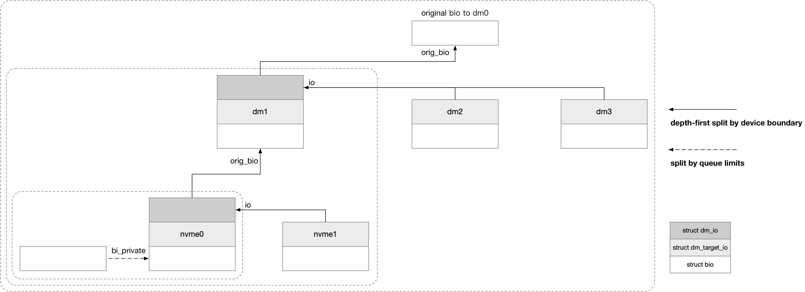
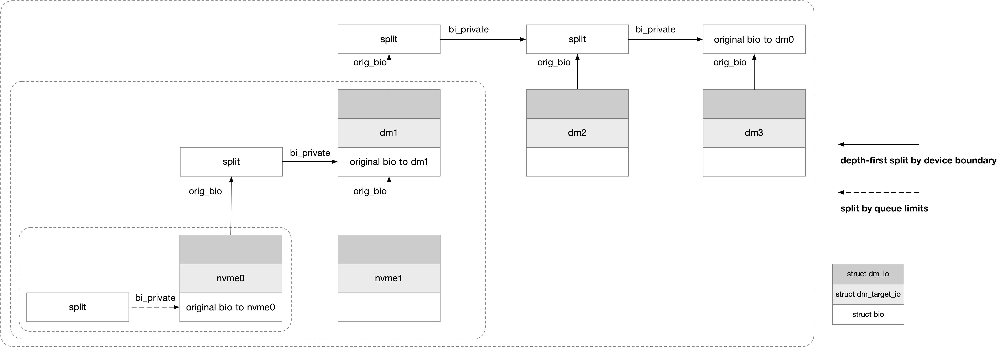
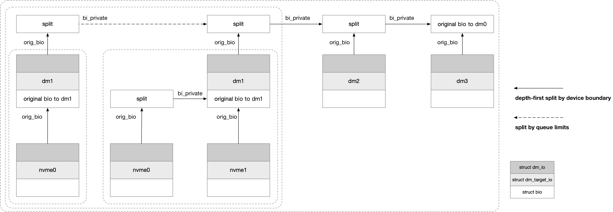

title:'dm - bio-split'
## dm - bio-split

### Concept

对于 request-based 设备来说，只要设备驱动设置好 queue_limits 参数，那么 mq 路径中调用的 bio split 路径就会自动执行 split 操作

而对于 bio-based 的设备例如 dm 设备来说，dm 需要自己调用相关的 bio split 路径来执行 split 操作，由于 dm 设备自身的复杂性，有一些会复用 block layer 的接口即 blk_queue_split()，而有一些则需要实现自己的路径来执行 split 操作

```sh
submit_bio
    submit_bio_noacct
        # request-based, __submit_bio_noacct_mq
            blk_mq_submit_bio
                __blk_queue_split // bio split
        # bio-based, __submit_bio_noacct
            __submit_bio
                disk->fops->submit_bio(), that is, dm_submit_bio
                    // bio split
```


我们谈论的 dm 层的 bio-split 主要有两个场景

#### split at device boundary

第一种场景是将发往 dm 设备的一个 original bio 切分为多个发往底层设备的 bio

在 dm 场景下，dm bio 会经过一层映射，最终映射为多个 bio 下发给底层的设备，因而就需要在底层设备映射的 sector 地址边界处切一刀，将 dm bio 切分为底层设备对应的多个 bio

```
        original dm bio
+-------------------------------+
|                               |
+-------------------------------+
         ^           ^
device A boundary   device B boundary

+-------+           +--------+          +-----------+
| split |           |  split |          |   remain  |
+-------+           +--------+          +-----------+
device A            device B            device C
```


#### split by queue limits

dm 设备有自身的 request queue，因而也就有自身的 queue limits，在 load table 过程中会计算 mapped device 的 queue limits，总的来说是综合其所有 target device 的 queue limits 计算出来的

```sh
table_load
    dm_setup_md_queue
        dm_calculate_queue_limits
            #(for each target device) blk_stack_limits
```

dm bio-split 的第二种场景就是根据 dm 设备的 queue limits 的 max_sectors/chunk_sectos/max_segments 参数，对 original bio 进行切分


#### split by max_io_len

此外 dm 设备还维护有一个 dm 层特有的参数，即 max_io_len，该参数描述一个 request 不能跨越 @max_io_len 界限

```c
struct dm_target {
	/* If non-zero, maximum size of I/O submitted to a target. */
	uint32_t max_io_len;
	...
}
```

@max_io_len 参数的一个典型例子来源于 dm-stripe 设备，这类设备有一个概念是 chunk，连续的多个 chunk 会按照 round-robin 的形式均匀分散到多个 underlying device 上；因而切分出来的 bio 不能跨越 chunk size 界限，dm-stripe 设备在 ctr() 回调函数中会设置 @max_io_len 参数的值为 chunk size

```
    bio 1       bio 2       bio 3
+-----------+-----------+-----------+
|  chunk 1  |  chunk 2  |  chunk 3  |
+-----------+-----------+-----------+
  device A    device B    device C
```


此时 dm 设备在下发 bio 的流程中，会调用 max_io_len() 限制当前 clone bio 的大小，此时每个 chunk 都会对应一个 dm_target_io

```sh
queue->submit_bio(), that is, dm_submit_bio
    __split_and_process_bio
        __split_and_process_non_flush
            len = min(max_io_len(), ci->sector_count);
            __clone_and_map_data_bio(..., len)
                tio = alloc_tio() // alloc one dm_target_io
                __map_bio(tio)
                    type->map()
```

此时当前 clone bio 的大小上限的计算过程为

- 首先 offset = (bio->bi_iter.bi_sector - target->begin) 计算出当前需要下发的起始 sector 在映射的 target device 中的 offset
- 从 offset 开始，到下一个 chunk size 的边界，就是当前 clone bio 的大小上限

```
                  @len
                +-------+
+-----------+-----------+-----------+
|  chunk 1  |  chunk 2  |  chunk 3  |
+-----------+-----------+-----------+
                ^
              offset = (bio->bi_iter.bi_sector - target->begin)
```


### History

```
                 dm-0
     dm-1        dm-2        dm3
nvme0  nvme1
```

#### v3.10

在 v3.10 年代，只会针对 device_boundary/max_io_len 进行切分



此时需要注意的有

dm bio-split 的时候不会按照 queue limits 进行切分，之后在这些底层设备的 bio 处理过程中，才会由 block core 实现的 split 算法，使得这些底层设备的 queue_limits 描述的限制发挥作用

此时对于每个 dm 设备来说，会一次性将 original bio 拆分为多个底层设备的 bio，此时每个 original bio 就对应一个 dm_io 结构，每个底层设备的 bio 对应一个 dm_target_io 结构


#### v4.16: depth-first split

以上描述的路径会一次性将 original bio 映射为所有底层设备对应的 bio，之后再对拆分出来的 bio 进行下一层的映射，这实际上就是 width first 的；但是这样的设计会一次性从 bioset 分配多个 bio，有可能带来潜在的 deadlock 风险

内核在 v4.16 引入 depth-first split 特性，commit 18a25da84354 ("dm: ensure bio submission follows a depth-first tree walk")，此时 dm 层拆分 bio 时的行为转变为 depth first 的



此时只会针对 device_boundary/max_io_len 进行切分


#### v4.20: split by queue_limits

需要注意的是在此之前，dm bio-split 路径都不会考虑 dm 设备的 queue_limits 参数限制，之后在这些底层设备的 bio 处理过程中，才会由 block core 实现的 split 算法，使得这些底层设备的 queue_limits 描述的限制发挥作用

内核在 v4.20 版本 (回合到 4.19 stable) 引入 commit 89f5fa47476e ("dm: call blk_queue_split() to impose device limits on bios")，这里实际上就是复用 block layer 的接口 blk_queue_split() 根据 queue_limits 进行拆分

```
queue->q->make_request_fn(), that is, dm_make_request
    __dm_make_request
        __split_and_process_bio
            blk_queue_split(md->queue, &bio)
```



此时会针对 device_boundary/max_io_len/queue_limits 进行切分


#### v5.1: split by queue_limits for both nvme/non-nvme bio-based

需要注意的是，以上的实现中只有 bio-based 设备会根据 queue_limits 进行拆分，nvme bio-based 设备还是没有根据 queue_limits 进行拆分的

```sh
queue->q->make_request_fn(), that is, dm_make_request
    dm_process_bio
        __process_bio // for DM_TYPE_NVME_BIO_BASED
        __split_and_process_bio // for DM_TYPE_BIO_BASED
            blk_queue_split(md->queue, &bio)
```


因而内核在 v5.1 引入 commit 568c73a355e ("dm: update dm_process_bio() to split bio if in ->make_request_fn()")，实际上就是将 blk_queue_split() 调用上提到 dm_process_bio() 中，这样无论是 nvme bio-based 还是普通的 bio-based 设备都会执行 queue limits split 路径

```sh
queue->q->make_request_fn(), that is, dm_make_request
    dm_process_bio
        blk_queue_split(md->queue, &bio); // for abnormal IO
        dm_queue_split(md, ti, &bio); // for normal rw IO
                
        __process_bio // for DM_TYPE_NVME_BIO_BASED
        __split_and_process_bio // for DM_TYPE_BIO_BASED
```


#### v5.1: split by queue_limits for both normal/abnormal IO

需要注意的是，以上实现中对于 normal READ/WRITE IO 来说，只会针对 device_boundary/max_io_len 进行切分，而不会按照 queue_limits 切分

因而内核在 v5.1 引入 commit effd58c95f27 ("dm: always call blk_queue_split() in dm_process_bio()")，此时对于 normal/abnormal IO 都会调用 blk_queue_split() 即按照 queue_limits 进行切分，对于 normal IO 还会调用 dm_queue_split() 按照 device_boundary/max_io_len 进行切分

```sh
queue->q->make_request_fn(), that is, dm_make_request
    dm_process_bio
        blk_queue_split(md->queue, &bio);
        dm_queue_split(md, ti, &bio); // for normal rw IO
                
        __process_bio // for DM_TYPE_NVME_BIO_BASED
        __split_and_process_bio // for DM_TYPE_BIO_BASED
```


#### v5.7: avoid excessive splitting

然而上述实现对于 normal IO 会存在过度切分的情况，参考 v5.7 commit 120c9257f5f1 ("Revert "dm: always call blk_queue_split() in dm_process_bio()"")，因而暂时将之前的那个 commit revert 掉


#### v5.9: remove duplicate bio split for normal IO in dm_process_bio()

此时 dm IO 路径为

```sh
queue->q->make_request_fn(), that is, dm_make_request
    dm_process_bio
        blk_queue_split(md->queue, &bio); // for abnormal IO
        dm_queue_split(md, ti, &bio); // for normal rw IO
                
        __process_bio // for DM_TYPE_NVME_BIO_BASED
        __split_and_process_bio // for DM_TYPE_BIO_BASED
```

对于 normal IO 来说，dm_process_bio() 中会调用 dm_queue_split() 按照 device_boundary/max_io_len 进行切分

但是实际上在之后调用的 __split_and_process_bio() 中，会再一次调用 max_io_len() 按照 device_boundary/max_io_len 进行切分，这相当于是与之前的 dm_queue_split() 重复了

```sh
queue->q->make_request_fn(), that is, dm_make_request
    dm_process_bio
        blk_queue_split(md->queue, &bio); // for abnormal IO
        dm_queue_split(md, ti, &bio); // for normal rw IO
            len = min(max_io_len(), ci->sector_count);
                
        __process_bio // for DM_TYPE_NVME_BIO_BASED
        __split_and_process_bio // for DM_TYPE_BIO_BASED
            __split_and_process_non_flush
                len = min(max_io_len(), ci->sector_count);
```

因而内核在 v5.9 引入 commit ee1dfad5325ff ("dm: fix bio splitting and its bio completion order for regular IO")，将 dm_process_bio() 中的 dm_queue_split() 调用移除，此时 dm IO 路径为

```sh
queue->q->make_request_fn(), that is, dm_make_request
    dm_process_bio
        blk_queue_split(md->queue, &bio); // for abnormal IO
                
        __process_bio // for DM_TYPE_NVME_BIO_BASED
        __split_and_process_bio // for DM_TYPE_BIO_BASED
            __split_and_process_non_flush
                len = min(max_io_len(), ci->sector_count);
```

即统一在 __split_and_process_bio() 中按照 device_boundary/max_io_len 对 bio 进行切分


#### v5.10: impose max_io_len by chunk_sectors

之前介绍过，dm bio-split 的一个场景是按照 max_io_len 进行切分，路径中是通过 max_io_len() 函数使得一个 IO 的大小不能超过 @max_io_len

```sh
queue->submit_bio(), that is, dm_submit_bio
    __split_and_process_bio
        __split_and_process_non_flush
            len = min(max_io_len(), ci->sector_count);
```

在此之前 max_io_len() 中就是直接用 @max_io_len 进行计算的

而 v5.10 之后 max_io_len() 函数的实现有一些变化，其实际是复用 block layer 的 queue_limits.chunk_sectors 参数


内核在 v5.10 引入 commit 882ec4e609c1a ("dm table: stack 'chunk_sectors' limit to account for target-specific splitting")，此时设备创建阶段 @max_io_len 参数会保存到 queue_limits.chunk_sectors 参数中

```sh
DM_TABLE_LOAD_CMD ioctl
    table_load
         populate_table
            dm_table_add_target
                type->ctr(), that is stripe_ctr() for dm-stripe
                    dm_set_target_max_io_len
                        ti->max_io_len = chunk_size // set @max_io_len to chunk_size

        dm_setup_md_queue
            dm_calculate_queue_limits
                if (ti->max_io_len):
            			queue.chunk_sectors = min(ti->max_io_len, queue.chunk_sectors); // set @chunk_sectors to chunk_size
```


同期 v5.10 引入的 commit 5091cdec56fae ("dm: change max_io_len() to use blk_max_size_offset()")，max_io_len() 函数中改用 queue_limits.chunk_sectors 参数来计算当前 clone bio 的大小上限


#### v5.10: impose max_sectors for normal IO

同时为了解决上述 normal IO 没有按照 queue_limits 切分的问题，内核在 v5.10 引入 commit 5091cdec56fae ("dm: change max_io_len() to use blk_max_size_offset()")，通过对 max_io_len() 函数的改造使得 @max_io_len 参数未设置时，依据 @max_sectors 进行切分

```sh
queue->submit_bio(), that is, dm_submit_bio
    blk_queue_split(md->queue, &bio); // for abnormal IO
    
    __split_and_process_bio
        __split_and_process_non_flush
            len = min(max_io_len(), ci->sector_count);
                max_len = blk_max_size_offset() // for normal IO
                    # calculating @max_len considering @chunk_sectors and @max_sectors
```


#### v5.10: impose queue_limits for deferred abnormal IO

之前介绍过，对于 abnormal IO 会调用 blk_queue_split() 按照 queue_limits 进行切分

```sh
queue->submit_bio(), that is, dm_submit_bio
    dm_process_bio
        blk_queue_split(md->queue, &bio); // for abnormal rw IO
```

但是其实现实际上是

```sh
dm_process_bio
    if (current->bio_list) {
        if (is_abnormal_io(bio))
            blk_queue_split(&bio);
    }
```

为什么这里只有 current->bio_lis non-NULL 的时候才会调用 blk_queue_split() 按照 queue_limits 进行切分呢？

这是与 blk_queue_split() 的实现有关，blk_queue_split() 中会递归地调用 submit_bio_noacct()，只有当 bio_list 特性开启时才能安全地递归调用 submit_bio_noacct()，否则就有可能造成死锁问题

```
blk_queue_split
    submit_bio_noacct
```


但是除了进程上下文中调用 dm_submit_bio() 的时候会调用到 dm_process_bio()，dm_wq_work() worker 中也会调用到 dm_process_bio()，这样 dm_wq_work() worker 在下发 deferred bio 的时候，这些 bio 就不会调用到 blk_queue_split()，从而没法让这些 deferred abnormal bio 按照 queue_limits 进行切分

```
dm_wq_work
    dm_process_bio
```


为了解决这一问题，内核在 v5.10 引入 commit 0c2915b8c6db1 ("dm: fix missing imposition of queue_limits from dm_wq_work() thread")

其主要的改造就是在 dm_wq_work() worker 中，不再直接调用 dm_process_bio()，而是调用 submit_bio_noacct()，也就是说让 dm_wq_work() worker 也处于 bio_list 保护之下，这样 dm_wq_work() worker 在下发 deferred bio 的时候，对于这些 deferred bio  也可以调用 blk_queue_split()，从而对其按照 queue_limits 进行切分了

```
dm_wq_work
    submit_bio_noacct
```


此外由于 dm_process_bio 的两个入口，即 dm_submit_bio() 与 dm_wq_work() worker  都是开启 bio_list 特性的，因而 dm_process_bio 中干脆去掉了 current->bio_list 的判断

```sh
dm_process_bio
    if (is_abnormal_io(bio))
            blk_queue_split(&bio);
```


#### v5.10: revert imposing max_io_len by chunk_sectors

v5.10 commit 882ec4e609c1a ("dm table: stack 'chunk_sectors' limit to account for target-specific splitting") 中将 @max_io_len 参数统一保存到 queue_limits.chunk_sectors 参数中

之后 normal IO 都会按照 @chunk_sectors/@max_sectors 参数进行切分

```sh
queue->submit_bio(), that is, dm_submit_bio
    blk_queue_split(md->queue, &bio); // for abnormal IO
    
    __split_and_process_bio
        __split_and_process_non_flush
            len = min(max_io_len(), ci->sector_count);
                max_len = blk_max_size_offset() // for normal IO
                    # calculating @max_len considering @chunk_sectors and @max_sectors
```


这里 normal IO 会按照 @queue_limits.chunk_sectors 参数进行切分，这里需要注意 @queue_limits.chunk_sectors 参数的计算过程

```sh
dm_calculate_queue_limits
    .iterate_devices()
        blk_stack_limits // stacking queue limits of all underlying devices
```

由于 blk_stack_limits() 的调用，@queue_limits.chunk_sectors 参数实际上是所有 underlying 设备的 @chunk_sectors 参数叠加而成的，可以简单理解为取所有 underlying 设备的 @chunk_sectors 参数的最小值

这样就会带来过度切分的问题，例如 dm 设备底下的两个 underlying 设备，其 @chunk_sectors 参数分别为 4K、128K，同时假设 dm 设备本身并没有 @max_io_len 参数限制

那么在 dm 设备按照 chunk_sectors 参数切分之前，dm 设备的 normal IO 只会按照 device boundary 进行切分，之后 underlying 设备自己再按照 4K、128K 的 @chunk_sectors 参数进行切分

但是在按照 chunk_sectors 参数切分之后，dm 设备的 @queue_limits.chunk_sectors 参数就变为 4K，此时发往 @chunk_sectors = 128K 的 underlying 设备的 IO，此时也会按照 @queue_limits.chunk_sectors 即 4K 进行切分，也就造成了过度切分的问题


因而在 v5.10 commit 3ee16db390b42b8a21f2ad2ea2518f3469c6e532 ("dm: fix IO splitting") 中 revert 了之前 "imposing max_io_len by chunk_sectors" 的尝试，此时 dm split 路径中回退到按照 @max_io_len 进行切分

```sh
dm_submit_bio
    __split_and_process_bio
        __split_and_process_non_flush
            len = min_t(max_io_len(ti, ci->sector), ...);
                blk_max_size_offset(..., ti->max_io_len);
```


### State

#### 5.10

所以总结一下，目前针对 5.10 内核，dm 层会针对以下三种因素对 dm bio 进行切分

1. split at device boundary

首先自然是在底层设备的边界处对 dm bio 进行切分


2. split by max_io_len

max_io_len 本质上其实还是将 dm bio 切分分发给各个底层设备，@max_io_len 参数的典型用例是 dm-stripe 设备

dm 设备初始化的时候会设置 max_io_len 参数的值为 chunk 的大下

```sh
DM_TABLE_LOAD_CMD ioctl
    table_load
         populate_table
            dm_table_add_target
                type->ctr(), that is stripe_ctr() for dm-stripe
                    dm_set_target_max_io_len
                        ti->max_io_len = chunk_size // set @max_io_len to chunk_size
```


之后 IO 下发过程中，就会按照 @max_io_len 参数，也就是在 chunk 的边界进行切分

```sh
queue->submit_bio(), that is, dm_submit_bio
    blk_queue_split(md->queue, &bio); // for abnormal IO
    
    __split_and_process_bio
        __split_and_process_non_flush
            len = min(max_io_len(), ci->sector_count);
                max_len = blk_max_size_offset() // for normal IO
                    # split by @max_io_len
```

```
                  @len
                +-------+
+-----------+-----------+-----------+
|  chunk 1  |  chunk 2  |  chunk 3  |
+-----------+-----------+-----------+
                ^
              offset = (bio->bi_iter.bi_sector - target->begin)
```


3. split by queue limits

这里所谓的 queue limits，实际上主要是 limits.max_sectors 与 limits.chunk_sectors 两个参数

需要注意的是，queue limits 生效的前提是，dm 设备的 max_io_len 参数为 0，因而如果 dm 设备的 max_io_len 参数不为 0，那么此时 dm 设备就只会按照 device boundary、max_io_len 进行切分，而不会按照 queue limits (max_sectors/chunk_sectors) 进行切分，这个也就是解决上述 “v5.10: revert imposing max_io_len by chunk_sectors” 描述的问题

dm 设备在 load table 过程中会计算 mapped device 的 queue limits，总的来说是综合其所有 target device 的 queue limits 计算出来的

```sh
table_load
    dm_setup_md_queue
        dm_calculate_queue_limits
            #(for each target device) blk_stack_limits
```


之后 IO 下发过程中，就会根据 dm 设备的 queue limits 对 dm bio 进行切分

```sh
queue->submit_bio(), that is, dm_submit_bio
    blk_queue_split(md->queue, &bio); // for abnormal IO
    
    __split_and_process_bio
        __split_and_process_non_flush
            len = min(max_io_len(), ci->sector_count);
                max_len = blk_max_size_offset() // for normal IO
                    if (q->limits.chunk_sectors): split at chunk boundary
                    else: split by limits.max_sectors
```

- 如果 dm 设备的 limits.chunk_sectors 参数不为 0，那么会按照 chunk 的边界进行切分

```
                  @len
                +-------+
+-----------+-----------+-----------+
|  chunk 1  |  chunk 2  |  chunk 3  |
+-----------+-----------+-----------+
                ^
              offset = (bio->bi_iter.bi_sector - target->begin)
```

- 否则按照 dm 设备的 limits.max_sectors 进行切分
