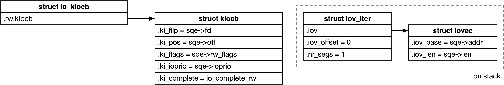

## io_uring - 3 IO Routine

本文描述 io_uring 的 IO Routine 路径


### submit

#### base routine

用户态程序通过调用 io_uring_setup() 来建立 io_uring 实例

之后用户态程序在向 submission queue 提交一定数量的 submission queue entry 之后，就需要调用 io_uring_enter() 通知内核开始处理这些 submission queue entry


io_uring_enter() 中根据 submission queue entry 初始化相应的 iov_iter 与 kiocb，之后就调用当前需要执行 IO 操作的文件的 read_iter()/write_iter() 回调函数，下发该 submission queue entry 对应的 IO



```sh
io_uring_enter
    io_submit_sqes
        io_get_sqe // get sqe from @tail
        io_submit_sqe
            io_queue_sqe
                __io_queue_sqe
                    io_issue_sqe
                        io_write // for IORING_OP_WRITE
                            f_op->write_iter()
```

direct IO 路径中在下发 IO 之后即返回，并不会等待 IO 完成


#### async submit

libaio 最令人诟病的一个缺陷是，用户之所以选择 libaio 进行异步操作，就是希望 IO 下发过程中不要发生阻塞，但是在实际实现中，部分类型的 IO (以 buffered IO 最为典型) 路径就是可能发生阻塞，例如 buffered read/write 过程中，如果 page cache 中不存在当前需要读写的 page，就需要等待这个 page 缓存到 page cache 中，这一过程就会发生阻塞

libaio 一直不能很好地处理这种可能发生阻塞的情况 (read/write 路径中发生阻塞)，导致用户进程在执行 libaio 的相关接口即 io_submit() 下发 IO 的时候，在用户进程上下文中发生阻塞

为了避免在用户进程上下文下发 IO 的时候发生阻塞，io_uring 实际有两级结构来实现 IO 的下发

```sh
- current process context
    # submit IO synchronously

- "io-wqe-worker" kthread
    # submit IO asynchronously
```

1. sync submit in current process context

io_uring 中会首先尝试在当前进程上下文中 **同步** 地下发 IO，但前提是当前下发的 IO 类型，其路径支持 NOWAIT 标志；在当前进程上下文中下发 IO 的时候，都会给下发的 kiocb 设置上 NOWAIT 标志

```sh
- current process context
    io_uring_enter
        io_submit_sqes
            io_submit_sqe
                io_queue_sqe
                    __io_queue_sqe
                        io_issue_sqe # with @force_nonblock true
                            read_iter/write_iter # sync submit with NOWAIT
```


2. async submit when sync failed with -EAGAIN

上述 sync IO 下发的路径中可能发生阻塞，那么 read_iter/write_iter 会返回 -EAGAIN

```sh
blkdev_write_iter
    __generic_file_write_iter
        generic_file_direct_write
        		/* If there are pages to writeback, return */
        		if (filemap_range_has_page(...))
        		      return -EAGAIN;
```


此时会将这个 IO 添加到 "io-wqe-worker" kthread 内核线程的队列中，之后由该内核线程 **异步** 地下发该 IO，从而避免在当前进程上下文中发生阻塞

```sh
- current process context
    io_uring_enter
        io_submit_sqes
            io_submit_sqe
                io_queue_sqe
                    __io_queue_sqe
                        io_issue_sqe
                            read_iter/write_iter # returns -EAGAIN
                        # returns -EAGAIN
                        
                        io_queue_async_work # request for async submit
```


3. async submit in "io-wqe-worker" kthread

"io-wqe-worker" kthread 内核线程中会异步地下发 IO，此时下发的 kiocb 都是没有 NOWAIT 标志的

```sh
- "io-wqe-worker" kthread
    io_wq_submit_work
        io_issue_sqe # with @force_nonblock false
            read_iter/write_iter # async submit without NOWAIT
```


3. skip async submit when sqe marked NOWAIT

如果用户提交的 sqe->rw_flags 设置有 RWF_NOWAIT，同时 file->f_mode & FMODE_NOWAIT，说明当前这个 sqe 必须同步下发，即下发这个 IO 的时候不能发生阻塞，此时在当前进程上下文中同步下发 IO 失败（read_iter/write_iter 会返回 -EAGAIN）的时候，不会再尝试由 "io-wqe-worker" kthread 内核线程异步下发，而是直接结束当前 IO 的下发，并在 completion queue 中写入一个 completion event，显示该 IO 的执行结果为 -EAGAIN

```sh
- current process context
    io_uring_enter
        io_submit_sqes
            io_submit_sqe
                io_queue_sqe
                    __io_queue_sqe
                        io_issue_sqe
                            read_iter/write_iter # sync submit with NOWAIT
                        if (ret == -EAGAIN && !(req->flags & REQ_F_NOWAIT)):
                            io_queue_async_work(req)
                        else:
                            io_req_complete(req, -EAGAIN) # write an completion event (-EAGAIN) to completion queue
```


4. skip sync submit when sqe marked FORCE_ASYNC

如果用户提交的 sqe->flags 设置有 REQ_F_FORCE_ASYNC 标志，说明当前这个 sqe 必须异步下发，那么此时就会跳过在当前进程上下文中同步下发的步骤，而是直接由 "io-wqe-worker" kthread 内核线程异步下发

```sh
- current process context
    io_uring_enter
        io_submit_sqes
            io_submit_sqe
                io_queue_sqe
                    if sqe marked REQ_F_FORCE_ASYNC:
                        io_queue_async_work # request for async submit
```


5. tag used up

之前介绍过，如果 sync IO 下发路径中发生阻塞，那么 read_iter/write_iter 会返回 -EAGAIN，此时会将这个 IO 添加到 "io-wqe-worker" kthread 内核线程的队列中，之后由该内核线程异步地下发该 IO

但如果是因为 block 层 tag 资源用尽而导致当前 IO request 无法下发，那么实际上是在 read_iter/write_iter 的上下文中直接调用 iocb->ki_complete() 即 io_complete_rw()，其中调用 io_rw_reissue() 由 "io-wqe-worker" kthread 内核线程异步下发该 IO

```sh
- current process context
    io_uring_enter
        io_submit_sqes
            io_submit_sqe
                io_queue_sqe
                    __io_queue_sqe
                        io_issue_sqe
                            read_iter/write_iter, e.g. blkdev_write_iter
                                mapping->a_ops->direct_IO(), that is, blkdev_direct_IO
                                    submit_bio(bio)
                                        blk_mq_submit_bio
                                            __blk_mq_alloc_request() # failed because tag used up
                                            bio_wouldblock_error(bio)
                                                # bio->bi_status = BLK_STS_AGAIN
                                                bio->bi_end_io(bio), that is blkdev_bio_end_io()
                                                    iocb->ki_complete(), that is, io_complete_rw
                                                        io_rw_reissue
                                                            io_queue_async_work # resubmit asynchronously
                                    # returns -EIOCBQUEUED
                        # returns -EIOCBQUEUED
```


6. skip sync submit when NOWAIT not supported

之前介绍过在下发 IO 的时候，io_uring 中会首先尝试在当前进程上下文中同步地下发 IO，此时下发的 kiocb 会设置上 NOWAIT 标志；之后如果 IO 下发路径中可能发生阻塞，那么 read_iter/write_iter 会返回 -EAGAIN，此时再由 "io-wqe-worker" kthread 内核线程异步下发该 IO，从而避免在当前进程上下文中发生阻塞

也就是说即使有些 IO 类型例如 buffered read/write 路径中可能发生阻塞，只要路径中支持 NOWAIT 处理，在即将发生阻塞的时候返回 -EAGAIN，那么在下发 IO 的时候，都可以先尝试在当前进程上下文中同步下发 IO

而如果 IO 下发路径中不支持 NOWAIT 的处理，就必须一开始就跳过在当前进程上下文中同步下发的步骤，而是直接由 "io-wqe-worker" kthread 内核线程异步下发

```sh
- current process context
    io_uring_enter
        io_submit_sqes
            io_submit_sqe
                io_queue_sqe
                    __io_queue_sqe
                        io_issue_sqe
                            # force_nonblock is TRUE and
                            # io_file_supports_async() returns FALSE
                            @no_async = TRUE
                            # returns -EAGAIN
                        # returns -EAGAIN
                        
                        io_queue_async_work # request for async submit
```


> direct read/write

- VFS 层的 direct IO 路径是支持 NOWAIT 处理的
- 但是 block 层路径取决于 blkdev 的 request queue 是否设置有 QUEUE_FLAG_NOWAIT 标志，设置有该标志的 blkdev 是支持 NOWAIT 处理的，目前 request-based mq 设备和设置有 DM_TARGET_NOWAIT 的 bio-based dm 设备都是支持 QUEUE_FLAG_NOWAIT 标志的

因而对于 direct read/write 路径来说，只要底层的 blkdev 是支持处理 NOWIAT 标志的，那么就会首先尝试在当前进程上下文中同步地下发 IO


> buffered read

本来 buffered read 路径是可能发生阻塞且不支持 NOWAIT 处理的，但是 Jens Axboe 在 v5.3 版本引入的一组 patchset ("Add support for async buffered reads") 增加了 buffered read 路径中对 NOWAIT 的处理，因而此时 buffered read 也是会首先尝试在当前进程上下文中同步地下发 IO


> buffered write

目前 buffered write 路径中

- regular file 的 buffered write 路径是不支持 NOWAIT 处理的，因而下发过程中是直接由 "io-wqe-worker" kthread 内核线程异步下发的
- 其他文件 (block/char/pipe) 的 buffered write 路径是支持 NOWAIT 处理的，因而会首先尝试在当前进程上下文中同步地下发 IO


### complete

direct IO 路径中当之前下发的 IO 完成时，会调用 kiocb->ki_complete() 回调函数即 io_complete_rw()，其中向 completion queue 写入一条 completion event

```sh
io_complete_rw
    __io_complete_rw
        io_complete_rw_common
            __io_req_complete
                io_submit_flush_completions
                    __io_cqring_fill_event
                        io_get_cqring
```


```
nvme_end_req
    blk_mq_end_request
        blk_update_request
            req_bio_endio
                bio_endio
                    bio->bi_end_io(), e.g., blkdev_bio_end_io() for blkdev
                        kiocb->ki_complete(), e.g., io_complete_rw_iopoll() for io_uring
                            WRITE_ONCE(req->iopoll_completed, 1);
        __blk_mq_end_request
            blk_mq_free_request
                __blk_mq_free_request
                    blk_queue_exit
                        percpu_ref_put(&q->q_usage_counter)
```
