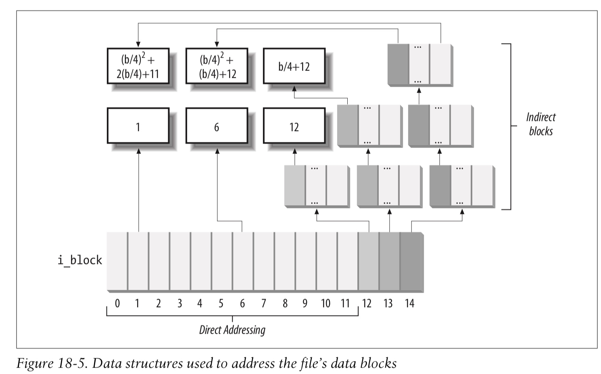
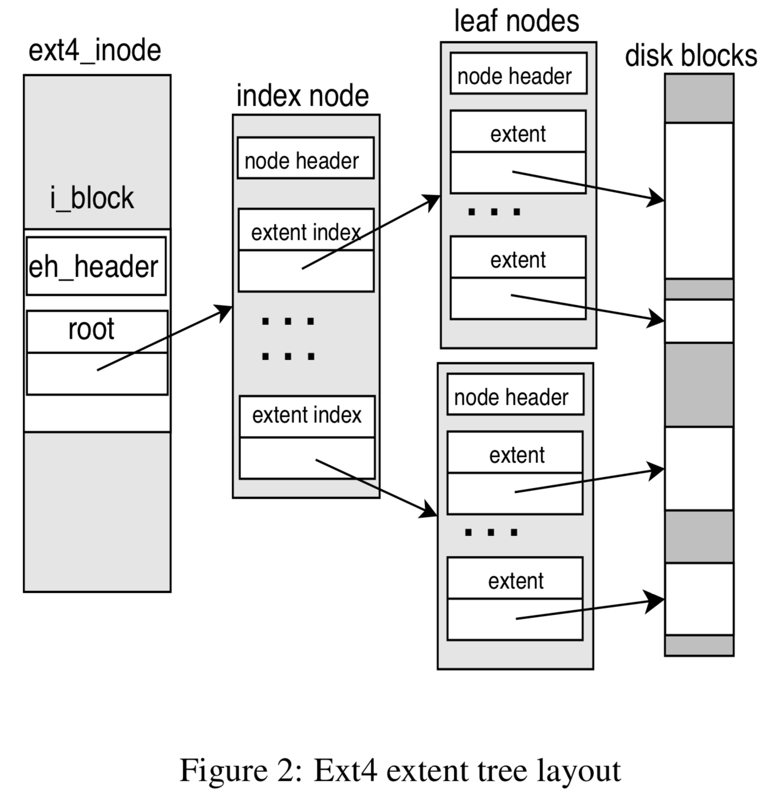

## IO - iomap - 1 Base


### Background

#### traditional filemap mapping

block-based 的文件系统需要将基于文件的 logical file offset 偏移，转换为基于磁盘的 physical block number 偏移，这种映射过程称为 block mapping

传统的 block mapping 机制被称为 filemap mapping，其入口为
 
 ```c
 ssize_t generic_file_read_iter(struct kiocb *iocb, struct iov_iter *iter)
 ssize_t generic_perform_write(struct file *file, struct iov_iter *i, loff_t pos)
 ```

其中会按照 page 为单位执行地址翻译与数据拷贝，各个文件系统传入各自的 get_block_t 回调函数以实现地址翻译

```c
typedef int (get_block_t)(struct inode *inode, sector_t iblock,
			struct buffer_head *bh_result, int create);
```

即获取 @inode 文件的 @iblock 偏移处映射的 physical block number，结果保存在 @bh_result 参数中


下面以 buffer write 为例，介绍 fiemap mapping 的流程

```sh
f_op->write_iter(kiocb, iov_iter)
    generic_perform_write
        # divide at page boundary, for each page
            # find buffer page in page cache
            a_ops->write_begin(), e.g. ext4_write_begin()
                __block_write_begin(..., ext4_get_block) // read from disk
                    # for each block in this page
                        # call get_block() for address translation
                    
            # copy from user buffer to buffer page
            iov_iter_copy_from_user_atomic
            
            # mark buffer page and inode as dirty
            a_ops->write_end()
```

从上述流程可以看到，fiemap mapping 是以 block 为单位进行地址翻译的，这里的 block 是指文件系统里面的 block 的概念，例如 ext4 下在执行 mkfs.ext4 的时候可以指定 block 的大小

fiemap mapping 框架下使用 struct buffer_head 来存储地址翻译的结果

```
struct page *b_page                         struct block_device *b_bdev
+-----------+                                       |           |
|           |                                       |           |
|@@@@@@@@@@@| <- b_data                b_blocknr -> |###########|
|@@@@@@@@@@@|       +--------------------+          |###########|
|@@@@@@@@@@@|       | struct buffer_head |          |###########|
|@@@@@@@@@@@|       +--------------------+          |###########|
|@@@@@@@@@@@| <- b_data + b_size                    |###########|                       
|           |                                       |           |
+-----------+                                       |           |
```

这种以 block 为单位进行地址翻译的软件实现最初是为传统的 indirect block mapping 的文件系统 (ext2) 设计的，彼时文件的 logical file offset 与 physical block 本就是以 block 为单位一一映射的，在 logical file offset 地址空间中相邻的两个 block，完全有可能映射为 physical block 地址空间中相分隔的两个 block，因而此时软件实现上为每个 block 执行一次地址翻译是必需的




#### extent based mapping

而现代文件系统 (ext4/xfs) 都支持 extent based mapping，此时文件的一个 extent 就描述文件的一段 logical file offset 区间映射为磁盘上一整块连续的 physical block 区间



在 extent-based 的映射机制下，原有的以 block 为单位进行地址翻译的软件实现则显得异常低效，更为合理的实现显然是以 extent 为单位执行地址翻译


#### iomap mapping

后来引入的 iomap 机制，其核心思想就是以 extent 为单位进行地址映射，避免 filemap block mapping 中重复冗余的地址映射操作

> The basic idea is to avoid the per-block get_blocks overhead
and make use of extents in the buffered write path by iterating over
them instead.
> [iomap infrastructure and multipage writes](https://lwn.net/Articles/686673/)


### iomap Framework

#### apply model

iomap 框架最初使用 apply model，即 iomap_apply() 作为 iomap 框架的入口

```c
loff_t
iomap_apply(struct inode *inode, loff_t pos, loff_t length, unsigned flags,
		const struct iomap_ops *ops, void *data, iomap_actor_t actor)
```

寻找 @inode 文件 @pos 偏移处起始的，@length 大小的 logical block 区间，所映射的 physical block 区间


##### iomap_begin()

iomap_apply() 只是通用路径，其中需要调用文件系统传入的 iomap_ops->iomap_begin() 回调函数实现地址翻译

```c
struct iomap_ops {
	/*
	 * Return the existing mapping at pos, or reserve space starting at
	 * pos for up to length, as long as we can do it as a single mapping.
	 * The actual length is returned in iomap->length.
	 */
	int (*iomap_begin)(struct inode *inode, loff_t pos, loff_t length,
			unsigned flags, struct iomap *iomap,
			struct iomap *srcmap);
	...
```

这里需要注意的是，最终 extent 映射的结果会保存在传入的 @iomap 参数，而保持 @srcmap 参数不变

> @srcmap 参数在 v5.5 版本由 commit c039b9979272 ("iomap: use a srcmap for a read-modify-write I/O") 引入，主要支持文件系统的 CoW 操作 (例如 xfs 的 reflink)，在发生 CoW 的时候文件系统会分配一个新的 extent 作为原来 shared extent 的拷贝，此时 @srcmap 就描述原来的 shared extent，@iomap 就描述新分配的 new extent


```c
struct iomap {
	u64			addr; /* disk offset of mapping, bytes */
	loff_t		offset;	/* file offset of mapping, bytes */
	u64			length;	/* length of mapping, bytes */
	u16			type;	/* type of mapping */
	u16			flags;	/* flags for mapping */
	...
};
```

一个 struct iomap 就描述文件的一个 extent，具体是指 @offset 偏移起始处起始的，@length 大小的 logical block 区间，映射为 @addr 地址处起始的 physical block 区间

@type 描述该映射的类型，可以为 IOMAP_HOLE/IOMAP_MAPPED/IOMAP_UNWRITTEN，IOMAP_HOLE 时 @addr 字段无效


这里需要注意的是，返回的 @iomap 描述的是一个完整的 extent，此时传入的 @pos 可以在这个 extent 范围内

```
  @iomap->addr
        <-------------- @iomap->length ------------->
        +-------------------------------------------+
        |                                           |
        +-------------------------------------------+
        ^                   ^
  @iomap->offset        **@pos**
```


同时传入的 @length 可能小于 @iomap->length，也就是当前 iomap_apply() 需要操作的数据只是一个 extent 中的一部分

```     
  @iomap->addr
        <---------------@iomap->length-------------->
        +-------------------------------------------+
        |                                           |
        +-------------------------------------------+
                            <-- @length -->
        ^                   ^
  @iomap->offset        **@pos**
```


传入的 @length 也有可能大于 @iomap->length，也就是当前 iomap_apply() 需要操作的数据对应多个 extent

```     
  @iomap->addr
        <---------------@iomap->length-------------->
        +-------------------------------------------+   +--------------
        |                                           |   | next extent (iomap)
        +-------------------------------------------+   +--------------
                            <---------------- @length ----------------->
        ^                   ^
  @iomap->offset        **@pos**
```


##### iomap_actor_t

iomap_apply() 中在调用 iomap_ops->iomap_begin() 回调函数实现映射之后，就会调用文件系统传入的 iomap_actor_t 回调函数，对取得的 iomap 进行处理

```c
typedef loff_t (*iomap_actor_t)(struct inode *inode, loff_t pos, loff_t len,
		void *data, struct iomap *iomap, struct iomap *srcmap);
```

描述当前对 @inode 文件 @pos 文件偏移处开始 @len 字节的数据进行操作，其中

- @iomap 参数就是 iomap_ops->iomap_begin() 回调函数中返回的 iomap，其中保存了地址映射的结果
- @len 参数描述当前可用的映射的长度，实际上是 min(@iomap->length, @length)
- @pos 参数描述当前需要操作的数据在文件中的起始偏移，该值是大于等于 @iomap->offset 的

函数返回已经处理的数据大小，例如 direct IO 中返回的就是已经读或写的数据量


##### iomap_end

最后 iomap_apply() 中会调用 iomap_ops->iomap_end() 回调函数

```c
struct iomap_ops {
	...
	/*
	 * Commit and/or unreserve space previous allocated using iomap_begin.
	 * Written indicates the length of the successful write operation which
	 * needs to be commited, while the rest needs to be unreserved.
	 * Written might be zero if no data was written.
	 */
	int (*iomap_end)(struct inode *inode, loff_t pos, loff_t length,
			ssize_t written, unsigned flags, struct iomap *iomap);
};
```


#### iterator model

v5.15 引入的 commit f4b896c213f0752adc828ddc11bd55419ffab248 ("iomap: add the new iomap_iter model")，使得 iomap 框架变更为 iterator model，区别在于

```
# apply model                       # iterator model
iomap_readpage                      iomap_readpage
    iomap_apply                         for each extent:
        for each extent:                    .iomap_begin()
            .iomap_begin()                  # handle the data
            iomap_actor_t                   .iomap_end()
            .iomap_end()
```

apply model 对于每个 extent 都要调用 iomap_apply() 的调用者传入的 iomap_actor_t 回调函数，而 iterator model 中则省去了这些 indirect call 的开销，因而理论上性能存在优势

在切换为 iterator model 之后，调用 iomap 框架的模式变为

```
# iomap_XXX
	while ((ret = iomap_iter(&iter, ops)) > 0)
		iter.processed = iomap_XXX_iter(&iter, &ctx, 0);
```

此时使用 struct iomap_iter 作为 iteration 过程中的上下文

```c
struct iomap_iter {
	struct inode *inode;
	loff_t pos;
	u64 len;
	s64 processed;
	unsigned flags;
	struct iomap iomap;
	struct iomap srcmap;
};
```

描述**接下来**需要对 @inode 文件的 @pos 偏移处起始的 @len 字节长度的 logical file range 执行 iomap 映射，@pos/@len 都会随着 iteration 的进行而更新

@processed 描述最近一轮即上一轮 iteration 过程中处理的数据长度，若该字段为 0 那么应该立即结束当前的 iteration 过程；若该字段小于 0，说明 iteration 过程中发生了错误


> first round

在第一轮 iteration 中，首先根据传入的需要读取的 page，设置 iter.@pos/@len 字段，之后 iomap_iter() 中会调用 ops->iomap_begin() 进行映射，之后就会对 iter.iomap 描述的映射进行处理，最后将 iter.processed 更新为这一轮 iteration 处理完成的数据长度

```
# iomap_XXX: first iteration
   # init iomap_iter @inode/@pos/@len
	struct iomap_iter iter = {
		.inode	= ,
		.pos		= ,
		.len		= ,
	};

    # first round
    iomap_iter(&iter, ops)
        iomap_iter_advance(iter)
            # init iomap_iter @processed/@iomap/@srcmap
            iter->processed = 0
            memset(&iter->iomap, 0, ...)
            memset(&iter->srcmap, 0, ...)
	   
        ops->iomap_begin(iter->inode, iter->pos, iter->len, iter->flags,
			       &iter->iomap, &iter->srcmap);
	   
    # handle the iter->iomap mapping range
    # returns the length has been handled in this iteration
    iter.processed = iomap_XXX_iter(&iter, ...)
```


> next round

之后在下一轮 iteration 中，根据 iter.processed 即上一轮处理的数据长度，相应地更新 iter.@pos/@len 字段，之后重复以上过程

```
# iomap_XXX: next iteration
    # next round
    while (iomap_iter(&iter, ops) > 0)
        iomap_iter_advance(iter)
            # update iomap_iter @pos/@len
            iter->pos += iter->processed;
            iter->len -= iter->processed;

            # reinit iomap_iter @processed/@iomap/@srcmap
            iter->processed = 0
            memset(&iter->iomap, 0, ...)
            memset(&iter->srcmap, 0, ...)

        ops->iomap_begin(iter->inode, iter->pos, iter->len, iter->flags,
			       &iter->iomap, &iter->srcmap);
	   
    # handle the iter->iomap mapping range
    # returns the length has been handled in this iteration
    iter.processed = iomap_XXX_iter(&iter, ...)
```


> last round

iomap_iter() 返回 0 时，说明当前应该立即结束 iteration 过程；iomap_iter() 返回负值时，说明 iteration 过程中发生了错误；这两种情况下都应该立即结束 iteration 过程

所以要结束 iteration loop，有两种途径

- iomap_XXX_iter() 中将 iter.processed 设置为 0
- iter.len 变为 0，即最初 iter.len 长度的数据都已经处理完了

```
# iomap_XXX: exit iteration
    # last round
    while (iomap_iter(&iter, ops) > 0)
        iomap_iter_advance(iter)
            if (iter->processed <= 0)
                return iter->processed
            
            iter->pos += iter->processed;
            iter->len -= iter->processed;
            if (!iter->len): return 0;
```
