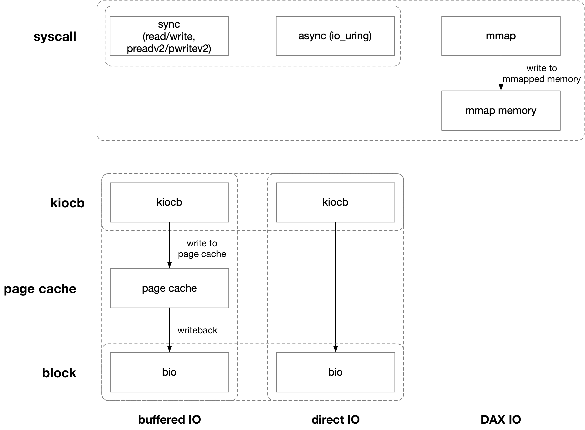
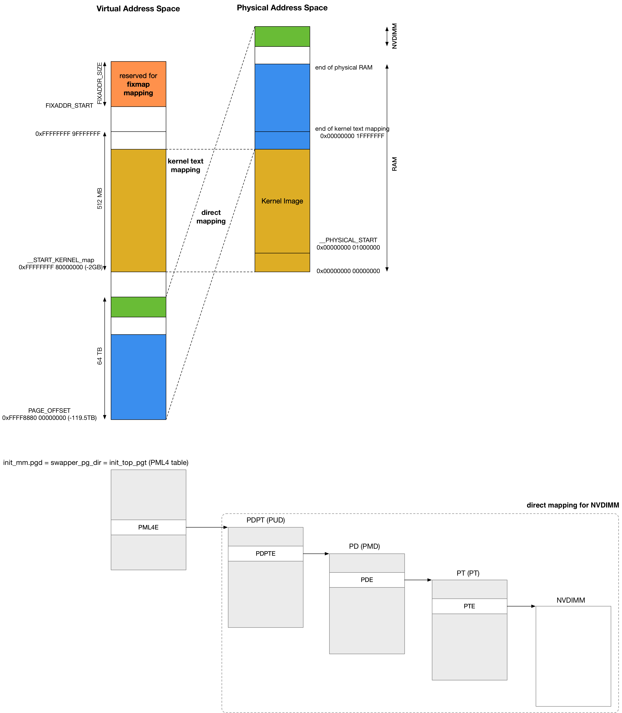

title:'3 DAX - fsdax'
## 3 DAX - fsdax

DAX (Direct Access) 是针对于 NVDIMM (Non-Volatile DIMM) 非易失性内存设备的特殊的文件访问模式，其使用方法一般是

- 在 NVDIMM (Non-Volatile DIMM) 设备上构建通用文件系统 (ext4/xfs 等)，同时通过挂载参数 (-o dax) 打开文件系统的 DAX 特性
- 之后对于该文件系统上的某个文件执行 mmap() 系统调用进行 file memory mapping，将用户进程地址空间内的一段虚拟地址区域映射到 NVDIMM 设备内的物理地址区间
- 用户进程对返回的虚拟地址区域执行内存操作，实际上就是对 NVDIMM 设备上的存储单元直接进行操作

因而 DAX 模式相当于是跳过了 page cache 和 block layer，直接通过内存操作实现文件操作

DAX 特性需要文件系统支持，ext4 在 v4.0 版本添加 DAX 支持




### pmem: fsdax mode

首先 NVDIMM 设备需要工作在 pmem+fsdax 模式，此时会创建 /dev/pmemX.X 块设备

```sh
nd_region_register_namespaces // register 'namespaceX.X' device, for each namespace in this region
    # for pmem + fsdax mode (disk: pmem0.0)
    nd_pmem_driver->probe(), i.e., nd_pmem_probe()
        pmem_attach_disk
            # blk_alloc_queue, alloc_disk, device_add_disk
            # disk->fops = pmem_fops
            
            # res from NFIT's 'SPA (System Physical Address) Range Structure'
            pmem->phys_addr = res->start;
            pmem->size = resource_size(res);
            
            pgmap.res = res
            pgmap.altmap_valid = false
            pgmap->type = MEMORY_DEVICE_FS_DAX
            pmem->virt_addr = devm_memremap_pages(pgmap)
```


设备初始化过程中，会为设备对应的 SPA (System Physical Address) 区间建立 direct memory mapping，@phys_addr 描述了该区间映射的起始物理地址，@virt_addr 描述了该区间映射的起始虚拟地址




pmem 注册的 disk->fops 为 pmem_fops，IO 下发过程中实际上就是根据 @virt_addr 字段，对对应的地址执行内存操作

```sh
pmem_fops->submit_bio(), i.e., pmem_submit_bio()
    pmem_do_read/pmem_do_write
        # fetching base virtual address from pmem->virt_addr
        memcpy()
```


### pmem: register dax device

之前介绍过 NVDIMM 设备初始化的时候会创建 'pmemX.X' 块设备，这个块设备的 request queue 会设置有 QUEUE_FLAG_DAX 标志

同时创建并注册对应的 dax device

```sh
nd_region_register_namespaces
    # for pmem + fsdax mode (disk: pmem0.0)
    nd_pmem_driver->probe(), i.e., nd_pmem_probe()       
        pmem_attach_disk
            blk_alloc_queue
            blk_queue_flag_set(QUEUE_FLAG_DAX, q);
            
            dax_dev = alloc_dax(pmem, disk->disk_name, &pmem_dax_ops, flags);
            pmem->dax_dev = dax_dev;
```


### mount filesystem

之前介绍过 NVDIMM 设备初始化的时候会创建 'pmemX.X' 块设备，之后可以在该块设备上格式化文件系统，之后这个文件系统挂载的时候，会获取对应的 dax_device，以 ext4 为例

```sh
ext4_fill_super
    dax_dev = fs_dax_get_by_bdev(sb->s_bdev);
        dax_get_by_host(bdev->bd_disk->disk_name)
    ext4_sb_info->s_daxdev = dax_dev;
```


