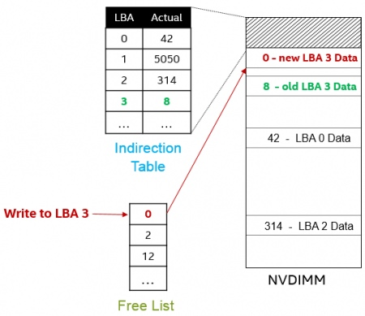

## 1 NVDIMM - Base

> Reference

[NVDIMM Enabling in SUSE Linux Enterprise 12, Service Pack 2](https://www.suse.com/c/nvdimm-enabling-suse-linux-enterprise-12-service-pack-2/)

### Background

NVDIMM (Non-Volatile DIMM) 指非易失性内存，目前 JEDEC 标准化组织规范了三种类型的 NVDIMM

1. NVDIMM-N

最为直观也是最早的一种 NVDIMM 命名为 NVDIMM-N，实际上就是将传统的 DRAM、NAND flash 与电池（电容）封装在一起

芯片中只有 DRAM 连接到系统的内存总线，NAND flash 只是作为 DRAM 的后备存储，因而系统只能访问 DRAM，不能直接访问 NAND flash，其访问方式是 byte-based 或 block-based 的

- 当芯片上电时，电池开始充电，同时系统访问 DRAM
- 当系统掉电时，芯片中内置的电池可以提供备用电源，使得 DRAM 中的数据及时写到 NAND flash 中
- 系统重新上电时，电池重新开始充电，同时 DRAM 中的数据由 NAND flash 恢复

这种格式的 NVDIMM

- 由于直接访问 DRAM 内存，因而其访问延迟与内存类似，为 10ns 量级
- 由于需要同时封装 DRAM 和 NAND flash，因而其容量较小，为 1~10GB 量级

2. NVDIMM-F

NVDIMM-F 本质上还是 NAND flash，只是将传统的 SATA/SAS/PCIe 接口替换为 DDR 总线，从而提升总线带宽，并一定程度上减小延时

这种格式的 NVDIMM 的存储介质本质上还是 NAND flash，因而其容量较大，为 10GB~1TB 量级；同时其延时与块设备一样还是 10 us 量级

其访问方式与块设备一样是 block-based 的

3. NVDIMM-P

NVDIMM-P 是将新型的存储介质直接连到内存总线，其容量可以达到 NAND flash 类似的 TB 量级，同时延时又可以达到内存的 100ns 量级

NVDIMM-P 既可以作为块设备（block-based），也可以作为内存访问（byte-based）

NVDIMM-P 目前有多种实现方式，例如 Intel 推出的 3D XPoint (3D Crosspoint) 就是一种新的存储介质，容量与 NAND flash 接近，延时与内存接近，同时可以按照 byte 寻址

3D XPoint 的存储介质

- 使用 PCI 接口实际上就是所谓的 Optane NVMe
- 使用 DDR 接口实际上就是所谓 Optane memory，也称为 AEP (Apache Pass)，属于一种 NVDIMM-P

#### Namespace - Mode

此外 namespace 还可以工作在不同的模式

fsdax (filesystem DAX) 是将 NVDIMM 设备用作存储，此时会导出一个块设备，用户可以在该块设备上格式化文件系统，在支持 DAX 特性的文件系统 (例如 ext4/xfs) 中，就可以通过 mmap() 的方式使得用户进程地址空间内的内存操作，直接转换为对 NVDIMM 设备存储单元的操作

devdax (device DAX) 则是将 NVDIMM 设备用作内存，此时导出一个字符设备，用户可以对该字符设备执行 mmap() 操作，之后就可以通过 mmap() 返回的地址，将该 NVDIMM 设备当作内存来用

> fsdax: Filesystem-DAX mode is the default mode of a namespace when specifying ndctl create-namespace with no options. It creates a block device (/dev/pmemX[.Y]) that supports the DAX capabilities of Linux filesystems (xfs and ext4 to date). DAX removes the page cache from the I/O path and allows mmap(2) to establish direct mappings to persistent memory media. The DAX capability enables workloads / working-sets that would exceed the capacity of the page cache to scale up to the capacity of persistent memory. Workloads that fit in page cache or perform bulk data transfers may not see benefit from DAX. When in doubt, pick this mode.
> 
> devdax: Device-DAX mode enables similar mmap(2) DAX mapping capabilities as Filesystem-DAX. However, instead of a block-device that can support a DAX-enabled filesystem, this mode emits a single character device file (/dev/daxX.Y). Use this mode to assign persistent memory to a virtual-machine, register persistent memory for RDMA, or when gigantic mappings are needed.
> 
> sector: Use this mode to host legacy filesystems that do not checksum metadata or applications that are not prepared for torn sectors after a crash. Expected usage for this mode is for small boot volumes. This mode is compatible with other operating systems.
> 
> raw: Raw mode is effectively just a memory disk that does not support DAX. Typically this indicates a namespace that was created by tooling or another operating system that did not know how to create a Linux fsdax or devdax mode namespace. This mode is compatible with other operating systems, but again, does not support DAX operation.

### Use Mode

Use Mode | devnode
---- | ----
PMEM + DAX | /dev/pmem
BLK | /dev/nd_blk
PMEM + BTT | /dev/btt

#### PMEM + DAX

nvdimm 最原生的使用模式是 PMEM + DAX

该模式下，设备是按字节寻址的；同时内核可以访问 NVDIMM 设备的物理地址空间，因而可以使用 DAX (Direct Access) 特性，即此时 NVDIMM 设备仍然可以作为一个块设备，在其上格式化一个文件系统，之后对于该文件系统上的某个文件执行 mmap() 系统调用进行 file memory mapping，其中将用户进程地址空间内的一段虚拟地址区域直接映射到 NVDIMM 设备内的物理地址区域，这样用户进程对返回的虚拟地址区域执行内存操作，实际上就是直接读写 NVDIMM 设备内的存储单元

#### BLK

PMEM + DAX 模式的最大缺陷是无法保证 "sector atomicity"

传统的基于块设备的 IO 栈以 sector 为单位向块设备读写数据，此时 IO 栈对块设备的一个要求就是必须确保 sector 数据读写的原子性，即向块设备写入一个 sector 数据的过程中设备发生意外断电，当设备重启之后从这一个 sector 读取的数据，要么全是 old data 要么全是 new data

PMEM + DAX 模式则没有办法保证这种 sector 读写的原子性，因为该模式下设备是按字节寻址、数据写入的，在写入一个 sector 数据的时候，完全有可能写入部分数据后发生意外断电，此时设备重启后读取出这一个 sector 的数据，完全有可能一部分是 old data 而另一部分是 new data

因而可以将 nvdimm 设备配置为 BLK 模式，该模式下 CPU 通过一种称为 Aperture 的资源来访问 NVDIMM 设备内的存储单元，Aperture 实际上就是一段数个 page 大小的内存，这一段内存会与 NVDIMM 设备特定 offset 处的存储单元相映射，CPU 对 Aperture 的操作实际上就是对 NVDIMM 设备中映射的一段存储单元的操作

此外

- Control Register 可以用于设置 Aperture 相映射的一段存储单元在 NVDIMM 设备内的偏移
- Status Register 用于描述 CPU 对 Aperture 进行操作后，实际的 IO 是否执行成功

实际上以上描述的 Aperture、Control Register、Status Register 加在一起组成了一套 block window，一个 region 实际上包含多个 block window 资源

BLK 模式下系统软件通过处理器提供的 block window 对设备进行读写，在写入一个 sector 之后，需要读取 Status Register 寄存器以判断这一个 sector 的数据是否全部成功写入，因而这种通过寄存器交互的方式天然就支持 "sector atomicity" 的特性；但是这种模式的性能较差，目前已经被弃用

#### PMEM + BTT

之前介绍过，PMEM + DAX 模式无法保证 "sector atomicity"，后来 PMEM 使用 BTT 这种软件方案来实现 sector 读写的原子性

BTT (Block Translation Table) 维护有两张表，其中一个 (indirection table) 实现了设备的 logical block address 与 NVDIMM 内部实际的地址空间之间的映射，而另一个 (free list) 则维护了 NVDIMM 设备内部当前所有可写的 sector

BTT 中通过将 write 操作转换为 allocate write 的方式来实现 secotor 读写的原子性，例如以下是 BTT 执行 sector write 操作的流程

1. initial state

BTT 描述了设备的 logical block address 与 NVDIMM 内部实际的地址空间之间的映射，例如此时 logical sector 3 实际映射为 physical sector 8

2. allocate write

如果此时上层的 IO 栈需要写 logical sector 3，此时不会直接覆盖写其映射的 physical sector 8，而是通过 free list 分配一个空闲的 physical sector (例如 physical sector 0)，将当前需要写入的数据写入这个分配的 physical sector

3. atomic swap

在将数据成功写入分配的 physical sector 之后，会通过 atomic swap 的方式将 indirection table 和 free list 中的 physical sector number 进行对换，这样就保证了 logical sector 3 原子地映射到新的 physical sector 0

