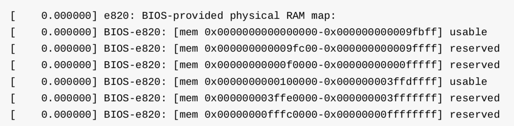

title:'MM - 05 Init - x86_64 Init Routine'
## MM - 05 Init - x86_64 Init Routine


### bootstrap

系统初始化过程中，bootstrap loader 会调用 BIOS 的相关接口收集系统的所有 RAM 的信息，包括每个 RAM segment 的类型、起始物理地址、大小等

例如当使用 BIOS e820 接口时，使用 struct e820entry 描述一个 RAM segment；每个 RAM segment 描述一个连续的物理内存区间，因而当物理内存区间被划分为多个区间时，就需要使用一个 struct e820entry 数组即 @e820_map[] 描述系统的所有内存物理地址区间，该数组保存在 boot_params 中

```c
struct boot_params {
	__u8  e820_entries;	/* 0x1e8 */
	struct e820entry e820_map[E820MAX];    /* 0x2d0 */
};
```


### memblock

系统初始化过程中，start_kernel() 会调用 setup_arch()，其中会将之前 bootstrap loader 扫描到的系统物理内存布局信息保存到 memblock 中

```
start_kernel
    |_ setup_arch
```

```c
void __init setup_arch(char **cmdline_p)
{
	memblock_reserve(__pa_symbol(_text),
			 (unsigned long)__bss_stop - (unsigned long)_text);

	early_reserve_initrd();
	
	setup_memory_map();
	
	memblock_x86_fill();
	...
}
```

1. reserve kernel image

将 kernel image 的 .text section 与 .data section 占用的物理内存区间添加到 memblock 的 reserved 分类


2. reserve ramdisk

调用 early_reserve_initrd() 将 ramdisk 占用的物理内存区间添加到 memblock 的 reserved 分类


3. setup memory map

调用 setup_memory_map() 将 bootstrap loader 扫描获取的 memory map 转移到另外静态定义的 e820 中

setup_memory_map() 中实际调用 x86_init.resources.memory_setup() 即 default_machine_specific_memory_setup()，其中将 boot_params 的 @e820_map[] 数组中存储的物理内存布局信息转移到静态定义的 e820 与 e820_saved 中

```c
struct e820map {
	__u32 nr_map;
	struct e820entry map[E820_X_MAX];
};

struct e820map e820;
struct e820map e820_saved;
```

同时将 memory map 打印输出




4. init memblock

调用 memblock_x86_fill() 将通过 BIOS 扫描得到的 memory map 中 E820_RAM 类型的物理地址区间添加到 memblock 的 memory 分类


### memory model

在 memblock 初始化完成后，setup_arch() 会调用 x86_init.paging.pagetable_init 即 paging_init() 完成 page table 以及 struct page 描述符的初始化

1. allocate page descriptor array

```
start_kernel
    setup_arch
        x86_init.paging.pagetable_init 即 paging_init()
            sparse_init
                sparse_init_nid
```


x86 架构下使用 sparse memory model，sparse_init() 中会初始化 sparse memory model，包括为当前插入的每个 section 从 memblock 分配相应数量的 page frame 以保存该 section 对应的 page 描述符数组


2. init page descriptor array

```
start_kernel
    setup_arch
        x86_init.paging.pagetable_init 即 paging_init()
            sparse_init
            zone_sizes_init
                free_area_init
                    free_area_init_node
                        free_area_init_core
                            memmap_init
                                memmap_init_zone
```

接下来会调用 free_area_init()，其中会对每个 memory node 调用 free_area_init_node() 以初始化该 memory node 对应的 struct pglist_data 数据结构

其中会对该 node 下的每个 zone 调用 memmap_init() 以初始化该 zone 下的所有 page，其中实际调用 memmap_init_zone()，其中就会初始化该 zone 下的所有 page 描述符，其具体过程是

- 遍历该 zone 下的所有 pfn，调用 pfn_to_page() 根据 memory model，找到当前 pfn 对应的 page 描述符
- 在该 page 描述符的 flags 字段保存该 page frame 所在的 node id、zone id、section id 等信息
- 将该 page frame 的类型初始化为 MIGRATE_MOVABLE type


### Node/Zone Init

```
start_kernel
    setup_arch
        x86_init.paging.pagetable_init 即 paging_init()
            sparse_init
            zone_sizes_init
                free_area_init
                    free_area_init_node
```

上面介绍的 free_area_init() 中会对每个 memory node 调用 free_area_init_node() ，其中会初始化该 node 对应的 struct pglist_data 数据结构

- node_start_pfn 字段保存该 node 的 start pfn
- node_spanned_pages 字段保存该 node 所有 page frame 的数目，包括 holes
- node_present_pages 字段保存该 node 所有可用的 page frame 的数目，不包括 holes

```c
typedef struct pglist_data {
	struct page *node_mem_map;
	unsigned long node_start_pfn;
	unsigned long node_present_pages; 	unsigned long node_spanned_pages; 
	...
} pg_data_t;
```


### Buddy System Init

```sh
start_kernel
    setup_arch
    mm_init
        free_all_bootmem
            free_low_memory_core_early
                # for each memory region
                __free_memory_core 
                    # for each page frame
                    __free_pages 
```

start_kernel() 中会调用 mm_init() 初始化 memory subsystem，其中会调用 mem_init()，其中对于 memblock 中的所有 memory 类型的 memory region 调用 __free_memory_core()，其中对于该 memory region 中的所有 page frame 调用 __free_pages()，以将该 memory region 中的所有 page frame 释放到 buddy system 中
