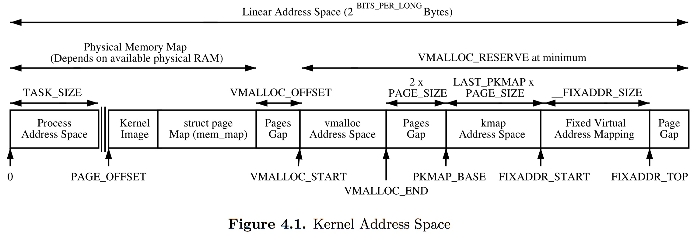
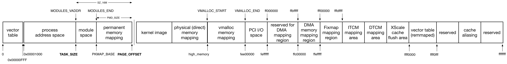

## MM - 02 Address Space


### Address Types

首先有必要先介绍计算机系统中使用的几种地址类型

```c
               CPU                  CPU                  Bus
             Virtual              Physical             Address
             Address              Address               Space
              Space                Space

            +-------+             +------+             +------+
            |       |             |MMIO  |   Offset    |      |
            |       |  Virtual    |Space |   applied   |      |
          C +-------+ --------> B +------+ ----------> +------+ A
            |       |  mapping    |      |   by host   |      |
  +-----+   |       |             |      |   bridge    |      |   +--------+
  |     |   |       |             +------+             |      |   |        |
  | CPU |   |       |             | RAM  |             |      |   | Device |
  |     |   |       |             |      |             |      |   |        |
  +-----+   +-------+             +------+             +------+   +--------+
            |       |  Virtual    |Buffer|   Mapping   |      |
          X +-------+ --------> Y +------+ <---------- +------+ Z
            |       |  mapping    | RAM  |   by IOMMU
            |       |             |      |
            |       |             |      |
            +-------+             +------+
```

#### Virtual Address

线性地址（linear address) 或虚拟地址 (virtual address）是 CPU 直接使用的地址，由 void * 数据类型表示


#### Physical Address

物理地址（physical address）与地址总线上的电信号相对应，每一个物理地址对应于某一个内存单元或内存映射的 IO 设备的一个寄存器

物理地址由 phys_addr_t 或 resource_size_t 数据类型表示，在 32bit 架构下就是 u32 数据类型，在 64bit 架构下就是 u64 数据类型

硬件设计中通常维护一个统一的物理地址空间，DRAM 与 FLASH 等各种外围设备共享同一个物理地址空间，因而 physical address 与 bus address 实际上是相通的

```
**Physical Address Space**

FFFFFFFF    +-----------+
            |           |
            |   Flash   |
            |           |
            +-----------+
            |           |
            +-----------+
            |           |
            |  PCI BUS  |
            |  Address  |
            +-----------+
            |           |
            +-----------+
            |           |
            |           |
            |   DRAM    |
            |           |
            |           |
00000000    +-----------+
```

只是我们通常说的 physical address 更多的是指代 DRAM 即内存的物理地址，处理器中的内存管理单元 (Memory Management Unit, MMU) 硬件用于实现 Virtual Address 与 Physical Address 之间的转换


### Virtual Address Space

Linux 中 virtual address space 通常分为 process address space 与 kernel address space 两部分

- 进程运行于用户态时只能寻址 process address space
- 进程运行于内核态时可以寻址 process address space 与 kernel address space


这样的划分方式具有以下考量

- 在 virtual address space 中明确区分用户态与内核态，即进程处于用户态时只能寻址 process address space，可以防止 user state 的错误影响到 kernel state
- 在实现中通常所有的 process address space 共用同一个 kernel address space，这样在执行 process context switch 时就可以不必对 kernel address space 相关的 TLB cache 执行 flush 操作，从而提高性能




其中

- PAGE_OFFSET 描述 kernel address space 的起点，即 PAGE_OFFSET 将 virtual address space 划分为 process address space 与 kernel address space 两部分
- TASK_SIZE 描述 process address space 的上限


#### 32 bit Address Space

在 32 bit 架构下，virtual address space 具有 4GB 地址空间，通常采用 3GB - 1GB 布局，即 process address space 占用前 3GB 地址空间，kernel address space 占用后 1GB 地址空间，此时 PAGE_OFFSET 为 0xC0000000


#### ARM 32 Address Space

下图为 ARM 32 架构下的 virtual address space




- PAGE_OFFSET 通常为 0xC0000000
- TASK_SIZE 通常为 (0xC0000000 - SZ_16M)

- MODULES_VADDR 通常为 TASK_SIZE 即 (0xC0000000 - SZ_16M)
- MODULES_END 通常为 (PAGE_OFFSET - PMD_SIZE)

- PKMAP_BASE 通常为 (PAGE_OFFSET - PMD_SIZE)，其中 PMD_SIZE 通常为 (1UL << 21) 即 2MB

- high_memory 描述 direct memory mapping 的结束地址

- VMALLOC_START 为 high_memory 开始的第一个以 VMALLOC_OFFSET 对齐的地址
- VMALLOC_END 为 0xFF000000


- vector table 位于虚拟地址空间起始的 1 page 即 4KB，当处理器支持 vector table remapping 时，vector table 也可以重映射到 kernel address space 的 1 page

- 在 TASK_SIZE 与 PAGE_OFFSET 之间
    - permanent memory mapping 占用 PMD_SIZE 即 2 MB
    - 剩余的地址空间用于 module space，module space 用于挂载 kernel module

- DMA memory mapping region 用于 DMA memory buffer


#### ARM 64 Address Space

在 ARM 64 架构下

1. 当 CONFIG_ARM64_64K_PAGES 配置，即使用 64KB page 时，只使用 64 bit 虚拟地址的低 42 bit，此时 process address space 占用前 4TB 地址空间，kernel address space 占用后 4TB 地址空间

2. 当 CONFIG_ARM64_64K_PAGES 未配置，即使用 4KB page 时，只使用 64 bit 虚拟地址的低 39 bit，此时 process address space 占用前 512GB 地址空间，kernel address space 占用后 512GB 地址空间

以上述情况 2 为例，此时 virtual address space 布局为

```
+-----------+ 0xFFFFFFFF_FFFFFFFF
|           |
|   Kernel  | 512GB
|           |
+-----------+ 0xFFFFFF80_00000000
|           |
|           |
|    N/A    |
|           |
|           |
|           |
+-----------+ 0x00000080_00000000
|           |
|   User    | 512GB
|           |
+-----------+ 0x00000000_00000000
```


此时 PAGE_OFFSET 实际为 0xffffffc000000000，即 direct memory mapping 为 (ffffffc000000000, ffffffffffffffff) 即 256GB

其余的 (0xffffff8000000000, 0xffffffc000000000) 之间的地址空间用于其他映射，此时不再使用 high memmory mapping (pkmap/fixmap)

```
+-----------+ 0xFFFFFFFF_FFFFFFFF
|  normal   | 256GB
+-----------+ 0xFFFFFFC0_00000000 (PAGE_OFFSET)
|  vmalloc  |
+-----------+ 0xFFFFFFBB_FFFF0000
|  module   |
+-----------+ 0xFFFFFFBF_FC000000
|           |
+-----------+ 0xFFFFFF80_00000000
|           |
|           |
|    N/A    |
|           |
|           |
|           |
+-----------+ 0x00000080_00000000
|           |
|   User    |
|           |
+-----------+ 0x00000000_00000000
```


#### x86 64 Address Space

在 x86 64 架构下，只使用 64 bit 虚拟地址的低 48 bit，地址的高 16 bit 的值与地址的 bit 47 相等，此时 virtual address space 具有 256TB 地址空间，通常采用 128TB - 128TB 布局，即 process address space 占用前 128TB 地址空间，kernel address space 占用后 128TB 地址空间，即 0xffff800000000000 起始的 128TB 地址空间


```
|           |
|    N/A    |
|           |
+-----------+ 0xFFFFF000_00000000
|           |
|   Kernel  | 128TB
|           |
+-----------+ 0xFFFF8000_00000000
|           |
|   User    | 128TB
|           |
+-----------+ 0x00000000_00000000
```


实际情况下，x86 64 架构下 PAGE_OFFSET 为 0xffff880000000000，即 direct memory mapping address space 为 (ffff880000000000, ffffc7ffffffffff) 即 64TB

中间空出的 8 TB 的地址空间 (0xffff800000000000, 0xffff87ffffffffff) 则用于 virtual machine hypervisor

```
|           |
|    N/A    |
|           |
+-----------+ 0xFFFFC800_00000000
|           |
|   normal  | 64TB
|           |
+-----------+ 0xFFFF8800_00000000 (PAGE_OFFSET)
| hypervisor| 8TB
+-----------+ 0xFFFF8000_00000000
|           |
|   User    | 128TB
|           |
+-----------+ 0x00000000_00000000
```


TODO: x86/x86_64/mm.rst
