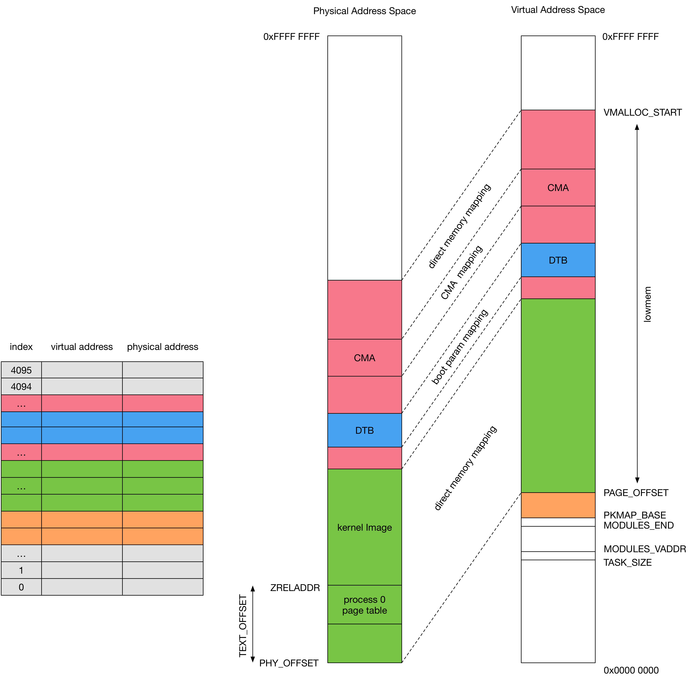

title:'MM - 05 Init - ARM Page Table'
## MM - 05 Init - ARM Page Table


在处理器架构设计中，当开启虚拟地址特性时，CPU 直接使用的地址是虚拟地址，每个进程都拥有各自独立的虚拟地址空间，此时一般通过处理器内部的内存管理单元 (Memory Management Unit, MMU) 来实现虚拟地址到物理地址的映射

简单地说，page table 是一张维护在内存中的表格，由内核负责维护，描述了虚拟地址与物理地址之间的映射关系，MMU 需要配合 page table 才能实现地址映射，当 CPU 需要访问某个虚拟地址时，MMU 硬件会自动找到内存中的 page table，查表项找到当前访问的虚拟地址对应的物理地址，并在引脚发出电信号，从而访问对应的 page frame

具体细节可以参考各自架构的 Virtual Memory System Architecture 实现


Linux 实现中虚拟地址空间划分为用户态虚拟地址空间 (user address space) 与内核态虚拟地址空间 (kernel address space) 两部分

每个进程都拥有各自独立的虚拟地址空间，因而每个进程都需要各自独立的一份 page table，在 ARM 架构下当系统中存在 N 个进程时，内存中实际存在 (N+1) 个 page table

- 系统中的所有进程共享一份内核页表 (master kernel Page Global Directory)，该页表负责将内核态虚拟地址空间内的虚拟地址映射为相应的物理地址
- 此外每个进程还拥有各自独立的一份页表，该页表就负责将该进程的用户态虚拟地址空间内的虚拟地址映射为相应的物理地址


此时当 CPU 需要访问某个虚拟地址时

- 如果当前访问的虚拟地址位于用户态虚拟地址空间内，那么 MMU 硬件就使用该进程特有的那份页表来实现地址映射
- 如果当前访问的虚拟地址位于内核态虚拟地址空间内，那么 MMU 硬件就使用系统中唯一的一份内核页表来实现地址映射


### global page table init

以下介绍 ARM 架构下，系统初始化过程中内核页表的创建与初始化的过程

1. kernel image layout

bootloader 将 Linux kernel image 加载到 DDR 中 ZREALADDR 物理地址起始的部分，之后在 kernel 初始化过程中会在 DDR 中 kernel image 之前预留一块内存用于 global page table


2. before MMU on

在开启 MMU 之前，需要执行一些准备工作

- 为开启 MMU 的代码创建 identity mapping

这是因为在开启 MMU 之前虚拟地址与物理地址相等，而在开启 MMU 之后系统必须使用 page table 将虚拟地址映射为物理地址，因而开启 MMU 之后，执行 enable MMU 操作的代码的虚拟地址必须还是与对应的物理地址相等，即 page table 中包含 enable MMU 操作的代码必须是 identity mapping


- 创建 kernel image direct mapping

即将 PAGE_OFFSET 起始到 kernel image 的 .bss section 的这一块虚拟地址区间映射到 PHYS_OFFSET 起始的物理地址区间，以使得之后开启 MMU 之后，内核可以通过 MMU 正常访问 kernel image


- 创建 boot param direct mapping

即创建 dtb 使用的虚拟地址region 到 dtb 在 DDR 中的物理地址region 的 direct mapping，以使得之后开启 MMU 之后，内核可以通过 MMU 正常访问 dtb


3. turn on MMU


4. global page table init

- 扫描 dtb 的 memory node 获取 memory bank 信息，以获悉系统的 physical memory layout
- 清除 global page table 中 [0, PAGE_OFFSET]、[VMALLOC_START, VMALLOC_END] 虚拟地址区间对应的页表项，因而之前建立的 identity mapping 会被清除，同时 global page table 中 proces address space 对应的页表项也均为初始状态
- 设置 global page table 的页表项，实现 lowmem direct mapping，即实现 [PAGE_OFFSET, VMALLOC_START] 虚拟地址区间与 PHY_OFFSET 起始的物理内存之间的映射
- 设置 global page table 的页表项，实现 CMA 占用的物理地址到虚拟地址的 direct mapping
- 设置 global page table 的页表项，创建 pkmap 的 level 2 page table


以上操作完成后 global page table 为




### process page table

内核态地址使用的 translation table (low mem direct mapping) 均为 section entry，即只使用 level 1 translation table entry 作为 section entry 映射 1MB 的物理内存


用户进程创建过程中，会调用 bprm_mm_init() 创建并初始化该用户进程的 mm_struct，其中调用 mm_alloc_pgd()，实际调用 pgd_alloc() 创建对应的 level 1 translation table，并保存在子进程的 mm_struct 的 pgd 字段中

```c
struct mm_struct {
	pgd_t * pgd;
	...
}
```

pgd_alloc() 是架构相关的，ARM 32 中该函数会

- 为该用户进程分配 level 1 translation table，由于 ARM 32 架构下 level 1 translation table 共占用 16KB，因而实际分配 16KB 大小的 page frame
- 之后初始化 level 1 translation table
    - 将其中 user address space 对应的 entry 都初始化为 0，level 1 translation table 中共包含 4096 个 entry，因而此时即相当于将 level 1 translation table 的前 3072 个 entry 初始化为 0
    - 之后将 global translation table 中 kernel address space 对应的 entry 的值，拷贝到当前用户进程的 level 1 translation table 的 kernel address space 对应的 entry 中


### page table switch

在开启虚拟地址特性的处理器架构下，每个进程都拥有各自独立的虚拟地址空间，因而每个进程都需要各自独立的一份 translation table，但是 MMU 硬件在执行地址翻译时并不知道当前需要选择哪份 translation table

为了解决这一问题，ARM 使用 CP15 register 2 TTBR (Translation Table Base Register) 描述当前地址翻译过程中使用的 translation table 的起始物理地址，MMU 在执行地址翻译过程中就会从 TTBR 寄存器获取对应的 translation table，之后执行地址翻译操作


ARM MMU 中维护两个 TTBR (Translation Table Base Register)，其中

- TTBR0 用于 process specific addresses translation，因而每次 process context switch 时都要更新 TTBR0 的值
- TTBR1 用于 operating system and I/O addresses translation，所有的进程共用同一个 TTBR1 指向的 page table，因而 process context switch 时不需要更新 TTBR1 的值


当 TLB cache miss 时需要执行 TLB walk 操作，此时根据 TTBR 获取对应的 translation table 即 page table，之后再在该 page table 的基础上执行 TLB walk 操作

Translation Table Base Control (TTBC) 则用于控制对于特定虚拟地址应该使用 TTBR0 还是 TTBR1

- TTBC[2:0] 的值 N == 0 时，总是使用 TTBR0
- TTBC[2:0] 的值 N > 0 时，若需要映射的虚拟地址的 bits [31:32-N] 全为 0，则使用 TTBR0，否则使用 TTBR1

因而在 Linux 中

- 当对 kernel address space 内的虚拟地址进行翻译时，实际使用 TTBR1 指向的 global page table，在 processor 初始化阶段，TTBR1 被初始化同时一直保持为 global page table 的起始物理地址
- 当对 process address space 内的虚拟地址进行翻译时，实际使用 TTBR0 指向的 page table，每次执行 process switch 操作过程中，TTBR0 都被更新为接下来调度执行的用户进程的 page table 的起始物理地址


> 1. PID 0 idle Process


idle process 使用 global page table，同时在系统初始化过程中，TTBR0 与 TTBR1 的值均被设置为 global page table 的 base physical address

在系统初始化阶段，只有 idle process 这一个内核线程运行，同时只使用 global page table 进行所有的地址翻译操作


> 2. PID 1 init process

之后 idle process 创建 init process，init process 一开始为内核线程，并与 idle process 共享 global page table，之后 init process 转换为用户进程，在转换过程中会创建一个 init process 专用的 page table

该 page table 一开始只是 global page table 的简单拷贝，因而该 page table 的 kernel address space 相关的 entry 与 global page table 中 kernel address space 相关的 entry 完全一样，之后将 init process 运行的程序的 .text section、.data section 映射到该 page table 的 process address space


> 3. PID 2 kthread

之后 idle process 创建 kthread 内核线程，所有的内核线程实际均共享 global page table


> 4. create user process

之后 init process 可以创建子进程，子进程创建过程中会创建一个子进程专用的 page table

该 page table 一开始只是其父进程的 page table 的简单拷贝，因而该 page table 的 kernel address space 相关的 entry 与其父进程的 page table 中 kernel address space 相关的 entry 完全一样，之后将子进程运行的程序的 .text section、.data section 映射到该 page table 的 process address space

子进程（child process）也可以创建子进程（grandchild process），grandchild process 也会创建自己专用的 page table，该 page table 一开始也是 child process 的 page table 的简单拷贝，其创建过程与上述过程相类似


> 5. create kernel thread

之后 kthread 可以创建子内核线程，子内核线也可以创建自己的子内核线程，而所有的内核线程实际均共享 global page table


> 6. process switch: from kernel thread / user process to user process

当由内核线程切换到用户进程或由用户进程切换到另一个用户进程时，会将 MMU TTBR0 更新为接下来调度的用户进程使用的 page table，而 TTBR1 仍为 global page table

这样

- 在该用户进程正常运行过程中，即用户进程运行在用户态时，进程访问的虚拟地址均位于 process address space 内，此时使用 TTBR0 指向的 page table 即该用户进程使用的 page table 对地址进行翻译
- 若用户进程通过系统调用进入内核态时，进程访问的虚拟地址均位于 kernel address space 内，此时使用 TTBR1 指向的 page table 即 global page table 对地址进行翻译


> 7. process switch: from user process to kernel thread

当由用户进程切换到内核线程时，实际不必更新 MMU TTBR0，因为内核线程访问的虚拟地址均位于 kernel address space 内，此时使用 TTBR1 指向的 page table 即 global page table 对地址进行翻译

因而内核线程的内存访问过程根本不会用到 MMU TTBR0，如果此时仍然更新 TTBR0，那么在更新 TTBR0 之后硬件会执行 TLB flush 操作，这一操作在切换到内核线程时显然是不需要的，因而通常在切换到内核线程时不必更新 MMU TTBR0，这一优化称为 lazy TLB flush

Linux 中为了实现 lazy TLB flush，当由用户进程切换到内核线程时，将内核线程的 active_mm 设置为之前执行的用户进程使用的 mm_struct，之后在 mm context switch 过程中发现该内核线程的 active_mm 对应的 page table 与当前 TTBR0 指向的 page table 的地址一样，则不再更新 TTBR0，此时相当于内核线程借用之前执行的用户进程的 page table，以避免 unnecessary TLB flush penalty


> 8. process switch: from kernel thread to kernel thread

当由内核线程切换到内核线程时，同样执行 lazy TLB flush，此时假设由用户进程 A 切换到内核线程 B，之后由内核线程 B 切换到内核线程 C，此时内核线程 C 实际借用内核线程 B 使用的 page table，而内核线程 B 又借用用户进程 A 的 page table，即内核线程 C 实际借用最近一个调度的用户进程的 page table，即当切换到内核线程 C 时，TTBR0 实际指向最近一个调度的用户进程的 page table

而内核线程 C 在进行内存访问时，访问的虚拟地址均位于 kernel address space 内，此时使用 TTBR1 指向的 page table 即 global page table 对地址进行翻译


> 9. interrupt context

当用户进程或内核线程运行过程中发生中断时，中断处理程序会抢占当前正在运行的用户进程或内核线程，此时中断处理程序实际借用当前正在运行的用户进程或内核线程的 mm_struct，中断处理程序会借用当前正在运行的用户进程或内核线程的 kernel stack，同时中断处理程序在进行内存访问时，访问的虚拟地址均位于 kernel address space 内，此时使用 TTBR1 指向的 page table 即 global page table 对地址进行翻译


### page table update

#### global page table update

global page table 在初始化完成后，会实现 lowmem direct mapping，即实现 [PAGE_OFFSET, VMALLOC_START] 虚拟地址区间与 PHY_OFFSET 起始的物理地址区间之间的映射，除此之外的页表项均为空


之后在内核态分配内存时，会更新 global page table 的页表项

内核态分配内存主要有以下接口

- zone page frame allocator
- kmalloc
- vmalloc


1. zone page frame allocator

zone page frame allocator 可以分配 lowmem page frame，也可以分配 highmem page frame，由 alloc_pages() 的 gfp_mask 参数决定

- 当 gfp_mask 参数包含 __GFP_HIGHMEM 标志时，将优先分配 highmem page frame，由于 global page table 中只实现 lowmem 的虚拟地址与物理地址的映射，因而分配的 highmem page frame 只有 physical address，而没有对应的 virtual address
- 否则当 gfp_mask 参数不包含 __GFP_HIGHMEM 标志时，将默认分配 lowmem page frame，由于 global page table 已经实现 lowmem 的虚拟地址与物理地址的映射，因而分配的 lowmem page frame 已经具有对应的 virtual address

zone page frame allocator 只会分配 page frame ，而不会实现虚拟地址与物理地址的映射，因而不会修改 page table


2. kmalloc

kmalloc 实际调用 zone page frame allocator 分配内存，其 gfp_mask 参数不包含 __GFP_HIGHMEM 标志，因而 kmalloc 分配的内存实际都位于 low memory，即 kmalloc 分配的内存都具有对应的 virtual address

因而 kmalloc 过程中也不会修改 page table


3. vmalloc

vmalloc 首先调用 zone page frame allocator 分配 highmem page frame（其 gfp_mask 参数包含 __GFP_HIGHMEM 标志），之后再修改相关的 page table entry，实现连续的虚拟地址区间到非连续的物理地址区间之间的映射

即 vmalloc 过程中会修改 global page table 的相应的页表项


#### process page table update

process page table 初始化完成后，其中的 kernel address space 相关的页表项与 global page table 中 kernel address space 相关的页表项完全同步，同时 process address space 中只实现运行的程序的 .text/.data/.bss section 以及程序使用的 user stack 的虚拟地址与物理地址的映射，除此之外的所有页表项均为空

之后用户进程在分配内存时都会修改该进程的 page table 的相关页表项，用户进程分配内存的接口有

- file memory mapping
- anonymous memory mapping


1. file memory mapping

file memory mapping 会修改 process page table 的相应页表项，实现分配的虚拟地址到文件的 page cache 或设备驱动程序分配的 memory buffer 之间的映射


2. anonymous memory mapping

用户进程调用 malloc() 分配内存时，实际通过 anonymous memory mapping (mmap() / brk()) 增大用户进程的 heap，但此时只是为进程分配对应的虚拟地址区间，而尚未分配对应的 page frame，之后当进程访问相应的虚拟地址时，在 page fault handler 中分配对应的 page frame，同时修改 process page table 的相应页表项，实现之前分配的虚拟地址区间与刚刚分配的 page frame 的物理地址之间的映射


### pseudo page table

MMU 硬件依赖于 translation table 实现线性地址与物理地址之间的映射，Linux 内核早期只支持 x86 架构，而 x86 架构下的 translation table entry 则包含 dirty/file/access 等标志位来描述对应的 page 的状态

后来内核支持 ARM 架构，但是 ARM 32 架构下的 translation table entry 没有多余的 bit 表示这些标志位，而内核的很多代码已经依赖于 table entry 中的 dirty/file/access 这些标志位

木已成舟，为了兼容这些代码，ARM 32 架构下另外创建一份对应的 Linux software page table (以下简称为 page table，以区分于 MMU 硬件使用的 translation table)，page table 中包含了 dirty/file/access 这些标志位

```
 * Hardware-wise, we have a two level page table structure, where the first
 * level has 4096 entries, and the second level has 256 entries.  Each entry
 * is one 32-bit word.  Most of the bits in the second level entry are used
 * by hardware, and there aren't any"accessed"and"dirty" bits.
 *
 * Linux on the other hand has a three level page table structure, which can
 * be wrapped to fit a two level page table structure easily - using the PGD
 * and PTE only.  However, Linux also expects one "PTE" table per page, and
 * at least a "dirty" bit.
 *
 * Therefore, we tweak the implementation slightly - we tell Linux that we
 * have 2048 entries in the first level, each of which is 8 bytes (iow, two
 * hardware pointers to the second level.)  The second level contains two
 * hardware PTE tables arranged contiguously, preceded by Linux versions
 * which contain the state information Linux needs.  We, therefore, end up
 * with 512 entries in the "PTE" level.
 *
 * This leads to the page tables having the following layout:
 *
 *    pgd             pte
 * |        |
 * +--------+
 * |        |       +------------+ +0
 * +- - - - +       | Linux pt 0 |
 * |        |       +------------+ +1024
 * +--------+ +0    | Linux pt 1 |
 * |        |-----> +------------+ +2048
 * +- - - - + +4    |  h/w pt 0  |
 * |        |-----> +------------+ +3072
 * +--------+ +8    |  h/w pt 1  |
 * |        |       +------------+ +4096
```


ARM 32 架构实现的 2 level translation table 中

- level 1 translation table 占用 4096 entry，每个 entry 为 32 bit 即 4 字节，因而整个 level 1 translation table 占用 16 KB
- level 2 translation table 实现为 page entry 时，包含 256 entry，每个 entry 为 32 bit 即 4 字节，因而整个 level 2 translation table 占用 1 KB


而在系统中，ARM 架构会“欺骗”内核，其 level 1 translation table 中包含 2048 entry，每个 entry 为 8 字节，同时其 level 2 translation table 实际占用一个 page frame (4 KB)，该 page frame 的后 2 KB 用于存储两个 level 2 translation table，而 page frame 的前 2 KB 则用于存储这两个 level 2 translation table 对应的 OS page table

此时 translation table entry 负责存储映射的 page frame 的物理地址，而 OS page table entry 则负责维护映射的 page frame 的 dirty/file/access 标志


因而此时 32 bit虚拟地址被划分为

```
global dir field        table dir field         offset field
      11 bit                  9 bit                 12 bit
```

即此时

- low 12 bits 描述该虚拟地址在对应的 page 中的偏移，即此时 page size 为 4KB
- 此时 page global directory 包含 (2 ^ 11 = 2048) 个 entry
- 每个 page upper directory 只包含一个 entry
- 每个 page middle directory 只包含一个 entry
- 每个 page table 包含 (2 ^ 9 = 512) 个 entry

因而此时 2 级页表的结构为


2 级页表中只使用 global directory 与 page table 这两层，因而此时 upper directory entry 与 middle directory entry 实际均指向 global directory entry
