title:'MM - 04 Arch - ARM Memory Architecture'
## MM - 04 Arch - ARM Memory Architecture

ARM 架构使用 Virtual Memory System Architecture (VMSA) 内存架构，其中 Memory Management Unit (MMU) 负责将虚拟地址 (virtual address) 或者说是线性地址 (linear address) 转化为物理地址 (physical address)

### 32 bit

本节以 ARMv6 架构为例介绍 32 bit 模式下的内存模型

> Reference
> ARM Architecture Reference Manual, Chapter B4 Virtual Memory System Architecture

#### Paging

MMU 依赖于 translation table 将线性地址翻译为物理地址，这一过程称为 translation table walk

这张表格被硬件称为 translation table，被内核称为 page table，这张表格存储在内存中，系统初始化的时候内核负责初始化这张表格，之后交给 MMU 硬件使用

32 bit 模式下使用 2-level translation table，此时物理内存的单元可以为

- section, 1MB
- large page, 64KB
- small page, 4KB

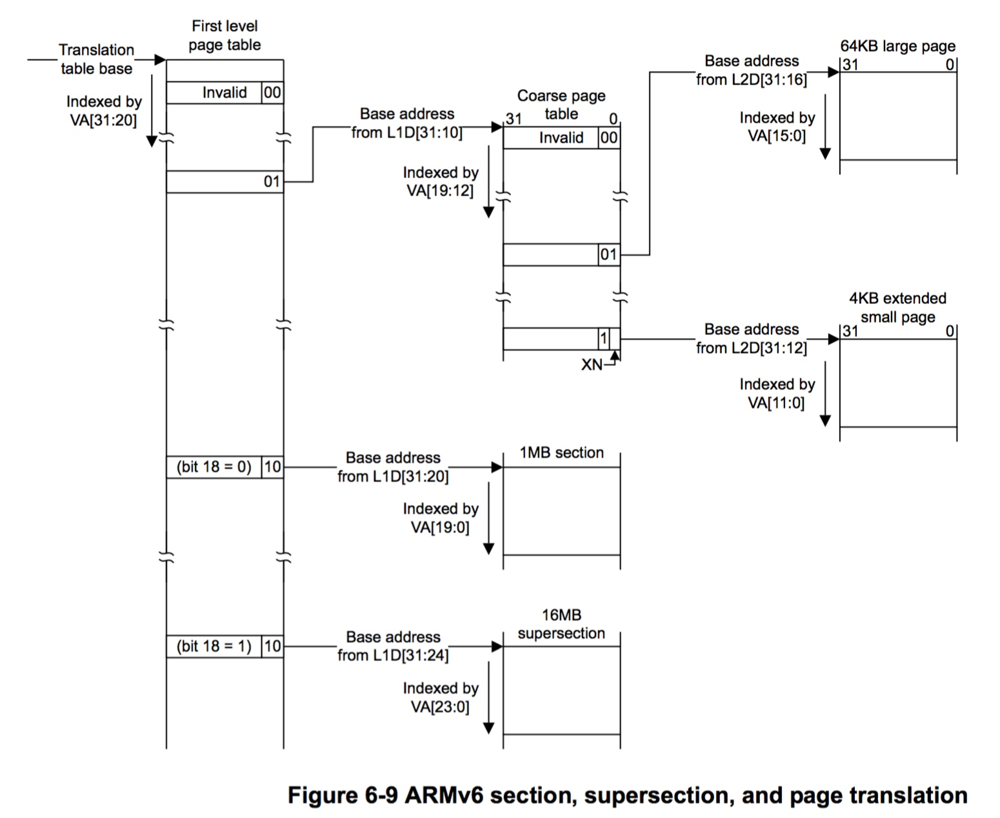

##### translation table base

执行 translation table walk 的第一个步骤是获取 translation table 在内存中的基地址

CP15 register 2 TTBR (Translation Table Base Register) 中存储 first level translation table 的起始物理地址

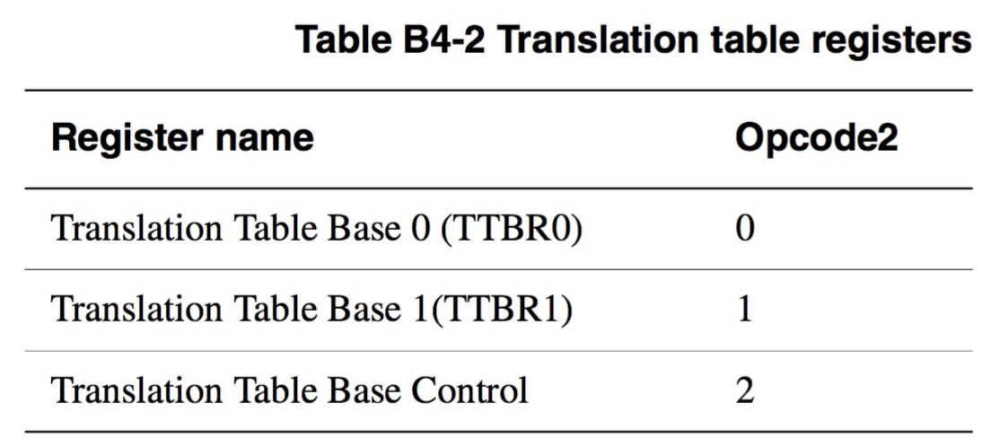

CP15 register 2 实际复用 3 个寄存器，其中包含两个 Translation Table Base Register 即 TTBR0、TTBR1，其中

- TTBR0 通常用于 process specific addresses translation，因而每次 process context switch 时都要更新 TTBR0 的值
- TTBR1 通常用于 operating system and I/O addresses translation，所有的进程共用同一个 TTBR1 指向的 page table，因而 process context switch 时不需要更新 TTBR1 的值

> TTBC

Translation Table Base Control (TTBC) 用于控制对于特定线性地址应该使用 TTBR0 还是 TTBR1，该寄存器的格式如下

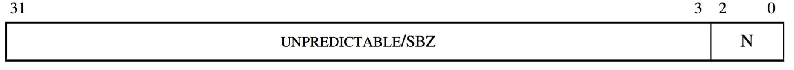

- N == 0 时，总是使用 TTBR0
- N > 0 时，若需要映射的线性地址的 bits [31:32-N] 全为 0，则使用 TTBR0，否则使用 TTBR1

即在 Linux 中

- 当对 kernel address space 内的线性地址进行翻译时，实际使用 TTBR1 指向的 global page table，在处理器初始化阶段，TTBR1 被初始化同时一直保持为 global page table 的起始物理地址
- 当对 process address space 内的线性地址进行翻译时，实际使用 TTBR0 指向的 process specific page table，每次执行 process switch 操作过程中，TTBR0 都被更新为接下来调度执行的用户进程的 page table 的起始物理地址

> TTBR1

TTBR1 存储 operating system translation table 的 first level translation table 的起始物理地址

ARMv6 之前只实现有一个 TTBR0 寄存器，即只实现有一个 process specific translation table，那个时候 first level translation table 都是 16KB 大小

ARMv6 新增了 operating system translation table，operating system translation table 复用了之前的设计，是 16KB 大小，因而也是 16KB 对齐的，因而 TTBR1 的低 14 bits 可以复用于其他标志位

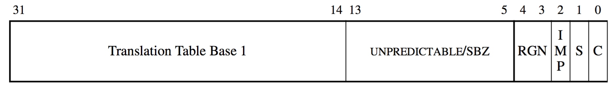

> TTBR0

TTBR0 存储 process specific translation table 的 first level translation table 的起始物理地址

ARMv6 之后的 process specific translation table 的 first level translation table 的大小在 [128 bytes, 16KB] 范围内，同时也是按照大小对齐的，因而 TTBR0 的格式如下

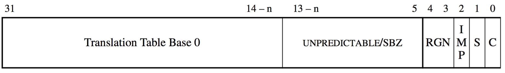

当 first level translation table 的大小为 16KB 时，n 为 0

##### section translation

ARM 可以按照 section 即 1MB 的粒度对物理内存进行寻址

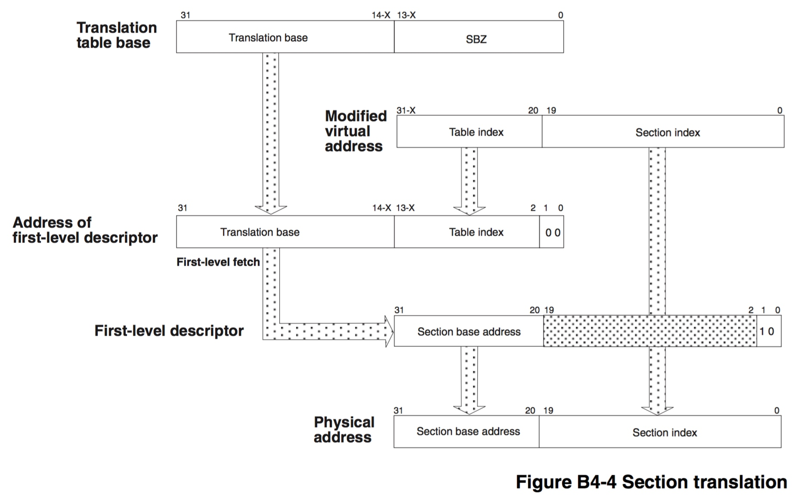

此时 translation table 具有 1-level 结构，32-bit 线性地址的低 20 bit 在 section 内部寻址，剩余的高 12 bit 在 first level translation table 中寻址

因而 first level translation table 中的每个 entry 就作为 section descriptor 描述一个 section

此时 first level translation table 中包含 2^12 = 4096 个 section descriptor，每个 section descriptor 大小为 4 字节，因而 first level translation table 的大小为 16KB

> section descriptor

此时线性地址的高 12 bit 即 bit [31:20] 作为 first level translation table 中的偏移，定位到当前需要翻译的线性地址对应的 section descriptor，其格式为

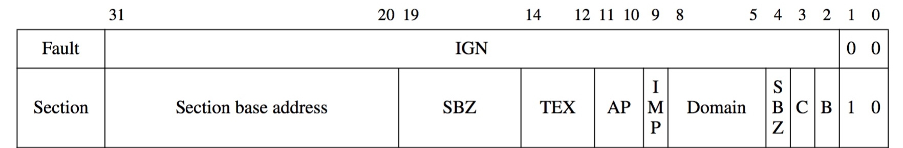

- bits[1:0] = 0b10，描述当前这个 first level descriptor 实际为 section descriptor
- bits[31:20] 描述当前映射的 section 的起始物理地址，由于该地址是按照 1MB 对齐的，因而其低 20 bits 复用于其他标志位

> physical address

此时当前的 section 的起始物理地址，加上当前需要翻译的线性地址剩余的 bit [19:0]，即得到最终映射的物理地址

##### page translation

ARM 也可以按照 small page 即 4KB 的粒度对物理内存进行寻址

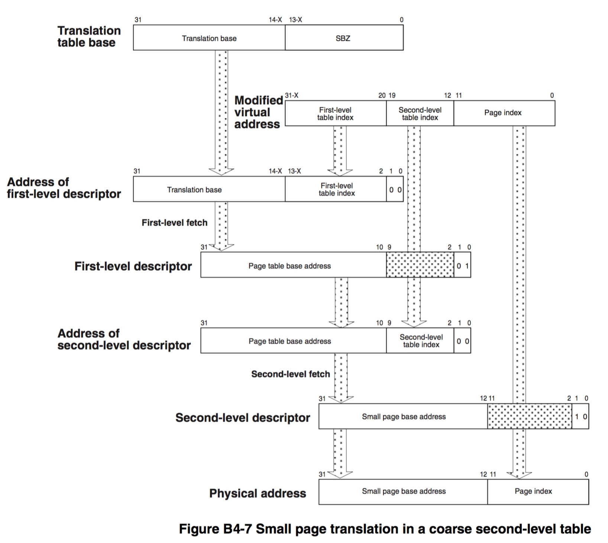

此时 translation table 具有 2-level 结构，32-bit 线性地址的低 12 bit 在 page 内部寻址，中间的 8 bit 在 second level translation table 中寻址，剩余的高 12 bit 在 first level translation table 中寻址

因而 first level translation table 包含 2^12 = 4096 个 entry，每个 entry 的大小为 4 字节，因而 first level translation table 的大小为 16KB

同时 second level translation table 包含 2^8 = 256 个 entry，每个 entry 的大小为 4 字节，因而 first level translation table 的大小为 1KB

first level translation table 中的每个 entry 作为 coarse page table descriptor，描述 second level translation table 即 coarse page table 的起始物理地址

之后的 second level translation table 中的每个 entry 作为 page descriptor，描述对应的一个 page

> coarse page table descriptor

此时线性地址的高 12 bit 即 bit [31:20] 作为 first level translation table 中的偏移，定位到当前需要翻译的线性地址对应的 coarse page table descriptor，其格式为

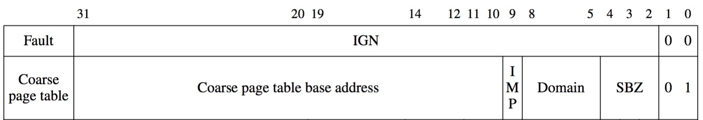

- bits[1:0] = 0b01，描述当前这个 first level descriptor 实际为 coarse page table descriptor
- bits[31:10] 描述当前映射的 coarse page table 的起始物理地址，因为 coarse page table 是 1KB 大小，因而该地址是按照 1KB 对齐的，因而其低 10 bit 可以复用于其他标志位

> page descriptor

之后线性地址的中间 8 bit 即 bit [19:12] 作为 coarse page table 中的偏移，定位到当前需要翻译的线性地址对应的 page descriptor，其格式为

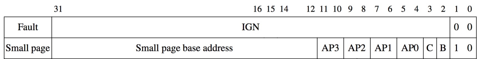

- bits[1:0] = 0b10，描述当前这个 second level descriptor 实际为 page descriptor
- bits[31:12] 描述当前映射的 page 的起始物理地址，因为 page 是 4KB 大小，因而该地址是按照 4KB 对齐的，因而其低 12 bit 可以复用于其他标志位

> physical address

此时当前的 page 的起始物理地址，加上当前需要翻译的线性地址剩余的 bit [11:0]，即得到最终映射的物理地址

##### access control

section/page descriptor 的相关标志位描述对应的物理内存的访问权限

AP[1:0] field 描述对应的 memory region 的 access permission，当 MMU 尝试访问当前权限不允许访问的 translation table entry 时，将产生 Permission Fault

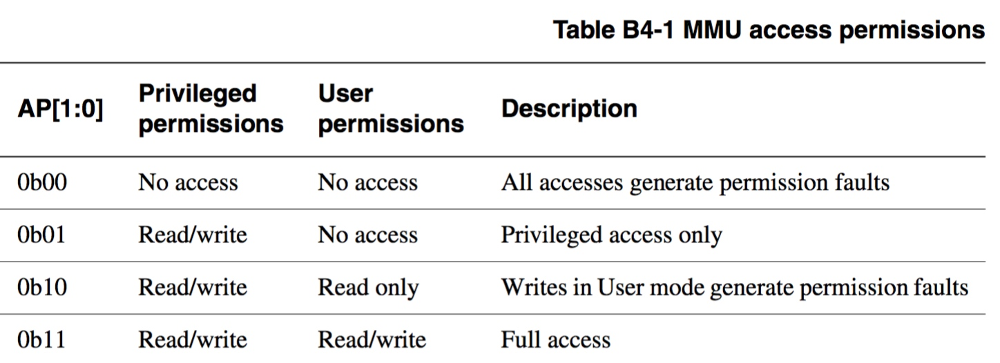

ARM 将整个 memory address space 划分为 16 个 domain，每个 translation table entry 描述的 memory region 都从属于其中的一个 domain，translation table entry 的 domain[3:0] field 即描述其对应

> memory region attributes

- TEX (Type extension) field 描述对应的 memory region type
- C (cacheable) bit 描述对应的 memory region 是否可以缓存到 cache 中
- B (bufferable) bit 描述对应的 memory region 是否可以访问 write buffer
- S (shareble) bit 描述对应的 memory region 是否对多个 process 共享

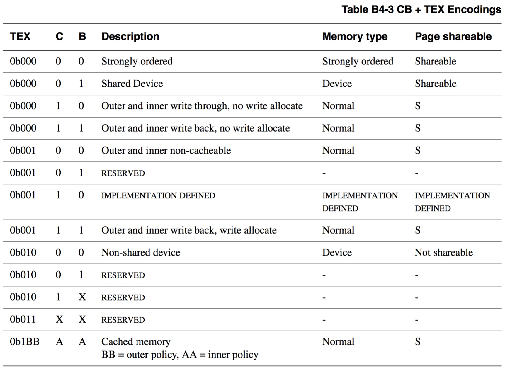

#### TLB

MMU 使用专门的 TLB (Translation Lookaside Buffer) 缓存对之前访问的线性地址与物理地址之间的映射关系，即之前解析的 (线性地址, 物理地址) 进行缓存

每次 MMU 使用 translation table 将线性地址解析为物理地址之后，都会将解析的结果保存在 TLB 中，而 MMU 在执行地址翻译过程中，首先在 TLB 中查找有没有对应的缓存，若 TLB hit 则 MMU 直接获取解析的线性地址对应的物理地址并发送相应的总线电信号，否则 TLB miss 则 MMU 使用 translation table 完成地址翻译，以上过程全部由 MMU 硬件自动完成

TLB 中包含多个 TLB entry，每个 TLB entry 包含线性地址、page size、物理地址以及 memory properties，其实际是将特定线性地址起始的 page size 大小的一个线性地址区间映射为对应的物理地址区间

MMU 执行地址翻译的过程中，会首先在 TLB 中寻找对应的 TLB entry，其查找的条件为映射的 线性地址的 bits[31:N] 必须与匹配的 TLB entry 的线性地址的 bits[31:N] 相同，其中 (2^N) 即为匹配的 TLB entry 的 page size

由于 Linux 中每个 process 都具有 4GB 的用户内存空间，因而相同的线性地址可能映射为不同的物理地址，ARMv6 之前在发生 process context switch 时都要对所有的 TLB entry 进行 invalidate 操作，即清空 TLB 中上一个 process 使用的 TLB entry

而在 ARMv6 之后，每个 TLB entry 还包含一个属性描述其对应的 process，当然该属性也可以是 global 即该 TLB entry 对所有的 process 均有效

同时 CP15 Register 8 中包含 Application Space IDentifier (ASID)，即当前运行的 process 对应的标识符

此时在上述的 TLB entry match 的基础上，只有匹配的 TLB entry 为 global 属性，或者该 TLB entry 对应的 process 与 CP15 Register 8 中的 ASID 相匹配时，才认为映射的线性地址与该 TLB entry 真正的匹配

#### Summary

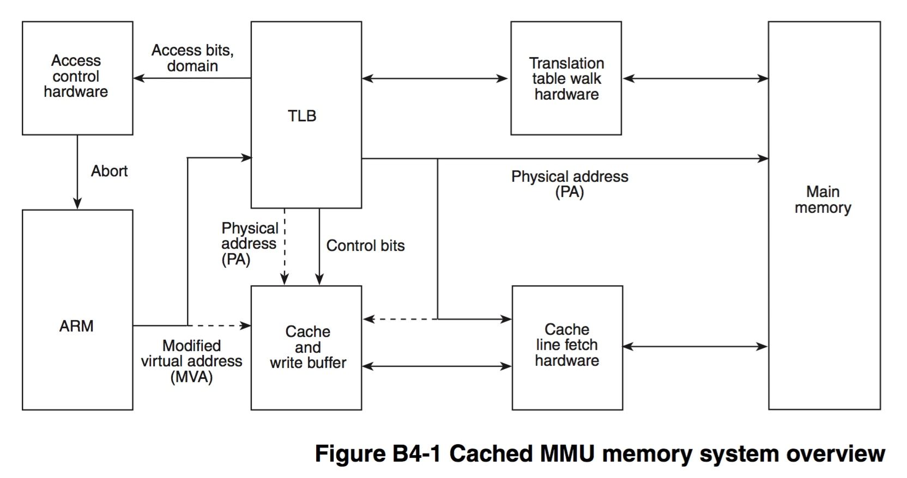

ARM VMSA 中内存访问的时序为

- ARM 处理器将线性地址传递给 MMU 进行解析，TLB 硬件首先接收到该线性地址，并在 TLB 中查找之前是否对该线性地址进行缓存
    - TLB hit，则 MMU 直接在引脚发出电信号，解析成相应的物理地址，从而访问对应的物理内存
    - TLB miss，则将线性地址传递给 translation table walk 硬件执行以下的 translation table walk 过程

- translation table walk 硬件接收到解析的线性地址，执行 translation table walk
    - 通过 CP15 register 2 TTBR (Translation Table Base Register) [31:20] 获取 first level translation table 的起始物理地址，之后硬件会访问该地址处的 translation table
    - translation base [31:14] 加上线性地址 [31:20] 即构成 first level descriptor 的物理地址
    
    - 若 first level descriptor 为 section descriptor，则执行 section translation
        - 以上获取的 first level descriptor 实际为 section entry，此时 section entry [31:20] 即 section base address 即为对应的 section 的起始物理地址，此时线性地址 [19:0] 描述当前需要翻译的线性地址在该 section 中的偏移，两者相加即得到当前需要翻译的线性地址对应的物理地址

    - 若 first level descriptor 为 coarse page table descriptor，则执行 page translation
        - 以上获取的 first level descriptor 实际为 coarse page table entry，此时 coarse page table entry [31:10] 即 second level page table base address 加上线性地址 [10:2] 即构成 second level descriptor 即 small page descriptor 的起始物理地址
        - small page descriptor [31:12] 即为对应的 page 的起始物理地址，而 线性地址 [11:0] 即为该线性地址在该 page 中的偏移，因而两者相加即为当前需要翻译的线性地址对应的物理地址

    - 计算出映射的物理地址之后，MMU 在引脚发出电信号，解析成相应的物理地址，从而访问对应的物理内存，同时将解析的结果保存在 TLB 中

以上时序均由 MMU 硬件 自动完成

### 64 bit

> Reference
> ARM Architecture Reference Manual, ARMv8, for ARMv8-A architecture profile, Chapter D5 The AArch64 Virtual Memory System Architecture

aarch64 支持 48 bit 即 256 TB 的线性地址空间 [0x0000_0000_0000_0000, 0x0000_FFFF_FFFF_FFFF]，同时支持 48 bit 的物理地址空间
