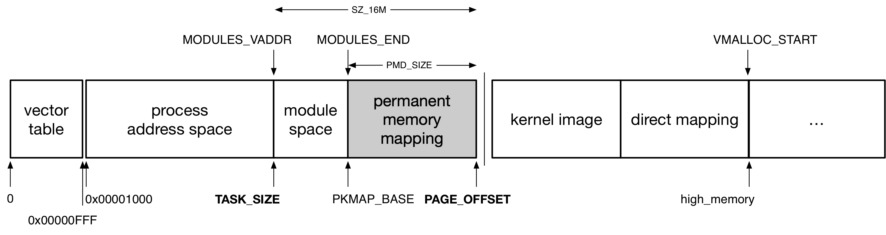
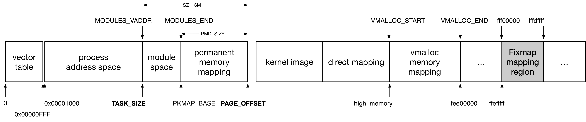
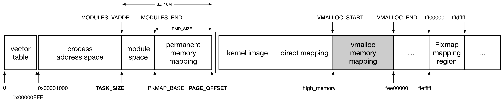

## MM - 1 Kernel Address Mapping

之前介绍过，处理器使用 MMU 和 page table 配合来实现虚拟地址与物理地址之间的映射；在 Linux 实现中虚拟地址空间划分为用户态虚拟地址空间与内核态虚拟地址空间两部分，同时所有进程共用一份内核页表来实现内核态虚拟地址空间内的地址映射

本文就描述内核态虚拟地址空间内的地址映射，即内核态虚拟地址空间内的虚拟地址如何映射到对应的物理地址

本文描述的内核虚拟地址映射实际上等价于内核页表的构建，因为处理器正是使用内核页表实现内核虚拟地址映射的


### direct mapping

内核虚拟地址映射需要实现，内核态虚拟地址空间内的虚拟地址到对应的物理地址之间的映射，同时由于内核负责管理系统中的所有 page frame，因而理论上内核页表应该将内核态虚拟地址空间一一映射到系统中所有的 page frame

此时内核态虚拟地址空间内的起始虚拟地址就映射到 DRAM 的起始物理地址，之后就是一一映射的关系，此时系统中的每个 page frame 都能对应到内核态虚拟地址空间内的某个虚拟地址，这种一一映射的关系就称为 direct mapping

```
                +---------------+
                |               |
                |     remain    |
 Kernel         |               |
                +---------------+  -->  +---------------+
Address Space   |               |       |               |
                |               |       |               |
                |direct mapping |       |               |
                |               |       |               |
                |               |       |               |
                +---------------+  -->  +---------------+
                |               |           page frame
 User           |               |        physical address
Address Space   |               |
                |               |
                +---------------+
```


```c
struct page {
	/*
	 * On machines where all RAM is mapped into kernel address space,
	 * we can simply calculate the virtual address. On machines with
	 * highmem some memory is mapped into kernel virtual memory
	 * dynamically, so we need a place to store that address.
	 * Note that this field could be 16 bits on x86 ... ;)
	 *
	 * Architectures with slow multiplication can define
	 * WANT_PAGE_VIRTUAL in asm/page.h
	 */
	void *virtual;			/* Kernel virtual address (NULL if
					   not kmapped, ie. highmem) */
	...
}
```

对于 direct mapping 范围内的内存，可以直接通过 page_address(page)，获取该 struct page 描述符描述的物理内存所映射的虚拟地址，其中通过该 struct page 描述符在 sparse vmemmap 中的偏移，可以直接计算出该物理内存的物理地址，之后再通过 direct mapping 直接计算出对应的虚拟地址

对于 direct mapping 范围内的内存调用 kmap()，实际上是直接返回该 page 对应的虚拟地址，而不做任何操作


### high memory mapping

上述介绍的 direct mapping 是最直观、也是最简单的一种实现映射的方式，但其前提是内核态虚拟地址空间必须足够大，使得内核态虚拟地址空间能够覆盖系统中的所有物理内存

在 64bit 架构下虚拟地址空间的资源非常充裕，通过 direct mapping 的方式即可访问所有可用的物理内存，自然不成问题；但是在过去的 32bit 年代，内核态虚拟地址空间只有 1GB 大小，也就是说采用 direct mapping 的方式，内核态的虚拟地址空间空间只能映射 1GB 大小的 page frame，也就是说内核态只能访问前 1G 的物理内存，当实际可用的物理内存超过 1GB 时，内核态也不能访问多余的内存资源

因而 32bit 架构下使用一种特殊的映射机制，即 high memory mapping，实现有限的虚拟地址资源的情况下，使得更多的物理内存映射到内核态虚拟地址空间；64bit 架构下不存在该映射机制


此时内核态虚拟地址空间内，(PAGE_OFFSET, VMALLOC_START) 虚拟地址区间是采用 direct mapping 的方式一比一地映射到物理内存地址空间的起始部分，这一部分映射的 page frame 又称为 low memory，low memory 的大小是架构相关的

- x86 32 架构中，low memory 通常为 896MB 大小
- ARM 32 架构中，low memory 通常为 768MB 大小

物理内存中 low memory 之后的剩余内存即被称为 high memory，Linux 中使用 high memory mapping 将物理内存中的 high memory 映射到内核态虚拟地址空间中相应的虚拟地址


通常使用以下 3 种方式实现 high memory mapping

#### pkmap

pkmap (permanent mapping)

在 kernel address space 中预留 permanent address region，permanent address region 以 PAGE_SIZE 为单位划分为多个 window，在执行映射操作过程中，会在 permanent address region 中查找一个尚未被使用的 window，设置相应的页表将该 virtual address window 映射到相应的 high memory page frame，这样进程就可以通过该 virtual address window 访问相应的 high memory page frame

映射过程中当找不到空闲的 virtual address window 时，进程就会睡眠等待，因而 permanent mapping 不能用于 interrupt context

ARM 32 中 permanent address region 的大小为 2MB，因而进程通常在申请执行 permanent mapping 从而占用其中的某个 virtual address window，在访问相应的 high memory page frame 之后，必须立即释放该 permanent mapping 以释放对应的 virtual address window，从而减小 permanent address region 的负载




内核使用 kmap*() 系列 API 实现 high memory mapping，其中 kmap() 可能阻塞休眠，因而只能用于进程上下文中；kmap_atomic() 中不会阻塞休眠，因而适用于中断上下文

由于 pkmap 在映射过程中可能会睡眠等待，因而不能用于中断上下文，因而 kmap() 实际上实现为 pkmap

```c
void *kmap(struct page *page);
```


以下介绍 pkmap 的具体实现

pkmap 会在内核地址空间中预留一段 PKMAP_BASE 起始的虚拟地址区间，以用于 pkmap 映射，这段虚拟地址区间的长度一般为 PAGE_SIZE * 512|1024，即同时可以映射最多 2MB 或 4MB 的高端内存

pkmap_page_table 指针指向 global page table 中，pkmap 映射 (即 PKMAP_BASE 起始的虚拟地址区间) 对应的那部分 page table

之前介绍过，pkmap 将 PKMAP_BASE 起始的这段虚拟地址区间以 PAGE_SIZE 为单位划分为多个 window，LAST_PKMAP 宏描述划分出来的 window 的数目，通常为512或1024

同时 pkmap 维护一个 pkmap_count[LAST_PKMAP] 数组来描述每个 window 的状态

- counter 计数值为 0，表明对应的 window 当前未被占用，同时处于可用状态
- counter 计数值 > 0，表明对应的 window 当前被占用


之前介绍过 kmap() 实际上实现为 pkmap，其中实际上就是遍历 pkmap_count[LAST_PKMAP] 数组，来寻找一个空闲的 window (counter 计数为 0)。之后就会更新对应的 pte，使得该 window 对应的虚拟地址映射到传入的 page 对应的物理地址。如果遍历结束后还没有找到一个空闲 window，当前进程就会进入睡眠等待状态，之后其他进程在调用 kunmap() 释放 window 的时候就会唤醒这个睡眠等待的进程

同时值得一提的是，系统中存在 high memory mapping (32 bit 架构下) 的时候，使用 struct page_address_map 来描述一个 page (high memory) 对应的虚拟地址

```c
struct page_address_map {
	struct page *page;
	void *virtual;
	...
};
```

所有实现了映射的 high memory 对应的 struct page_address_map 维护在 page_address_htable hash table 中

```c
struct page_address_slot page_address_htable[];
```

这样就可以快速地查询某个 high memory 是否已经实现了映射，以及其映射的虚拟地址

```c
vaddr = (unsigned long)page_address(page)
```


#### fixmap

之前介绍过，在不能阻塞休眠的场景下，内核使用 kmap_atomic() 接口实现 high memory mapping，由于 pkmap 在映射过程中可能会睡眠等待，而 fixmap 并不会，因而 kmap_atomic() 实际上实现为 fixmap

```c
void *kmap_atomic(struct page *page);
```



fixmap 实际在内核地址空间中为 atomic high memory mapping 预留一块专用的虚拟地址空间，其中为每个 CPU 分配一个 PAGE_SIZE 大小的 virtual address window；在 atomic high memory mapping 映射过程中，直接使用当前 CPU 对应的 virtual address window

由于每个 CPU 只有一个 virtual address window (PAGE_SIZE) 可以用于 fixmap 映射，这就要求 CPU 在执行 map 之后，紧接着就需要执行 unmap 操作，这一过程中不能发生 fixmap 的嵌套，也就意味着 CPU 在执行 map 操作后，CPU 不能发生抢占或睡眠，因而 fixmap 往往只适用于临时映射

> drawbacks for kmap_atomic*()

之前介绍过 kmap_atomic() 在 32 bit 架构下通过 fixmap 实现 high memory mapping，为了防止这一过程中 CPU 发生抢占，在 kmap_atomic() 中会调用 preempt_disable() 以关闭 CPU 抢占

```sh
kmap_atomic
    kmap_atomic_prot
        preempt_disable
        
        __kmap_local_page_prot
            if 64 bit arch:
                return page_address(page) directly
            else if 32 bit arch:
                # do fixmap mapping
```

而在 64 bit 架构下，所有的物理内存都是通过 direct mapping 映射到内核虚拟地址空间的，此时并不依赖于 fixmap 实现 high memory mapping，因而 kmap_atomic() 中本可以通过 page 所在的偏移直接返回对应的虚拟地址，而无须执行 fixmap，也就无须执行 preempt_disable()

但是现有实现的 kmap_atomic()，在 64 bit 架构下还是会调用 preempt_disable() 关闭 CPU 抢占，这主要是出于 debug 的目的，这样如果用户代码在 kmap_atomic() 与 kunmap_atomic() 之间可能发生睡眠，系统就可以示警代码可能存在 bug

> kmap_local*()

但是 kmap_atomic() 中关闭 CPU 抢占的行为有时确实会带来不便，例如 RT linux 就希望关闭 CPU 抢占的地方越少越好，因而内核随后增加了 kmap_local*() 接口

```c
void *kmap_local_page(struct page *page)
```

kmap_local*() 接口与之前的 kmap_atomic*() 接口的最大差异是，无论 32 bit 还是 64 bit 架构下，kmap_local*() 过程中都不会关闭 CPU 抢占

```sh
kmap_local_page
    __kmap_local_page_prot
        if 64 bit arch:
            return page_address(page) directly
        else if 32 bit arch:
            # do fixmap mapping
```

但是我们之前介绍过，同一个 CPU 上的 fixmap 不能嵌套，因而要求 fixmap 过程中不能发生 CPU migration、CPU 抢占等，那么 kmap_local*() 接口是如何突破这个限制的呢？

kmap_local*() 与之前的 kmap_atomic*() 一样，每个 CPU 仍然只有一个 PAGE_SIZE 大小的 virtual address window 可以用于 fixmap 映射，但是不同的是，kmap_local*() 实现了 fixmap 的嵌套

首先在每个进程的进程描述符中维护一个 pteval[] 数组

```c
struct task_struct {
	struct kmap_ctrl		kmap_ctrl;
	...
}
```

```c
struct kmap_ctrl {
	...
	pte_t				pteval[];
};
```

当一个进程执行 fixmap 的过程中，当前 fixmap 对应的 pte 就会暂时缓存在当前进程描述符的 pteval[] 数组中

```sh
kmap_local_page
    __kmap_local_page_prot
        # on 32 bit arch: do fixmap mapping
        __kmap_local_pfn_prot
            current->kmap_ctrl.pteval = pteval
```

之后当这个进程执行 map 之后，但是尚未执行 unmap 的时候，发生了进程抢占，CPU 调度器会负责将 page table 中之前建立的 fixmap 映射对应的 pte 清除掉

```sh
# unstall outgoing task's mapping
prepare_task_switch
    kmap_local_sched_out
        __kmap_local_sched_out
            pteval = tsk->kmap_ctrl.pteval
            # unmap on this pteval
```

同时如果当前抢占的进程的 pteval[] 数组中存储有 pte，即这个进程之前在执行 fixmap 的过程中也被另一个进程抢占，那么此时 CPU 调度器会将 pteval[] 数组中存储的 pte 写入 page table，以恢复这个进程之前的 fixmap 映射，从而实现了 fixmap 的嵌套

```sh
# re-install ingoing task's mapping
finish_task_switch
    kmap_local_sched_in
        __kmap_local_sched_in
            pteval = tsk->kmap_ctrl.pteval
            # re-install map on this pteval
```


实际上现在 kmap_atomic*() 接口的实现已经与上述 kmap_local*() 的接口相类似，也是在 fixmap 映射的过程中在进程描述符的 pteval[] 数组中缓存对应的 pte，只是 kmap_atomic*() 在建立 fixmap 的过程中还是会关闭 CPU 抢占，从而与之前的语义保持一致


#### vmalloc

另外一种实现 high memory mapping 的方式是 vmalloc，实际上 vmalloc 最初的作用不是实现 high memory mapping，而是用于分配虚拟地址连续而物理地址不连续的内存，vmalloc 可以从 low memory 或 high memory 分配 page frame，但是由于 low memory 的稀缺性，vmalloc 优先从 high memory 分配 page frame，并返回分配的连续虚拟地址区间的起始虚拟地址，因而变相地实现了 high memory mapping


vmalloc 通过修改 global page table 以实现 连续的虚拟地址区间 到 非连续的物理页帧 之间的映射，当用户进程通过系统调用进入内核态，同时通过设备驱动调用 vmalloc() 时，实际修改 global page table 中 (VMALLOC_START, VMALLOC_END) 对应的页表项

一些 ARM 架构中只使用一个 TTBR，此时内核态的用户进程访问 vmalloc() 分配的内存时，使用用户进程自身的 page table 进行地址翻译，由于该用户进程的 page table 中并不包含访问的虚拟地址对应的 entry，因而发生 page fault，在 page fault handler 中会检查 global page table 中是否存在触发 page fault 的虚拟地址对应的 entry，若存在则说明该虚拟地址是之前通过 vmalloc() 分配的合法地址，只是对应的 page table entry 尚未同步到用户进程的 page table 中，此时内核会将 global page table 中相应的 entry 拷贝同步到用户进程的 page table，之后用户进程即可继续正常访问 vmalloc() 分配的内存

而在较新的 ARM 架构中使用两个 TTBR，其中 TTBR1 专用于存储 global page table，此时当内核态的用户进程访问 vmalloc() 分配的内存时，由于访问的虚拟地址位于 kernel address space 内，因而使用 TTBR1 指向的 page table 即 global page table 进行地址翻译，此时对 vmalloc() 分配的内存的访问就不会导致 page falut 以及相关 page table entry 的同步




vmalloc 一般只用于 device driver 分配较大内存（以 page 为单位），而又不需要分配的内存在物理地址上连续的场景

kmalloc() 用于分配虚拟地址连续同时物理地址连续的内存，在实现上 kmalloc() 实际分配 low memory 的 page frame，因而分配的内存的物理地址与虚拟地址具有简单的一一映射的关系；同时 kmalloc() 在实现上依赖于 slab allocator 的 general cache，因而 kmalloc 最小分配 32 KB，最大分配 32 MB 的内存，因而 kmalloc() 往往不能满足设备驱动分配大内存的需求

如果设备驱动不需要分配的内存在物理上是连续的，即分配的内存只是软件使用（硬件 DMA 使用的内存通常需要物理地址连续），此时 vmalloc() 就可以很好地满足设备驱动的这一需求

所以按照以上的逻辑，照理说 vmalloc 非常适合软件逻辑使用，因为硬件可能要求使用的内存必须是物理地址是连续的，而软件在访问内存时总是通过 MMU 实现虚拟地址到物理地址的映射，因而使用的内存的物理地址是否连续对于软件其实并不重要，然而在 vmalloc() 运行过程中需要修改 page table，因而其性能仍然不如 kmalloc()，因而内核中绝大多数情况下能够使用 kmalloc() 就使用 kmalloc() 进行内存分配，只有在 kmalloc() 不适用的场景下才会选择 vmalloc()，通常就是设备驱动中分配大块内存的场景，例如分配大于 32MB 的内存

也正因为如此，ARM 32 架构下，vmalloc 使用的虚拟地址区间 (VMALLOC_START, VMALLOC_END) 最小只有 240 MB，小于 kmalloc 可以使用的虚拟地址区间 (PAGE_OFFSET, VMALLOC_END) 768 MB


