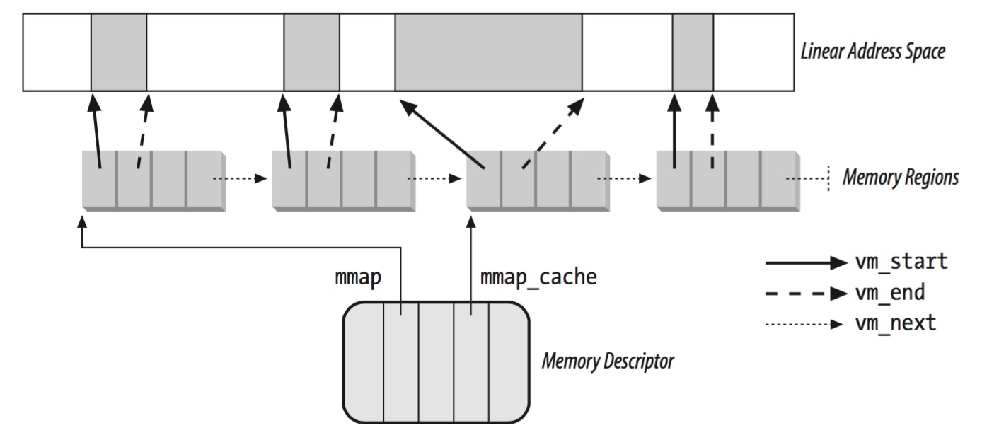

## MM - 2 Process Address Space


#### vma

当用户进程动态分配内存时，内核通常只是给用户进程分配在进程地址空间 (process address space) 内的一块虚拟地址区间，此时使用 vma (virtual memory area) 来描述这块虚拟地址区间，此时并没有给这块 vma 分配任何的 physical page frame

之后当用户进程访问该 vma 中的虚拟地址时，会发生缺页异常 (page fault)，内核在 page fault handler 中检查用户进程访问的虚拟地址的有效性，当检查访问的虚拟地址有效 (该进程分配有对应的 vma) 同时尚未与任何 physical page frame 映射时，为该 vma 分配对应的 physical page frame，同时修改 process page table 相应的页表项，以实现两者之间的映射；也就是说，用户进程申请动态分配内存时，内核实际推迟对应的 physical page frame 的分配


struct vm_area_struct 即用于描述一个 vma，包含一段虚拟地址区间 [@vm_start, @vm_end)，以及相应的访问权限 @vm_page_prot

```c
struct vm_area_struct {
	unsigned long vm_start;
	unsigned long vm_end;
	...
};
```

由于一个 vma 通常映射为一个或多个 physical page frame，因而 vma 的长度即 (vm_end - vm_start) 必须为 PAGE_SIZE 的整数倍


#### mm_struct

同属于一个进程的所有 vma 就共同描述了进程的进程地址空间 (process address space)，struct mm_struct 即内存描述符用于描述进程的进程地址空间

```c
struct mm_struct;
```


mm_struct 即用于管理进程的进程地址空间中的所有 vma，其中使用不同方式组织进程的所有 vma

1. vma list

一个进程拥有的所有 vma 会通过 @vm_next/@vm_prev 字段组织为一个排序的链表，其中按照 vma 的虚拟地址进行排序

```c
struct vm_area_struct {
	/* linked list of VM areas per task, sorted by address */
	struct vm_area_struct *vm_next, *vm_prev;
	...
}
```

内存描述符的 @mmap 字段就指向了这一个 vma 链表，@map_count 字段描述该链表中包含的 vma 的数量

```c
struct mm_struct {
	struct vm_area_struct *mmap; /* list of VMAs */
	int map_count;			/* number of VMAs */
	...
}
```




2. vma rbtree

此外为了提高 vma 的查找速度，一个进程拥有的所有 vma 还会组织为一个 rbtree，通过 @vm_start 进行排序，内存描述符的 @mm_rb 字段就指向这个 rbtree

```c
struct mm_struct {
	struct rb_root mm_rb;
	...
}
```


#### vma attribute

```c
struct vm_area_struct {
	/* Access permissions of this VMA. */
	pgprot_t vm_page_prot;
	unsigned long vm_flags;
	...
}
```

@vm_flags 描述该 vma 的一些标志位

- VM_READ   来自 mmap() 系统调用的 @prot 参数的 PROT_READ 标志
- VM_WRITE  来自 mmap() 系统调用的 @prot 参数的 PROT_WRITE 标志
- M_EXEC    来自 mmap() 系统调用的 @prot 参数的 PROT_EXEC 标志

- VM_SHARED 来自 mmap() 系统调用的 @flags 参数的 MAP_SHARED 标志


@vm_page_prot 描述该 vma 映射的 page frame 的访问权限，包括 Read/Write、Present、User/Supervisor 等；事实上当发生 page fault 需要增加一个页表项时，页表项的 page protection bit 实际上就来自对应 vma 的 @vm_page_prot 字段

```sh
mmap_region
    vma->vm_page_prot = vm_get_page_prot(vm_flags);
```


