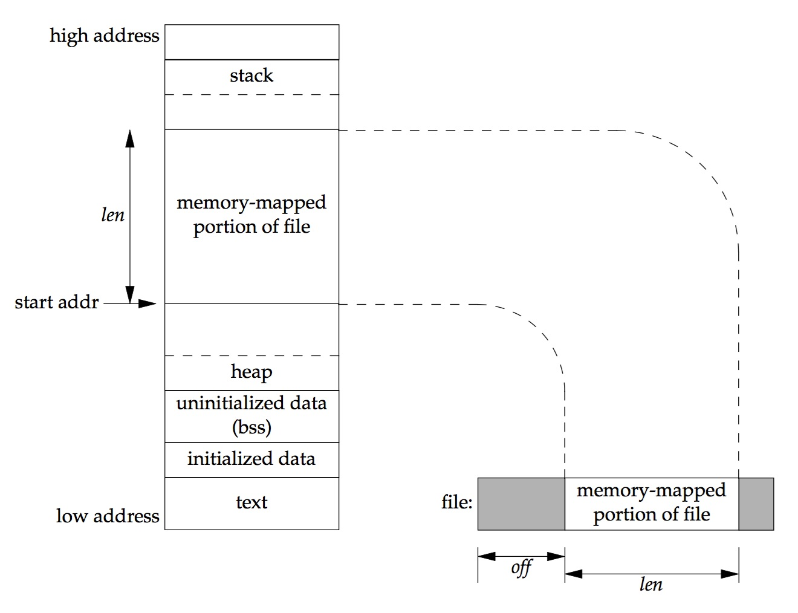

title:'MM - 4 File Memory Mapping - Syscall'
## MM - 4 File Memory Mapping - Syscall

通过 mmap() 系统调用创建新的内存映射，munmap() 系统调用取消特定内存映射

```c
#include <sys/mman.h>

void *mmap(void *addr, size_t length, int prot, int flags, int fd, 
            off_t offset);

int munmap(void *addr, size_t length);
```

mmap() 系统调用描述，将 @fd 文件 @offset 偏移起始的 @length 长度的区间，映射至进程地址空间，若成功函数返回映射至的虚拟地址的起始地址，否则返回负的错误码 MAP_FAILED

@addr 描述需要映射至用户进程地址空间的虚拟地址的起始地址，通常设置为 0 表示由内核选择合适的起始地址，映射的虚拟地址的起始地址应以页对齐

@length、@offset 同样需要以页为单位




> prot

@prot 标志描述映射的虚拟地址区域的保护属性，通常为 PROT_NONE 或其他标志的位或

prot | 描述
---- | ----
PROT_READ | 映射后的虚拟地址区域可读
PROT_WRITE | 映射后的虚拟地址区域可写
PROT_EXEC | 映射后的虚拟地址区域可执行
PROT_NONE | 映射后的虚拟地址区域不能被访问


> flags

@flags 标志描述映射的虚拟地址区域的访问属性，该标志位描述对该映射区域的更改对于其他进程是否可见，或者说对该映射区域的更改是否保存到原文件（underlying file），通常必须指定 MAP_SHARED 或 MAP_PRIVATE，以及其他标志的位或

MAP_SHARED 标志表明对映射的虚拟地址区域的写操作实际是对映射的文件的操作，当前用户进程对该映射区域具有 read/write 权限，用户进程对该映射区域的更改会保存到原文件，对该映射区域的更改对于其他进程可见

MAP_PRIVATE 标志表明当前用户进程对该映射区域实现 copy-on-write 映射，一开始当前进程对该映射区域只具有 read 权限，之后当对映射的虚拟地址区域进行写操作时，实际维护一份原文件的拷贝，对映射的虚拟地址区域的写操作实际是对该拷贝的操作，而并不对原文件进行任何修改

MAP_FIXED 标志标明 mmap() 返回的映射虚拟地址区间的起始地址必须由 @addr 参数指定。 mmap() 系统调用的 @addr 参数不为 0 时表示映射的用户进程地址空间的虚拟地址的起始地址，但内核并不能保证函数最终返回的映射的起始地址与 addr 参数相等，当使用 MAP_FIXED 标志时限制函数返回的映射的起始地址必须与 @addr 参数相等，此时传入的 @addr 参数必须是页对齐的

