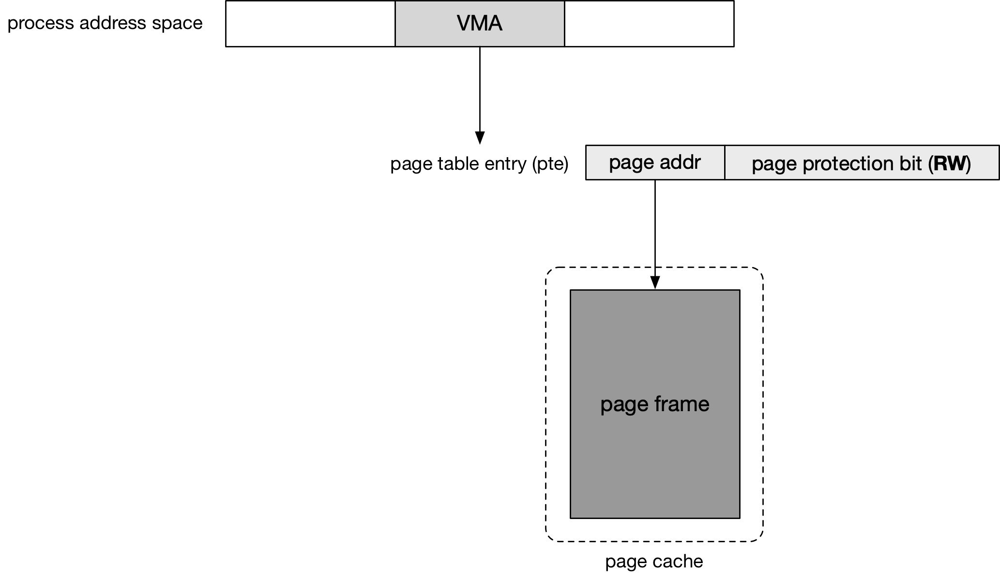

## MM - 4 File Memory Mapping

file memory mapping 将用户进程地址空间中的一段虚拟地址区间映射到文件的 page cache 中的一个 physical page frame，从而实现虚拟地址区间与文件某一段 offset 区间的映射，这样用户进程对这一段虚拟地址区间的内存操作直接转换为对文件的 page cache 的操作，从而转换为对文件的读写操作，而不必频繁调用 read()/write() 系统调用


### Routine

#### mmap syscall

在 file memory mapping 中，同样使用 vma 描述这一映射关系，描述 @vm_file 文件的 @vm_pgoff 起始处的内容，映射到进程的 [@vm_start, @vm_end) 虚拟地址空间

```c
struct vm_area_struct {
	unsigned long vm_start;
	unsigned long vm_end;	

	struct file * vm_file;	/* File we map to (can be NULL). */
	unsigned long vm_pgoff;	 /* Offset (within vm_file) in PAGE_SIZE units */
	...
};
```


文件的 address space 的 @i_mmap rbtree 维护该文件下所有用于 file memory mapping 的 vma

```c
struct address_space {
	...
	struct rb_root_cached	i_mmap;
}
```

因而 mmap() 系统调用实际上就包含以下操作


1. allocate virtual address

```sh
old_mmap()/mmap_pgoff
    ksys_mmap_pgoff
        vm_mmap_pgoff
            do_mmap
                get_unmapped_area   // allocate virtual address
                    fops->get_unmapped_area(), that is, thp_get_unmapped_area() for ext4
                        current->mm->get_unmapped_area(), that is, arch_get_unmapped_area_topdown       
```

调用 get_unmapped_area() 分配当前映射需要的虚拟地址区域，对于 file memory mapping 来说，实际是调用 fops->get_unmapped_area() 回调函数，其中又是调用 mm->get_unmapped_area() 回调函数


2. allocate vma

get_unmapped_area() 只是分配了当前映射所需要的虚拟地址区间，此时还没有分配对应的 vma 结构；之后会调用 mmap_region()，其中如果当前分配的虚拟地址空间可以与之前的 vma 相合并，那么就直接合并，此时就不必再分配对应的 vma 结构；否则就必须为当前分配的虚拟地址区间创建对应的 vma 结构

```sh
old_mmap()/mmap_pgoff
    ksys_mmap_pgoff
        vm_mmap_pgoff
            do_mmap
                get_unmapped_area
                mmap_region
                    # allocate vma
                    
                    vma->vm_start = addr;
                    vma->vm_end = addr + len;
                    vma->vm_file = get_file(file);
                    vma->vm_pgoff = pgoff;
                    
                    fops->mmap(), that is, ext4_file_mmap() for ext4
                        vma->vm_ops = ext4_file_vm_ops (for non-DAX mode)
```

这个 vma 就描述了 @vm_file 文件的 @vm_pgoff 偏移处起始的区间，映射至 [@vm_start, @vm_end) 进程地址空间

此外对于 file memory mapping 来说，还会调用对应的 fops->mmap() 回调函数，来设置 vma->vm_ops


#### page fault

mmap 系统调用中只是为当前进程分配用于 file memory mmaping 的虚拟地址区域 vma，但尚未为该 vma 分配对应的 physical page frame

mmap 系统调用返回后，当用户进程访问该 vma 中的虚拟地址时将产生 page fault，在 page fault handler 中为该 vma 分配对应的 physical page frame，并设置 page table 以建立映射

```sh
page fault handler entry, that is, do_page_fault/exc_page_fault
    handle_mm_fault
        __handle_mm_fault
            p4d_alloc(), pud_alloc(), pmd_alloc() // allocate pgd/pud/pmd table
            
            vmf.vma = vma,
        	  vmf.address = address & PAGE_MASK,
        	  vmf.pgoff = linear_page_index(vma, address),
        	  
            handle_pte_fault          
```


这里需要注意的是，page fault handler 使用 struct vm_fault 结构传递相关参数

```c
struct vm_fault {
	const struct {
		struct vm_area_struct *vma; /* Target VMA */
		gfp_t gfp_mask;			/* gfp mask to be used for allocations */
		pgoff_t pgoff;			/* Logical page offset based on vma */
		unsigned long address;/* Faulting virtual address */
	};
	...
};
```

@vmf.address 描述当前触发 page fault 的 virtual address，以 PAGE_SIZE 对齐
@vmf.vma 描述对应的 vma 结构
@vmf.pgoff 描述当前触发 page fault 的偏移在文件中的偏移，以 PAGE_SIZE 对齐


### Shared Mapping

file memory mapping 实际分为 shared/private memory mapping 两类，通过 mmap() 系统调用的 @flags 参数进行区分

@flags 参数包含 MAP_SHARED 标志表明当前建立 shared memory mapping，此时用户进程对文件的这一映射区域的更改对于其他进程可见，同时对该映射区域的更改也会保存到原文件

对于 shared memory mapping 来说，用户进程的一个 vma 实际与文件 page cache 中对应偏移处的 page frame 相映射，因而用户进程对这一映射区域的更改对于其他进程可见，同时对该映射区域的更改也会保存到原文件；此外进程对映射的 page frame 具有 read/write 权限 (通过页表项实现，即 pte.rw = 1)

此时由于多个进程都可以通过内存操作直接修改文件内容，因而需要用户进程自身进行竞争保护




#### build vma

mmap() 系统调用中会为当前的映射建立 vma

```sh
old_mmap()/mmap_pgoff
    ksys_mmap_pgoff
        vm_mmap_pgoff
            do_mmap
                get_unmapped_area
                mmap_region
                    # allocate vma
                    vma->vm_start = addr;
                    vma->vm_end = addr + len;
                    vma->vm_page_prot = vm_get_page_prot(vm_flags); // pte.rw = 1, pte.usr = 1
                    vma->vm_flags = VM_READ｜VM_WRITE｜VM_SHARED
                    vma->vm_file = get_file(file);
                    vma->vm_pgoff = pgoff;
                    fops->mmap(), that is, ext4_file_mmap() for ext4
                        vma->vm_ops = ext4_file_vm_ops (for non-DAX mode)
```

对于 shared memory mapping 来说，如果 mmap 系统调用的 @prot 参数包含 PROT_READ|PROT_WRITE，那么对应的 vma 具有 read/write 权限；之后 page fault 中对应 pte 的标志位就来自 vma->vm_page_prot，也就是说之后这个 vma 映射的 physical page frame 具有 read/write 权限


#### page fault - read

1. allocate page table

```sh
page fault handler entry, that is, do_page_fault/exc_page_fault
    handle_mm_fault
        __handle_mm_fault
            p4d_alloc(), pud_alloc(), pmd_alloc() // allocate pgd/pud/pmd table
            handle_pte_fault
                do_fault // file memory mapping
                    do_read_fault
                        __do_fault
                            vmf->prealloc_pte = pte_alloc_one() // allocate pt table             
```


2. allocate page cache

如果当前进程访问的文件偏移对应的 page 尚不存在于 page cache，此时会先调用 vma->vm_ops->fault() 回调函数，其中将当前访问的 page 添加到该文件的 page cache 中

```sh
page fault handler entry, that is, do_page_fault/exc_page_fault
    handle_mm_fault
        handle_pte_fault
            do_fault // file memory mapping
                do_read_fault
                    do_fault_around
                        vma->vm_ops->map_pages() // find no page and return 0, fallback to __do_fault()
                    __do_fault
                        vma->vm_ops->fault(), that is, filemap_fault() for ext4
                            find_get_page   // find page in page cache
                            (find no page) pagecache_get_page(..., FGP_CREAT) // allocate page cache
                            (not-uptodate) mapping->a_ops->readpage() // read page             
```


2. build mapping

上述分配 page cache 的过程中，handle_pte_fault() 返回 VM_FAULT_RETRY，返回到 handle_mm_fault() 中会再次调用 handle_pte_fault()

此时会调用 vma->vm_ops->map_pages() 回调函数，其中为当前访问的虚拟地址区间与 page cache 中对应的 page frame 建立映射关系

```sh
page fault handler entry, that is, do_page_fault/exc_page_fault
    handle_mm_fault
        handle_pte_fault
            do_fault // file memory mapping
                do_read_fault
                    do_fault_around
                        vma->vm_ops->map_pages(), that is, filemap_map_pages() for ext4
                            do_set_pte // build mapping
                                entry = mk_pte(page, vma->vm_page_prot);
                                set_pte_at(..., pte, entry)
```

此时 pte 的权限就来自 vma->vm_page_prot，也就是具有 read/write 权限


#### page fault - write

1. allocate page table

和之前一样，会先分配对应的 page table

```sh
page fault handler entry, that is, do_page_fault/exc_page_fault
    handle_mm_fault
        __handle_mm_fault
            p4d_alloc(), pud_alloc(), pmd_alloc() // allocate pgd/pud/pmd table
        handle_pte_fault
            do_fault // file memory mapping
                do_shared_fault
                    __do_fault
                        vmf->prealloc_pte = pte_alloc_one() // allocate pt table             
```


2. allocate page cache

和之前一样，如果当前进程访问的文件偏移对应的 page 尚不存在于 page cache，此时会先调用 vma->vm_ops->fault() 回调函数，其中将当前访问的 page 添加到该文件的 page cache 中

```sh
page fault handler entry, that is, do_page_fault/exc_page_fault
    handle_mm_fault
        handle_pte_fault
            do_fault // file memory mapping
                do_shared_fault
                    __do_fault
                        vma->vm_ops->fault(), that is, filemap_fault() for ext4
                            find_get_page   // find page in page cache
                            (find no page) pagecache_get_page(..., FGP_CREAT) // allocate page cache
                            (not-uptodate) mapping->a_ops->readpage() // read page             
```


3. build mapping

上述分配 page cache 的过程中，handle_pte_fault() 返回 VM_FAULT_RETRY，返回到 handle_mm_fault() 中会再次调用 handle_pte_fault()，其中会为当前访问的虚拟地址区间与 page cache 中对应的 page frame 建立映射关系

```sh
page fault handler entry, that is, do_page_fault/exc_page_fault
    handle_mm_fault
        handle_pte_fault
            do_fault // file memory mapping
                do_shared_fault
                    do_page_mkwrite
                        vma->vm_ops->page_mkwrite(), that is, ext4_page_mkwrite() for ext4
                    finish_fault
                        do_set_pte // build mapping
                            entry = mk_pte(page, vma->vm_page_prot);
                            set_pte_at(..., pte, entry)
```

此时 pte 的权限就来自 vma->vm_page_prot，也就是具有 read/write 权限


#### msync writeback

对于 shared file memory mapping 来说，用户进程对该虚拟地址区域的内存进行写操作，实际上是修改了该文件的 page cache 中对应的 page frame，要将 page frame 中的修改同步到磁盘上，可以依赖于 writeback 框架的周期性回写自动将这些 dirty page 同步到磁盘

此外用户进程还可以显式地调用 MS_SYNC msync 系统调用，其中会主动调用 writeback 框架来将文件的所有 dirty page 写回到磁盘


### Private Mapping

mmap() 系统调用的 @flags 参数包含 MAP_PRIVATE 标志表明当前建立 private memory mapping，此时用户进程对文件的这一映射区域的更改对于其他进程不可见，同时对该映射区域的更改也不会保存到原文件

在第一次对 private memory mapping 映射区域内的内存进行读操作而触发 page fault 时，虽然也会建立映射使得这段虚拟地址区间映射到 page cache 中的 page frame，但是此时建立的 pte.rw = 0，即进程对映射的 page frame 只有 read 权限

之后当用户进程尝试对映射区域内的内存进行写操作时，由于页访问权限会再次触发 page fault，此时虽然 pte.rw 为 0，但是 vma->vm_flags 包含 VM_WRITE，表明该虚拟地址区间是具有写权限的，此时就会执行 copy-on-write 操作，在 page fautl handler 中会分配一个新的 page frame，新分配的 page frame 不在 page cache 中，同时重新设置对应的页表项，使得该虚拟地址区域与新分配的 page frame 相映射，新的页表项会描述新映射的 page frame 具有 read/write 权限


#### build vma

mmap() 系统调用中会为当前的映射建立 vma

```sh
old_mmap()/mmap_pgoff
    ksys_mmap_pgoff
        vm_mmap_pgoff
            do_mmap
                get_unmapped_area
                mmap_region
                    # allocate vma
                    vma->vm_start = addr;
                    vma->vm_end = addr + len;
                    vma->vm_page_prot = vm_get_page_prot(vm_flags); // pte.rw = 0, pte.usr = 1
                    vma->vm_flags = VM_READ｜VM_WRITE
                    vma->vm_file = get_file(file);
                    vma->vm_pgoff = pgoff;
                    fops->mmap(), that is, ext4_file_mmap() for ext4
                        vma->vm_ops = ext4_file_vm_ops (for non-DAX mode)
```

对于 private memory mapping 来说，如果 mmap 系统调用的 @prot 参数包含 PROT_READ|PROT_WRITE，那么对应的 vma->vm_page_prot 只具有 read 权限；这样之后第一次因为 read 操作发生 page fault 的时候，这段虚拟地址区间会映射到 page cache，但是对应的 pte 只具有 read 权限，从而满足 private mapping 的语义

但同时 vma->vm_flags 表明该 vma 实际上是具有 write 权限的，因而之后因为 write 操作发生 copy-on-write page fault 的时候，会新分配一个 page frame 作为 page cache 中原 page frame 的拷贝，同时这段虚拟地址区间会转而映射到新分配的 page frame，从而满足 private mapping 的语义

同时值得注意的是，此时 vma->vm_flags 没有 VM_SHARED 标志


#### page fault - read


1. allocate page table

和之前一样，先分配对应的 page table


2. allocate page cache

和之前一样，如果当前进程访问的文件偏移对应的 page 尚不存在于 page cache，此时会先调用 vma->vm_ops->fault() 回调函数，其中将当前访问的 page 添加到该文件的 page cache 中


3. build mapping

之后会再次调用 handle_pte_fault()，其中同样会调用 vma->vm_ops->map_pages() 回调函数，其中为当前访问的虚拟地址区间与 page cache 中对应的 page frame 建立映射关系

```sh
page fault handler entry, that is, do_page_fault/exc_page_fault
    handle_mm_fault
        handle_pte_fault
            do_fault // file memory mapping
                do_read_fault
                    do_fault_around
                        vma->vm_ops->map_pages(), that is, filemap_map_pages() for ext4
                            do_set_pte // build mapping
                                entry = mk_pte(page, vma->vm_page_prot);
                                set_pte_at(..., pte, entry)
```

此时 pte 的权限就来自 vma->vm_page_prot，而对于 private mapping 来说，vma->vm_page_prot 字段没有设置有 __RW 标志，即只有 read 权限，因而 pte 也没有设置有 __RW 标志，因而映射的 page frame 只具有读权限

也就是说，在第一次对映射区域内的内存进行读操作而触发 page fault 时，虽然也会建立映射使得这段虚拟地址区间映射到 page cache 中的 page frame，但是此时建立的 pte 实际上描述映射的 page frame 只有读权限，尽管 vma 本身是具有读写权限的 (mmap 系统调用的 @prot 参数设置有 PROT_READ|PROT_WRITE)


#### page fault - write


上述介绍了第一次对映射区域内的内存进行读操作而触发 page fault 时，会建立对应的 pte 使得用户进程地址空间内的这段虚拟地址区间映射到 page cache 中的 page frame，这样用户进程对映射的虚拟地址的读内存操作，实际上就是直接从文件的 page cache 读取文件的内容

但是此时建立的 pte 描述映射的 page frame 只有读权限，之后当用户进程对映射区域内的内存进行写操作时就会再次触发 page fault

1. allocate page table

和之前一样，先分配对应的 page table


2. allocate private page frame

由于之前 `page fault - read` 阶段已经将对应的 page frame 添加到 page cache 中，因而此时会跳过原先的往 page cache 添加对应 page frame 的阶段

但是此时会分配一个新的 page frame，这个新分配的 page frame 的内容完全是原先 page cache 中那个映射的 page frame 的拷贝

但是这个新分配的 page frame 是位于文件的 page cache 之外的，完全是这个用户进程私有的，也就是说用户进程之后对这一映射区域的修改对其他用户进程不可见，同时也不会保存到原文件中

```sh
page fault handler entry, that is, do_page_fault/exc_page_fault
    handle_mm_fault
        handle_pte_fault
            do_wp_page // copy-on-write
                wp_page_copy
                    new_page = alloc_page_vma() // allocate one private page frame
                    cow_user_page(new_page, old_page)  // copy contents
```


3. build mapping

之后会修改原先的 pte，使其指向新分配的 page frame

同时还会修改该 pte 的访问权限，即 vma->vm_flags 含有 VM_WRITE 标志，即 mmap 系统调用的 @prot 参数含有 PROT_WRITE 标志时，会使得该 pte 添加上写权限

```sh
page fault handler entry, that is, do_page_fault/exc_page_fault
    handle_mm_fault
        handle_pte_fault
            do_wp_page // copy-on-write
                wp_page_copy
                    entry = mk_pte(new_page, vma->vm_page_prot);
                    entry = maybe_mkwrite(entry, ...); // enable write permission
                        if vma->vm_flags & VM_WRITE: pte_mkwrite(pte)
                    set_pte_at_notify(..., pte, entry)  // build mapping
```

因而在此之后，用户进程对映射区域内的内存进行读写操作，实际上都是对该用户进程私有的这个 page frame 进行操作


#### page fault - direct write


之前的 `page fault - read` 和 `page fault - write` 一起描述了 private memory mapping 下，先 read 再 write 时 page fault 的处理；本节介绍用户进程直接对映射区域内的内存进行写操作时 page fault 的处理


1. allocate page table

和之前一样，先分配对应的 page table


2. allocate page cache

和之前一样，如果当前进程访问的文件偏移对应的 page 尚不存在于 page cache，此时会先调用 vma->vm_ops->fault() 回调函数，其中将当前访问的 page 添加到该文件的 page cache 中

```sh
page fault handler entry, that is, do_page_fault/exc_page_fault
    handle_mm_fault
        handle_pte_fault
            do_fault  // file memory mapping
                do_cow_fault // copy-on-write
                    vma->vm_ops->map_pages(), that is, filemap_map_pages() for ext4
```


3. allocate private page frame

同时分配一个新的 page frame，其内容完全是 page cache 中对应的 page frame 的拷贝，同时这个新分配的 page frame 是位于文件的 page cache 之外的

```sh
page fault handler entry, that is, do_page_fault/exc_page_fault
    handle_mm_fault
        handle_pte_fault
            do_fault  // file memory mapping
                do_cow_fault // copy-on-write
                    cow_page = alloc_page_vma()
                    copy_user_highpage(cow_page, page)
                        
```


4. build mapping

之后会设置该 pte，使其指向新分配的 page frame

同时 vma->vm_flags 含有 VM_WRITE 标志，即 mmap 系统调用的 @prot 参数含有 PROT_WRITE 标志时，该 pte 会添加上写权限

```sh
page fault handler entry, that is, do_page_fault/exc_page_fault
    handle_mm_fault
        handle_pte_fault
            do_fault  // file memory mapping
                do_cow_fault // copy-on-write
                    finish_fault
                        alloc_set_pte // build mapping (virtual address <-> physical page frame)
                            maybe_mkwrite // enable write permission
                                if vma->vm_flags & VM_WRITE: pte_mkwrite(pte)
```

在此之后，用户进程对映射区域内的内存进行读写操作，实际上都是对该用户进程私有的这个 page frame 进行操作
