## 2 NVDIMM Topology


### NFIT (NVDIMM Firmware Interface Table)

ACPI (Advanced Configuration and Power Interface Specification) 6.0 的 NFIT (NVDIMM Firmware Interface Table) 接口描述了 nvdimm 设备的硬件拓扑

NFIT 由 header 与其后的多种 NFIT Structure 构成

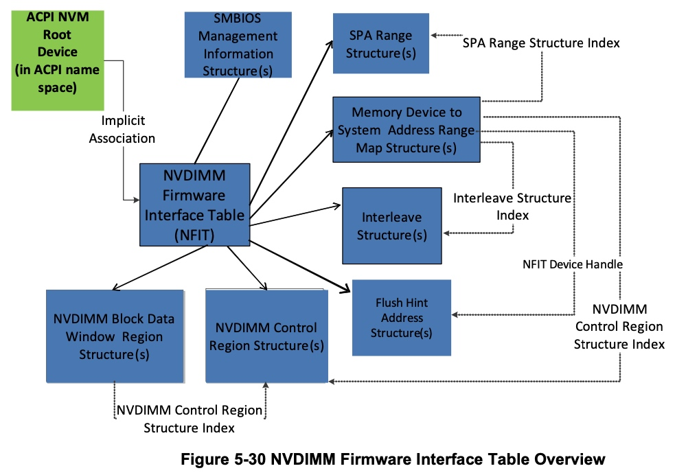

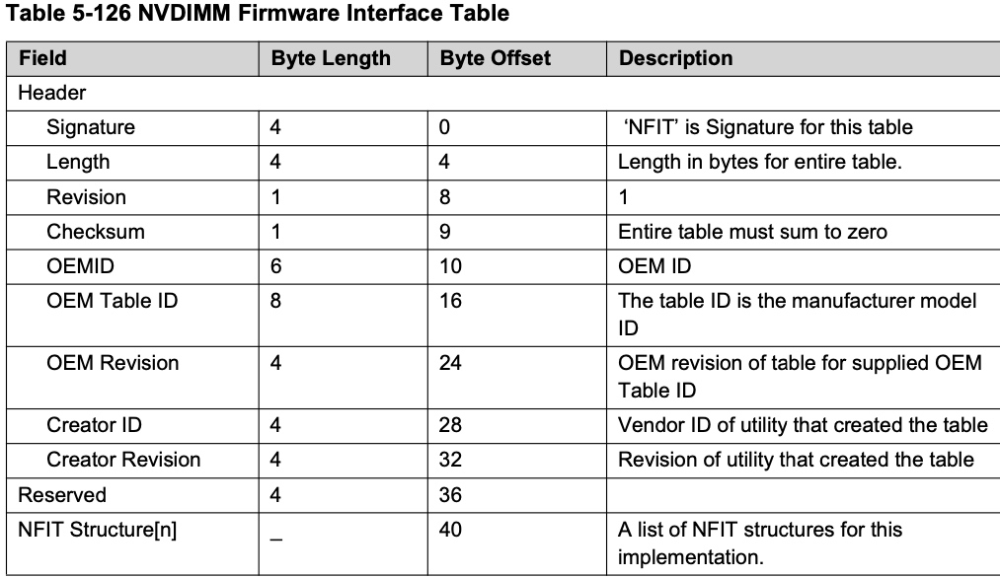

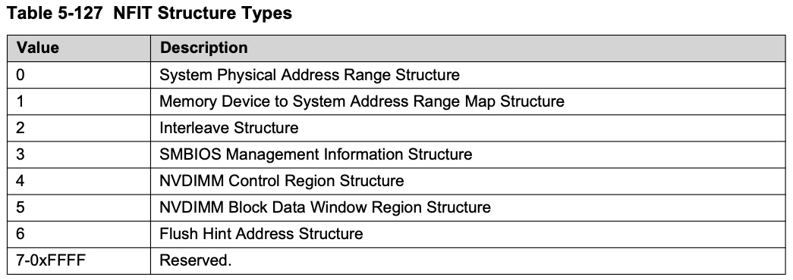

```sh
# ipmctl show -system NFIT
---NVDIMM Firmware Interface Table---
   Signature: NFIT
   ...
```


> example

```sh
# ls /dev/nmem*
/dev/nmem0  /dev/nmem10  /dev/nmem2  /dev/nmem4  /dev/nmem6  /dev/nmem8
/dev/nmem1  /dev/nmem11  /dev/nmem3  /dev/nmem5  /dev/nmem7  /dev/nmem9

# ls /dev/pmem*
/dev/pmem0  /dev/pmem1
```

例如对于以下 NFIT 示例，系统中一共存在 12 根 NVDIMM 设备

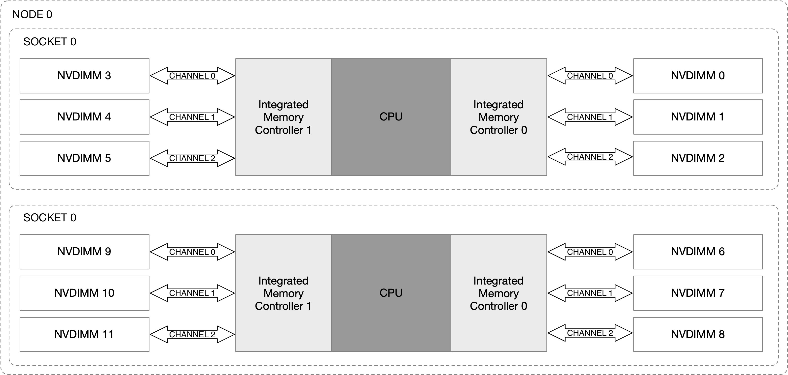


NVDIMM 设备安装在 DIMM 接口上，该接口的一个特点是，一个 CPU 连接的多个 memory controller、以及一个 memory controller 连接的多个 channel 可以并行传输数据，因而一段连续的 SPA (System Physical Address) 地址空间可以交错 (interleave) 映射到多个 NVDIMM 设备

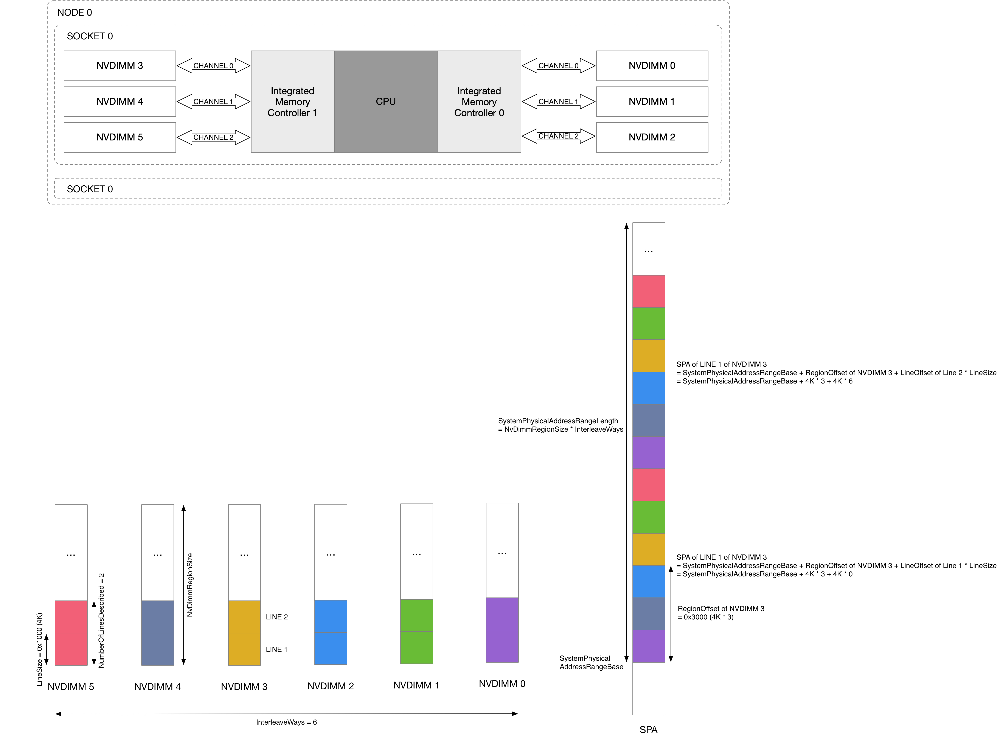


#### System Physical Address Range Structure

一个 System Physical Address Range Structure 就描述一段连续的 SPA 地址空间，而同一个 SOCKET 上的所有 NVDIMM 设备会映射到同一段 SPA 地址空间，因而之后会看到每个 SOCKET 上的 6 根 NVDIMM 设备组成一个 PMEM 设备

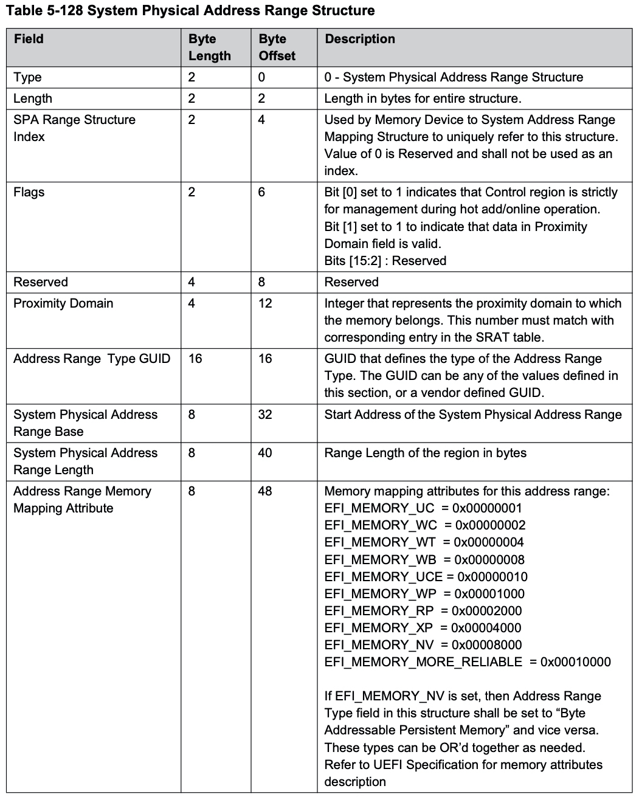

SpaRangeDescriptionTableIndex | Address Range Type GUID | SystemPhysicalAddressRangeBase | SystemPhysicalAddressRangeLength
---- | ---- | ---- | ----
0x1 | 66f0d379-b4f3-4074-ac43-0d3318b78cdb (Byte Addressable Persistent Memory (PM) Region) | 0x3060000000 | 0xbd00000000 (756 GB)
0x2 | 92f701f6-13b4-405d-910b-299367e8234c (NVDIMM Control Region) | 0x1da00000000 | 0x5f400000
0x3 | 66f0d379-b4f3-4074-ac43-0d3318b78cdb (Byte Addressable Persistent Memory (PM) Region) | 0x11d00000000 | 0xbd00000000 (756 GB)

@AddressRangeTypeGUID 字段描述了 NVDIMM 设备的工作模式，例如上述就描述了两块 NVDIMM 设备分别工作在 "Byte Addressable Persistent Memory (PM) Region" 也就是 pmem 模式


#### Interleave Structure

每个 NVDIMM 设备具有一个对应的 Interleave Structure，@LineSize 描述了 interleave 映射的粒度

至于 @NumberOfLinesDescribed，不是说一个 NVDIMM 中只有 @NumberOfLinesDescribed 数量的块参与 interleave 映射，而是一次 interleave 映射中该 NVDIMM 设备中具有 @NumberOfLinesDescribed 数量的 @LineSize 粒度的块，NVDIMM 设备中之后的映射，都只是之前描述的 interleave mapping pattern 的重复

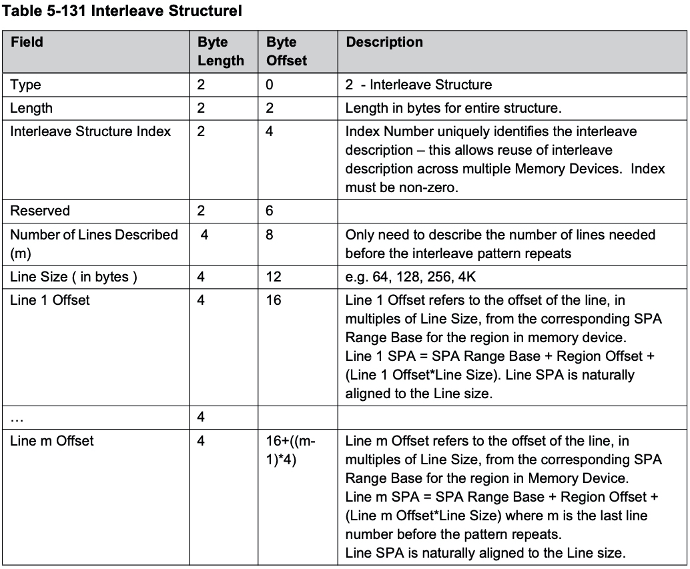

InterleaveStructureIndex | NumberOfLinesDescribed | LineSize | LineOffset
---- | ---- | ---- | ----
0x1 | 0x2 | 0x1000 (4KB) | 0: 0x0, 1: 0x6
0x2 | 0x2 | 0x1000 (4KB) | 0: 0x0, 1: 0x6
0x3 | 0x2 | 0x1000 (4KB) | 0: 0x0, 1: 0x6
0x4 | 0x2 | 0x1000 (4KB) | 0: 0x0, 1: 0x6
0x5 | 0x2 | 0x1000 (4KB) | 0: 0x0, 1: 0x6
0x6 | 0x2 | 0x1000 (4KB) | 0: 0x0, 1: 0x6
...|
0x13 | 0x2 | 0x1000 (4KB) | 0: 0x0, 1: 0x6
0x14 | 0x2 | 0x1000 (4KB) | 0: 0x0, 1: 0x6
0x15 | 0x2 | 0x1000 (4KB) | 0: 0x0, 1: 0x6
0x16 | 0x2 | 0x1000 (4KB) | 0: 0x0, 1: 0x6
0x17 | 0x2 | 0x1000 (4KB) | 0: 0x0, 1: 0x6
0x18 | 0x2 | 0x1000 (4KB) | 0: 0x0, 1: 0x6


#### Memory Device to System Physical Address Range Mapping Structure

同时每个 NVDIMM 设备还具有一个对应的 Memory Device to System Physical Address Range Mapping Structure，它描述了该 NVDIMM 中的块是如何映射到 SPA 地址空间的

这里 @InterleaveWays 描述有多少个 NVDIMM 设备参与到当前 SPA 地址空间的 interleave 映射

由于 interleave 映射的特性，@RegionOffset 描述了当前 NVDIMM 设备在映射的 SPA 地址空间中的起始地址偏移


NvDimmRegionalId | NfitDeviceHandle | RegionOffset | NvDimmRegionSize | NvDimmPhysicalAddressRegionBase | SpaRangeDescriptionTableIndex | InterleaveStructureIndex | InterleaveWays
--- | ---- | ---- | ---- | ---- | ---- | ---- | ----
0x0 | 0x0001 (SocketId=0, MemControllerId=0, MemChannel=0, DimmNumber=1) | 0x0 | 0x1f80000000 (126 GB) | 0x10000000 | 0x1 | 0x1 | 0x6
0x1 | 0x0011 (SocketId=0, MemControllerId=0, MemChannel=1, DimmNumber=1) | 0x4000 | 0x1f80000000 (126 GB) | 0x10000000 | 0x1 | 0x2 | 0x6
0x2 | 0x0021 (SocketId=0, MemControllerId=0, MemChannel=2, DimmNumber=1) | 0x2000 | 0x1f80000000 (126 GB) | 0x10000000 | 0x1 | 0x3 | 0x6
0x3 | 0x0101 (SocketId=0, MemControllerId=1, MemChannel=0, DimmNumber=1) | 0x3000 | 0x1f80000000 (126 GB) | 0x10000000 | 0x1 | 0x4 | 0x6
0x4 | 0x0111 (SocketId=0, MemControllerId=1, MemChannel=1, DimmNumber=1) | 0x1000 | 0x1f80000000 (126 GB) | 0x10000000 | 0x1 | 0x5 | 0x6
0x5 | 0x0121 (SocketId=0, MemControllerId=1, MemChannel=2, DimmNumber=1) | 0x5000 | 0x1f80000000 (126 GB) | 0x10000000 | 0x1 | 0x6 | 0x6
...|
0x12 | 0x1001 (SocketId=1, MemControllerId=0, MemChannel=0, DimmNumber=1) | 0x0 | 0x1f80000000 (126 GB) | 0x10000000 | 0x3 | 0x13 | 0x6
0x13 | 0x1011 (SocketId=1, MemControllerId=0, MemChannel=1, DimmNumber=1) | 0x4000 | 0x1f80000000 (126 GB) | 0x10000000 | 0x3 | 0x14 | 0x6
0x14 | 0x1021 (SocketId=1, MemControllerId=0, MemChannel=2, DimmNumber=1) | 0x2000 | 0x1f80000000 (126 GB) | 0x10000000 | 0x3 | 0x15 | 0x6
0x15 | 0x1101 (SocketId=1, MemControllerId=1, MemChannel=0, DimmNumber=1) | 0x3000 | 0x1f80000000 (126 GB) | 0x10000000 | 0x3 | 0x16 | 0x6
0x16 | 0x1111 (SocketId=1, MemControllerId=1, MemChannel=1, DimmNumber=1) | 0x1000 | 0x1f80000000 (126 GB) | 0x10000000 | 0x3 | 0x17 | 0x6
0x17 | 0x1121 (SocketId=1, MemControllerId=1, MemChannel=2, DimmNumber=1) | 0x5000 | 0x1f80000000 (126 GB) | 0x10000000 | 0x3 | 0x18 | 0x6


### NVDIMM Namespace

与 NVMe namespace 类似，NVDIMM 中也存在 namespace 的概念

#### topology concept

在此介绍一下 NVDIMM 拓扑结构中的几个概念

##### Region

传统的 DDR 内存可以通过 DIMM 封装的形式接入 DDR 总线，总线上的多块 DIMM 就可以组成一个统一的内存物理地址空间，此时多个 DIMM 实际上是采用 interleaving 的形式构成一个物理地址空间，例如当接入 4 DIMM 时，对于某种粒度的内存物理地址区间，各个 1/4 依次映射到 DIMM 0/1/2/3，从而提升内存的带宽

由于 NVDIMM 设备是直接连接到系统的 DDR 总线的，因而也可以采用 interleaving 的技术，即由多个 DIMM 组成一个 NVDIMM 设备，这些 DIMM 的集合就称为是一个 region

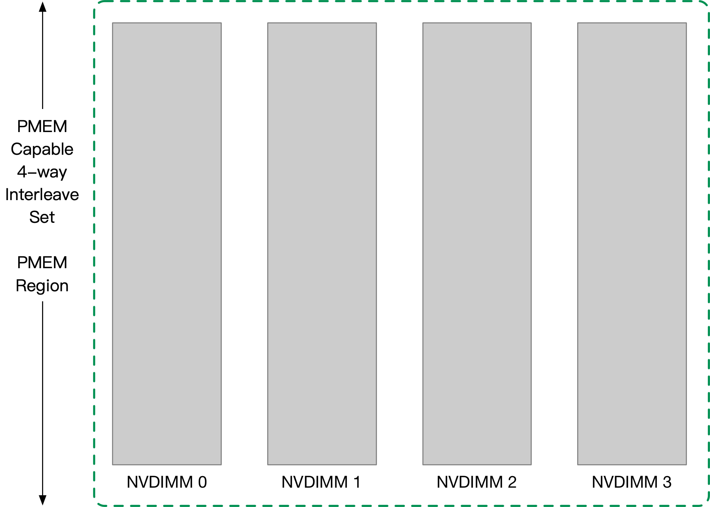


##### Namespace

一个 region 可以划分为多个 namespace，namespace 分为 block/pmem 两种类型

> pmem

该模式下 NVDIMM 设备的物理地址空间对 MMU 可见，即 CPU 可以对 NVDIMM 设备内的所有存储单元按照 byte 寻址；该模式下一个 namespace 实际上可以跨越多个 DIMM
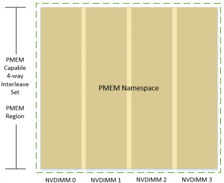


> block

该模式下 NVDIMM 设备的物理地址空间对 MMU 不可见，此时 CPU 不能直接访问 NVDIMM 设备内的存储介质，而必须通过 block window 来访问；该模式下一个 namespace 不能跨越 DIMM

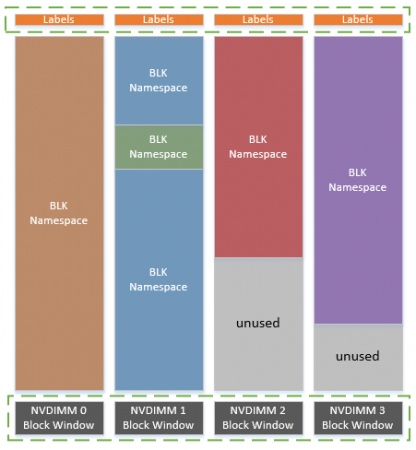


> pmem & block

有些 NVDIMM 设备只能工作在 pmem 模式，有些则只能工作在 block 模式，而有些则能同时工作在 pmem 和 block 模式

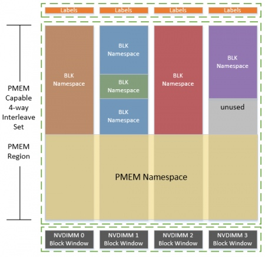


#### Label Storage Area

一个 NVDIMM 可以包含多个 namespace，此时在 NVDIMM 存储区域之外单独划分出一个存储区域称为 Label Storage Area，通常是 128 KB

每个 NVDIMM 都有一个对应的 Label Storage Area，其中存储对应的 NVDIMM 包含的 namespace 数量及相关信息

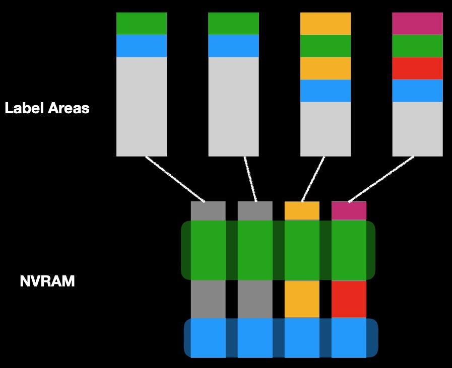


NVDIMM Namespace Specification 中定义了 Label Storage Area 的格式

```
 Label Storage Area
+-------------------+
|   index block     |
+-------------------+
|   index block     |
+-------------------+
|       label       |
+-------------------+
|       label       |
+-------------------+
|        ...        |
+-------------------+
|       label       |
+-------------------+
```

> index block

index block 相当于是 Label Storage Area header，其中描述了相关元数据；其后是一个个 label，NVDIMM 中包含的每个 namespace 都对应一个 label

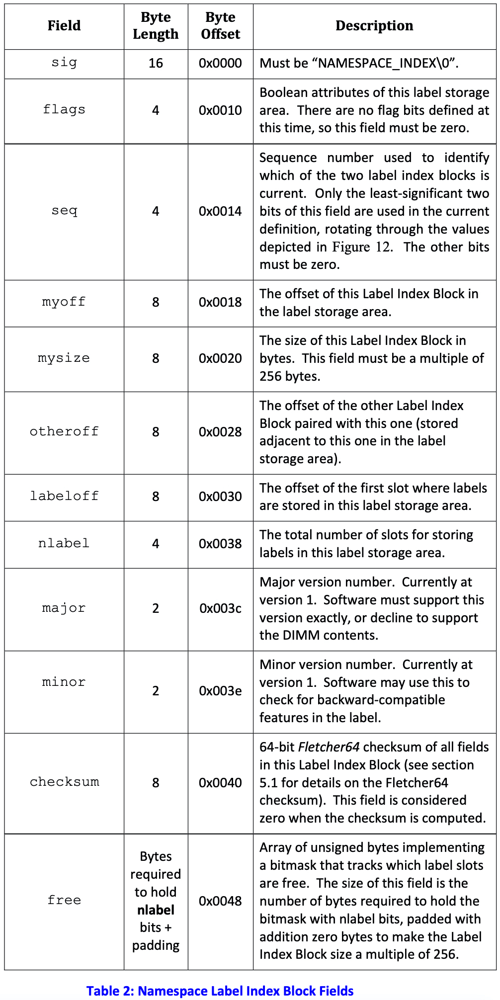

@nlabel 描述了 Label Storage Area 中包含的 label 的数量，@free bitmap 描述了所有 label 的使用情况，bit 为 1 表示对应的 label 处于 free 可用状态

Label Storage Area 的头部包含两个 index block，这两个 index block 会按照 ping-pong 的方式轮流处于激活状态，从而防止运行时 index block 更新到中途发生 crash，从而发生数据丢失的问题


> block

NVDIMM 中包含的每个 namespace 都对应一个 label，描述当前 NVDIMM 中 @dpa 起始的，@rawsize 大小的 dpa (device physical address) 地址空间，划分给当前描述的 namespace

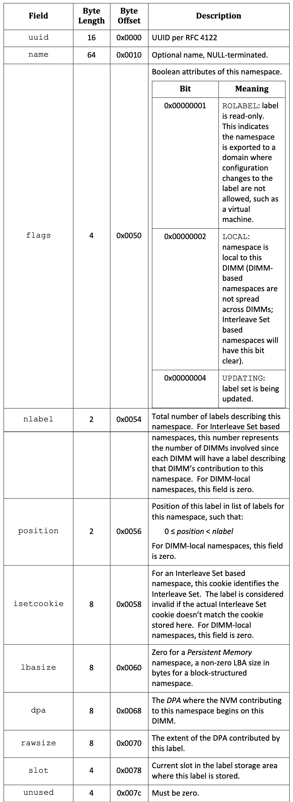

一个 namespace 可能需要由多个 label 描述，例如 pmem type 的 namespace 可能会横跨多个 NVDIMM，此时每个 NVDIMM 都有一个对应的 label 描述这一 namespace，label 的 @nlabel 就描述对应的 namespace 由多少个 label 共同描述，@position 描述当前这个 label 在所有这些 label 中的偏移，同时描述同一个 namespace 的所有 label 具有相同的 @uuid 字段


```
# ndctl read-labels -v -u nmem0
```

dev | uuid | nlabel | position | dpa | rawsize
---- | ---- | ---- | ---- | ---- | ----
nmem 0 | 6d9231b1-104a-476f-9d7f-a732c4fa146e | 6 | 0 | 0x10000000 | 126 GiB
nmem 1 | 6d9231b1-104a-476f-9d7f-a732c4fa146e | 6 | 1 | 0x10000000 | 126 GiB
nmem 2 | 6d9231b1-104a-476f-9d7f-a732c4fa146e | 6 | 2 | 0x10000000 | 126 GiB
nmem 3 | 6d9231b1-104a-476f-9d7f-a732c4fa146e | 6 | 3 | 0x10000000 | 126 GiB
nmem 4 | 6d9231b1-104a-476f-9d7f-a732c4fa146e | 6 | 4 | 0x10000000 | 126 GiB
nmem 5 | 6d9231b1-104a-476f-9d7f-a732c4fa146e | 6 | 5 | 0x10000000 | 126 GiB
... |
nmem 6 | 8a181b2e-805c-4e93-9866-4c6269c6cf9d | 6 | 0 | 0x10000000 | 126 GiB
nmem 7 | 8a181b2e-805c-4e93-9866-4c6269c6cf9d | 6 | 1 | 0x10000000 | 126 GiB
nmem 8 | 8a181b2e-805c-4e93-9866-4c6269c6cf9d | 6 | 2 | 0x10000000 | 126 GiB
nmem 9 | 8a181b2e-805c-4e93-9866-4c6269c6cf9d | 6 | 3 | 0x10000000 | 126 GiB
nmem 10 | 8a181b2e-805c-4e93-9866-4c6269c6cf9d | 6 | 4 | 0x10000000 | 126 GiB
nmem 11 | 8a181b2e-805c-4e93-9866-4c6269c6cf9d | 6 | 5 | 0x10000000 | 126 GiB


### Linux NVDIMM Driver

NVDIMM 在 device model 实现了一个单独的 nvdimm bus

```
                              /sys/                                              
                                |
                               bus/
                                |
                                nd/                                             
                        (nvdimm_bus_type)
                                |
        +-----------------------+-------------------------------------------+      
        |                                                                   |      
    drivers/                                                           devices/
        |                                                                   |
+-------+-------+--------+--------------+-------------+                     |
|       |       |        |              |             |                     |
|       |       |        |              |         nd_bus  ----------->  ndbus0/
|       |       |        |              |   (nd_bus_driver)                 |
|       |       |        |              |                           +-------+------+
|       |       |        |              |                           |              |
|       |       |        |           nvdimm --------------------> nmem0    +--> region0/
|       |       |        |      (nvdimm_driver)                  (nvdimm)  |  (nd_region)
|       |       |        |                                                 |       |
|       |       |      nd_region ------------------------------------------+       |
|       |       |   (nd_region_driver)                                             |     
|       |       |                                 +----------------+-------------+-+---------+
|       |     nd_blk                              |                |             |           |
|       | (nd_blk_driver)                     namespace0.0         |             |           |
|       |       +---------------------------> (nd_namespace_blk)   |             |           |
|       |                                         |                |             |           |
|       |                                     [disk: ndblk0.0]     |             |           |
|       |                                                          |             |           |
|    nd_pmem                                                       |             |           |
| (nd_pmem_driver)                                                 |             |           |                                        
|       +-----------------------------------> (nd_namespace_io)    |             |           |
|       |                                     (nd_namespace_pmem)  |             |           |
|       |                                         |                |             |           |
|       |                                     [disk: pmem0.0]      |             |           |
|       |                                                          |             |           |
|       |                                                          |             |           |
|       +-------------------------------------------------------> btt0.0         |           |
|       |                                                         (nd_btt)       |           |
|       |                                                                        |           |
|       +----------------------------------------------------------------->  pfn0.0          |
|                                                                            (nd_pfn)        |
|                                                                                            |
dax_pmem   -----------------------------------------------------------------------------> dax0.0      
(dax_pmem_driver)                                                                         (nd_dax)    
                                                                                             |
                                                                                            dax
                                                                                             |
                                                                                           dax0.0
                                                                                          (dax_fops)
```

namespace\<regionID>.\<namespaceID>

disk name:
/dev/ndblk\<regionID>.\<namespaceID>
/dev/pmem\<regionID>
/dev/pmem\<regionID>.\<namespaceID>

btt\<regionID>.\<bttID>
pfn\<regionID>.\<pfnID>
dax\<regionID>.\<daxID>

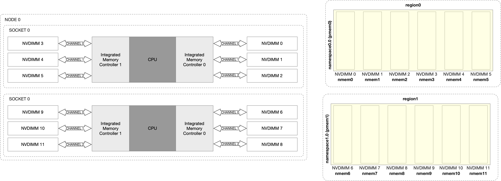

```sh
libnvdimm_init
    nvdimm_bus_init // register 'nvdimm_bus_type' bus
                    // register 'nd_bus_driver' driver
    nvdimm_init     // register 'nvdimm_driver' driver
    nd_region_init  // register 'nd_region_driver' driver

acpi_nfit_init(struct acpi_nfit_desc *acpi_desc,...)
    nvdimm_bus_register // register 'ndbus0' device
        nd_bus_driver->probe(), i.e., nd_bus_probe

    add_table // parsing NFIT to acpi_nfit_desc
    
    acpi_nfit_register_dimms // register 'nmemX' device, for each dimm in &acpi_desc->dimms
        nvdimm_driver->probe(), i.e., nvdimm_probe() // read Label Storage Area
        
    acpi_nfit_register_regions // register 'regionX' device, for each region in &acpi_desc->spas
        nd_region_driver->probe(), i.e., nd_region_probe()
            nd_region_register_namespaces // register 'namespaceX.X' device, for each namespace in this region
            nd_region->btt_seed = nd_btt_create(nd_region); // register 'btt0.0' device
            nd_region->pfn_seed = nd_pfn_create(nd_region); // register 'pfn0.0' device
            nd_region->dax_seed = nd_dax_create(nd_region); // register 'dax0.0' device

nd_region_register_namespaces // register 'namespaceX.X' device, for each namespace in this region
    # for block mode (disk: ndblk0.0)
    nd_blk_driver->probe(), i.e., nd_blk_probe()
        nsblk_attach_disk
            # blk_alloc_queue, alloc_disk, device_add_disk

    # for pmem + fsdax mode (disk: pmem0.0)
    nd_pmem_driver->probe(), i.e., nd_pmem_probe()
        pmem_attach_disk
            # blk_alloc_queue, alloc_disk, device_add_disk
            # disk->fops = pmem_fops

    # for pmem + fsdax + pfn mode (disk: pmem0.0)
    nd_pmem_driver->probe(), i.e., nd_pmem_probe()       
        if namespace->claim_class == 'pfn': nd_pfn_probe // register 'pfn0.1' device
        pmem_attach_disk
            # blk_alloc_queue, alloc_disk, device_add_disk
            # disk->fops = pmem_fops

    # for pmem + sector mode (disk: pmem0.0s)
    nd_pmem_driver->probe(), i.e., nd_pmem_probe() 
        if namespace->claim_class == 'btt': nd_btt_probe // register 'btt0.1' device
        pmem_attach_disk
            # blk_alloc_queue, alloc_disk, device_add_disk
            # disk->fops = pmem_fops
    
    # for pmem + devdax mode (char: dax0.0)
    nd_pmem_driver->probe(), i.e., nd_pmem_probe() 
        if namespace->claim_class == 'dax': nd_dax_probe // register 'dax0.1' device 
            dax_pmem_driver->probe(), i.e., dax_pmem_probe()
                __dax_pmem_probe // register 'dax0.0' device of 'dax' bus
                    device_dax_driver->probe(), i.e., dev_dax_probe()
                        # register char device 'dax0.0'
                        # ops = dax_fops
```


