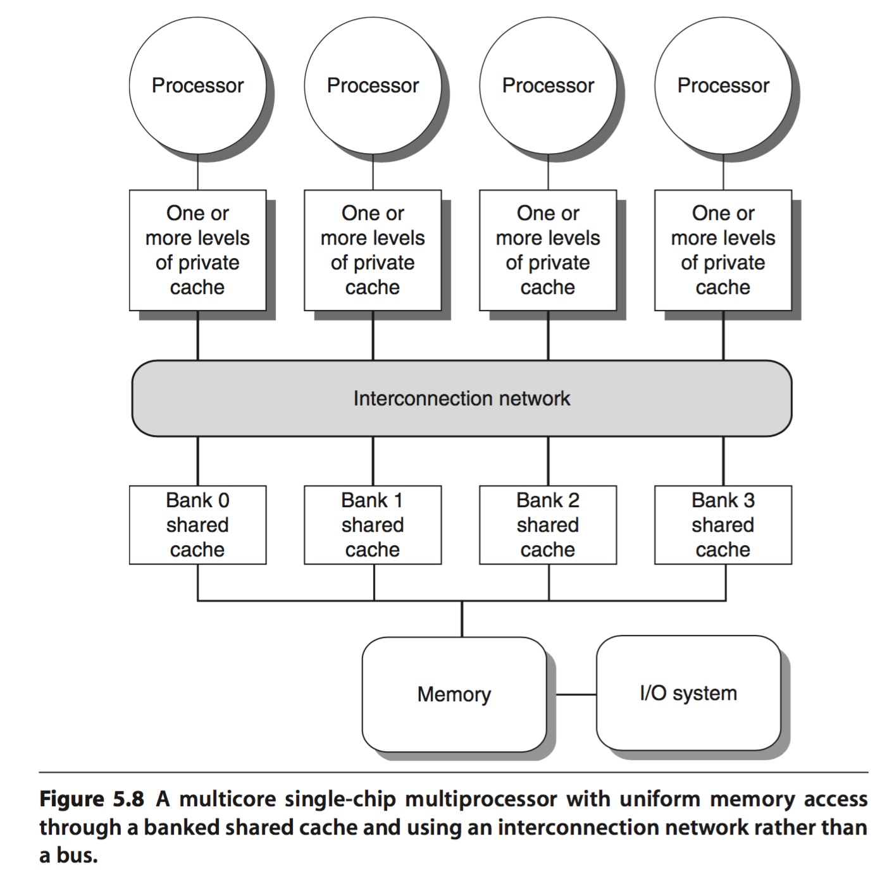
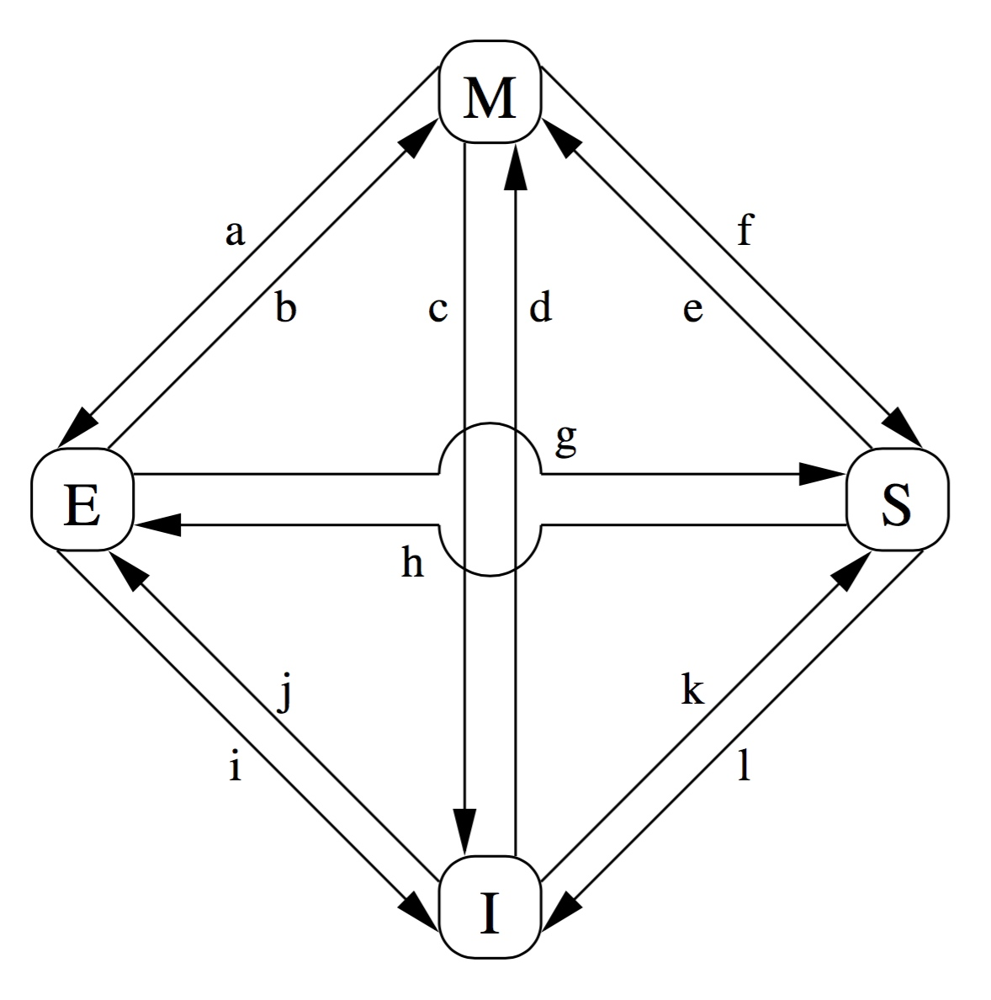
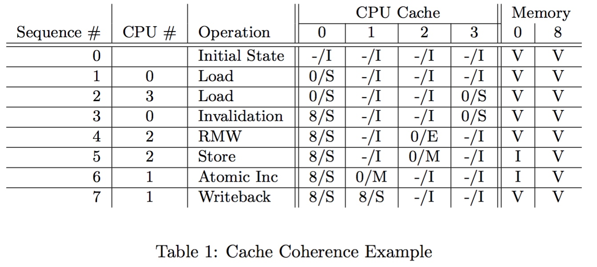

title:'Cache - Cache Coherency'
## Cache - Cache Coherency

cache coherency 主要包含以下两类

1. IO cache coherency
2. SMP cache coherency

### IO Cache Coherency

IO 设备可以通过 DMA 操作，经 memory 中转，直接将数据传递给 processor，或从 processor 接收数据，此时

- 对于 input routine，当 cache 对 DMA 使用的 memory 进行缓存时，若 IO 设备通过 DMA 更改 memory 的值，此时 cache 中缓存的值就与 memory 的值不同步，即 processor 读取的数据与 IO 设备实际传递的数据不同步
- 对于 output routine，当 cache 使用 write-back 策略时，processor 输出的数据实际仍然缓存在 cache 中，还没有传递到 memory，因而此时 processor 输出的数据与 IO 设备实际获取的数据不同步

这个问题即为 IO cache coherency，通常使用以下措施解决这一问题

1. 对于 output routine
    - 可以将 cache 设置为 write-through，这样每次 processor 输出的数据都可以立即传递到 memory
    - 或者在 processor 输出数据之后，在 IO 设备读取数据之前，对 cache 执行 flush 操作，即将 processor 输出的数据传递到 memory
        - 这一操作可以由操作系统显式地执行 cache flush 操作
        - 也可以由 cache hardware 自动执行，即 processor 将输出数据缓存到 cache 中时，cache hardware 检查到对应的 virtual address 实际用于 IO buffer，则立即将缓存更新到 memory
2. 对于 input routine
    - 将 IO 设备使用的 memory buffer 设置为 noncacheble
    - 或者在 IO 设备输出数据之后，在 processor 读取数据之前，对 cache 执行 invalidate 操作，这样之后 processor 读取这些数据时，必须重新从 memory 读取数据并填充到 cache 中
        - 这一操作可以由操作系统显式地执行 cache invalidate 操作
        - 也可以由 cache hardware 自动执行，即 processor 从 cache 读取数据时，cache hardware 检查到对应的 virtual address 实际用于 IO buffer，则 cache 总是从 memory 重新读取数据

### SMP Cache Coherency

### Cache-Coherence Protocols 

Cache-Coherence Protocol 用于 SMP 系统中的缓存同步

#### MESI States

Cache-Coherence Protocol 规定了 cache line 的四种状态 MESI(modified, exclusive, shared, invalid)，cache line 的 valid bit 与 tag 字段用于标识该 cache line 的状态

1. modified

modified 状态是指该 cache line 对应的 CPU 最近执行 store 指令对该 cache line 中的数据进行过修改，同时只有该 cache line 保存对该数据的有效缓存，即其他 CPU 的 cache 对该数据的缓存均无效；当该 cache line 被替换时，必须将该 cache line 中的数据写回到内存，或将该数据拷贝到其他 CPU 的缓存

2. exclusive

exclusive 状态与 modified 相似，即只有该 cache line 保存对该数据的缓存，但同时当前对应的 CPU 仍未执行 store 指令对 cache line 中的数据进行修改，因而该 cache line 中缓存的数据与内存中的原数据是同步的

因而之后该 cache line 被修改时，当前 CPU 无需对其他 CPU cache 执行 invalidation 操作，同时该 cache line 被替换时，无需将该 cache line 中的数据写回到内存，或将该数据拷贝到其他 CPU 的缓存

3. shared

shared 状态是指多个 CPU 的 cache line 同时对同一个数据进行缓存，同时 cache line 中缓存的数据与内存中的原数据是同步的，因而当 CPU 修改缓存中的数据时必须同缓存有该数据的其他 CPU 进行协商，同时 cache line 被替换时，无需将该 cache line 中的数据写回到内存，或将该数据拷贝到其他 CPU 的缓存

4. invalid

invalid 状态是指该 cache line 为空

#### MESI Protocol Messages

CPU 通过向总线发送 message 实现对缓存的访问操作，该总线用于连接各个 CPU 的 private cache，SMP 系统中当多个 CPU 共享同一个总线时，CPU 之间通过 MESI Protocol Messages 实现缓存的同步

##### write cache routine

SMP 系统中当 CPU 对 cache 中的某个数据进行写操作时，该 CPU 必须对该数据执行 invalidate 操作，即使该数据在其他 CPU private cache 中的拷贝无效，CPU 通过向连接各个 CPU private cache 的总线发送 invalidate message 以实现 invalidate 操作

当其他 CPU 监测到总线上的 invalidate message，同时该 invalidate message 包含的需要进行 invalidate 操作的数据在当前 CPU 的 private cache 中存在拷贝时，该 CPU 即将该数据对应的 cache line 标记为 invalid

> invalidate

invalidate message 包含需要进行 invalidate 操作的 cache line 的物理地址

> invalidate acknowledge

invalidate acknowledge message 是对之前的 invalidate message 回应，当 CPU 接收到 invalidate message 时需要将缓存中对应的 cache line 移除，之后发送 invalidate acknowledge message

##### writeback routine

此外当 modified 状态的 cache line 被取代，或者由于主动 cache flush 操作而需要将 cache 中的数据回写到 memory 时，就需要发送 writeback message

> writeback

writeback message 包含需要写回到内存的数据以及该数据在内存中的地址

##### read cache routine

之后该 CPU 访问该数据时即发生 cache miss，此时 CPU 会根据访问的类型向连接各个 CPU private cache 的总线发送 read message 或 read invalidate message

若该数据最新的值位于其他某个 CPU 的 private cache 中，即之前其他 CPU 对该数据执行写操作同时尚未将该数据同步到 memory 中，由于各个 CPU 的 cache controller 总是监测连接各个 CPU private cache 的总线，当保存有该数据的最新值的 cache controller 监测到总线中存在该数据的 read message 或 read invalidate message 时，该 cache controller 就会截获该 read message 或 read invalidate message，并回复 read response message，回复的 read response message 中即包含其他 CPU 需要读取的数据的最新值，在这种情况下 read message 或 read invalidate message 在到达 memory controller 之前就被对应的 cache controller 截获

若该数据最新的值位于 memory，则最终 memory controller 会接收到对应的 read message 或 read invalidate message，并回复对应的 read response message

> read

read message 包含需要读取的 cache line 的物理地址

> read response

read response message 包含之前发送的 read message 申请访问的数据，该 message 可以在 cache hit 时由本 CPU 对应的 cache line 发送，或其他 CPU 对应的标记为 modified 状态的 cache line 发送

> read invalidate

read invalidate message 包含需要读取的 cache line 的物理地址，是 read message 与 invalidate message 的结合，CPU 发送 read invalidate message 之后将接收到一条 read response message 以及多条 invalidate acknowledge message

#### MESI State Machine

每个 cache line 都通过其 valid bit 与 tag 字段维护一个状态机，当 CPU 发送或接收 MESI Protocol Messages 时，相应的 cache line 的状态也将发生变化

- a modified->exclusive

CPU 发送 writeback message 后将 cache line 中的数据写回到内存，但同时缓存仍保存该 cache line，CPU 之后仍可能修改该 cache line

- b exclusive->modified

CPU 对原先 exclusive 状态的 cache line 进行修改，该过程不需要发送任何 MESI message

- c modified->invalid

CPU 接收到 read invalidate message，即其他 CPU 申请读取其 modified 状态的 cache line 时，该 CPU 向申请读取的 CPU 发送 read response message，其中包含相应的数据，之后该 cache line 被标记为 invalid，并向申请读取的 CPU 发送 invalidate acknowledge message

- d invalid->modified

CPU 执行 read-modify-write 操作时发生 cache miss，该 CPU 发送 read invalidate message，当接收到一条 read response message 以及其余所有 CPU 的 invalidate acknowledge message 时，该操作成功完成

- e shared->modified

CPU 执行 read-modify-write 操作时发生 cache hit，同时该 cache line 状态为 shared，该 CPU 发送 invalidate message，当接收到其余所有 CPU 的 invalidate acknowledge message 时，该操作成功完成

- f modified->shared

CPU 接收到 read message，即其他 CPU 申请读取其 modified 状态的 cache line 时，该 CPU 发送包含数据的 read response message，同时可能需要将该数据写回内存，此时该 cache line 中的数据变为 read-only

- g exclusive->shared

CPU 接收到 read message，即其他 CPU 申请读取其 exclusive 状态的 cache line 时，该 CPU 发送包含数据的 read response message，此时该 cache line 中的数据变为 read-only

- h shared->exclusive

CPU 发送 invalidate message，其他 CPU 接收到该 message 后将缓存中对应的 cache line 移除，并发送 invalidate acknowledge message，当 CPU 接收到其余所有 CPU 的 invalidate acknowledge message 时，该操作成功完成

或者所有其他 CPU 发送 writeback message，此时只有当前 CPU 还缓存有该数据

- i exclusive->invalid

CPU 接收到 read invalidate message，即其他 CPU 申请读取其 exclusive 状态的 cache line 时，该 CPU 向申请读取的 CPU 发送 read response message，其中包含相应的数据，之后该 cache line 被标记为 invalid，并向申请读取的 CPU 发送 invalidate acknowledge message

- j invalid->exclusive

CPU 对某一数据执行 str 操作时发生 cache miss，该 CPU 发送 read invalidate message，当该 CPU 接收到一条 read response message 以及其余所有 CPU 的 invalidate acknowledge message 时，该操作成功完成，之后当 str 操作完成时该 cache line 将变为 modified 状态

- k invalid->shared

CPU 对某一数据执行 ldr 操作时发生 cache miss，该 CPU 发送 read message，当该 CPU 接收到一条 read response message 时，该操作成功完成

- l shared->invalid

CPU 接收到 invalidate message，其他 CPU 申请对其 shared 状态的 cache line 执行 str 操作，该 CPU 将该 cache line 移出缓存后发送 invalidate acknowledge message；或者当发生 capacity miss 时该 cache line 被移出缓存

#### example

上表描述了在一个包含 4 个 CPU 的 SMP 系统中，在访问 0 地址的内存时，各个 CPU 的 MESI state machine，Memory 这一栏中 "V" 描述内存中的数据相较于缓存是 up-to-date 的，"I" 描述内存中的数据相较于缓存是 out-of-date 的

- 0 即初始状态下，4 个 CPU cache 均处于 invalid 状态
- 1 CPU 0 执行 load 操作读取 0 地址内存，此时 CPU 0 cache 变为 shared 状态
- 2 CPU 3 执行 load 操作读取 0 地址内存，此时 CPU 3 cache 变为 shared 状态
- 3 CPU 0 读取 8 地址内存，0 地址与 8 地址 hash 之后可能使用同一个 cache set，当该 cache set 满时，CPU 0 对原先缓存 0 地址的 cache line 执行 invalidate 操作，之后使用该 cache line 缓存 8 地址
- 4 CPU 2 需要对 0 地址执行 atomic read-modify-write 操作，因而 CPU 2 会向其他 CPU 发送 read-invalidate message，此时 CPU 2 拥有 0 地址的 exclusive state，而 CPU 3 的 0 地址由 share state 变为 invalid state
- 5 CPU 2 对 0 地址执行 STORE 操作即修改 0 地址的数据，此时 CPU 2 点 0 地址变为 modified state
- 6 CPU 1 对需要对 0 地址执行 atomic increment 操作，因而 CPU 1 会向其他 CPU 发送 read-invalidate message，此时 CPU 1 拥有 0 地址的 modified state，而 CPU 2 的 0 地址由 modified state 变为 invalid state
- 7 CPU 1 发送 writeback message 对 0 地址执行 writeback 操作，之后 CPU 1 的 0 地址由 modified state 变为 shared state

