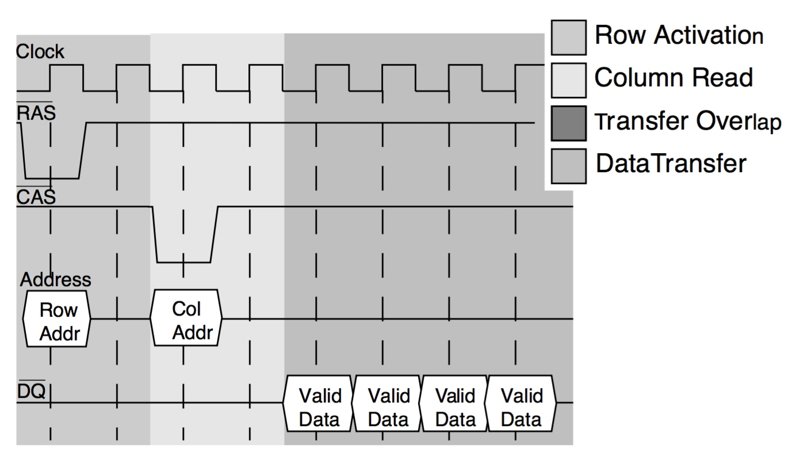

title:'Storage - RAM'
## Storage - RAM

易失性存储 (Volatile Storage) 主要是指 RAM (Random Access Memory)，主要包括 SRAM (Static RAM) 与 DRAM (Dynamic RAM) 两类

### SRAM

SRAM (Static RAM) 常用于 cache

> SRAM cell

SRAM 由 SRAM cell 阵列构成，每个 SRAM cell 由 6 个场效应管的电路构成

场效应管 M1~M4 构成一对交叉耦合的反相器，其中

- M1 与 M2 构成反相器 C1，其输出为 $\overline{Q}$
- M3 与 M4 构成反相器 C2，其输出为 Q

该交叉耦合的反相器输出为双稳态的，即当电路供电时 Q 的电平始终保持 0 或 1，而无需 refresh 操作，因而每个 SRAM cell 可以保存 1 bit 的数据；M5 与 M6 用于控制数据访问

WL (Word Line) 用于数据访问控制，当需要读取或改变反相器状态时，WL 为高电平，否则 WL 为低电平

BL 与 $\overline{BL}$ (Bit Line) 用于保存反相器状态，当读取反相器状态时 BL 的电平表示反相器的当前状态，当改变反相器状态时 BL 的电平表示需要写入的电平状态；之后 BL 与 $\overline{BL}$ 之间的 sense amplifier 通过感知 BL 与 $\overline{BL}$ 之间的电压差获取该 SRAM cell 存储的 1 bit 数据

SRAM cell 的状态有

- Standby 当 WL 为低电平时，M5 与 M6 处于截止状态，反相器的电平状态与 BL 相隔绝，因而反相器维持在双稳态状态
- Read 当需要对该 SRAM cell 进行读操作时，WL 的电平被拉高，M5 与 M6 导通，同时为了加快访问速度 BL 与 $\overline{BL}$ 被充电至中间态，即其电平处于 0 与 1 之间，当 SRAM cell 保存 1'b1 数据时，Q 电平高于 BL 电平，因而 BL 通过 M4、M6 充电，BL 电平升高；同时 $\overline{BL}$ 电平高于 $\overline{Q}$ 电平，$\overline{BL}$ 通过 M5、M1 放电，$\overline{BL}$ 的电平降低，此时 BL 与 $\overline{BL}$ 间的电压差为正，则 SRAM cell 存储 1'b1 数据
- Write 当需要对该 SRAM cell 进行写操作时，BL 与 $\overline{BL}$ 的电平表示需要写入的电平状态，之后 WL 的电平被拉高，M5 与 M6 导通；若需要向该 SRAM cell 写入 1'b1 同时反相器原先存储的数据为 1'b0，则 BL 为高电平，Q 为低电平，$\overline{Q}$ 为高电平，当 WL 拉高时 M6 导通，Q 变为高电平，此时 M1 导通，$\overline{Q}$ 通过 M1 放电，$\overline{Q}$ 变为低电平，导致 M3 截止，从而使 Q 锁定为高电平

SRAM 的特点有

- SRAM cell 需要 6 个场效应管实现
- 只要 Vdd 一直供电，那么反相器 C1、C2 的状态就一直保持稳定，即不需要执行 refresh 操作
- SRAM cell 的读操作的速度很快，只要 word line 被拉高，那么 bit line 的电平状态立即就能反映反相器 C1、C2 的状态，SRAM 的读操作的速度远快于 DRAM，因而常用作 cache

### DRAM

DRAM (Dynamic RAM) 常用于 memory

> DRAM cell

DRAM 由 DRAM cell 构成，每个 DRAM cell 由以下 4 部分构成

- Storage Capacitor 即电容，用于存储 1 bit 数据
- Access Transistor 即场效应管，用于数据访问控制，导通时允许对电容进行读写，否则截止时不允许对电容进行读写
- WL (Word Line) 控制场效应管的导通或截止，WL 高电平时场效应管导通，否则 WL 低电平时场效应管截止
- BL (Bit Line) 用于读取或修改 Storage Capacitor 的值

DRAM cell 的状态有

- Read 当需要读取 DRAM cell 数据时，BL (Bit Line) 充电至中间电平状态，之后 WL (Word Line) 被拉高至高电平，此时 M1 导通，若 DRAM cell 保存 1'b1 数据，则 Cs 为高电平，电容通过 M1 放电，BL 电平升高；同理若 DRAM cell 保存 1'b0 数据，则 Cs 为低电平，电容通过 M1 充电，BL 电平降低；BL 连接的 sense amplifier 通过感知 BL 的电平变化获取 DRAM cell 存储的数据；同时由于读取 DRAM cell 状态时电容需要充放电，因而需要 refresh 操作，即将读取的数据写回
- Write 当需要向 DRAM cell 写入数据时，BL 设置为需要写入的电平状态，之后 WL 被拉高至高电平，M1 导通，电容进行充放电，从而保存写入的 1 bit 数据

此外由于一个 DRAM 阵列中可能包含众多数量的 DRAM cell，因而每个 DRAM cell 的电容的电容值实际很小，因而在读取数据时 BL 的电压变化很小，因而使用 Differential Sense Amplifier，其包含 Sensing Circuit 和 Voltage Equalization Circuit 两个主要部分。它主要的功能就是将 Storage Capacitor 存储的信息转换为逻辑 1 或者 0 所对应的电压，并且呈现到 Bitline 上。同时，在完成一次读取操作后，通过 Bitline 将 Storage Capacitor 中的电荷恢复到读取之前的状态。

DRAM 的特点

- DRAM cell 由一个电容与一个场效应管实现
- DRAM cell 中一个 bit 的信息存储在电容中，由于电容泄漏电流的存在，电容的电压并不能保持稳定，需要对电容周期执行 refresh 操作
- 当对 DRAM cell 进行读操作时，由于读操作中电容有可能进行放电操作，因而每次读操作完成后都需要将读到的内容重新写回到 DRAM cell 中，以保持电容的电压
- 当对 DRAM cell 进行读操作时，电容需要进行充放电操作，电容的充放电不是立即完成而是需要一定的时间，同时 Differential Sense Amplifier 需要对电容的电压变化进行一定的处理从而将电容的电压变化转化为 logic 0/1，该转化操作同样需要一定的时间，因而 DRAM 的读操作的速度比 SRAM 要慢

> DRAM Organizatoin

DRAM cell 阵列通常组织为 supercell 阵列，即组织为一个二维的 supercell 矩阵，每个 supercell 中包含一定数目的 DRAM cell，supercell 矩阵与 memory controller 之间通过地址总线与数据总线连接

如果每个 supercell 包含 8 个 DRAM cell，即每个 supercell 保存 1 byte 的数据，那么就需要 8 bit 的数据总线

同时对于一个 4x4 的 supercell 阵列，即阵列中一共包含 16 个 supercell，此时就需要 2 bit 的地址总线，在访问 DRAM 时，会通过地址总线分时传输需要访问的 supercell 的行地址与列地址，之后数据总线传输访问的 supercell 存储的数据或需要写入的数据

#### SDRAM

传统的非同步的 DRAM，memory controller 与 DRAM 阵列之间需要一些控制总线以实现数据访问的控制，而 SDRAM (Synchronous DRAM) 与 memory controller 使用同一个外部时钟，通过使用该时钟的上升沿来代替之前的这些控制总线，从而获得更快的数据访问速度

SDRAM 读操作过程中

1. 首先 DRAM controller 拉低 RAS (Row Address Signal) 控制信号，并在 address bus 上传输需要访问的 SDRAM cell 的 row address，SDRAM chip 在 CLK 上升沿采样 row address
2. 之后 DRAM controller 拉低 CAS (Column Address Signal) 控制信号，并在 address bus 上传输需要访问的 SDRAM cell 的 column address，SDRAM chip 在 CLK 上升沿采样 column address
3. 最后 SDRAM chip 在 data bus 输出对应的 cell 的数据，一个 CLK 周期传输一个 data word

这种在一个 CLK 周期传输一个 data word 的 SDRAM 又称为 SDR (Single Data Rate DRAM)

如今广泛使用的 DDR (Double Data Rate DRAM) 则是在 CLK 的上升沿与下降沿分别发送一个 data word，即在一个 CLK 周期传输两个 data word

而之后演进的 DDR 标准则是不断提高 CLK 频率，其“一个 CLK 周期传输两个 data word”的本质并没有改变

DDR2 在 DDR 的基础上将 CLK 频率加倍

DDR3 在 DDR2 的基础上将 CLK 频率加倍

