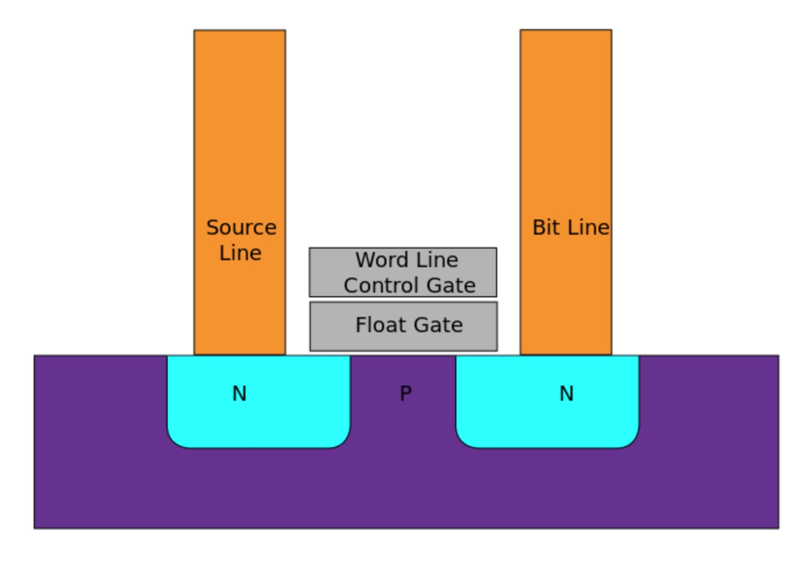
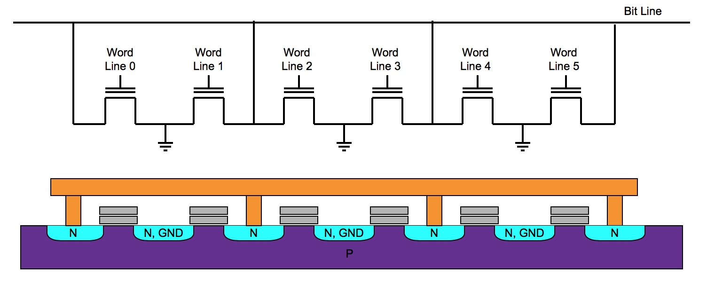
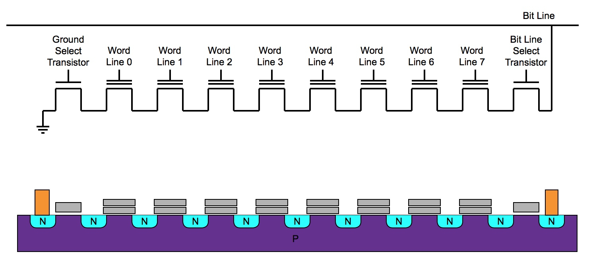
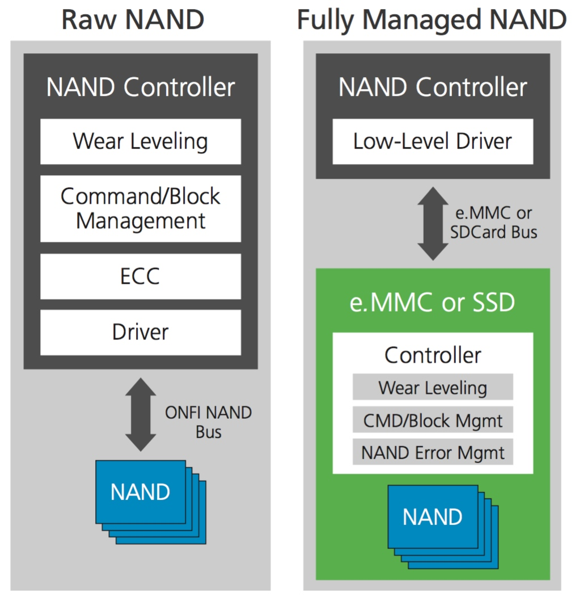

## Storage - Flash

非易失性存储 (Non-Volatile Storage) 是指失去电压时依然能保存数据的存储，其通常包含 ROM 与 flash 两类存储

- ROM (Read-Only Memory) 为只读存储
- PROM (Programmable ROM) 为可编程 ROM，即对其只能进行一次写操作
- EPROM (Erasable PROM) 为可擦除的 PROM，在紫外光照射下可对其进行写操作
- EEPROM (Electrically EPROM) 为电可擦除的 PROM，在电压条件下即可对其进行写操作

FLASH 其实是一种改进的 EEPROM，具有更快的读写速度与更大的容量

flash 的存储单元为 floating-gate transistor，一个 floating-gate transistor 可以存储 1 bit 或多个 bit 的信息

floating-gate transistor 与 MOSFET 相类似，不同的是 floating-gate transistor 拥有两个 gate，top gate 与 botttom gate，top gate 称为 control gate (CG)，bottom gate 称为 floating gate (FG)

Flash 分为 NOR flash 与 NAND flash 两种

### NOR flash

NOR flash 的 memory cell 的一极与地相连，另一极直接与 bit line 相连，而 CG 与 word line 相连，此时 memory cell 阵列表现为异或 (NOR) 特性，即任一个 memory cell 相连的 word line 拉高时，bit line 即被拉低，因而称为 NOR flash

正因为 NOR flash 中的 memory cell 相互并联，因而可以实现 memory cell 的 random access

### NAND flash

NAND flash 的 memory cell 之间串联构成 memory cell 阵列，串联阵列中的第一个 memory cell 的一极与地相连，最后一个 memory cell 与 bit line 相连，而每个 memory cell 的 CG 与 word line 相连，此时 memory cell 阵列表现出异与 (NAND) 特性，即只有当所有 word line 拉高时，bit line 才被拉低，因而称为 NAND flash

正因为 NAND flash 中的 memory cell 相互串联，因而不支持 memory cell 的 random access

NADN flash 通常分为 raw NAND flash 与 fully managed NAND flash 两类，其中 fully managed NAND flash 又包括 SD、MMC、SSD 等

NADN flash 必须在外部提供一个 NAND flash controller，NAND flash 与 NAND flash controller 通过某种 bus 相连接，例如 SD/MMC 通常使用 SPI bus，而 SSD 通常使用 SATA bus

NAND flash controller 需要实现以下工作

- (Bad) Block Management

NAND flash 的 block 的擦写（erase-and-write）次数是有限的，当达到该上限时该 block 则不能使用，此时称为 bad block，NAND controller 需要对这些 bad block 进行标记并管理

- Wear-Leveling

由于 NAND flash 的 block 的擦写次数是有限的，因而 NAND controller 需要将对同一个 physical address block 的擦写分摊到多个不同的 physical block，从而提高 NAND flash 的寿命，这部分管理称为 Wear-Leveling

- ECC

由于 NAND flash cell 的物理特性，存储过程中其中的某个 bit 可能发生翻转，因而需要由 NAND controller 实现数据的错误检测与恢复功能，这一特性即为 ECC (Error Code Correction)

> raw NAND flash

raw NAND flash 需要 external NAND controller 的支持，软件需要通过 NAND controller 对包括 (Bad) Block Management、Wear-Leveling、ECC 等在内的工作进行管理

> SD/MMC

SD (Secure Digital) Card 与 MMC (Multi Media card) 都是 MMC standard 的一种形式，都是一种改进的 NAND FLASH，其将 NAND flash controller 与 NAND flash 集成在一个封装当中，此时封装的 NAND flash 硬件会自动完成 (Bad) Block Management、Wear-Leveling、ECC 等工作，因而简化软件的设计

SD 与 MMC 通常通过 SPI 与处理器连接

> SSD

SSD (Solid State Drive) 将 NAND flash controller 与 NAND flash 存储阵列直接集成在一个封装当中，SSD 可以通过 SATA/NVMe 等接口与处理器连接
