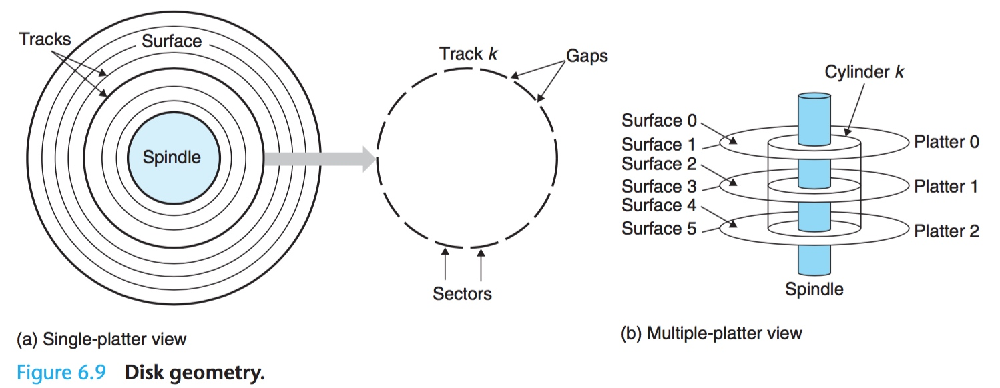
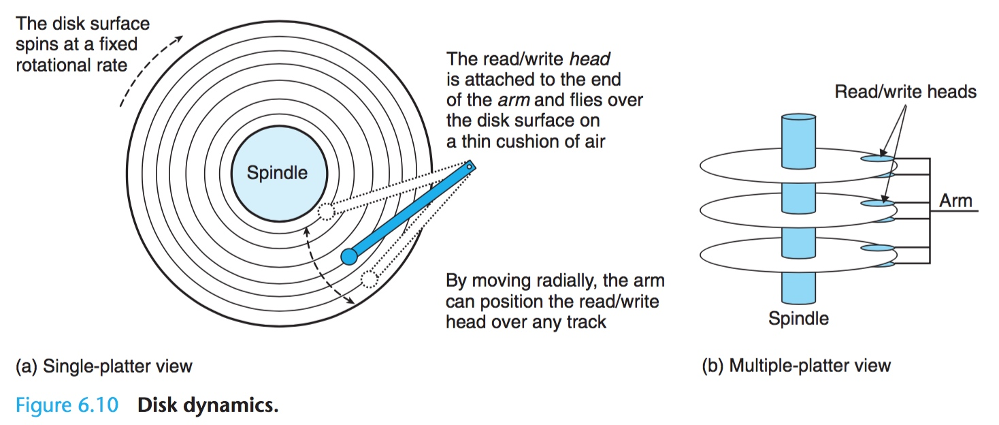
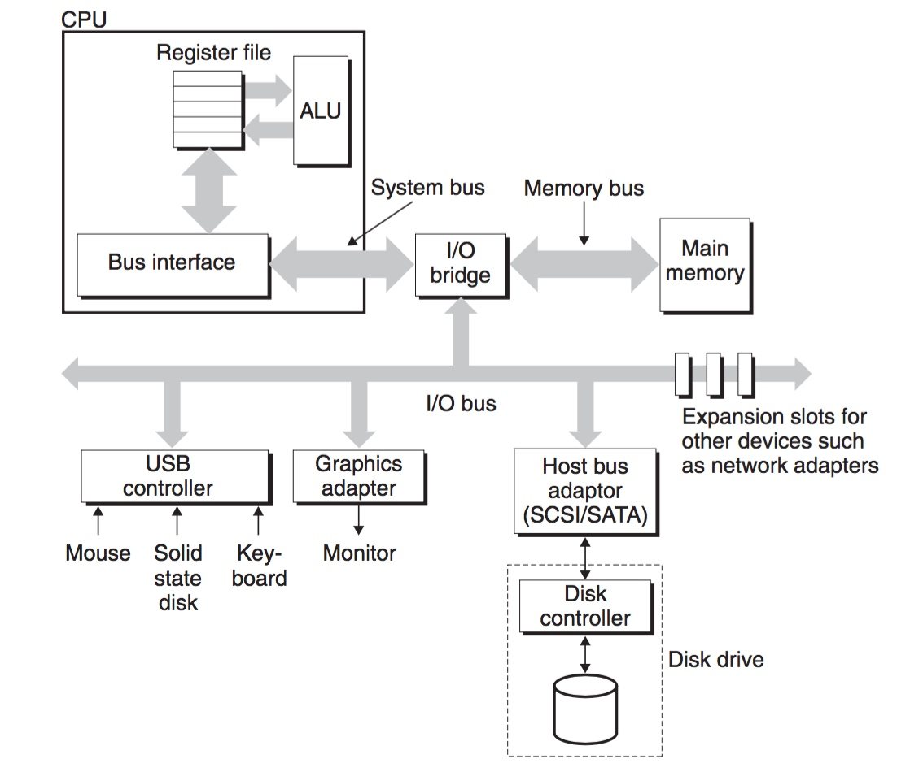
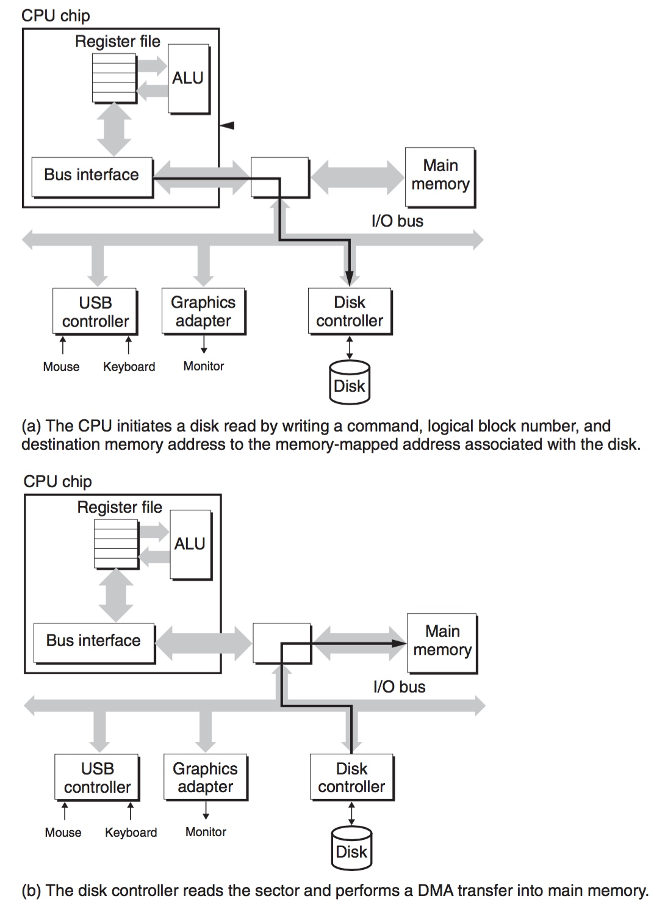
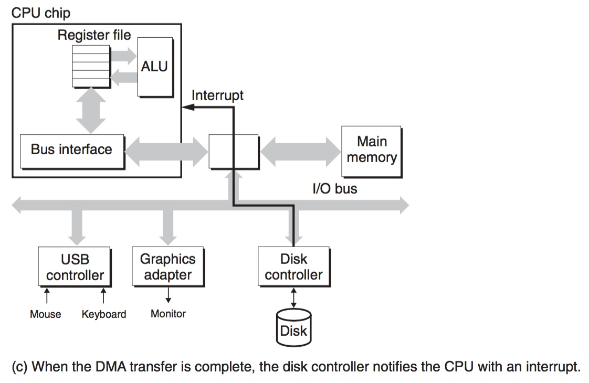

title:'Storage - Disk'
## Storage - Disk

> storage cell

硬盘 Disk 使用磁介质存储数据，硬盘由一个或多个磁盘 platter 构成，每个 platter 有上下两个面 surface，surface 中的一个同心圆构成一个磁道 track，每个 track 分为多个段 sector，每个 sector 通常存储 512 byte 的数据，sector 之间的 gap 用于存储描述 sector 的格式信息，当 disk 中包含多个 platter 时，多个 platter 的相同 track 组成一个 cylinder，即多个 platter 中距圆心相同距离的 track 构成一个圆柱面 cylinder

磁盘工作时，中间的转轴 spindle 带动 platter 以一定的速度旋转，例如 5400~15000RPM (Revolutions Per Minute)，一组电机驱动的读写头（read/write head）可以沿半径运动，每个 surface 都拥有一个读写头，同时读写头与 surface 之间相隔约 0.1 微米，可以对 surface 中的每个 track 进行读写操作

> control routine

CPU 通过 system bus 与 IO bridge 连接，IO bridge 通过 memory bus 与内存进行连接，同时 IO bridge 通过 IO bus（通常为 PCI bus）与 IO 设备如硬盘、USB 控制器、I2C 控制器等进行连接

1. 当 CPU 执行读操作时，CPU 向 disk controller 发送读指令、需要读的 sector 的编号、之后读取的数据保存到内存中的地址，以及操作完成后是否向 CPU 发送中断等，处理完后 CPU 执行其他指令等待数据数据传输完成
2. disk controller 接收到 CPU 的指令后，将 sector 的编号翻译为实际的物理地址，并采用 DMA 的方式将该地址的 sector 的数据传输到指定的内存地址处，数据传输完成后向 CPU 发送中断信号

3. CPU 接收到中断信号，执行中断处理程序，对读取的数据进行处理，中断处理完成后 CPU 返回继续执行原指令

