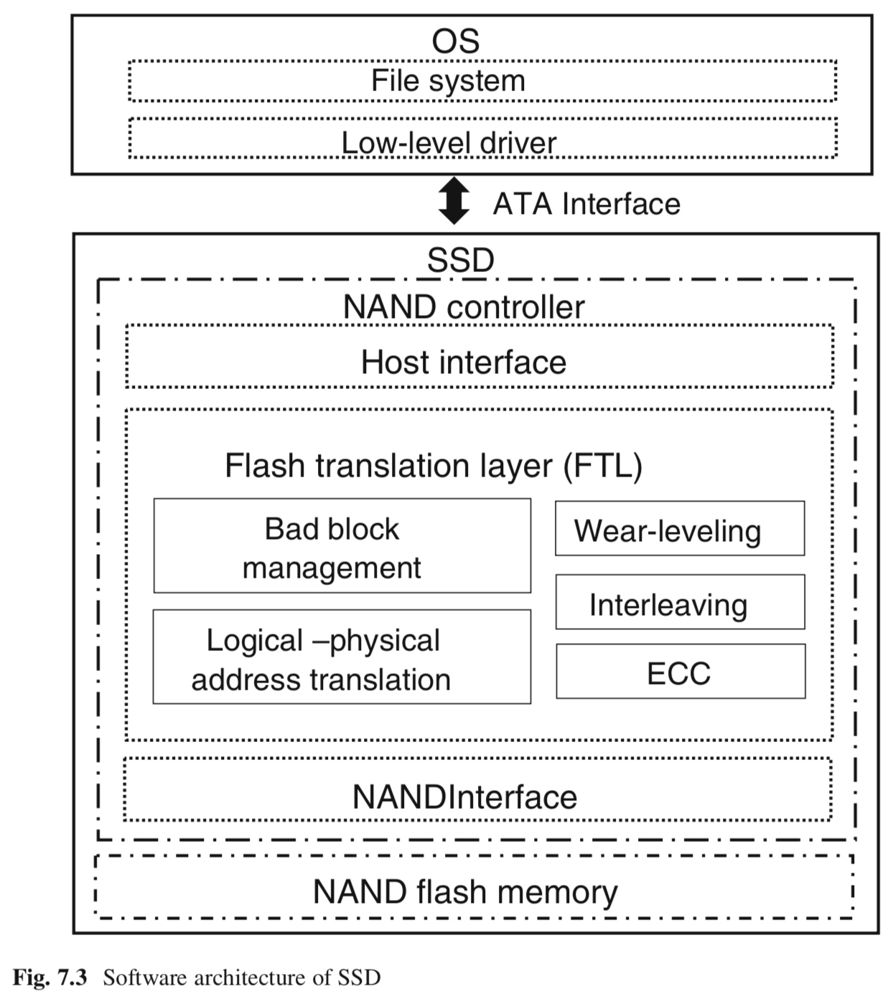

title:'Storage - NAND Flash'
## Storage - NAND Flash

### Hierarchy

#### cell

NAND flash 的存储单元为 floating-gate transistor

- 一个 floating-gate transistor 包含两个 gate（control gate 与 floating gate），floating gate 可以储存电子，从而存储 bit 信息

- 对 memory cell 执行 erase 操作时，需要对 floating gate 执行放电操作，此时该 memory cell 相当于存储 bit 1
- 对 memory cell 执行 program 操作时，需要对 floating gate 执行充电操作，此时该 memory cell 相当于存储 bit 0

memory cell 可以执行以下 erase/program(write)/read 操作

1. erase 
此时需要对底部的 silicon substrate 施加电压，此时电子会从 floating gate 向 silicon substrate 移动，即对 floating gate 进行放电操作

2. program
此时需要对 floating gate 施加电压，此时电子会从 silicon substrate 向 floating gate 移动，即对 floating gate 进行充电操作

3. read
此时需要对 control gate 施加电压，此时

- 若 source 与 drain 之间存在电流，说明此时 floating gate 中没有电子，即此时 floating gate 存储 bit 1
- 否则说明此时 floating gate 中存储有电子，即此时 floating gate 存储 bit 0

memory cell 的 两个 gate 之间，以及 floating gate 与底部的 silicon substrate 之间都有氧化物绝缘层填充，以上 memory cell 的 erase/program 过程中电子会在 floating gate 与底部的 silicon substrate 之间的氧化物绝缘层中移动，当 erase/program 次数达到一定限度时，floating gate 与底部的 silicon substrate 之间的氧化物绝缘层就会被击穿，之后该 memory cell 就无法再使用

> memory cell type

1.  SLC (Single Level Cell) 

一开始 floating gate 只能表示两种状态，即 floating gate 中存在电子，或 floating gate 中不存在电子，因而此时一个 memory cell 只能表示一个 bit，因而此时 memory cell 称为 SLC (Single Level Cell) 

2.  MLC (Multiple Level Cell) 

之后为了增加 NAND flash 的容量，发明了 MLC (Multiple Level Cell)，此时 MLC 中 floating gate 可以描述四种状态

- floating gate 中不存在电子
- 同时将原先 floating gate 中存在电子的状态划分为三种状态，分别为存在 1/3、2/3、3/3 容量的电子

此时 floating gate 可以描述 2 bit 的信息，因而称为 MLC (Multiple Level Cell)

同时当对 MLC memory cell 执行 program 操作时，需要对 floating gate 施加不同的 threshold voltage，以使得 floating gate 存储不同容量的电子，此时各个状态的 threshold voltage 的范围更加窄即控制器需要对施加的电压进行更精确的控制，因而 MLC 的 program 操作的执行速度更慢

3. TLC (Triple Level Cell) 

TLC 与 MLC 相类似，只是 TLC memory cell 中可以存储 3 bit 信息

#### string

NAND flash 由多个 NAND string 组成一个阵列，一个 NAND string 通常由 32 或 64 个 memory cell 相互串联而成，其中

- 在水平方向的多个 NAND string 可以共用 wordline
- 在垂直方向的多个 NAND string 可以共用 bitline

- 同时在 NAND string 的两端各有一个用于控制的 transistor，其中
    - SSL (Source Select Line) 用于控制 NAND string 与 Source Line 的连接
    - DSL (Drain Select Line) 用于控制 NAND string 与 Bitline 的连接

#### page

以上介绍的 string 是组成阵列的物理单元，实际上从数据存储的角度，其存储单元分别是 page/block

之前介绍过，在水平方向的多个 NAND string 中的多个 cell 共用一个 wordline，此时共用同一个 wordline 的多个 cell 就构成一个 page，但是共用同一个 wordline 的所有 memory cell 可以组成多个 page

- 对于 SLC，共用同一个 wordline 的所有 memory cell 构成一个 page
- 对于 MLC，一个 memory cell 可以存储 2 bit 信息，因而共用同一个 wordline 的所有 memory cell 构成两个 page，其中所有 memory cell 的 odd bit 构成一个 page，而其 even bit 构成另一个 page

page 是执行 read/program 操作的最小单位

#### block

之前介绍过，一个 NAND string 可以由 64 个 memory cell 串联而成，此时**一组** wordlines 就包含 64 个 wordline，其中的每个 wordline 就与 string 中一个水平方向上的多个 cell 连接，这些 cell 就组成了一个 page

一组 wordlines 与一个水平方向上的多个 string 连接，这样每个水平方向上都需要一组 wordlines，因而一个阵列中会包含多组 wordlines

共用同一组 wordlines 的所有 memory cell 实际上共用同一块 silicon substrate，而 memory cell 的 erase 操作又需要对 silicon substrate 施加电压，因而共用一组 wordlines 的所有 NAND string 实际上会同时执行擦除操作

将共用同一组 wordlines 的所有 NAND string 组成一个 block，因而 block 是执行 erase 操作的最小单位

#### plane

多个 block 组合在一起构成 plane，通常一个 plane 包含上千个 block

#### die / LUN

多个 plane 组合在一起构成 die，通常一个 die 包含 2 个 plane

可以在垂直方向堆叠多个 die，以增加 NAND flash 的容量

die 也被称为 LUN，因为 die 是控制器的地址总线可以寻址的最小单元，同时 die 也是接收和执行 flash 命令的最小单元

#### chip

一个 chip 通常包含 2 个 die

#### package

一个 package 包含一个或多个 chip

#### channel

multi-channel SSD 中通常包含 4-8 个 channel，每个 channel 连接多个 chip

多个 channel 之间可以并行运行，但是同一个 channel 的多个 chip 之间只能串行运行

#### bank

而在垂直方向，各个 channel 中处于同一位置的多个 chip 共同构成一个 bank

### NAND Controller

### Optimization 

#### die interleave

同一个 channel 上的多个 die 可以按照类似流水线的方式执行该 channel 上传递的命令

#### multi-plane

每个 plane 具有各自独立的 cache register

- host 向 NAND flash 写数据时，首先将数据写入 page 对应的 plane 的 cache register 中，之后控制器会将 cache register 中的数据写入对应的 plane
- host 从 NAND flash 读数据时，首先由控制器将对应 page 的数据读取到对应 plane 的 cache register 中，之后将该 cache register 中的数据发送给 host

NAND flash 的读写过程中 page 与对应的 cache register 之间的数据传输相对耗时，为 ms 级别，而 NAND flash 与 host 之间的数据传输则为 us 级别

而 multi-plane 的原理则是，例如当对两个 page 执行写操作时

- 首先将 page 1 的数据存入 plane 1，因而该 page 1 的数据写入 plane 1 的 cache register 中
- 之后将 page 2 的数据存入 plane 2，因而该 page 2 的数据写入 plane 2 的 cache register 中
- 最后将 plane 1 与 plane 2 的 cache register 中的数据并行写入对应的 page

multi-plane 操作可以减小 page 与对应的 cache register 之间的数据传输的耗时，从而提高读写性能
