## Cache - Base

### Concept

#### Locality

局部性原理包括时间局部性（Temporal Locality）以及空间局部性（Spatial Locality），时间局部性是指当前使用的指令与数据可能在之后的数个时钟周期后再次被使用，空间局部性是指之后的数个时钟周期后使用的指令与数据在存储介质中的地址很可能在当前使用的指令与数据的地址旁边

#### Memory Hierarchy

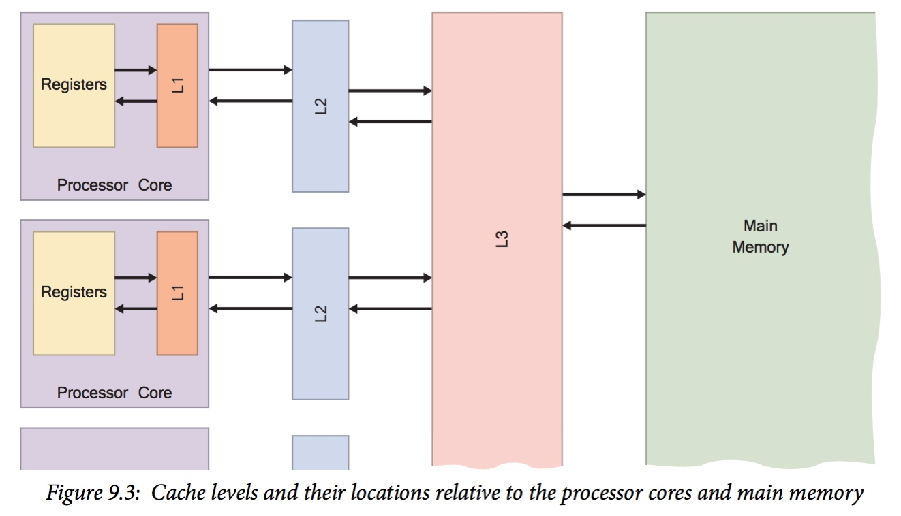

计算机系统采用分层的存储结构，位于顶层的 CPU 寄存器访问速度最快，其数据访问只需 1 个时钟周期，之后的 L1 cache、L2 cache 使用 SRAM，访问操作需要数个时钟周期，main memory 使用 SDRAM，访问操作需要数十至数百个时钟周期，而底层的 disk 的访问操作需要 millions 时钟周期，同时对于分布式系统，其存储结构还包含分布式文件系统或网络文件系统

存储结构由上至下存储的访问速度变慢、价格递减、容量递增，同时由于局部性原理上层的存储为下一层的存储实现缓存

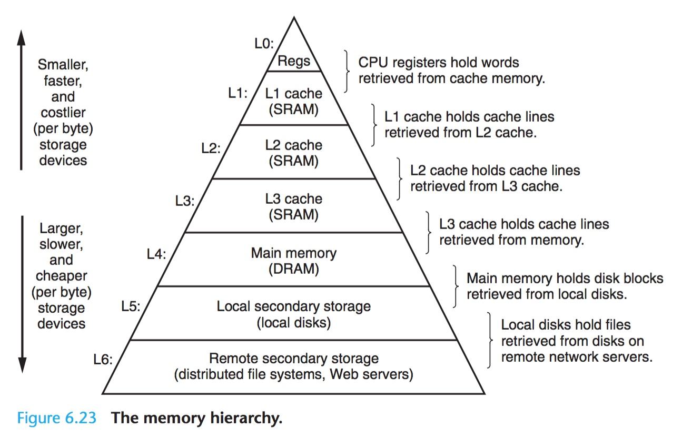

相邻层之间的存储使用相同大小的存储单元（block），即上层存储使用与下层存储相同大小的存储单元对其进行缓存，不同层之间的缓存存储单元的大小可能不同，例如 register 与 L1 cache 之间缓存的存储单元的大小为 1 个字，L1 cache 与 L2 cache 之间缓存的存储单元的大小为 8~16 个字

根据局部性原理，上层存储将下层存储中最近使用的 block 中的数据拷贝到上层存储的 block 中，以实现缓存

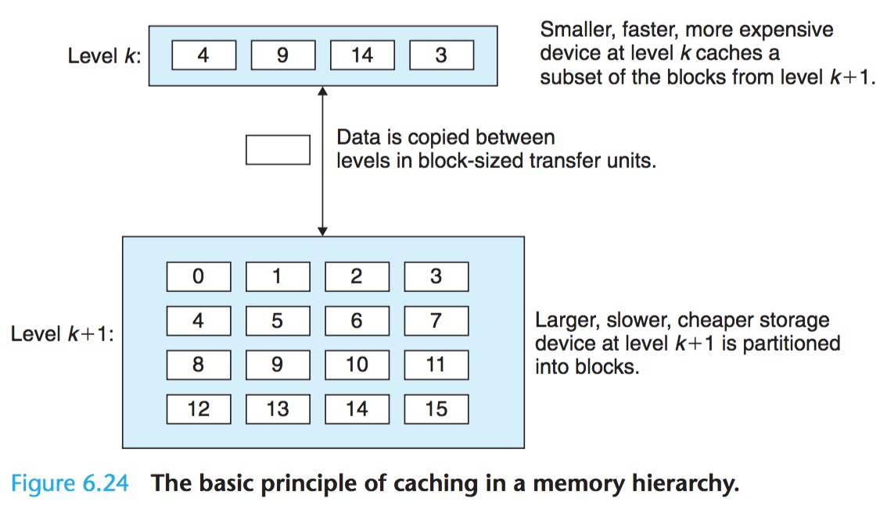

### Cache Memory

#### Cache Organization

前文描述上层存储是以 block 为单位对下层存储进行缓存的，也就是说缓存存储数据的单位是 block，假设 block 的大小为 $B=2^b$ 字节，那么对于一个 m 位的地址，其低 b bits 就描述了该地址在对应的 block 中的 offset

在此之前缓存会使用 hash 的方式将一个 m 位的地址快速映射到对应的 block

一个缓存由 $S=2^s$ 个 set 构成，这里的一个 set 就相当于是一个 hash node，因而根据 m 位地址的中间 s bits 就可以找到该地址对应的 set

而其中的每个 set 具有 E 个缓存行（cache line），这里相当于每个 hash node 引申出一个包含 E 个节点的链表

每个 cache line 实际就包含一个 data block，除此之外还包含一个 valid bit 以表示该 cache line 是否有效，同时使用 $t=m-(b+s)$ bit 的 tag 来标识同一个 cache set 中的 cache line

因而缓存的组织结构可以由 (S, E, B, m) 表示

- 即对于 m 位地址的下层存储
- 缓存由 $S=2^s$ 个 set 构成，m 位地址的中间 s bits 就用于找到该地址对应的 set
- 每个 set 具有 E 个缓存行（cache line），每个缓存行包含 t bits 的 tag，m 位地址的高 t bits 就用于寻找该地址对应的 cache line
- 每个 cache line 中包含一个 block，block 的大小为 $B=2^b$ 字节，m 位地址的低 b bits 就描述了该地址在对应的 block 中的 offset

最终该缓存的有效数据大小为 C=S\*E\*B

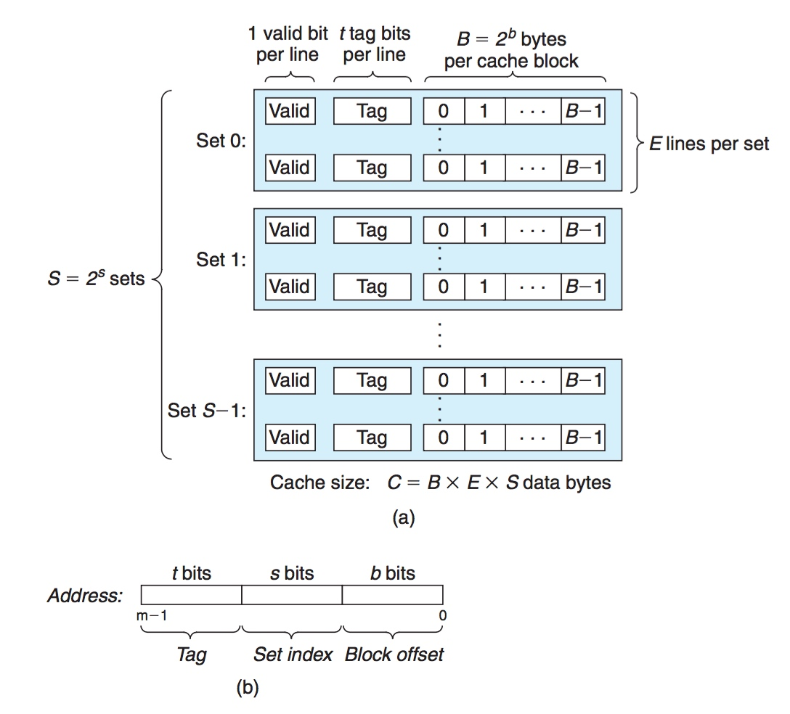

当 CPU 需要访问下层存储中的某一地址时，首先根据该地址中间的 s 位寻找到缓存中的 cache set，之后对该 cache set 中的 cache line 进行匹配，只有该 cache line 的 valid bit 有效，同时地址的高 t 位 tag bit 与 cache line 的 tag bit 相同，此时 cache line 匹配成功（cache hit），通常会对一个 cache set 中的所有 cache line 的 tag bits 并时检查，以加快速度；之后地址的低 b 位用于定位需要读取的 1 字节的数据在该 cache line 的 data block 中的位置

如之前所述，hardware cache 通常实现为 hardware hash，例如以下 cache 实际包含 16 个 set，每个 set 包含 2 个 cache line(way)，每个 cache line 包含 256 字节

因而在实现 virtual address 到对应的 cache line 的匹配过程中，virtual address 的 low 8 bits 用于实现当前访问的一个 byte 在对应的 cache line 中的偏移，往上的 4 bits 用于寻找对应的 cache line 所在的 set，例如

- 在第一次访问 0x12345E00 地址时，其 middle 4 bits 为 0xE，因而 hash 到第 15 个 set，此时该 set 全空，cache miss，因而将 0x12345E00 地址起始的 256 字节数据缓存到该 set 的第一个 cache line
- 之后访问 0x43210E00 地址时，其 middle 4 bits 为 0xE，因而 hash 到第 15 个 set，此时该 set 的第一个 cache line 被占用，第二个 cache line 为空，比较发现 0x43210E00 地址的 high 20 bits 与第一个 cache line 的 tag bits 不同，cache miss，因而将 0x43210E00 地址起始的 256 字节数据缓存到该 set 的第二个 cache line
- 之后再次访问 0x43210E00 地址时，其 middle 4 bits 为 0xE，因而 hash 到第 15 个 set，此时该 set 为满，比较发现 0x43210E00 地址的 high 20 bits 与第二个 cache line 的 tag bits 相同，cache hit

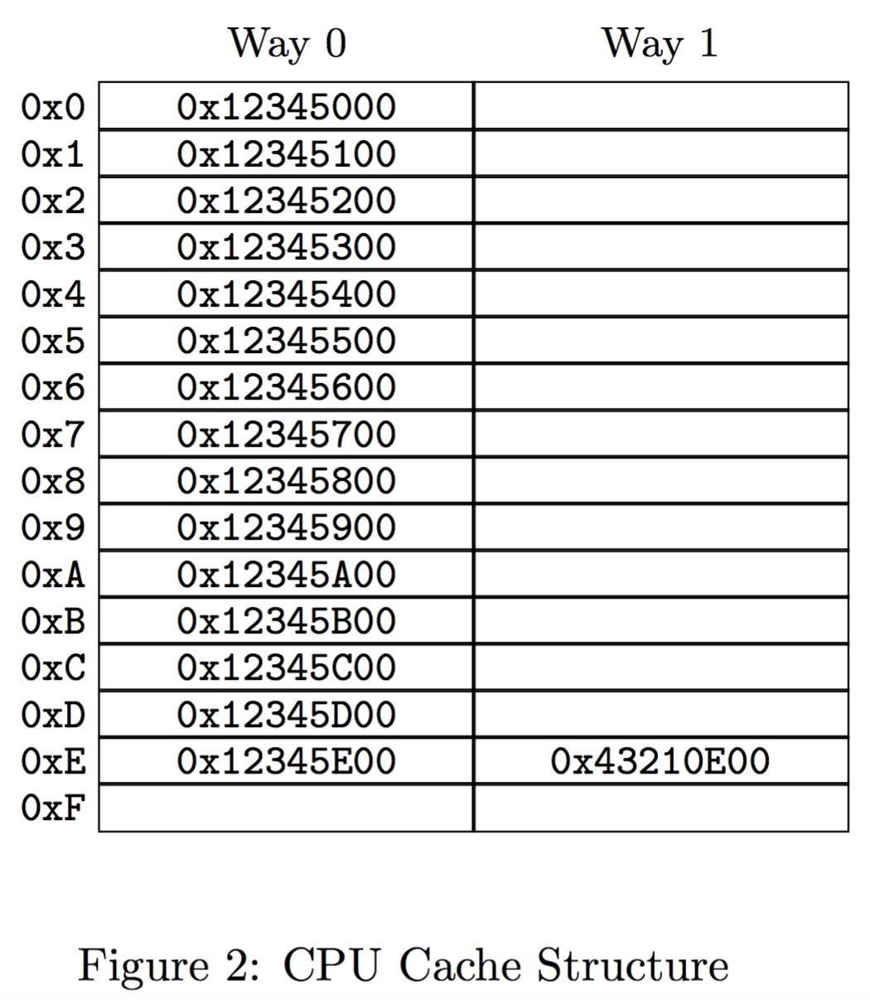

因而 cache 的组织结构实际与 hash table 相类似，上例 cache 类似于一个拥有 16 个 hash bucket，而每个 hash bucket 的 hash chain 最多只能包含 2 个元素的 hash table

当发生 cache miss 时，缓存需要将下层存储中的相应 block 拷贝到缓存中对应的 cache set 的其中一个 cache line，当对应的 cache set 已满即 conflict miss 时，需要将该 cache set 的其中一个 cache line 替换，以存储新的 data block

cache set 的实现是为了提高 cache line 匹配的速度，如果发生 cache miss 时将下层存储的相应 block 拷贝并随机存储到缓存中的某一个 cache line，那么在进行 cache line match 的时间复杂度将是 O(S\*E)，而将缓存分为 S 个 cache set，每个 cache set 包含 E 个 cache line，同时使 m 位地址空间中具有相似性质的 block 拷贝到相同的 cache set，此时 cache line match 的时间复杂度为 O(S+E)

#### Cache Structure

set-associativity 描述一个 cache set 中包含的 cache line 的数量，set-associativity  越小，即一个 cache set 中包含的 cache line 的数量越小，那么 cache lookup 实现就越简单，cache 的容量就越小，同时 cache 的耗电量也就越小，但是 cache 的竞争越激烈，从而影响性能

cache structure 通常分为

- direct-mapped cache
- set associative cache
- fully associative cache

当前使用的 cache 通常为 direct-mapped cache、two-way set associative cache 或 four-way set associative cache

##### Direct-Mapped Cache

Direct-Mapped Cache 是指每个 cache set 都只有一个 cache line 的缓存结构

Direct-Mapped Cache 的组织结构
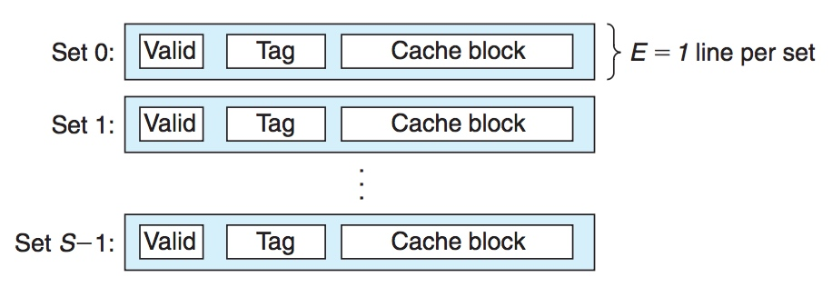

cache line 的匹配过程

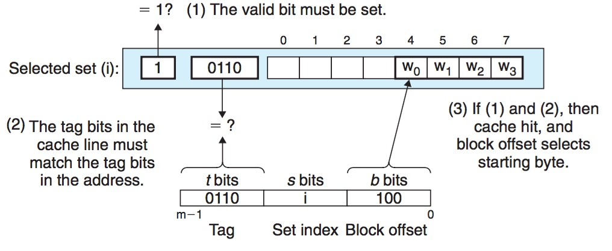

当发生 cache miss 时，缓存需要将下层存储中的 block 拷贝到缓存的对应 cache set 中的 cache line，当对应的 cache set 已满时，需要将该 cache set 的 cache line 替换，并存储新的 data block

##### Set Associative Cache

Set Associative Cache 是指每个 cache set 具有 E 个 cache line 的缓存结构，其中 1 < E < C/B

Set Associative Cache 的组织结构
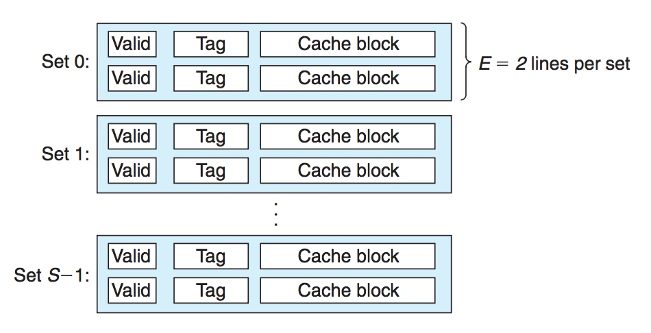

cache line 的匹配过程
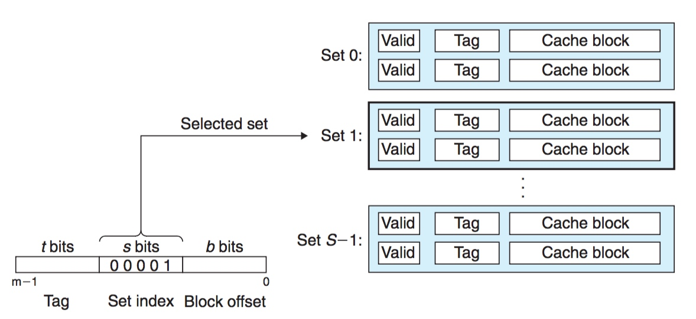
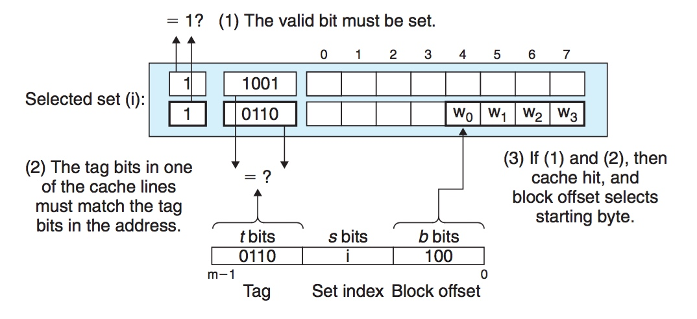

每个 cache set 具有 E 个 cache line 时，该 cache 就称为 E-way set associative

##### Fully Associative Cache

Fully Associative Cache 是指 E = C/B，即整个缓存只有一个 cache set 的缓存结构，由于其 cache line match 的时间复杂度为 O(S\*E)，因而只适用于较小的缓存，如 TLB 缓存

Fully Associative Cache 的组织结构
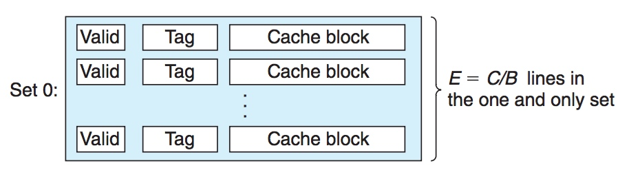

cache line 的匹配过程
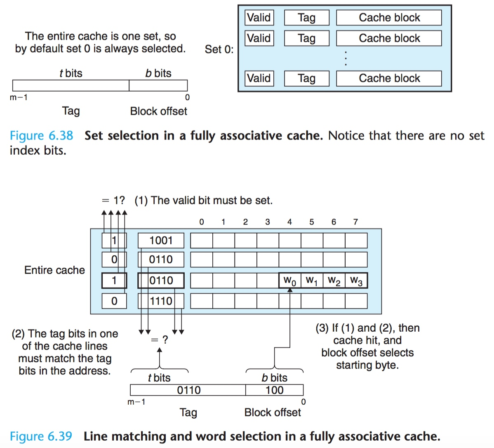

#### Cache Read

##### Cache Hit

当 CPU 需要访问存储在 k+1 层的数据时，CPU 首先访问第 k 层的缓存，若其中包含该数据的缓存，则 CPU 直接使用第 k 层缓存的数据而不再访问第 k+1 层，称为 Cache Hit

##### Cache Miss

当 CPU 需要访问存储在 k+1 层的数据时，CPU 首先访问第 k 层的缓存，若其中不包含该数据的缓存，则 CPU 需要将 k+1 层中包含该数据的 block 拷贝到第 k 层，之后使用第 k 层缓存的数据，称为 Cache Miss

当第 k 层的缓存满时，称为 conflict miss，此时新写入的 block 需要替换原来存储的 block，其策略由相应的替换算法实现，其中

- 随机替换算法（Random Replacement）随机选择其中的一个 block 并将其替换
- LRU (Least-Recently Used) 将上次使用时间距当前时刻最远的一个 block 进行替换
- LFU (Least Frequency Used) 将最近使用次数最少的 block 进行替换

当发生 Cache Miss 时，根据时间局部性原理将当前引用的指令或数据进行缓存，而根据空间局部性原理将当前应用的指令或数据周围的数据也一起进行缓存，即对引用的数据所在的 block 进行缓存

cache miss 可以分为以下几类

1. 系统刚启动时 cache 为空，此时发生的 cache miss 称为 cold miss/warmup miss
2. 当所需的 block 不在对应的 cache set 中同时该 cache set 满时，此时发生的 cache miss 称为 conflic miss
3. 当需要缓存的 blocks 的大小超过缓存大小时，此时发生的 cache miss 称为 capacity miss

##### replacement strategy

cache miss 发生后，需要将内存中的数据读取到一个 cache line 中，当 cache set 中包含多个 cache line 时，需要从其中挑选一个 cache line，相关的算法就称为 replacement strategy

1. Random replacement

即通过生成一个随机数，在 cache set 中随机挑选一个 cache line

2. Round-robin replacement

即轮流使用 cache set 中的 cache line

Round-robin replacement 的行为更加可预测，但是其对特定数据集的性能往往更差

#### Cache Write

Cache Read 相对较简单，而 Cache Write 则相对复杂一些，当 CPU 更改缓存中的数据时，则需要考虑 write hit 时何时将缓存中被更改的数据同步到下层存储，以及如何解决 write miss 的问题，即缓存中不存在更改数据的缓存

对于前者，write-through 策略是随即将被更改的数据同步至下层存储，但该方法容易使数据传输的负载加重；write-back 策略是只有当其对应的 cache line 被替换算法移出缓存时才将该 cache line 中的数据同步至下层存储，但该方法需要在 cache line 中额外增加一个 dirty bit 以标识该 cache line 中的数据是否发生更改

而对于后者，write-allocate 策略是首先将对应的 block 读取到 cache 中，之后再修改缓存中的数据，该方法与缓存的读操作一样利用局部性原理；no-write-allocate 策略是直接将被更改的数据同步至下层存储

通常 write-throuth 同时是 no-write-allocate 的，而 write-back 同时是 write-allocate 的

此外在 SMP 系统中，在 cache write 之前还必须执行 cache invalidation 操作，即当某个 CPU 对该 CPU 的 cache 中缓存的数据进行修改时，该 CPU 必须使其他 CPU 的 cache 中缓存的同一数据失效，即实现多个 CPU cache 的同步，Cache-Coherence Protocol 即用于 SMP 系统中的缓存同步

