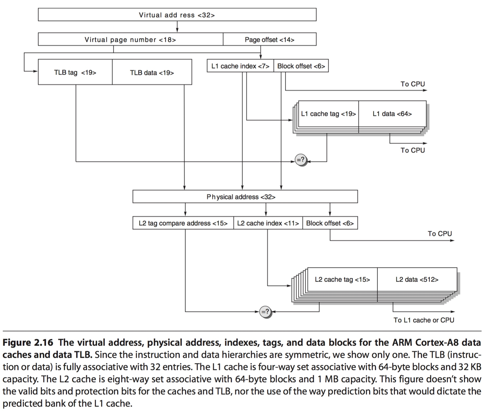

title:'Cache - Arch - ARM'
## Cache - Arch - ARM

#### cache match

cache可以实现为 virtually indexed and virtually tagged，即使用virtual address的mid s bits在缓存中寻找对应的cache set，同时使用virtual address的tag bits与cache line的tag bits进行比较

但是当不同virtual address space的同一个virtual address映射到不同的physical address时，或不同virtual address映射到同一个physical address时，virtually indexed and virtually tagged 即存在问题

因而 ARM A8 中 L1 cache 使用virtually indexed and physically tagged，即使用virtual address的mid s bits在缓存中寻找对应的cache set，之后使用TLB将virtual address转换为physical address，之后使用TLB tag与cache line的tag bits进行比较

同时L2 cache使用physically indexed and physically tagged，即使用physicall address在缓存中寻找对应的cache set，同时使用physicall address与cache line的tag bits进行比较
