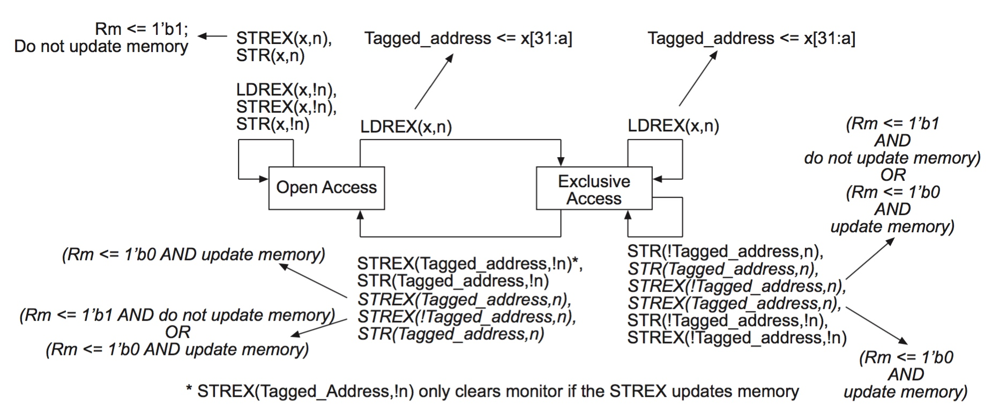

title:'Lock - 01 spinlock'
## Lock - 01 spinlock

spinlock 是多种锁机制的基础，spinlock 用于实现“互斥”语义

- 进程在进入临界区之前必须获取锁
- 当前锁不可用时进程将进入忙等待状态，直到其他进程或中断上下文释放该资源
- 进程获取锁之后，进入临界区
- 离开临界区时，进程释放自旋锁

由于锁不可用时，进程会进入忙等待状态，不会引起睡眠，因而自旋锁可以安全地用于中断上下文这类不能睡眠的语境


spinlock 是一个 single-holder lock，即同一时刻只能有一个用户获取到锁，因而自旋锁一般直接实现为一个整数，0 表示锁可用，1 表示锁不可用

进程在获取锁的时候需要查询自旋锁的当前状态，即该整数的值，当整数值为 0 时表示锁可用，进程修改该整数的值为 1 以获取自旋锁，之后进入临界区；否则当整数值为 1 时进程持续忙等待并查询自旋锁的状态。当进程离开临界区时，进程修改该整数的值为 0，以释放自旋锁


spinlock 是一个典型的 counter based 的锁机制，其使用以下机制来消除系统的并行度

1. parallesim from SMP

使用 atomic RMW (Read-Modify-Write) 操作来确保对 count 计数的操作是原子的，从而消除 SMP 系统中多个 CPU 之间的并行性

例如 x86 架构下使用 LOCK 指令来实现 atomic RMW，ARM 架构下使用 LDREX/STREX 指令来实现 atomic RMW

此外还会使用 acquire/release barrier 对 atomic RMW 操作进行保护


2. parallesim from preemption

在获取锁的过程中需要关闭抢占，以消除单处理器上因为进程抢占带来的并行度


3. parallesim from IRQ

如果进程上下文需要与中断上下文竞争锁，那么进程上下文在获取锁的过程中还需要关闭本地 CPU 全局中断，以消除进程与中断处理程序之间的并行性


### Spinlock Implementation

#### UP

在 UP 环境下不存在多个 CPU 之间的并行性，因而实际上只需要关闭抢占即可实现“互斥”语义（暂时先不考虑中断带来的并行性）

因而此时 spinlock 的实现也不需要 interger count，此时 spinlock 实际上就是一个空的结构体（去除了 debug 相关的成员）

```c
typedef struct spinlock {
	...
} spinlock_t;
```

---

> lock

```sh
spin_lock
    raw_spin_lock
        _raw_spin_lock
            __LOCK
                preempt_disable
```

此时 lock 操作只是关闭调度器的抢占特性，以消除抢占特性带来的并行度


> unlock

```sh
spin_unlock
    raw_spin_unlock
        _raw_spin_unlock
            __UNLOCK
                preempt_enable
```

此时 unlock 操作只是恢复调度器的抢占特性


#### SMP - ticket spinlock

在 SMP 环境下，spinlock 需要维护一个 integer count 来消除多个 CPU 之间的并行度

此时需要使用 atomic RMW (Read-Modify-Write) 操作来确保对 count 计数的操作是原子的，同时还要使用 acquire/release barrier 对 atomic RMW 操作进行保护


在之前版本的内核中，spinlock 只是定义为一个 volatile unsigned int，该整数值为 0 表示自旋锁可用，整数值为 1 表示自旋锁不可用，但此时进程处于无序竞争状态，容易导致资源的不公平竞争问题，即有些进程在争夺自旋锁资源时的饥饿问题

为解决这一问题，引入了 tickets 的概念，虽然此时 spinlock 本质上仍然是一个 32 位数，但可以将其拆分为两个 16 位数，其中 owner 表示当前拥有自旋锁的进程的编号，next 表示下次可以获取自旋锁的进程的编号，每次当有进程申请获得自旋锁时 next 的值将加 1，同时只有当 owner 与 next 的值相等时进程才能获得自旋锁，当自旋锁初始化时其 owner 与 next 的初始值均为 0

```c
typedef struct spinlock {
	union {
		u32 slock;
		struct __raw_tickets {
			u16 owner;
			u16 next;
		} tickets;
	};
} spinlock_t;
```

自旋锁 spinlock_t 本质上是内存中的一个数据，在多处理器系统中，每个处理器都拥有各自独立的一级缓存 L1，当某个处理器的进程申请获取自旋锁时，进程读取自旋锁的 owner 与 next 的当前值，并保存在 L1 缓存中，并对 next 加 1，此时该处理器 L1 缓存中的 next 表示该等待进程的编号；之后判断缓存中 owner 与 next 的值，若 owner 与 next 相等，则当前自旋锁可用，进程进入临界区访问共享资源；若 owner 与 next 不相等，则进程进入忙等待状态；此时其他处理器上获取自旋锁的进程在访问完共享资源离开临界区时，该进程对 owner 加 1，之后通知其他处理器的 L1 缓存对其中缓存的 owner 值进行更新，并重新对 owner 与 next 的值进行比较

---

> lock

```sh
spin_lock
    raw_spin_lock
        _raw_spin_lock
            preempt_disable
            do_raw_spin_lock
                arch_spin_lock
```


以 ARM32 中 arch_spin_lock() 的实现为例

```c
static inline void arch_spin_lock(arch_spinlock_t *lock)
{
	unsigned long tmp;
	u32 newval;
	arch_spinlock_t lockval;

	__asm__ __volatile__("1:	ldrex	%0, [%3]\n"
"add	%1, %0, %4\n"
"strex	%2, %1, [%3]\n"
"teq	%2, #0\n"
"bne	1b"
	: "=&r" (lockval), "=&r" (newval), "=&r" (tmp)
	: "r" (&lock->slock), "I" (1 << TICKET_SHIFT)
	: "cc");

	while (lockval.tickets.next != lockval.tickets.owner) {
	   wfe();
		lockval.tickets.owner = ACCESS_ONCE(lock->tickets.owner);
	}

	smp_mb();
}
```

ldrex	%0, [%3]      
相当于 lockval=lock->slock


add	%1, %0, %4
相当于 newval=lockval+1 << TICKET_SHIFT，即 newval.tickets.next 加 1


strex	%2, %1, [%3]  
相当于 *lock=newval，即更新 lock 在内存中的值，同时 tmp 保存 strex 指令的返回值，返回 0 表示更新内存成功，否则失败；同时根据 tmp 的值设置 CPSR 的条件标志位


teq	%2, #0
bne	1b        
若 tmp 为 1，即 strex 更新内存失败，此时 CPSR 的 Z 标志位为 1，则跳过 teq 指令，直接执行 bne 指令，跳转到 1 处循环执行 ldrex %0, [%3]

否则 tmp 为 0，即 strex 更新内存成功，此时 CPSR 的 Z 标志位为 0，执行 teq 指令将 tmp 与 0x0 按位异或，异或结果为 1，此时 CPSR 的 Z 标志位被置为 0，之后执行 bne 指令，此时 CPSR 的 Z 标志位为 0，则跳过该 bne 指令；teq 与 bne 指令实际上是判断指令 strex 是否操作成功，以确保操作的原子性

之后判断本地的 next（lockval.tickets.next，即 next 加 1 之前，next 的值）与 内存中的 owner 是否相等，若两者相等则直接获取自旋锁；否则调用 wfe() 进入低功耗等待状态，之后当其他处理器的进程释放自旋锁时，ticket 的 owner 发生了变化，此时该处理器的进程继续 while 循环，直至 tickets 的 next 与 owner 相等，该处理器的进程最终获得自旋锁

do_raw_spin_lock 在更新内存中的 next 值之前先在本地保存一份 next 加 1 之前 next 的值，以表示本进程的等待编号，之后将内存中的 next 值加 1，之后等待之前的进程释放自旋锁，即循环查询内存中的 owner 的值，只有当本地的 next 与内存中的 owner 的值相等时表示轮到该进程获得自旋锁


最后值得一提的是，在获取到锁、函数返回之前会调用 smp_mb()，也就是设置 acquire barrier 对 integer count 的 atomic RWM 操作进行保护

---

> unlock

```sh
spin_unlock
    raw_spin_unlock
        _raw_spin_unlock
            do_raw_spin_unlock
                arch_spin_unlock
            preempt_enable
```


以 ARM32 中 arch_spin_unlock() 的实现为例

```c
static inline void arch_spin_unlock(arch_spinlock_t *lock)
{
	smp_mb();
	lock->tickets.owner++;
	dsb_sev();}
```

这里直接更改内存中的 owner 值使其加 1，这是因为只有获得自旋锁的进程才会调用 spin_unlock，因而对 owner 的修改不会导致竞争

这里同样在释放锁之前会调用 smp_mb()，也就是设置 release barrier 对 integer count 的 atomic RWM 操作进行保护

---

> example

考虑 SMP 系统中 spin_lock/spin_unlock 的控制逻辑，假设当前处理器 1 上的进程 A 调用 spin_lock 获得自旋锁，访问临界区资源，此时处理器 1 的调度器的抢占特性被关闭，因而并不存在处理器 1 上的其他进程与进程 A 相竞争，同时处理器 1 的 global monitor 的状态为 Exclussive Access

当 A 仍处于临界区尚未释放自旋锁时，考虑处理器 2 上的进程 B 调用 spin_lock 申请获得锁，并将 next 的值加 1，由于此时 owner 与 next 并不相等，说明当前自旋锁被占用，因而进程 B 自旋等待

当进程 A 退出临界区并调用 spin_unlock 释放自旋锁时，处理器 1 的 global monitor 的状态变为 Open Access，同时 strex 指令成功更新 owner 的值；此时自旋等待的进程 B 发现 owner 与自身的 next 值相等，因而进程 B 获得自旋锁


此外考虑进程 A 在调用 spin_lock 函数尚未返回，进程 B 调用 spin_lock 试图修改自旋锁时，若处理器 1 与处理器 2 的 global monitor 的状态均为 Exclussive Access，此时最先执行 strex 指令的进程其对应的 global monitor 的状态变为 Open Access，同时指令返回 0 表示成功修改内存，该进程获得自旋锁；而后执行 strex 指令的进程对应的 global monitor 的状态变为 Open Access，但指令返回 1 表示修改内存失败，该进程需要重新执行 ldrex/strex 指令以申请自旋锁，从而解决进程间的竞争




### Locking Semantics

> Reference:
> Documentation/kernel-hacking/locking.rst

```
============== ============= ============= ========= ========= ========= ========= ======= ======= ============== ==============
.              IRQ Handler A IRQ Handler B Softirq A Softirq B Tasklet A Tasklet B Timer A Timer B User Context A User Context B
============== ============= ============= ========= ========= ========= ========= ======= ======= ============== ==============
IRQ Handler A  None
IRQ Handler B  SLIS          None
Softirq A      SLI           SLI           SL
Softirq B      SLI           SLI           SL        SL
Tasklet A      SLI           SLI           SL        SL        None
Tasklet B      SLI           SLI           SL        SL        SL        None
Timer A        SLI           SLI           SL        SL        SL        SL        None
Timer B        SLI           SLI           SL        SL        SL        SL        SL      None
User Context A SLI           SLI           SLBH      SLBH      SLBH      SLBH      SLBH    SLBH    None
User Context B SLI           SLI           SLBH      SLBH      SLBH      SLBH      SLBH    SLBH    MLI            None
============== ============= ============= ========= ========= ========= ========= ======= ======= ============== ==============

Table: Table of Locking Requirements

+--------+----------------------------+
| SLIS   | spin_lock_irqsave          |
+--------+----------------------------+
| SLI    | spin_lock_irq              |
+--------+----------------------------+
| SL     | spin_lock                  |
+--------+----------------------------+
| SLBH   | spin_lock_bh               |
+--------+----------------------------+
| MLI    | mutex_lock_interruptible   |
+--------+----------------------------+
```

#### Locking Only In PROCESS Context

以上介绍的是最普通的 spin_lock()/spin_unlock() 接口

```
spin_lock()
spin_unlock()
```

如果锁保护的资源只在 PROCESS Context 之间共享，那么使用这两个接口即可


#### Locking Between HRADIRQ and PROCESS/SOFTIRQ/TASKLET

由于 HRADIRQ 有最高的优先级，因而 PROCESS/SOFTIRQ/TASKLET context 运行过程中，可以被同一 CPU 上的 HRADIRQ 抢占

如果 PROCESS/SOFTIRQ/TASKLET 在获取到锁之后，被同一 CPU 上的 HRADIRQ 抢占，就有可能造成死锁

例如 HRADIRQ 中同样需要等待获取锁，但由于此时锁已经被 PROCESS/SOFTIRQ/TASKLET 获取，而 PROCESS/SOFTIRQ/TASKLET 又被 HRADIRQ 抢占无法执行，因而 HRADIRQ 会一直循环等待获取锁，从而造成死锁

这是由于同一处理器上的 PROCESS/SOFTIRQ/TASKLET 与 HRADIRQ 不能并行执行造成的，但是如果 PROCESS/SOFTIRQ/TASKLET 与 HRADIRQ 在不同的 CPU 上运行，那么不会带来任何问题，因为这两者是严格并行执行的

例如 PROCESS/SOFTIRQ/TASKLET 在 CPU 0 上运行，在获取 spinlock 之后进入临界区，此时 HRADIRQ 在 CPU 1 上发生，此时 CPU 1 上的 HRADIRQ 同样需要等待 CPU 0 上的 PROCESS/SOFTIRQ/TASKLET 释放锁之后才能获取到锁；此时由于 PROCESS/SOFTIRQ/TASKLET 与 HRADIRQ 运行在两个不同的 CPU，因而 HRADIRQ 等待过程中 PROCESS/SOFTIRQ/TASKLET 继续运行，之后当 PROCESS/SOFTIRQ/TASKLET 退出临界区时，HRADIRQ 最终获得锁


因而如果锁保护的资源在 HRADIRQ 与 PROCESS/SOFTIRQ/TASKLET 之间共享，即 HRADIRQ 中也需要获取锁，那么

- PROCESS/SOFTIRQ/TASKLET 需要调用 spin_lock_irq()/spin_unlock_irq() 版本
- HRADIRQ 则可以继续使用 spin_lock()/spin_unlock() 版本


##### variant: lock/unlock with irq

如果锁保护的资源在 HRADIRQ 与 PROCESS/SOFTIRQ/TASKLET 之间共享，那么 PROCESS/SOFTIRQ/TASKLET 需要调用 spin_lock_irq()/spin_unlock_irq() 版本

```
spin_lock_irq
spin_unlock_irq
```

此时在获取锁的过程中会调用 local_irq_disable() 以关闭本地 CPU 的全局中断，以消除 HRADIRQ 带来的并行度

在释放锁的过程中调用 local_irq_enable() 恢复本地 CPU 的全局中断


##### variant: lock/unlock with irq save/restore

spin_lock_irq()/spin_unlock_irq() 的另一个变种是 spin_lock_irqsave()/spin_unlock_irqrestore()

```
spin_lock_irqsave(lock, flags)
spin_unlock_irqrestore(lock, flags)
```

spin_unlock_irq() 中会调用 local_irq_enable() 恢复本地 CPU 的全局中断，例如在 ARM 架构下就是直接将当前 CPU 的 CPSR 寄存器的 I bit 设置为 1，从而开启该 CPU 的全局中断

PROCESS/SOFTIRQ/TASKLET context 下当然可以安全地使用 spin_unlock_irq()，因为 PROCESS/SOFTIRQ/TASKLET context 下 HRADIRQ 本来就是打开的，spin_unlock_irq() 中直接打开 HRADIRQ 不会带来任何问题

但是 HRADIRQ context 下则不能直接使用 spin_unlock_irq()，因为 HRADIRQ context 下，HRADIRQ 本来是关闭的，而 spin_unlock_irq() 中会直接打开 HRADIRQ


但是我们之前也说过了，HRADIRQ 可以继续使用原先的 spin_lock()/spin_unlock() 版本，那什么情况下 HRADIRQ 会使用 spin_lock_irq()/spin_unlock_irq() 版本呢？

如果将访问临界区的操作以及相关的 spin_lock_irq()/spin_unlock_irq() 封装为一个函数，PROCESS/SOFTIRQ/TASKLET 与 HRADIRQ 都会调用这个函数的情况下，HRADIRQ context 就会调用到 spin_lock_irq()/spin_unlock_irq() 版本


spin_lock_irqsave()/spin_unlock_irqrestore() 变种就可以解决这一问题

此时获取锁的过程中，会调用 local_irq_save() 将当前状态寄存器的值保存到函数传入的 @flags 临时变量中

在之后释放锁的过程中，会调用 local_irq_restore() 将 @flags 的值重新写回到当前的状态寄存器，也就是恢复在获取锁之前状态寄存器的值，此时 HRADIRQ 开启情况与获取锁之前保持一致


##### locking in HRADIRQ context

如果锁保护的资源在 HRADIRQ 与 PROCESS/SOFTIRQ/TASKLET 之间共享，那么 PROCESS/SOFTIRQ/TASKLET 需要使用 IRQ-safe 的版本，但是 HRADIRQ 则可以继续使用 spin_lock()/spin_unlock() 版本

这是因为 HRADIRQ 具有最高的优先级，HRADIRQ 不会被 PROCESS/SOFTIRQ/TASKLET 抢占

此外现有实现中，同一个 CPU 上的 HRADIRQ 不能嵌套，也就是 HRADIRQ 不会被另一个 HRADIRQ 抢占，因而 HRADIRQ 中也就不必使用 IRQ-safe 版本


#### Locking Between HRADIRQ contexts

首先同一个 HRADIRQ 不能在多个 CPU 上并行运行，即同一时刻一个 HRADIRQ 只能在一个 CPU 上运行，因而同一个 HRADIRQ 就不存在并行运行的情况

而如果锁保护的资源在两个不同的 HRADIRQ 之间共享，那么

- 两个不同的 HRADIRQ 是可以在不同的 CPU 上严格并行运行的，此时可以使用 spin_lock()/spin_unlock() 版本进行同步
- 一般情况下在同一个 CPU 上 HRADIRQ 是不会发生嵌套的，而如果会发生 HRADIRQ 嵌套，那么 HRADIRQ 中必须使用 spin_lock_irqsave()/spin_unlock_irqrestore() 版本进行同步


#### Locking Between SOFTIRQ/TASKLET and PROCESS

如果锁保护的资源在 SOFTIRQ/TASKLET 与 PROCESS 之间共享，那么使用 spin_lock()/spin_unlock() 版本就有可能带来死锁

例如 PROCESS 在获取到锁之后发生 HRADIRQ 中断，HRADIRQ 中断结束后会执行 SOFTIRQ/TASKLET，SOFTIRQ/TASKLET 中就会一直等待获取锁，形成死锁

spin_lock_bh()/spin_unlock_bh() 变种则用于解决这一问题

```
spin_lock_bh
spin_unlock_bh
```

此时在获取锁的过程中，会调用 local_bh_disable() 关闭本地 CPU 的全局 SOFTIRQ，这样 SOFTIRQ/TASKLET 就不会再抢占 PROCESS context

在释放锁的过程中，会调用 local_bh_enable() 恢复本地 CPU 的全局 SOFTIRQ


当然这种情况下也可以使用 spin_lock_irq()/spin_unlock_irq() 版本，因为在关闭 HRADIRQ 的情况下，SOFTIRQ/TASKLE 也不会执行，即使这显然是 overkill 的


#### Locking Between SOFTIRQ contexts

首先同一个 SOFTIRQ 是可以在多个 CPU 上并行运行的，此时可以使用 spin_lock()/spin_unlock() 版本进行同步

其次不同 SOFTIRQ 也是可以在多个 CPU 上并行运行的，此时也需要使用 spin_lock()/spin_unlock() 版本进行同步

但是不需要使用 spin_lock_bh()/spin_unlock_bh() 版本，因为同一个 CPU 上的 SOFTIRQ 不会发生嵌套

其次如果锁保护的资源是在 SOFTIRQ 与 TASKLET 之间共享，那么由于 TASKLET 实际基于 SOFTIRQ 实现，因而其同步原则与资源在不同 SOFTIRQ 之间共享时的原则保持一致，即需要使用 spin_lock()/spin_unlock() 版本进行同步


#### Locking Between TASKLET contexts

首先同一个 TASKLET 是不会在多个 CPU 上并行运行的，因而不需要特别的同步

其次不同 TASKLET 是可以在多个 CPU 上并行运行的，此时需要使用 spin_lock()/spin_unlock() 版本进行同步

同样不需要使用 spin_lock_bh()/spin_unlock_bh() 版本，因为同一个 CPU 上的 TASKLET 不会发生嵌套


#### Locking Between One Lock Class

spin_lock_nested() 与 lockdep 检测模块有关

lockdep 模块用于实现 deadlock 检测，该框架中使用 lock class 的概念来抽象一类锁，例如 struct inode 中的 @i_lock 就是一个 lock class，虽然 inode->i_lock 可能有很多实例，但是所有 inode->i_lock 的实例都属于同一个 lock class

```c
struct inode {
	spinlock_t		i_lock;
	...
}
```

> 同一类锁的不同实例是如何共用同一个 lock class 的呢？

每一类锁的初始化函数中都会定义一个 static 的 lock_class_key 变量

```c
# define spin_lock_init(lock) \
do {								\
	static struct lock_class_key __key; \
	...
} while (0)
```

```
iget_locked
    alloc_inode
        inode_init_always
            spin_lock_init(&inode->i_lock);
```

例如对于 inode->i_lock 来说，相当于在 inode_init_always() 中定义了一个 static 的 lock_class_key 变量

因为这个 static 的 lock_class_key 变量是定义在各自类别打锁的初始化函数内部的，因而同一类锁的不同实例会共用同一个 lock_class_key，而不同类的锁就会使用不同的 lock_class_key


lockdep 框架使用一个全局的 classhash_table hash table 来管理所有的 lock class，在之后的 lock 操作过程中就可以在这个 hash table 中找到当前锁对应的 lock class

lock class 在这个全局 hash table 中的 hash 值由 __classhashfn() 描述，实际上就是对 lock_class_key 的地址作 hash 运算得到的一个 hash 值

```c
#define __classhashfn(key)	hash_long((unsigned long)key, CLASSHASH_BITS)
#define classhashentry(key)	(classhash_table + __classhashfn((key)))
```

而由于同一类锁的不同实例会共享同一个 lock_class_key，因而同一类锁的不同实例实际上也就会共用同一个 lock class


> deadlock between one lock class?

lockdep 框架中是以 lock class 为粒度实现 deadlock 检测的，而上述也介绍了同一类锁的不同实例会共用同一个 lock class，这就会导致，如果同一类锁的不同实例依次上锁，例如在持有 inode A 的 @i_lock 锁的同时，获取 inode B 的 @i_lock 锁，此时就会触发 lockdep 的误报 "possible recursive locking detected"，即一个进程重复获取同一个锁

spin_lock_nested() 正是用于解决这一问题

```c
void spin_lock_nested(spinlock_t lock, unsigned int subclass)
```

之前介绍过，唯一标识一个 lock class 的 hash 值由对应的 lock_class_key 的地址作 hash 运算得到，因为同一类锁的不同实例共享同一个 lock_class_key，因而同一类锁的不同实例就会共用同一个 lock class

而为了解决上述同一类锁的不同实例依次上锁而导致的误报，此时同一个 lock_class_key 中维护有多个 subkeys

```c
struct lock_class_key {
	union {
		struct hlist_node		hash_entry;
		struct lockdep_subclass_key subkeys[MAX_LOCKDEP_SUBCLASSES];
	};
};
```

此时同一类锁的不同实例依然使用同一个 lock class，但此时依次上锁的不同的实例可以指定不同的 subclass，此时参与 hash 运算的实际上是 @subkeys[] 数组中，subclass 作为 index 指定的 subkey 的地址，这样不同 subclass 最终就对应不同的 lock class

```sh
register_lock_class
    key = lock->key->subkeys + subclass;
    hash_head = classhashentry(key);
```

而未指定 subclass 时，即 spin_lock_nested() 之外的其他接口，实际上都是默认使用的 subclass 0，此时参与 hash 计算的是 @subkeys[] 数组中 index 0 对应的 subkey 的地址，实际上也就是 lock_class_key 的地址

所以回到之前描述的例子，在持有 inode A 的 @i_lock 锁的同时，获取 inode B 的 @i_lock 锁，此时就应该使用 spin_lock_nested() 接口来区分同一类锁下面的不同实例

```c
spin_lock(inode_A->i_lock)
spin_lock_nested(inode_B->i_lock, 1)
```
