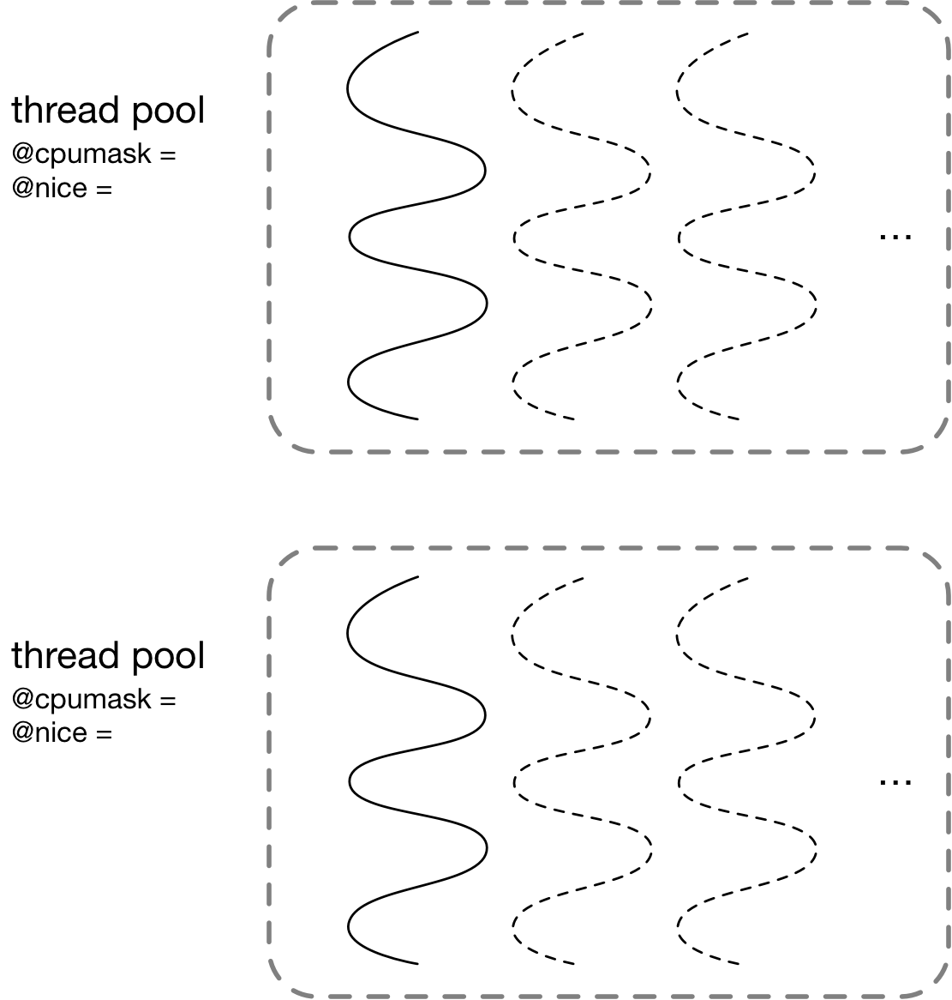
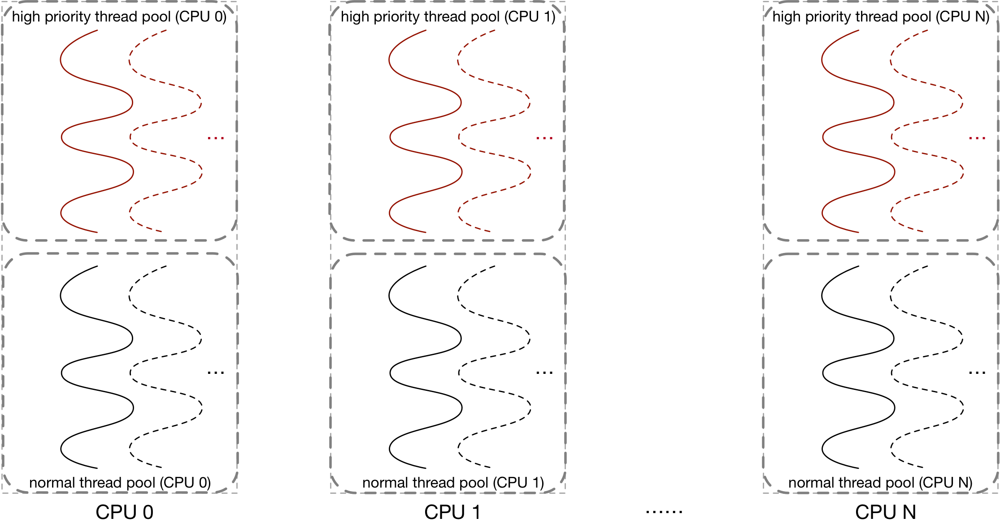
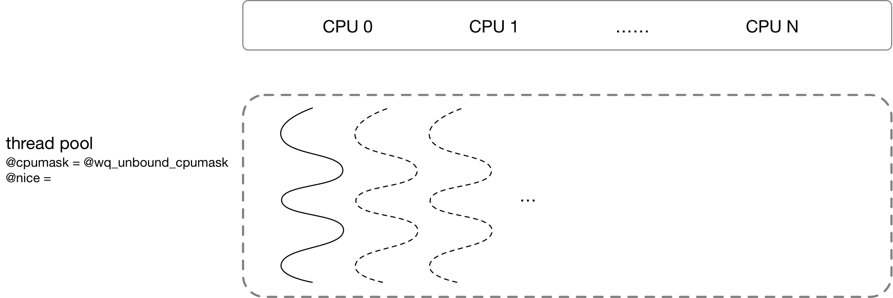
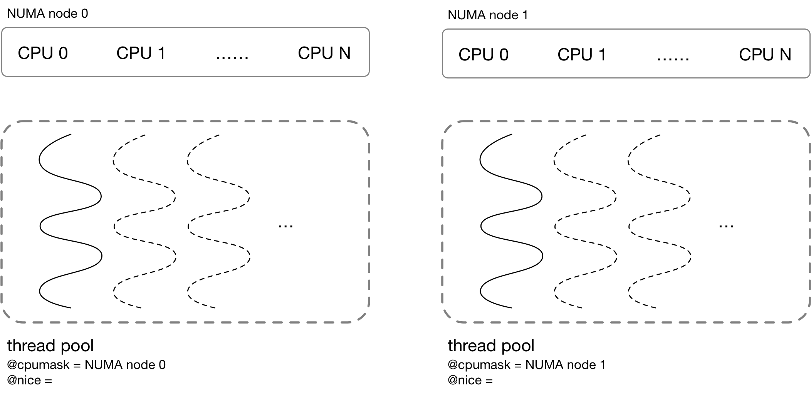

title:'CMWQ - Base'
## CMWQ - Base

### Intro

workqueue 是 Linux 中非常重要的一种异步执行的机制

以 v2.6.36 为界，workqueue 存在两个不同的实现，在此之前的实现我们称为 old-style，之后的即所谓的 CMWQ (Concurrency Managed Workqueue)


#### old-style

在介绍 CMWQ 之前其实绕不开 old-style workqueue，正是因为 old-style workqueue 存在一系列的问题，才有了后来的 CMWQ

在介绍 old-style workqueue 的问题之前，其实有必要简单介绍一下 old-style workqueue 中 singlethread workqueue 和 multi-thread workqueue 的概念，其中前者整个 workqueue 只有一个 worker，而后者每个 workqueue 有一组 worker

> issue 1

首先 old-style workqueue 会创建出大量的 worker，即使其中的大部分可能都无所事事。对于 multi-thread workqueue 来说，每个 workqueue 都分配有一组 per-CPU worker，因而当系统中 workqueue 的数量很多时，就需要消耗大量的 PID 资源，同时大量的 worker 线程也会严重影响系统性能

> issue 2

其次，old-style workqueue 很容易发生阻塞。对于 singlethread workqueue，所有 CPU 共享一个 worker，当 worker 处理其中一个 work 阻塞时，之后等待的所有 work 都会阻塞在那里而得不到处理；对于 multi-thread workqueue，每个 CPU 都有一个绑定的 per-CPU worker，同一个 CPU 上的 work 共享一个 worker，因而在执行过程中当其中一个 work 阻塞时，该 CPU 上的其他 work 也必须等待

> issue 3

以上描述的 old-style workqueue 容易发生阻塞的问题，还可能会导致死锁问题。例如 work A 依赖于 work B，当这两个 work 都调度到同一个 worker 上时，如果 work A 先于 work B 执行，那么 work A 就会因为依赖于 work B 而进入阻塞，此时整个 worker 都进入阻塞状态，因而也调度不了 worker B，从而造成死锁


#### CMWQ

Old-style workqueue 在创建 workqueue 的过程中同时创建对应的 worker，此时 workqueue 与对应的 worker 具有严格的对应关系即二元性，这也是以上问题 1 的原因

CMWQ 为了解决这一问题，将 workqueue 与对应的 worker 相分离，由 worker-pool 管理和调度 worker，此时 workqueue 与 worker-pool 是彼此分离的。CMWQ 在初始化时只是创建有限数量的 worker-pool，worker 的调度全部由 worker-pool 管理，之后创建的所有的 workqueue 都共用这些全局的 worker-pool。由于 worker-pool 的数量是有限的，而每个 thread pool 中 worker 的数量也是严格控制的，因而就可以解决问题 1 中 worker 数量过多的问题


此外问题 2 的本质是由于 old-style workqueue 中虽然有 thread pool 的概念，但是这个 thread pool 并不是弹性的，即 thread pool 中 worker 的数量都是定死的，例如 multi-thread workqueue 对应的 thread pool 中 worker 的数量就是 CPU 的数量，singlethread workqueue 对应的 thread pool 中就只有一个 worker，当其中的任一个 worker 阻塞时，thread pool 中都不会再动态创建一个新的 worker 补上

问题 3 实际是问题 2 导致的，只要解决了问题 2，问题 3 自然也就不复存在

CMWQ 中 workqueue 与 worker-pool 是彼此分离的，worker 的调度全部由 worker-pool 管理，因而为了解决问题 2，CMWQ 中 worker-pool 是弹性可伸缩的，即当 worker 陷入阻塞时，worker-pool 会立即创建一个新的 worker 补上，以运行之后的 work


之前介绍过，CMWQ 中 workqueue 与 worker-pool 是彼此分离的，这样 workqueue 与 worker-pool 就是多对多的关系，即一个 workqueue 实际对应多个 worker pool，而一个 worker pool 也负责处理多个 workqueue 提交的 work，因而此时就需要 per-pool workqueue 数据结构来建立 workqueue 与 worker pool 之间的映射关系，即此时每个 (workqueue, worker pool) pair 都有一个对应的 per-pool workqueue


### Worker Pool

CMWQ 中 workqueue 与 worker-pool 是彼此分离的，此时 worker-pool 都是全局的，所有 workqueue 会共用这些全局的 worker-pool，在系统初始化时会预先创建或者是在之后动态创建 worker-pool，之后 workqueue 创建过程中会为 workqueue 挑选对应的 worker-pool，即建立两者之间的绑定关系

worker pool 分为 bound worker-pool 与 unbound worker-pool 两种 


#### unbound worker-pool

unbound worker-pool 是指不与单个 CPU 相绑定的 worker-pool，其中的 worker 可以在多个 CPU 上运行，这些 worker 具体可以在哪些 CPU 上运行，是由 unbound worker-pool 的 workqueue_attrs 属性来描述的

每个 worker-pool 都有一个对应的 struct workqueue_attrs 结构来描述其属性

```c
struct workqueue_attrs {
	/* @nice: nice level */
	int nice;

	/* @cpumask: allowed CPUs */
	cpumask_var_t cpumask;
	...
};
```

@nice 描述该 worker-pool 的 worker 的 nice 值

@cpumask 描述该 worker-pool 中的 worker 只能在该 cpumask 描述的 CPU 子集上运行，这是通过设置 worker 的 CPU affinity 实现的，至于 worker 最终是在 cpumask 中的哪一个 CPU 上运行的，则是由 scheduler 决定的




@nice 与 @cpumask 的组合多种多样，因而系统中就可能存在多个 unbound worker-pool，内核使用全局的 @unbound_pool_hash hash table 组织系统中的所有 unbound worker-pool

unbound worker-pool 是按需创建的，只有当前需要特定 workqueue attrs 属性对应的 worker-pool，同时 hash table 中不存在该属性对应的 worker-pool 时，才会创建该 worker-pool


#### bound worker-pool

bound worker-pool 是 **per-CPU** 的 worker-pool，即每个 CPU 上都有一个对应的 worker-pool，这些 worker-pool 中的 worker 只能在当前对应的 CPU 上运行

与 unbound worker-pool 按需创建不同，bound worker-pool 由系统静态定义，在系统初始化阶段会初始化这些 bound worker-pool

```c
static DEFINE_PER_CPU_SHARED_ALIGNED(struct worker_pool [NR_STD_WORKER_POOLS], cpu_worker_pools);

NR_STD_WORKER_POOLS	= 2,	/* # standard pools per cpu */
```

每个 CPU 实际上维护两个 bound worker pool，即 normal worker-pool 与 high priority worker-pool，两者的区别是，前者管理的 worker 的 nice 为默认的 0，而后者管理的 worker 的 nice 为 HIGHPRI_NICE_LEVEL 即 -20，因而后者管理的 worker 在调度时具有更高的优先级

bound worker-pool 同样由 workqueue_attrs 来描述其属性，例如对于 CPU 0 上的 high priority worker-pool，就具有如下 workqueue_attrs

- @cpumask 的值为 0x1，描述该 worker pool 中的 worker 只能在 CPU 0 上运行
- @nice 的值就为 -20




### Workqueue

创建 workqueue 的接口为

```c
alloc_workqueue(fmt, flags, max_active, args...)
```

@flags 与 @max_active 这两个参数的组合，就描述了该 workqueue 中的 work 在调度、执行时的特性


#### bound workqueue

alloc_workqueue() 中 @flags 参数不包含 WQ_UNBOUND 标志时，说明此时创建的是 bound workqueue

bound workqueue 创建过程中，会为其挑选对应的 bound worker-pool，即 normal worker-pool 或 high priority worker-pool，具体是由 workqueue 自身的优先级决定的

- high priority workqueue (@flags 参数包含 WQ_HIGHPRI 标志) 会与每个 CPU 上的 high priority worker-pool 相联系
- normal workqueue 会与每个 CPU 上的 normal worker-pool 相联系


workqueue 中 per-CPU 的变量 @cpu_pwqs 就描述了该 workqueue 对应的一组 per-CPU worker-pool

```c
struct workqueue_struct {
	struct pool_workqueue __percpu *cpu_pwqs;
	...
}
```

```
    per-CPU @cpu_pwqs   +------------------------+      +---------------------+
                +-----> | pool workqueue (CPU 0) | ---> | worker pool (CPU 0) |
                |       +------------------------+      +---------------------+
+-----------+   |
| workqueue | --+
+-----------+   |
                |       +------------------------+      +---------------------+
                +-----> | pool workqueue (CPU N) | ---> | worker pool (CPU N) |
                        +------------------------+      +---------------------+
```


提交 work 的入口为 queue_work_on()，表示当前需要将 @wq 中的 @work 提交给 @cpu 上的 worker-pool 处理

```c
bool queue_work_on(int cpu, struct workqueue_struct *wq, struct work_struct *work)
```


##### select CPU for bound work

此时将 @work 提交给具体哪个 CPU 上的 worker-pool 处理，具体有以下两个候选

1. @cpu 参数对应的 bound worker-pool
2. @work->data 中保存的上一次处理该 work 的 bound worker-pool

具体选择以上的那一个候选，是由以下算法决定的

- 如果当前是第一次处理该 work，即 work->data 字段为空，那么就选择 @cpu 参数对应的 bound worker-pool，即在 @cpu 参数描述的 CPU 上运行
- 否则 @work->data 就保存了上一次处理该 work 的 bound worker-pool，此时
    - 如果 @work->data 指向的 worker-pool 当前存在 worker 正在运行这个 work，那么就会让当前这个 work 由 @work->data 指向的 worker-pool 运行，即在 @work->data 参数指向的 CPU 上运行
    - 否则还是选择 @cpu 参数对应的 bound worker-pool，即在 @cpu 参数描述的 CPU 上运行

所谓的 work 添加到 worker-pool 的过程，实际上就是将该 work 提交到对应的 worker-pool 的 @worklist 链表中去，并唤醒该 worker-pool 的 worker，之后 worker 被唤醒后就会处理 worklist 链表中的 work


##### select CPU for unbound work

以上描述的算法中，@cpu 参数描述了将 @work 提交给哪一个 worker-pool 的其中一个候选，实际上 @cpu 参数的值还可以是 WORK_CPU_UNBOUND，表示当前提交的 @work 实际上是 unbound 的，此时就需要挑选出一个 CPU 出来处理这个 work，具体有以下策略

默认情况下，会选择当前 CPU，即调用 queue_work_on() 时的 CPU，但是前提是当前 CPU 在 @wq_unbound_cpumask 内，@wq_unbound_cpumask 全局参数描述了当前系统中所有 unbound worker pool 默认的 CPU affinity (即 workqueue_attr->cpumask)，用户可以通过 `/sys/devices/virtual/workqueue/cpumask` 修改该参数的值，该参数也适用于 bound workqueue 中 unbound work 的处理

如果当前 CPU 不在 @wq_unbound_cpumask 内，就会回退到按照 round-robin 算法在 @wq_unbound_cpumask 参数描述的一组 CPU 中选出一个 CPU


上文提到的 round-robin 算法，实际上就是在 @wq_unbound_cpumask 参数描述的一组 CPU 中，按照 round-robin 算法选出一个 CPU，当然如果系统中 CONFIG_DEBUG_WQ_FORCE_RR_CPU 配置项是开启的，那么在一开始就会直接使用 round-robin 算法在 @wq_unbound_cpumask 参数描述的一组 CPU 中选出一个 CPU，而不是选择当前 CPU；但是如果 @wq_unbound_cpumask 参数本身是空的，那么还是会回退到使用当前的 CPU


以上描述的算法只是选出 @cpu 参数对应的一个 worker-pool 候选，之后还是会和上一小节中介绍的算法那样，和 @work->data 指向的另一个 worker-pool 候选一起，选出最终将该 work 提交到哪个 CPU 上运行


#### unbound workqueue

alloc_workqueue() 的 flags 参数包含 WQ_UNBOUND 标志时，说明此时创建的是 unbound workqueue，即该 workqueue 中的 work 会提交给 unbound worker-pool 处理

unbound workqueue 创建过程中需要为其挑选对应的 unbound worker-pool，由于系统中可以存在多个 unbound worker-pool，因而通常使用 struct workqueue_attrs 来描述该 unbound workqueue 所需要的 worker-pool 的属性，这其中会在全局的 @unbound_pool_hash hash table 中寻找与该 workqueue attrs 匹配的 unbound worker-pool，若 hash table 中尚不存在匹配的 worker-pool，则根据该 workqueue attrs 创建一个新的 worker-pool 


##### standared unbound workqueue in one NUMA-node

alloc_workqueue() 中 flags 参数包含 WQ_UNBOUND 标志 (但不包含 __WQ_ORDERED 标志) 时，说明此时创建的是 standared unbound workqueue

此时只考虑系统中只包含一个 NUMA node 的情况，那么该 workqueue 只需要与一个 worker-pool 相联系

```
+-----------+  numa_pwq_tbl[0]  +----------------+      +-----------------------------------+
| workqueue | ----------------> | pool workqueue | ---> | worker pool (@wq_unbound_cpumask) |
+-----------+                   +----------------+      +-----------------------------------+
```

在调用 alloc_workqueue() 创建 standared unbound workqueue 时，需要为创建的 unbound workqueue 寻找匹配的 worker-pool，这一过程中使用的 workqueue attrs 实际上为

- @cpumask 字段默认为 @wq_unbound_cpumask，该参数描述了 unbound worker pool 默认的 CPU affinity，用户可以通过 `/sys/devices/virtual/workqueue/cpumask` 修改该参数的值
- @nice 字段由 workqueue 本身的优先级决定，若 workqueue 的 flags 参数包含 WQ_HIGHPRI 标志，则 @nice 字段即为 -20，否则为 0



由于此时 standared unbound workqueue 只对应于一个 worker-pool，因而 queue_work_on() 提交 work 时，该 work 总是提交给这个唯一的 worker-pool


##### standared unbound workqueue in multi NUMA-node

alloc_workqueue() 中 flags 参数包含 WQ_UNBOUND 标志 (但不包含 __WQ_ORDERED 标志) 时，说明此时创建的是 standared unbound workqueue

考虑系统中存在多个 NUMA node 的情况，如果还是和之前一样，一个 workqueue 对应一个 worker pool，那么这个 worker pool 对应的 cpumask 参数就应该是 all_possible_cpu，即该 worker pool 下的 worker 可以在所有 NUMA node 的所有 CPU 下运行，这样就会带来一个问题，即 worker 可能被调度器调度到 NUMA node 2 的某个 CPU 上运行，而当初是 NUMA node 1 的某个 CPU 调用的 queue_work_on() 提交了这个 work，即这个 @work 数据大概率是存储在 NUMA node 1 上的，此时这个 worker 运行时就需要跨 NUMA node 访问 @work 数据，从而带来性能的下降

解决办法就是让 worker pool 是 per-NUMA node 的，即让一个 unbound workqueue 对应多个 worker pool，每个 NUMA node 一个 worker pool，其中的每个 worker pool 的 cpumask 参数只覆盖一个 NUMA node，即每个 per-NUMA-node worker-pool 的 worker 只能在该 NUMA node 对应的 CPU 上运行，之后 queue_work_on() 提交 work 的时候，实际上是将该 work 提交给当前 CPU 所在的 NUMA node 对应的那个 worker-pool 处理，这样 @work 数据是存储在当前 CPU 所在的 NUMA node 的，而实际执行的 worker 也是在同一个 NUMA node 上运行的，这样就不会再存在跨 NUMA node 的情况

此时一个 unbound workqueue 就对应于多个 worker pool

```
      numa_pwq_tbl[0]   +-------------------------+      +----------------------+
                +-----> | pool workqueue (node 0) | ---> | worker pool (node 0) |
                |       +-------------------------+      +----------------------+
+-----------+   |
| workqueue | --+
+-----------+   |
                |       +-------------------------+      +----------------------+
                +-----> | pool workqueue (node N) | ---> | worker pool (node N) |
      numa_pwq_tbl[N]   +-------------------------+      +----------------------+
```


> select per-NUMA-node worker-pool

在之后调用 queue_work_on() 提交 work 的时候，需要将 work 提交给对应的 worker-pool，此时需要从该 workqueue 对应的多个 worker-pool 中挑选出一个 worker-pool，这里的算法实际上是和 bound workqueue 中介绍的算法基本一致，这里候选的 worker-pool 有两个

1. @cpu 参数对应的 bound worker-pool，如果 @cpu 参数为 WORK_CPU_UNBOUND，就会选择当前的 CPU 或按照 round-robin 算法从 @wq_unbound_cpumask 参数描述的一组 CPU 中选出一个 CPU
2. @work->data 中保存的上一次处理该 work 的 bound worker-pool

实际上无论是 bound workqueue，还是 single NUMA node 下的 standared unbound workqueue，还是 multi NUMA node 下的 standared unbound workqueue，都是使用这一套算法挑选由哪个 worker-pool 处理当前这个 work，其差异主要在步骤 1 这里，其他步骤基本一致

步骤 1 中在确定对应的 CPU 之后，需要将该 CPU 映射为对应的 worker-pool，这里因为 pool workqueue 结构实现了 workqueue 与 worker-pool 之间的联系，而 pool workqueue 结构与 worker-pool 是一对一的，因而以上问题就转化为了根据 CPU 获取其对应的 pool workqueue 结构

```
CPU
    - bound workqueue
        pwq = per_cpu_ptr(wq->cpu_pwqs, cpu);

    - standared unbound workqueue (single NUMA node)
        pwq = wq->numa_pwq_tbl[0]

    - standared unbound workqueue (multi NUMA node)
        pwq = wq->numa_pwq_tbl[cpu_to_node(cpu)]
```

对于 bound workqueue 来说，worker-pool 是 per-CPU 的，每个 CPU 一个 worker-pool，workqueue的 per-CPU 变量 @cpu_pwqs 就描述了该 workqueue 对应的所有 worker-pool，此时就是获取该 CPU 对应的那个 per-CPU worker-pool

对于 single NUMA node 下的 standared unbound workqueue 来说，(对于单个 workqueue 来说) 整个系统范围内只有一个 worker-pool，一个 workqueue 就只对应于一个 worker-pool，wq->numa_pwq_tbl[0] 就存储了这个 worker-pool，因而此时只需要直接返回 wq->numa_pwq_tbl[0] 指向的这个 worker-pool 就好

而对于 multi NUMA node 下的 standared unbound workqueue 来说，worker-pool 是 per-NUMA node 的，此时 wq->numa_pwq_tbl[] 数组存储了该 workqueue 对应的一组 worker-pool，numa_pwq_tbl[0] 就指向 NUMA node 0 对应的 worker-pool，numa_pwq_tbl[1] 就指向 NUMA node 1 对应的 worker-pool，以此类推...... 因而此时只需要根据 CPU 确定该 CPU 所在的 NUMA node number，wq->numa_pwq_tbl[node] 就是我们寻找的 worker-pool




> example

例如 NUMA 系统中

- node 0 包含 CPU A、CPU B
- node 1 包含 CPU C、CPU D
- node 2 包含 CPU E、CPU F
- node 3 包含 CPU G、CPU H

那么在调用 alloc_workqueue() 创建 standared unbound workqueue 时，在为创建的 unbound workqueue 寻找匹配的 worker-pool 的过程中，使用的 workqueue attrs 的 cpumask 字段默认为 @wq_unbound_cpumask

那么此时

- 为 node 0 创建一个 unbound worker-pool，其 cpumask 为 CPU A/B，即其中的 worker 只能在 CPU A、CPU B 上运行
- 为 node 1 创建一个 unbound worker-pool，其 cpumask 为 CPU C/D，即其中的 worker 只能在 CPU C、CPU D 上运行
- 为 node 2 创建一个 unbound worker-pool，其 cpumask 为 CPU E/F，即其中的 worker 只能在 CPU E、CPU F 上运行
- 为 node 3 创建一个 unbound worker-pool，其 cpumask 为 CPU G/H，即其中的 worker 只能在 CPU G、CPU H 上运行

之后当调用 queue_work_on() 提交 work 时，在 CPU A 上调用 queue_work_on() 时就会将 work 提交到 node 0 对应的 worker-pool，在 CPU C 上调用 queue_work_on() 时就会将 work 提交到 node 1 对应的 worker-pool，以此类推


> select default worker-pool

考虑以下这种情况，alloc_workqueue() 创建 standared unbound workqueue 时，@wq_unbound_cpumask 参数实际上限制了 workqueue->cpumask 的值，@wq_unbound_cpumask 参数的默认值为 all_possible_cpu，因而默认情况下每个 NUMA node 确实都有一个 worker-pool

但是用户是可以修改 @wq_unbound_cpumask 参数值的，考虑以上 NUMA 系统中，如果 @wq_unbound_cpumask 参数的值修改为 CPU A、CPU C，即之后创建的 standard unbound workqueue 中的 work 只能在 CPU A、CPU C 中运行，此时该 standared unbound workqueue 与对应的 worker-pool 的关系为

- 首先创建一个 default worker-pool，其 cpumask 参数即为该 standard unbound workqueue 的 workqueue attr 的 cpumask，即 @wq_unbound_cpumask 参数的值，即 CPU A、CPU C，也就是说 default worker-pool 的 worker 可以在 CPU A、CPU C 上运行
- 为 node 0 创建一个 unbound worker-pool，其 cpumask 为 CPU A，即其中的 worker 只能在 CPU A 上运行，之后在 node 0 即 CPU A、CPU B 上调用 queue_work_on() 时，work 都会提交到 node 0 对应的 worker-pool 
- 同理，为 node 1 创建一个 unbound worker-pool，其 cpumask 为 CPU C，即其中的 worker 只能在 CPU C 上运行，之后在 node 1 即 CPU C、CPU D 上调用 queue_work_on() 时，work 都会提交到 node 0 对应的 worker-pool
- 由于该 workqueue 不能在 node 2 上运行，因而在 node 2 即 CPU E、CPU F 上调用 queue_work_on() 时，work 都会提交到 default worker-pool，这些 work 会在 CPU A、CPU C 上运行
- 同理，在 node 3 即 CPU G、CPU H 上调用 queue_work_on() 时，work 都会提交到 default worker-pool，这些 work 会在 CPU A、CPU C 上运行


```
           @dfl_pwq     +-------------------------+      +-------------------------------------------+
                + ----> | default pool workqueue  | ---> | default worker pool (@wq_unbound_cpumask) |
                |       +-------------------------+      +-------------------------------------------+       
                |
                |       +-------------------------+      +----------------------+
numa_pwq_tbl[0] +-----> | pool workqueue (node 0) | ---> | worker pool (node 0) |
                |       +-------------------------+      +----------------------+
+-----------+   |
| workqueue | --+
+-----------+   |
                |       +-------------------------+      +----------------------+
                +-----> | default pool workqueue  | ---> |         ...          |
      numa_pwq_tbl[N]   +-------------------------+      +----------------------+
```


##### ordered unbound workqueue

alloc_workqueue() 中 flags 参数同时包含 WQ_UNBOUND|__WQ_ORDERED 标志时，说明此时创建的是 ordered unbound workqueue

ordered unbound workqueue 与 standared unbound workqueue 的区别是，在 multi NUMA node 情况下，后者可能与多个 unbound worker pool 相联系，而前者只与一个 unbound worker pool 相联系，此时该 worker-pool 的 cpumask 即为 @wq_unbound_cpumask，即默认可以在系统中任意一个 CPU 上运行

而当系统中只有一个 NUMA node 时，ordered unbound workqueue 实际就等同于 standared unbound workqueue

ordered unbound workqueue 提交 work 的逻辑与之前 bound workqueue 中提交 work 的逻辑相类似，只是此时该 work 总是提交给唯一的 worker-pool

```
           @dfl_pwq     +-------------------------+      +-------------------------------------------+
                + ----> | default pool workqueue  | ---> | default worker pool (@wq_unbound_cpumask) |
                |       +-------------------------+      +-------------------------------------------+       
                |
                |       +-------------------------+      +----------------------+
numa_pwq_tbl[0] +-----> | default pool workqueue  | ---> |         ...          |
                |       +-------------------------+      +----------------------+
+-----------+   |
| workqueue | --+
+-----------+   |
                |       +-------------------------+      +----------------------+
                +-----> | default pool workqueue  | ---> |         ...          |
      numa_pwq_tbl[N]   +-------------------------+      +----------------------+
```


### Concurrency

以下两个因素会影响 work 的并发度

#### concurrency for one workqueue

> 对于一个 workqueue 来说，max_active 参数描述了该 workqueue 中有多少个 work 可以并行执行，即该参数决定了 workqueue 的并行度
> 如果 max_active 为 1，那么该 workqueue 中的 work 只能串行执行，即一个 work 执行完了，才能执行该 workqueue 中的下一个 work


queue_work_on() 中，在上述确定了将 work 提交给哪个 worker-pool 之后，就会将该 work 添加到该 worker-pool 的 @worklist 链表

但是在细节上 alloc_workqueue() 传入的 @max_active 参数会影响以上行为，@max_active 参数描述了每个 worker-pool 的 @worklist 链表中可以缓存的来自该 workqueue 的 work 数量

后面会介绍到，同一个 work 不能重复添加到一个 worker pool 的 worklist 中，因而 @max_active 参数实际描述了每个 worker-pool 的 worklist 链表中可以缓存的来自该 workqueue 的**不同** work 的数量

对于特定 worker-pool，其 worklist 链表当前已经缓存了多少个来自该 workqueue 的 work 的统计量保存在对应的 pool workqueue 中，因而

- 从 workqueue 的视角来看，@max_active 参数对于各个 worker-pool 是独立统计的

例如对于 bound workqueue 来说，CPU A 上的 bound worker-pool 的 @worklist 链表可以缓存最多 @max_active 个来自该 workqueue 的 work，同时 CPU B 上的 bound worker-pool 的 worklist 链表也可以缓存最多 @max_active 个来自该 workqueue 的 work

- 从 worker-pool 的视角来看，@max_active 参数对于各个 workqueue 是独立统计的

例如对于 bound worker-pool 来说，该 bound worker-pool 的 @worklist 链表可以缓存最多 @max_active (workqueue 1 的 @max_active 参数) 个来自 workqueue 1 的 work，同时该 @worklist 链表还可以缓存最多 @max_active (workqueue 2 的 @max_active 参数) 个来自 workqueue 2 的 work


当 alloc_workqueue() 传入的 @max_active 为 0 时将使用其默认配置，即 WQ_DFL_ACTIVE 即 256


但是 @max_active 参数的值也存在上限

- 对于 bounded workqueue，max active work 的最大值为 WQ_MAX_ACTIVE 即 512
- 对于 unbounded workqueue，max active work 的最大值为 WQ_UNBOUND_MAX_ACTIVE，即 512 与 4 * num_possible_cpus() 中的最大值


queue_work_on() 调用过程中会将 work 添加到对应的 worker-pool 的 @worklist 链表，此时若对应的 worker-pool 中缓存的来自当前 workqueue 的 work 数量已经达到 @max_active 上限，那么会将当前提交的 work 缓存到对应的 pool workqueue 的 @delayed_works 链表中，之后该 worker-pool 中的 worker 在每次处理完成一个 work 的时候，若对应的 @delayed_works 链表不为空，则会将 delayed_works 链表中的一个 pending work 添加到该 worker-pool 的 @worklist 链表中

因为 worker 只会处理 worklist 链表中的 work，而不会处理 delayed_works 链表中的 work，因而 @max_active 参数可以有效地控制 workqueue 的并行度


#### concurrency of worker pool

对于 (per-CPU) bound worker pool 来说，每个 worker pool 在同一时刻最多只有一个 running worker (这里 "running worker" 的概念指正在处理 work 的 worker)

对于 (per-NUMA-node) unbound worker pool 来说，每个 worker pool 在同一时刻可以有多个 running worker，只要 worklist 中有 pending work，就会创建新的 running worker；基本上 worklist 中的每个 pending work 都会唤醒一个 running worker

```
worker_thread
    # get one work from worklist
    process_one_work
        wake_up_worker // wake up another idle worker
                         (transit to running worker soon)
                         to process remained pending work
    work->func()
```


#### concurrency for one work

> 同一个 work 在 system-wide 不会发生并发，即同一个 work 在 system-wide 同时只能由一个 worker 执行，因而多次提交的同一个 work 会串行执行

1. 首先同一个 work 在 system-wide 同时只能挂载到一个 worker-pool，即一个 work 在某一时刻不可能存在于多个 worker pool

CMWQ 通过 work->data 的 WORK_STRUCT_PENDING_BIT bit 来确保一个 work 同时只能挂载到一个 worker-pool

首先 queue_work_on() 中会设置 work->data 的 WORK_STRUCT_PENDING_BIT bit，并将 work 添加到对应 worker pool 的 worklist 中；下次再对同一个 work 调用 queue_work_on()，检查到该 work 的 WORK_STRUCT_PENDING_BIT bit 当前已经被置位，即该 work 之前已经被添加到当前的 worker-pool 中，则函数直接返回，从而确保一个 work 同时只能挂载到一个 worker-pool

```
queue_work_on
    if !test_and_set_bit(WORK_STRUCT_PENDING_BIT, ...):
        # add this work into worklist
```


worker 在处理 work 的时候，会将 work 从 worklist 链表中移除，之后清除 work 的 WORK_STRUCT_PENDING_BIT bit，最后执行 work 的任务

```
worker_thread
    # get one work from worklist
    process_one_work
        # delete this work from worklist
        set_work_pool_and_clear_pending // clear WORK_STRUCT_PENDING_BIT bit
        work->func()
```


注意上述时序中，有可能存在 worker 清除 WORK_STRUCT_PENDING_BIT bit 后，还没来得及执行 work->func() 的时候，又有进程对该 work 执行 queue_work_on() 操作，此时该 work 再次被添加到 worker pool 的 worklist 中

```
PROCESS 1                           PROCESS 2
===========                         ===========
queue_work_on                       worker_thread
  # insert work into worklist
  # set WORK_STRUCT_PENDING_BIT
                                      # process_one_work
                                        # delete this work from worklist
                                        clear WORK_STRUCT_PENDING_BIT bit
queue_work_on
  # insert work into worklist
  # set WORK_STRUCT_PENDING_BIT
                                        work->func()

```

> 这里插一句题外话，process_one_work() 中为什么不能在 work->func() 执行结束后再 clear WORK_STRUCT_PENDING_BIT bit 呢？如果这样的话，就不会发生上述的时序了。这是因为如果在 work->func() 执行结束后再 clear WORK_STRUCT_PENDING_BIT bit，考虑以下时序
> 
> ```
> PROCESS 1                           PROCESS 2
>===========                         ===========
>                                    worker_thread
>                                     # process_one_work
>                                       work->func()
>                                         ...
>queue_work_on                            ...
> # since WORK_STRUCT_PENDING_BIT set
> # i.e. this work is still in worklist
>                                       # delete this work from worklist
>                                       clear WORK_STRUCT_PENDING_BIT bit
> ```
> 
> 这里 worker 在执行 work->func() 的过程中，其他进程调用 queue_work_on() 提交 work，此时看到这个 work 还在 worklist 中，因而马上返回；但是此时 work->func() 可能已经执行到了一半，可能并不会处理到刚刚 queue_work_on() 提交的任务


那么是否有可能两次 queue_work_on() 的时候这个 work 被添加到两个不同的 worker pool 呢，即第一次 queue_work_on() 的时候 work 添加到一个 worker pool，而第二次 queue_work_on() 的时候 work 添加到另一个 worker pool ？答案是并不会，CMWQ 会确保前后两次 queue_work_on() 调用将 work 添加到同一个 worker pool，但前提是 "这个 work 不会重复提交给另一个 workqueue (No one queues the work item to another workqueue)"

queue_work_on() 将 work 添加到 worker pool 的 worklist 的时候，会在 work->data 中保存对应的 pool workqueue

下一次再调用 queue_work_on() 的时候，work->data 中保存的 pool workqueue 就描述了这个 work 上一次被添加到哪个 worker pool，此时如果检查到上一次 queue_work_on() 提交的任务还在执行中 (即发生了上述时序)，那么就会将这个 work 提交到与上一次 queue_work_on() 一样的 worker pool，从而确保两次 queue_work_on() 提交到同一个 worker pool

```
queue_work_on
    __queue_work
        last_pool = get_work_pool(work)
        worker = find_worker_executing_work(last_pool, work);
        if (worker && worker->current_pwq->wq == wq):
            pwq = worker->current_pwq;
```


2. 其次同一个 work (在一个 worker pool 中) 不会被多个 worker 并发处理

上面介绍了同一个 work 在同一时刻只能挂载到一个 worker-pool，但是考虑到之前描述的时序，上一次提交的 work->func() 还在运行过程中，这个 work 就有可能被再次添加到 worklist 中，这种情况下有没有可能再起一个新的 worker 处理第二次提交的 work，从而导致两个 worker 并发处理同一个 work 呢？

```
PROCESS 1                           PROCESS 2
===========                         ===========
queue_work_on                       worker_thread
  # insert work into worklist
  # set WORK_STRUCT_PENDING_BIT
                                      # process_one_work
                                        # delete this work from worklist
                                        clear WORK_STRUCT_PENDING_BIT bit
queue_work_on
  # insert work into worklist
  # set WORK_STRUCT_PENDING_BIT
                                        work->func()

```

答案是不会

1) 对于 bound worker pool 来说

由于每个 bound worker pool 同一时刻只能有一个 running worker，此时不会有其他 running worker 来执行第二次提交的 work，从而与当前的 running worker 形成并发

实际上当前 running worker 处理完第一次提交的 work 之后，才会重新从 worklist 中取出第二次提交的 work 进行处理，从而确保这个 work 在 system-wide 不会并发


2) 对于 unbound worker pool 来说

虽然 unbound worker pool 在同一时刻可以有多个 running worker，但是会对这种情况作特殊处理

```
PROCESS 1                           PROCESS 2
===========                         ===========
worker_thread                       worker_thread
  process_one_work
    work->func()
      ...
                                      process_one_work
                                        collision = find_worker_executing_work(pool, work);
                                        if collision:
                                          move_linked_works // delete work from worklist
                                                              and insert into collision worker's @scheduled list
                                          return

      # when finish processing this work
      if !list_empty(&worker->scheduled):
        process_scheduled_works(worker)                                   
```

新起的 running worker 在尝试处理第二次提交的 work 的时候，会发现这个 work 正在被其他 worker (collision worker) 处理过程中，那么此时只是将这个 work 添加到 collision worker 的 @scheduled 链表之后立即返回

等到 collision worker 处理完第一次提交的 work 之后，才会处理 @scheduled 链表中第二次提交的 work，从而确保这个 work 在 system-wide 不会并发


#### ordered workqueue

alloc_ordered_workqueue() 用于创建 ordered unbound workqueue，又称为 single thread workqueue，此时

- @flags 标志位包含 WQ_UNBOUND | __WQ_ORDERED 标志
- @max_active 参数为 1

ordered unbound workqueue 中的 work 严格按照顺序串行执行，注意这里指的是 workqueue 中的不同 work 之间也是严格串行执行的

我们知道 __WQ_ORDERED 描述的 ordered workqueue 只会与一个 worker-pool 相联系，那为什么还需要设置 @max_active 参数为 1 呢？

假设 workqueue 中存在两个不同的 work，即 work A 与 work B，work A 先于 work B 提交到 workqueue，为了达到“work 严格按照顺序串行执行”的要求，必须等待 work A 完成之后才能开始 work B 的处理

若该 workqueue 的 @max_active 参数大于 1，那么 work A 与 work B 都会添加到对应 worker-pool 的 @worklist 链表中，之后该 worker-pool 的 worker thread 在处理 work A 进入阻塞时，该 worker-pool 检查到 @worklist 链表不为空，因而会创建一个新的 worker thread 以处理 work B，此时 work A 还没有完成就开始了 work B 的处理


而当 workqueue 的 @max_active 参数为 1 时，work A 添加到对应 worker-pool 的 @worklist 链表之后，在将 work B 提交给 worker-pool 的时候，由于该 worker-pool 中 @worklist 链表中缓存的来自该 workqueue 的 work 数量已经达到 @max_active 上限，因而此时会将 work B 缓存到 pool workqueue 的 @delayed_works 链表

之后该 worker-pool 的 worker thread 处理 work A 的过程中进入阻塞时，若 @worklist 链表已经为空，则此时不会再创建新的 worker thread（尽管此时 delayed_works 链表不为空）；而若 @worklist 链表不为空即含有来自其他 workqueue 的 pending work，那么此时虽然会创建一个新的 worker thread，但是新创建的 worker thread 只负责处理 @worklist 链表中的 pending work，而不会处理 pool workqueue 的 @delayed_works 链表中的 work。之后等到处理 work A 的 worker thread 从阻塞中恢复并处理完成 work A 之后，会检查 work A 对应的 pool workqueue 的 @delayed_works 链表，当检查到该链表不为空时，就会处理该链表中的 work B，从而满足了严格按照顺序串行执行的要求


