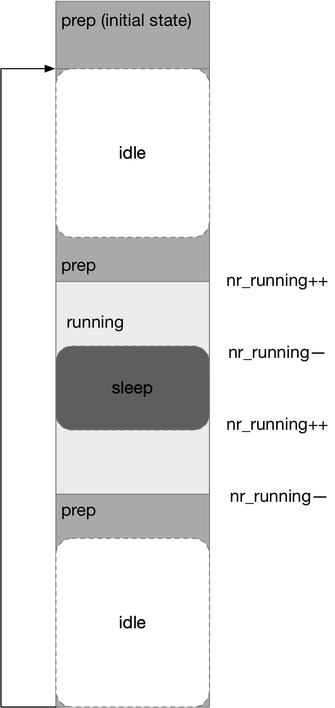

title:'CMWQ - Worker'
## CMWQ - Worker


### worker lifecycle

worker pool 中的 worker 分为 running/not-running 两类，其中

- not-running worker 通过 worker->flags 的 WORKER_NOT_RUNNING 标志进行识别，例如没有任务可做的 worker (设置有 WORKER_PREP 标志) 就属于 not-running worker，例如刚刚创建出来的 worker、或者 idle worker
- 剩余的都属于 running worker


#### nr_running



worker pool 的 @nr_running 计数统计该 worker pool 中 running worker 的数量

```c
struct worker_pool {
    int			nr_running;
    ...
}
```

1. initial state

worker 一开始创建出来的时候属于 idle worker，之后会处理 worker pool 的 worklist 中的 work，从而转变为 running worker；在切换为 running 状态的时候，就会增加 @nr_running 计数

```
workqueue_init
    # for each cpu
        # for each worker pool on this cpu
        (normal bound worker pool, and high priority bound worker pool)
            create_worker
                alloc_worker
                    worker->flags = WORKER_PREP
                pool->nr_workers++ 
                worker_enter_idle
                    pool->nr_idle++
                    worker->flags |= WORKER_IDLE
                wake_up_process(worker->task)
                    worker_thread

worker_thread
    worker_leave_idle
        # worker->flags: clear WORKER_IDLE
        pool->nr_idle--

    # worker->flags: clear WORKER_PREP
    worker_clr_flags(..., WORKER_PREP)
        pool->nr_running++ // since the transition: prep (not-running) -> running
    
    # start processing works ...
```


2. running worker: sleep

running worker 会依次处理 worker pool 的 worklist 中的 work，即调用 work->func() 回调函数，这一过程中就有可能陷入阻塞

workqueue 在 schedule() 中嵌入了一个 hook，在进程进入睡眠之前，减去 @nr_running 计数

```
worker_thread
    # start processing work
    # get one work from @pool->worklist
    process_one_work(worker, work)
        work->func()
            ...
            schedule
                sched_submit_work
                    wq_worker_sleeping
                        pool->nr_running--
                __schedule
```


3. running worker: wakeup

之后这个睡眠的 running worker 被唤醒的时候，同样通过在 schedule() 中嵌入 hook 的方式，增加 @nr_running 计数

```
worker_thread
    # start processing work
    # get one work from @pool->worklist
    process_one_work(worker, work)
        work->func()
            ...
            schedule
                sched_submit_work
                    wq_worker_sleeping
                        pool->nr_running--
                
                __schedule
                
                # waken up
                sched_update_worker
                    wq_worker_running
                        pool->nr_running++
```


4. running worker: idle

running worker 会依次处理 worker pool 的 worklist 中的 work，当所有 work 都已经完成、或者当前有其他 running worker，即不再需要当前的这个 running worker 的时候，这个 running worker 会重新回到 idle 状态，从而变成一个 idle worker

这个过程中这个 worker 会由 running 状态切换为 prep 状态，这个时候就会减去 @nr_running 计数

```
worker_thread
    # start processing work
    
    # when this running worker is not needed anymore
        # worker->flags: set WORKER_PREP
        worker_set_flags(..., WORKER_PREP)
            pool->nr_running-- // since the transition: running -> prep (not-running)
```


5. idle worker: sleep

接下来这个 worker 就会通过 schedule() 进入睡眠状态

```
worker_thread
    # start processing work
    
    # when this running worker is not needed anymore
        # worker->flags: set WORKER_PREP
        pool->nr_running--
        
        worker_enter_idle
            worker->flags |= WORKER_IDLE;
            pool->nr_idle++;
       
        schedule() // goto sleep (won't modify @nr_running counter)
```

需要注意的是，这个时候调用的 schedule() 并不会改变 @nr_running 计数，因为 schedule() 中的 hook 只对 running worker 生效，此时由于 worker 已经切换为 prep 状态，属于 not-running worker，因而调用的 schedule() 并不会改变 @nr_running 计数

```
schedule
    sched_submit_work
        wq_worker_sleeping
            # if !(worker->flags & WORKER_NOT_RUNNING):
                pool->nr_running--
    
    __schedule
    
    # waken up
    sched_update_worker
        wq_worker_running
            # if !(worker->flags & WORKER_NOT_RUNNING):
                pool->nr_running++
```


6. idle worker: wakeup

和步骤 1 中的类似，当 idle worker 重新被唤醒的时候，再次切换为 running 状态，此时会增加 @nr_running 计数

```
worker_thread
    worker_leave_idle
        # worker->flags: clear WORKER_IDLE
        pool->nr_idle--

    # worker->flags: clear WORKER_PREP
    worker_clr_flags(..., WORKER_PREP)
        pool->nr_running++ // since the transition: prep (not-running) -> running
    
    # start processing works ...
```


#### idle worker

idle worker 属于 not-running worker 中的一种，idle worker 一般都处于 prep 状态，即要么是刚刚创建出来的 worker，要么是当前没有任务可做而陷入睡眠的 worker

> nr_idle

每个 worker pool 会对其中的 idle worker 的数量进行弹性伸缩，@nr_idle 计数器就统计了该 worker pool 中 idle worker 的数量

```c
struct worker_pool {
	int			nr_idle;	/* L: currently idle workers */
	...
}
```

idle worker 在开始处理 worklist 中的 work 之前，会切换为 running 状态

```
worker_thread
    worker_leave_idle
        # worker->flags: clear WORKER_IDLE
        pool->nr_idle--

    # worker->flags: clear WORKER_PREP
    worker_clr_flags(..., WORKER_PREP)
        pool->nr_running++ // since the transition: prep (not-running) -> running
    
    # start processing works ...
```


在所有 work 处理完成之后，会重新回到 idle 状态

```
worker_thread
    # start processing work
    
    # when this running worker is not needed anymore
        # worker->flags: set WORKER_PREP
        pool->nr_running--
        
        worker_enter_idle
            worker->flags |= WORKER_IDLE;
            pool->nr_idle++;
       
        schedule() // goto sleep (won't modify @nr_running counter)
```


> create idle worker

worker pool 初始化的时候会创建 initial worker，一开始创建出来的时候就属于 idle worker

```
workqueue_init
    # for each cpu
        # for each worker pool on this cpu
        (normal bound worker pool, and high priority bound worker pool)
            create_worker
```


worker pool 管理 worker 生命周期的一个原则是，worker pool 无论在什么时候，总是会有至少一个 idle worker 待命，这样当 running worker 在处理 work 的过程中陷入睡眠的时候，可以立即由这个 idle worker 上位成为新的 running worker

因而 idle worker 在由 idle 状态切换到 running 状态之前，就会检查 @nr_idle 计数，并确保除了当前这个 worker 以外，还有至少一个 idle worker

```
worker_thread
    worker_leave_idle
        # worker->flags: clear WORKER_IDLE
        pool->nr_idle--

    # if pool->nr_idle == 0, i.e. there's no other idle worker:
        manage_workers
            maybe_create_worker
                create_worker // create a new idle worker, to make sure
                            worker pool always has at least one worker
    
    # worker->flags: clear WORKER_PREP
    worker_clr_flags(..., WORKER_PREP)
    
    # start processing works ...
```


> destroy idle worker

idle worker 进入 idle 状态后，如果当前 worker pool 中的 idle worker 的数量大于 2，同时 (idle_worker - 2) 即超出的数量大于 busy worker 数量的 1/4 时，就需要销毁一些多余的 idle worker

此时依赖于 worker pool 的 @idle_timer 对 idle worker 进行追踪，当定时器超时即 idle worker 的 idle 状态已经持续 IDLE_WORKER_TIMEOUT 即 300s 的时候，即销毁该 idle worker

```
worker_thread
    # start processing work
    
    # when this running worker is not needed anymore
        # worker->flags: set WORKER_PREP
        pool->nr_running--
        
        worker_enter_idle
            worker->flags |= WORKER_IDLE;
            pool->nr_idle++;
            if too_many_workers:
                # trigger pool->idle_timer

        schedule() // goto sleep (won't modify @nr_running counter)
```


### running worker

worker pool 动态管理 worker 的策略为，当 worker pool 存在 pending work 需要处理时，必须确保 worker pool 中存在且**只**存在一个 running worker


idle worker 被唤醒后，尝试切换到 running 状态之前，会通过 @nr_running 检查当前 running worker 的数量，只要当前已经有其他 running worker 正在运行，当前这个 idle worker 就不会切换到 running 状态，而是直接进入睡眠

```
worker_thread
    worker_leave_idle
        # worker->flags: clear WORKER_IDLE
        pool->nr_idle--

    # if !need_more_worker, i.e. nr_running != 0:
        worker_enter_idle // reenter idle state
    # else:
        # worker->flags: clear WORKER_PREP
        worker_clr_flags(..., WORKER_PREP)
        
        # start processing works ...
```


此外 running worker 在处理 work 过程中陷入阻塞的时候，就会唤醒一个 idle worker 使其转变为 running worker，从而确保 worker pool 中总是存在 running worker

```
worker_thread
    # start processing work
    # get one work from @pool->worklist
    process_one_work(worker, work)
        work->func()
            ...
            schedule
                sched_submit_work
                    wq_worker_sleeping
                        pool->nr_running--
                        # if need_more_worker:
                            # wake up first idle worker
                __schedule
```

这里需要注意的是，虽然 worker pool 管理 worker 的原则是，worker pool 中存在且**只**存在一个 running worker，但是 worker pool 中 running worker 的数量是有可能短暂超过 1 的

设想 worker A 在处理 work 过程中陷入阻塞，此时唤醒 idle worker B 成为新的 running worker，此时 @nr_running 计数为 1；后面当 worker A 被唤醒的时候，@nr_running 计数变为 2，此时 worker A 会继续处于 running 状态，以继续完成当前正在处理的这个 work；后面当 worker A/B 中的任一个在完成一个 work 的处理后，发现 @nr_running 计数为 2，就会切换为 idle worker，从而确保 worker pool 中只有一个 running worker，此时 @nr_running 计数更新为 1


#### UNBOUND

上述介绍 worker pool 管理 worker 的原则是，"worker pool 中最多只存在一个 running worker"，这一原则对于 bound worker pool 是适用的，即 bound worker pool 中最多只存在一个 running worker

但是对于 unbound worker pool 来说，这一原则更为复杂一些

unbound worker pool 设置有 POOL_DISASSOCIATED 标记

```
alloc_workqueue
    alloc_and_link_pwqs
        apply_workqueue_attrs
            apply_workqueue_attrs_locked
                apply_wqattrs_prepare
                    alloc_unbound_pwq
                        get_unbound_pool
                            init_worker_pool
                                pool->flags |= POOL_DISASSOCIATED
```

unbound worker pool 创建出来的 worker 设置有 WORKER_UNBOUND 标记

```
create_worker
    worker_attach_to_pool
        if (pool->flags & POOL_DISASSOCIATED):
            worker->flags |= WORKER_UNBOUND;
```

WORKER_UNBOUND 标记包含在 WORKER_NOT_RUNNING 以内，因而 unbound worker 即使在处理 work 任务的时候也属于 not-running worker，因而对于 unbound worker pool 来说，可以存在多个 worker 同时处理 work 任务，只要 worklist 中还有 pending work，新的 worker 就可以被创建出来以处理 work 任务

但需要注意的是，"worker pool 中最多只存在一个 running worker" 的原则对于 unbound worker pool 来说仍然成立，因为 unbound worker (WORKER_UNBOUND) 严格意义上并不属于 running worker，而是属于 not-running worker，因而即使 unbound worker 脱离了 prep 状态而开始处理 work 的时候，也不会增加 @nr_running 计数

```
worker_thread
    worker_leave_idle
        # worker->flags: clear WORKER_IDLE
        pool->nr_idle--

    # worker->flags: clear WORKER_PREP
    worker_clr_flags(..., WORKER_PREP)
        # after clearing WORKER_PREP flag, worker->flags (WORKER_UNBOUND) still applies with WORKER_NOT_RUNNING:
        # thus pool->nr_running won't be increased
    
    # start processing works ...
```


#### CPU INTENSIVE workqueue

上述介绍到，bound worker pool 最多只存在一个 running worker，而 unbound worker pool 则可以同时存在多个 running worker (指 worker 处于处理 work 的状态)

bound workqueue 可以借助于 CPU INTENSIVE 的概念，达到与 unbound worker pool 类似的效果，使得 bound worker pool 中的 worker 在处理该 bound workqueue 提交的 CPU INTENSIVE work 时并不增加 @nr_running 计数，从而使得该 bound worker pool 可以存在多个 worker 处理 work 任务


其实现过程是，若 alloc_workqueue() 的 @flags 标志包含 WQ_CPU_INTENSIVE 标志，说明当前创建的是 CPU INTENSIVE workqueue

worker 在处理 work 的过程中，若当前正在处理的为 CPU INTENSIVE work，则使当前 worker 添加 WORKER_CPU_INTENSIVE 标志，实际将该 worker 标记为 WORKER_NOT_RUNNING，并减小 worker pool 的 running worker count 计数，此时再次检查若当前仍然存在 pending work 同时 running worker count 计数为 0，则调用 wake_up_worker() 唤醒 worker pool 其中的一个 idle worker 以处理之后的 pending work


