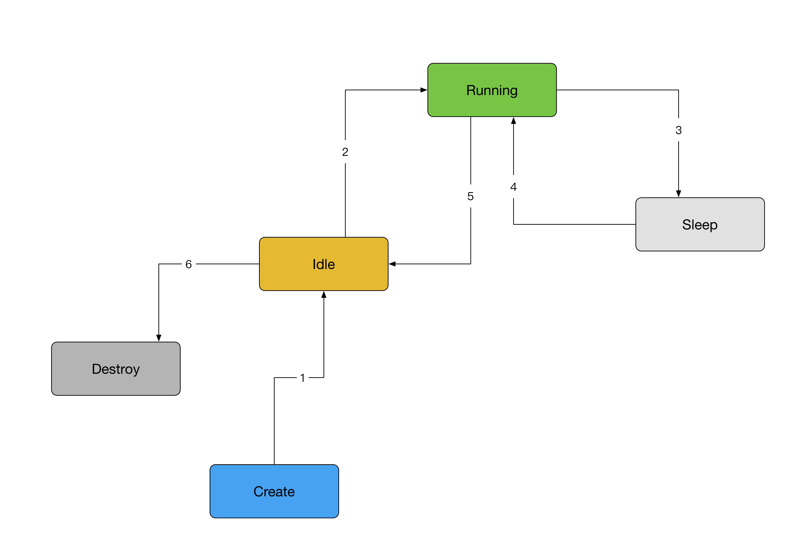

title:'CMWQ - Worker'
## CMWQ - Worker

### worker state machine 

上图所示为 worker state machine，worker 动态调度的策略为，当 worker pool 存在 pending work 需要处理时，必须确保 worker pool 中存在且**只**存在一个 running worker

### worker routine

- worker-pool 新创建过程中会创建一个 initial worker
- 所有通过 create_worker() 新创建的 worker 包括 initial worker 均为 idle worker，此时增加 worker pool 的 idle worker count 计数
- 调用 queue_work_on() 挂载 work 时，会通过 wake_up_worker() 唤醒对应的 worker pool 的第一个 idle worker，scheduler wakeup routine 中当检测到当前需要唤醒的进程为 worker thread 时调用 wq_worker_waking_up()，此时由于检测到该 worker 标记为 WORKER_NOT_RUNNING，因而并不会增加 worker pool 的 running worker count 计数

- worker 运行过程中
    - 若 worker pool 的 @worklist 为空，则直接调度该 worker 进入睡眠状态
    - 否则 worker pool 的 @worklist 非空，此时
        - 若 worker pool 的 running worker count 不为 0 即当前该 worker pool 中存在相应的 running worker，则直接调度该 worker 进入睡眠状态
        - 否则 worker pool 的 running worker 的数量为 0，即由当前 worker 作为唯一的 running worker，但该 worker 在之后的处理 work 的过程中可能因为阻塞而进入睡眠状态，因而此时必须确保存在至少一个 idle worker，以确保之后当前 worker 阻塞时可以唤醒备选的 idle worker 以处理剩余的 pending work；检查 worker pool 的 idle worker thread 的数目
            - 若 idle worker 的数目不为 0 即存在 idle worker，此时不必创建新的 worker，直接执行以下 work 的处理
            - 否则 idle worker 的数目为 0 即不存在 idle worker，此时调用 create_worker() 创建一个新的 idle worker thread
    - worker_clr_flags() 中清除该 worker 的 WORKER_NOT_RUNNING 标记，同时增加 worker pool 的 running worker count 计数
    - 当前 worker 遍历处理 worker pool 的 worklist 链表中的所有 work
        - 当 worker pool 的 @worklist 链表为空时退出当前的遍历过程
        - 当 worker pool 的 @worklist 链表不为空，但是 worker pool 的 running worker 的数量大于 1 时，退出当前的遍历过程
        - 当 worker pool 的 @worklist 链表不为空，同时 worker pool 的 running worker 的数量为 1 即 worker pool 只有当前运行的一个 worker 时，继续当前的遍历过程

    - 当 worker 处理完 @worklist 链表中的所有 work 时，worker_set_flags() 中减小 worker pool 的 running worker count 计数，同时该 worker 再次变为 idle worker，增加 worker pool 的 idle worker count 计数，同时该 worker 标记为 WORKER_NOT_RUNNING
    - 通过 schedule() 使该 worker 进入睡眠状态

    - 当前 worker 在处理 work 过程中由于阻塞而进入睡眠状态时，在 schedule() 中调用 wq_worker_sleeping()，此时检测到该 worker 没有 WORKER_NOT_RUNNING 标记，则执行以下动作
        - 减小 worker pool 的 running worker count 计数
        - 若此时 running worker count 计数变为 0，同时当前仍存在 pending work 需要处理时，则唤醒当前 worker pool 中的第一个 idle worker，以处理阻塞 work 之后的 pending work

    - 当阻塞的 worker 被唤醒后，在 wake_up_process()中调用 wq_worker_waking_up()，其中检测到该 worker 未被标记为 WORKER_NOT_RUNNING，则增加 worker pool 的 running worker count 计数

    - idle worker 进入 idle 状态后，worker pool 的 idle_timer 对 idle worker 进行追踪，当定时器超时即 idle worker 的 idle 状态已经持续 IDLE_WORKER_TIMEOUT 即 300s 时间，同时当前 worker pool 中的 idle worker 的数量大于 2，同时 (idle_worker - 2) 即超出的数量大于 busy worker 数量的 1/4 时，即销毁该 idle worker

### work concurrency

#### general concurrency

结论：同一个 work 在 system-wide 同时只能由一个 worker 执行

- 同一个 work 在 system-wide 同时只能挂载到一个 worker-pool 

queue_work_on() 中检查 work 的 data 标志位的 WORK_STRUCT_PENDING_BIT bit，若该 bit 当前已经被置位，即该 work 之前已经被添加到相应的 worker-pool，则函数直接返回

- 同一个 work 在 system-wide 同时只能由一个 worker 执行

由于一个 worker-pool 中同时只存在一个 running worker，因而被添加到 worker-pool 中的 work 同时只能被一个 worker thread 处理

#### max_active

调用 queue_work_on() 将 work 提交给 worker-pool 的过程，实际上就是将该 work 添加到对应的 worker-pool 的 @worklist 链表，但是在细节上 alloc_workqueue() 传入的 max_active 参数会影响以上行为

@max_active 参数描述了每个 worker-pool 的 @worklist 链表中可以缓存的来自该 workqueue 的 work 数量

同一个 work 不能重复添加到同一个 worker-pool，这是因为 queue_work_on() 中会检查 work 的 data 标志位的 WORK_STRUCT_PENDING_BIT bit，若该 bit 当前已经被置位，即该 work 之前已经被添加到相应的 worker-pool，则函数直接返回；因而对于一个特定的 work，一个 worker-pool 的 worklist 链表最多只能容纳一个该 work

因而 @max_active 参数实际描述了每个 worker-pool 的 worklist 链表中可以缓存的来自该 workqueue 的不同 work 的数量

对于特定 worker-pool，其 worklist 链表当前已经缓存了多少个来自该 workqueue 的 work 的统计量保存在对应的 pool workqueue 中，因而

- 从 workqueue 的视角来看，@max_active 参数对于各个 worker-pool 是独立统计的

例如对于 bound workqueue 来说，CPU A 上的 bound worker-pool 的 @worklist 链表可以缓存最多 @max_active 个来自该 workqueue 的 work，同时 CPU B 上的 bound worker-pool 的 worklist 链表也可以缓存最多 @max_active 个来自该 workqueue 的 work

- 从 worker-pool 的视角来看，@max_active 参数对于各个 workqueue 是独立统计的

例如对于 bound worker-pool 来说，该 bound worker-pool 的 @worklist 链表可以缓存最多 @max_active (workqueue 1 的 @max_active 参数) 个来自 workqueue 1 的 work，同时该 @worklist 链表还可以缓存最多 @max_active (workqueue 2 的 @max_active 参数) 个来自 workqueue 2 的 work

当 alloc_workqueue() 传入的 @max_active 为 0 时将使用其默认配置，即 WQ_DFL_ACTIVE 即 256

但是 @max_active 参数的值也存在上限

- 对于 bounded workqueue，max active work 的最大值为 WQ_MAX_ACTIVE 即 512
- 对于 unbounded workqueue，max active work 的最大值为 WQ_UNBOUND_MAX_ACTIVE，即 512 与 4 * num_possible_cpus() 中的最大值

queue_work_on() 调用过程中会将 work 添加到对应的 worker-pool 的 @worklist 链表，此时若对应的 worker-pool 中缓存的来自当前 workqueue 的 work 数量已经达到 @max_active 上限，那么会将当前提交的 work 缓存到对应的 pool workqueue 的 @delayed_works 链表中，之后该 worker-pool 中的 worker thread 在每次处理完成一个 work 的时候，若对应的 @delayed_works 链表不为空，则会将 delayed_works 链表中的一个 pending work 添加到该 worker-pool 的 @worklist 链表中

#### ordered workqueue

alloc_ordered_workqueue() 用于创建 ordered unbound workqueue，又称为 single thread workqueue，此时

- @flags 标志位包含 WQ_UNBOUND | __WQ_ORDERED 标志
- @max_active 参数为 1

ordered unbound workqueue 中的 work 严格按照顺序串行执行

我们知道 __WQ_ORDERED 描述的 ordered workqueue 只会与一个 worker-pool 相联系，那为什么还需要设置 @max_active 参数为 1 呢？

假设 workqueue 中存在两个不同的 work，即 work A 与 work B，work A 先于 work B 提交到 workqueue，为了达到“work 严格按照顺序串行执行”的要求，必须等待 work A 完成之后才能开始 work B 的处理

若该 workqueue 的 @max_active 参数大于 1，那么 work A 与 work B 都会添加到对应 worker-pool 的 @worklist 链表中，之后该 worker-pool 的 worker thread 在处理 work A 进入阻塞时，该 worker-pool 检查到 @worklist 链表不为空，因而会创建一个新的 worker thread 以处理 work B，此时 work A 还没有完成就开始了 work B 的处理

而当 workqueue 的 @max_active 参数为 1 时，work A 添加到对应 worker-pool 的 @worklist 链表之后，在将 work B 提交给 worker-pool 的时候，由于该 worker-pool 中 @worklist 链表中缓存的来自该 workqueue 的 work 数量已经达到 @max_active 上限，因而此时会将 work B 缓存到 pool workqueue 的 @delayed_works 链表

之后该 worker-pool 的 worker thread 处理 work A 的过程中进入阻塞时，若 @worklist 链表已经为空，则此时不会再创建新的 worker thread（尽管此时 delayed_works 链表不为空）；而若 @worklist 链表不为空即含有来自其他 workqueue 的 pending work，那么此时虽然会创建一个新的 worker thread，但是新创建的 worker thread 只负责处理 @worklist 链表中的 pending work，而不会处理 pool workqueue 的 @delayed_works 链表中的 work。之后等到处理 work A 的 worker thread 从阻塞中恢复并处理完成 work A 之后，会检查 work A 对应的 pool workqueue 的 @delayed_works 链表，当检查到该链表不为空时，就会处理该链表中的 work B，从而满足了严格按照顺序串行执行的要求

#### CPU INTENSIVE workqueue

若 alloc_workqueue() 的 @flags 标志为包含 WQ_CPU_INTENSIVE 标志，说明当前创建的是 CPU INTENSIVE workqueue

worker 动态调度的策略为，当 worker pool 存在 pending work 需要处理时，必须确保 worker pool 中存在且只存在一个 running worker。也就是说一般情况下，一个 worker-pool 中最多只存在一个 running worker

但是当前正在处理 CPU INTENSIVE work 的 worker thread 并不在 concurrency management 范围内，此时 worker-pool 会有一个 running worker thread 处理 CPU INTENSIVE work，同时创建另一个 running worker thread 处理其他 work

其实现过程是，若当前正在处理的为 CPU INTENSIVE work，则使当前 worker 添加 WORKER_CPU_INTENSIVE 标志，实际将该 worker 标记为 WORKER_NOT_RUNNING，并减小 worker pool 的 running worker count 计数，此时再次检查若当前仍然存在 pending work 同时 running worker count 计数为 0，则调用 wake_up_worker() 唤醒 worker pool 其中的一个 idle worker 以处理之后的 pending work

CPU INTENSIVE workqueue 通常只用于 bound workqueue

