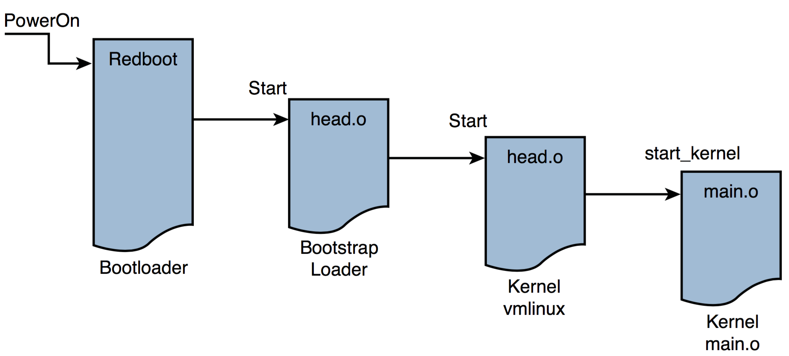
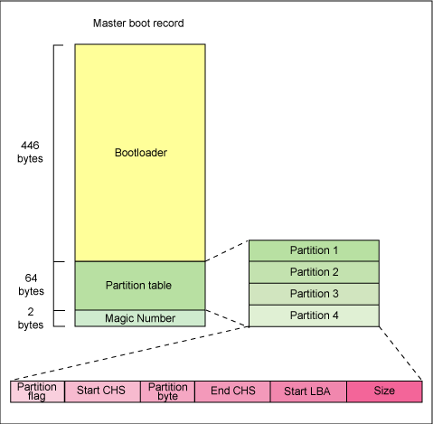
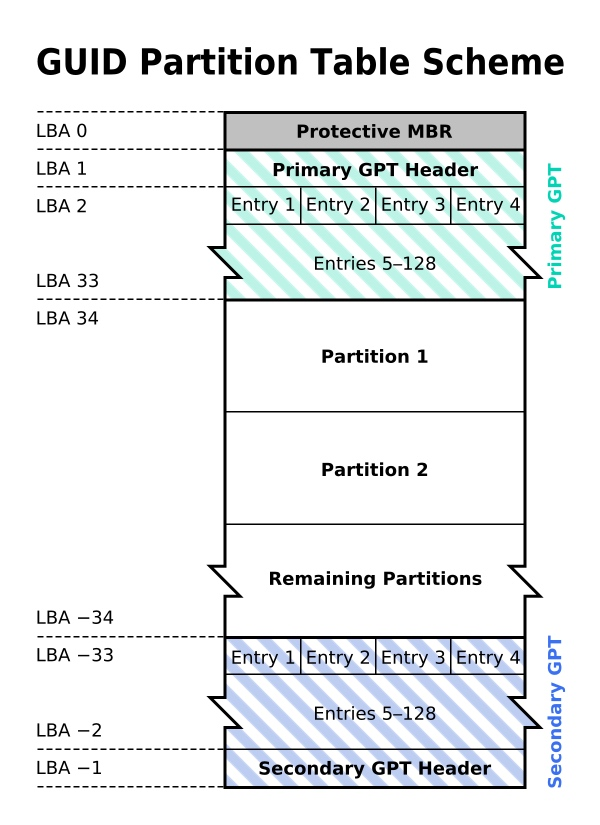

title:'Init - 1 BIOS'
## Init - 1 BIOS


### Summary

系统启动流程如下图所示



1. 上电复位时，自动执行 BIOS 执行硬件自检 (POST, Power On Self Test)。之后将处理器的控制权转交给 Bootloader。

2. Bootloader 主要执行底层硬件的初始化、启动分区 boot partition 的挂载，内核镜像的加载。之后将处理器的控制权转交给 Bootstrap Loader。

3. Bootstrap Loader 由 head.o 开始执行，主要执行内核的解压缩与重定位。之后将处理器的控制权转交给内核。

4. 内核由 head.o 开始执行，主要执行架构和处理器相关的初始化工作，为内核的主体部分的执行做好准备，其主要工作有
    - 检查处理器和架构的有效性
    - 生成最初的页表条目
    - 使能存储管理单元 MMU
    - 建立有限的错误检测和报告
    - 跳转至内核映像主体的起始部分，即 main.c 的 start_kernel()

5. 内核中的 start_kernel() 的主要工作有
    - 初始化首个内核线程
    - 加载根文件系统
    - 运行首个用户空间应用程序


### Reset

系统刚上电时，CPU 会进入 real mode，并进行复位操作，此时

- CS (code segment selector) 寄存器的初始值为 0xf000
- IP (instruction pointer) 寄存器的初始值为 0xfff0

x86 real mode 支持 20 bit physical address bus，但是 segment selector 寄存器只有 16 bit，因而 segment 的 base linear address 实际为对应的 segment selector * (2^4)

因而 CPU 复位时 CS 寄存器的初始值为 0xf000，那么对应的 segment 的 base linear address 即为 0xf0000

x86 架构的物理地址寻址实际为 segment base address + offset，此时 code segment base address 为 0xf0000，而 IP 描述的 offset 为 0xfff0，因而 CPU 复位时执行 0xffff0 物理地址处的代码


x86 架构下 0xffff0 物理地址处的代码通常为 BIOS 的 reset vector，例如 coreboot 中定义

```lds
/*
_ROMTOP: The top of the rom used where we need to put the reset vector.
 */

SECTIONS {
	_ROMTOP = 0xfffffff0;
	. = _ROMTOP;
	.reset . : {*(.reset)
		. = 15 ;
		BYTE(0x00);
	} 
}
```


coreboot 中 0xffff0 物理地址处的代码为 .reset section，即 reset vector，其定义为

```asm
	.section ".reset"
	.code16
.globl	reset_vector
reset_vector:
	.byte  0xe9
	.int   _start - (. + 2)
```
0xe9 为 jmp 指令的二进制码，跳转地址为 _start - (. + 2)，即此时开始运行 BIOS


### BIOS

BIOS 向下负责硬件的发现、枚举和初始化，向上负责向操作系统提供接口，描述硬件设备的相关信息

但是传统的 BIOS 来自于 IBM，其格式并不统一并且是闭源的，各个 IDE 厂商都维护有自己的 BIOS 格式，只是向操作系统提供一个相对统一、兼容的接口

为了解决这一问题，UEFI (Unified Extensible Firmware Interface) 应运而生，它向操作系统提供了统一的标准接口，同时是开源的


BIOS 阶段会寻找可以启动的 boot device，BIOS 的配置文件中保存所有可以作为 boot device 的设备及其优先级顺序

```
Boot Device Priority
1) ...
2) ...
```


### Partition Scheme

bootloader 一般存储在 boot device 的起始位置，BIOS/UEFI 会按照顺序依次检查所有设备能否作为合法的启动设备，若该设备合法，则执行该设备上的 bootloader，否则继续检查下一个设备

这一过程中会涉及到块设备的分区表 (partition table)，块设备的分区表有 MBR (Master Boot Record) 与 GPT (GUID Partition Table) 两种方案


#### MBR

当块设备使用 MBR (Master Boot Record) 分区方案时，设备的第一个 sector (512 byte) 存储分区表 (partition table)，这个 sector 又称为 boot sector，其格式为



- 最后 2 字节为 magic number 即 0xAA55
- 之前的 64 字节就是 partition table，其中存储有四个 partition entry

每个 partition entry 的大小为 16 字节，其中

- Start LBA，4 字节，描述该分区的起始 sector number
- Size，4 字节，描述该分区的大小，以 sector 为单位

由于以上这两个字段都是 4 字节，因而 MBR 中一个分区的大小上限为 2^32 sectors 即 2TB


例如以下 vdc 设备具有两个分区

```
vdc        253:32   0   ...  0 disk
├─vdc1     253:33   0   ...  0 part
└─vdc2     253:34   0   ...  0 part
```

此时该设备的 boot sector 的 partition table 与 magic number (后 66 字节) 为

```
00001be 0400 1c01 0283 5588 0800 0000 0000 0004
00001ce 0300 5581 0183 8e08 0800 0004 0000 0004
00001de 0000 0000 0000 0000 0000 0000 0000 0000
00001de 0000 0000 0000 0000 0000 0000 0000 0000
00001fe aa55
0000200
```


boot sector 剩余的前 446 字节可以用于存储 bootloader 程序

BIOS/UEFI 在检查启动设备的合法性时，若该设备采用 MBR 分区，那么只有当该设备的 boot sector 的最后两字节的 magic number 为 0xAA55 时，即认为该设备是合法的，此时会执行 boot sector 的前 446 字节的 bootloader 程序


#### GPT

由于 MBR 分区中，partition entry 的 Start LBA 与 Size 字段都是 4 字节，因而一个分区的大小上限为 2TB

GPT (GUID Partition Table) 则是一种更为现代的分区方案，其格式



- 起始 sector 预留，用于兼容 MBR 方案
- 之后的一个 sector 为 GPT header，其中一个字段就指向 partition entry array
- 之后的一个 sector 就开始存储 partition entry array，通常 sector 2 ~ 33 都用于存储 partition entry array

每个 entry 大小为 16 字节，其格式为

Offset | Length | Contents
---- | ---- | ----
0 (0x00)	|16 bytes	| Partition type GUID (mixed endian[6])
16 (0x10)	|16 bytes	| Unique partition GUID (mixed endian)
32 (0x20)	|8 bytes	| First LBA (little endian)
40 (0x28)	|8 bytes	| Last LBA (inclusive, usually odd)
48 (0x30)	|8 bytes	| Attribute flags (e.g. bit 60 denotes read-only)
56 (0x38)	|72 bytes	| Partition name (36 UTF-16LE code units)

GPT 中使用 8 字节描述 LBA 地址，因而每个分区的大小上限为 2^64 sectors


例如对于以下设备

```
$lsblk
NAME        MAJ:MIN RM   SIZE RO TYPE MOUNTPOINT
sda           8:0    0    ...  0 disk
├─sda1        8:1    0    ...  0 part
├─sda2        8:2    0    ...  0 part /boot
├─sda3        8:3    0    ...  0 part /
```

其 GPT 分区为

```
Disk /dev/sda: XXGB
Partition Table: gpt
Disk Flags:

Number  Start   End     Size    File system  Name     Flags
 1      1024KB  4096KB  3072kB                        bios_grub
 2      4096KB  ...     ...     ext4                  boot
 3      ...     ...     ...     ext4
....
```

