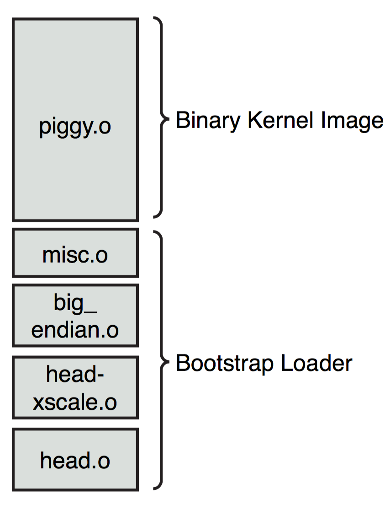
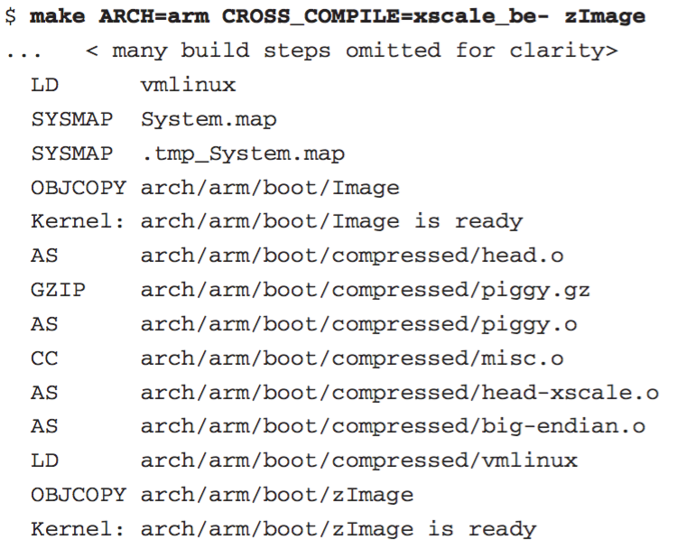
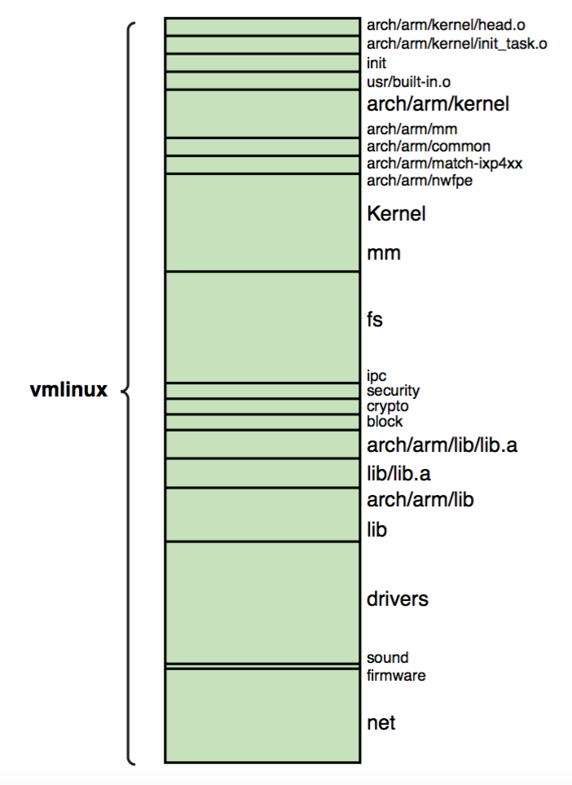
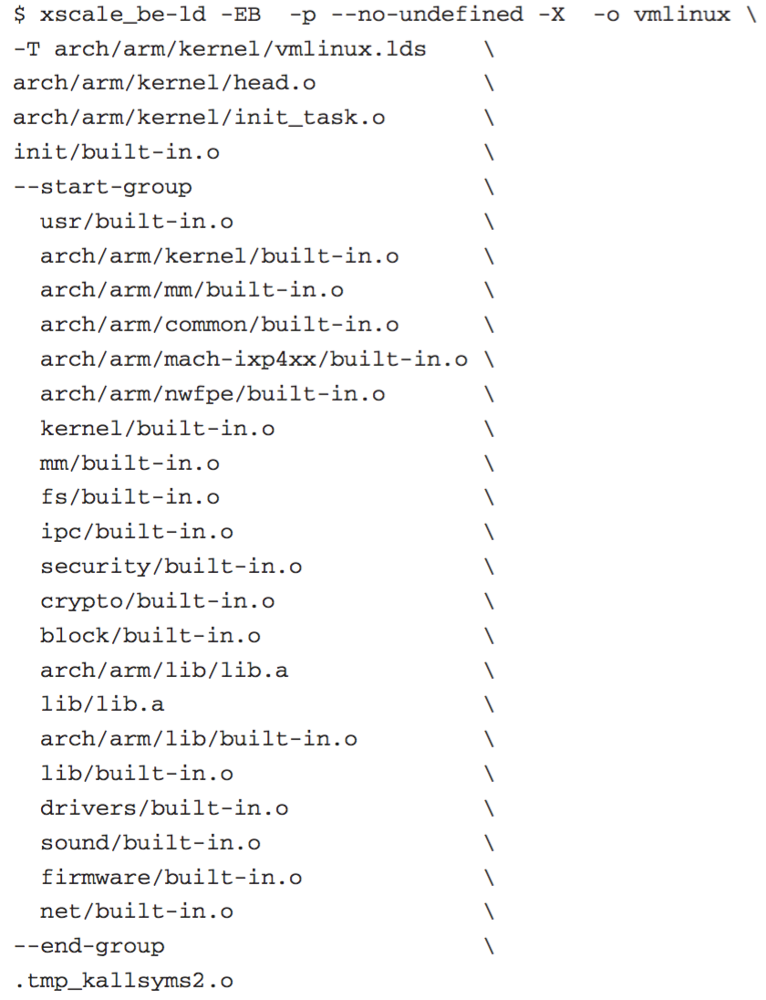
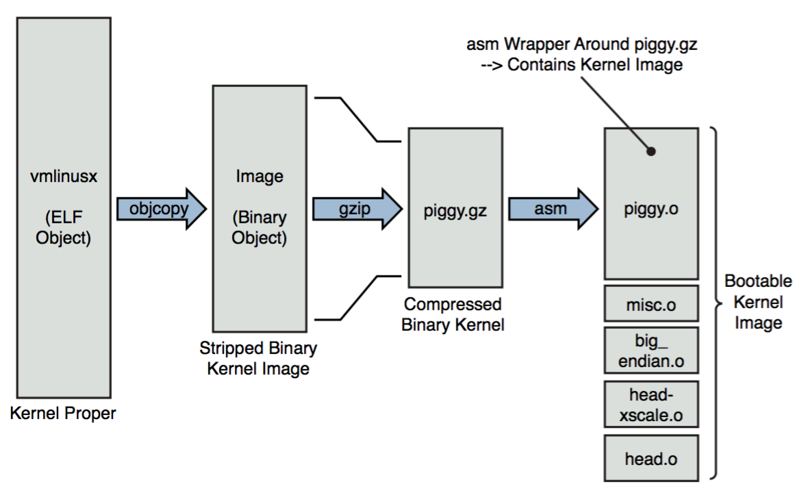
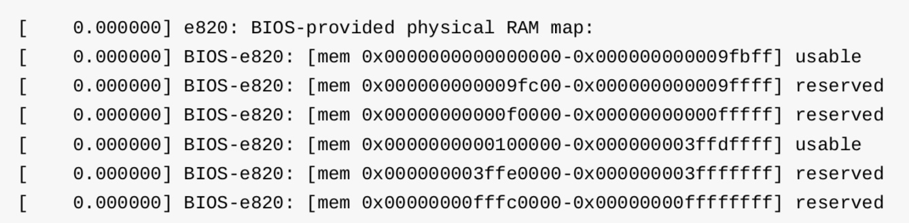

## Init - 3 Bootstrap Loader - x86

bootloader 在将对应的 vmlinuz 与 initramfs 加载到内存之后，即将 CPU 控制权传递给 vmlinuz 内核镜像中的 bootstrap loader


bootstrap loader 相当于第二阶段的加载程序，用于将内核加载入内存。

bootstrap loader 对处理器进行初始化、申请内存区域、解压缩二进制内核映像，并将其加载到内存的正确位置，之后将处理器的控制权交给内核映像。


### Intro to Bootstrap Loader

vmlinuz 实际包含了 compressed kernel image 与 bootstrap loader 两部分，bootstrap loader 的任务就是将 compressed kernel image 解压，同时执行 relocate 操作

vmlinuz 是 vmlinux 经过压缩的内核映像，vmlinux 是静态链接的可执行文件 (ELF) 格式的内核，其中包括了符号表、注释、调试信息等，vmlinux 实际上包含了 kernel image 与 bootstrap loader 两部分



#### kernel image

以下编译脚本为例



`LD vmlinux` 链接生成 vmlinux 内核映像，ELF 格式，其中包括符号、注释、调试符号等信息，其组成部分如下图所示




从以下链接脚本可以看出，vmlinux 包含以下部分

- `head.o` 是各个架构下的汇编文件，例如 arch/arm/kernel/head.s、arch/x86/kernel/head_64.S，编译的架构相关的目标文件，用于执内核底层的初始化，也是 vmlinux 执行时的入口；
- `init_task.o` 用于设置内核所需的初始线程和任务结构
- `built-in.o` 是内核的各个模块和子系统




接下来继续执行编译脚本中的

`SYSMAP System.map` 生成 System.map 符号表文件，该文件包含了符号（变量／函数名）与其对应的变量／函数地址，用于内核调试时的地址与符号间的转换；
`SYSMAP .tmp_System.map` 生成文件用于 System.map 的验证；
`OBJCOPY .../Image` 生成 Image 二进制的内核映像文件，不含符号、注释、调试符号等信息；
`GZIP .../piggy.gz` 使用 gzip 将 Image 压缩，生成压缩的二进制内核映像文件 piggy.gz；
`AS .../piggy.o` 生成汇编格式的内核映像文件 piggy.o，以使得内核映像与之后生成的各模块链接生成可启动的内核映像；


到这里为止，就得到了 vmlinuz 中的 compressed kernel image 即 piggy.gz


#### bootstrap loader

接下来继续执行编译脚本中的

`AS .../head.o` 生成 head.o 模块，也是由各个架构下的汇编代码编译而来，例如 arch/arm/boot/compressed/head.S、arch/x86/boot/header.S，该模块负责从 bootloader 接过处理器的控制权，执行底层架构以及处理器架构相关的任务

`CC .../misc.o` 生成内核映像 (piggy.gz) 的解压缩模块 misc.o；
`AS .../head-xsacle.o` 生成 head-xscale.o 模块，执行 XScale 处理器架构的初始化；
`AS .../big-endian.o` 生成 big-endian.o 模块，由汇编代码编译而来，使得特定特定架构的处理器进入大端模式；
`LD .../vmlinux` 将各模块（piggy.o、misc.o、head.o、misc.o、head-xscale.o 等）链接生成二进制的内核映像文件 vmlinux，该文件由二进制的内核映像 (piggy.o) 与 Bootstrap Loader (head.o、misc.o、head-xscale.o、big-endian.o) 两部分构成。



`arch/arm/boot/compressed/piggy.gzip.S` 定义压缩的二进制内核映像文件 piggy.gz 作为 bootstrap loader 映像的负载，其中 `input_data` 与 `input_data_end` 定义该压缩二进制内核映像的边界。

```
	.section .piggydata,#alloc
	.globl	input_data
input_data:
	.incbin	"arch/arm/boot/compressed/piggy.gzip"
	.globl	input_data_end
input_data_end:
```


### entry

bootstrap loader 的入口为 _start，`arch/x86/boot/header.S` 中定义

```asm
	# offset 512, entry point

	.globl	_start
_start:
		# Explicitly enter this as bytes, or the assembler
		# tries to generate a 3-byte jump here, which causes
		# everything else to push off to the wrong offset.
		.byte	0xeb		# short (2-byte) jump
		.byte	start_of_setup-1f
```

0xeb 为 jmp 指令的二进制码，因而 bootstrap loader 的入口即为跳转执行 start_of_setup


1. preliminary

bootloader 在将控制权传递给 bootstrap loader 之前，会将 segment register 设置为

```
segment = vmlinuz_load_address
ss = ds = es = fs = gs = segment
cs = segment + 20
```


2. segment register align

之后将 ESP (stack pointer) 寄存器的值按照 4 字节对齐

```asm
	.section ".entrytext", "ax"
start_of_setup:
# Force %es = %ds
	movw	%ds, %ax
	movw	%ax, %es
	cld
```

首先确保 ds 与 es 寄存器具有相同的值，之后执行 cld 指令以清除 EFLAGS 寄存器中的 DF (Direction Flag)


> stack setup

```asm
# Apparently some ancient versions of LILO invoked the kernel with %ss != %ds,
# which happened to work by accident for the old code.  Recalculate the stack
# pointer if %ss is invalid.  Otherwise leave it alone, LOADLIN sets up the
# stack behind its own code, so we can't blindly put it directly past the heap.

	movw	%ss, %dx
	cmpw	%ax, %dx	# %ds == %ss?
	movw	%sp, %dx
	je	2f		# -> assume %sp is reasonably set
```

首先确保 ss 寄存器具有与 ds 寄存器相同的值，即 vmlinuz 的 load address，之后跳转执行 label 2


```asm
2:	# Now %dx should point to the end of our stack space
	andw	$~3, %dx	# dword align (might as well...)
	jnz	3f
	movw	$0xfffc, %dx	# Make sure we're not zero
```

在之前的操作中，dx 寄存器只能够保存 sp (stack pointer) 寄存器的值，即此时 dx 寄存器中保存栈的顶部位置，此时将 stack pointer 的值按照 4 字节对齐，之后跳转执行 label 3


```asm
3:	movw	%ax, %ss
	movzwl	%dx, %esp	# Clear upper half of %esp
	sti			# Now we should have a working stack
```

将 dx 寄存器中的值返回给 esp 寄存器，最后执行 sti 指令以设置 EFLAGS 寄存器的 interrupt flag bit


3. check signature

之后检查 magic signature

```asm
# Check signature at end of setup
	cmpl	$0x5a5aaa55, setup_sig
	jne	setup_bad
```


4. BSS setup

之后设置 BSS section

```asm
# Zero the bss
	movw	$__bss_start, %di
	movw	$_end+3, %cx
	xorl	%eax, %eax
	subw	%di, %cx
	shrw	$2, %cx
	rep; stosl
```

将 (__bss_start , _end) 标识区域清为 0， (\\\__bss_start , _end) 实际包含 bss section 与 heap section 两部分


5. jump to c code

```asm
# Jump to C code (should not return)
	calll	main
```

最后跳转执行 real mode 下的 main 函数


### main in real mode

`arch/x86/boot/main.c` 中定义 real mode 下 bootstrap loader 执行的 main 函数，其主要任务是将 CPU 由 real mode 切换到 protected mode 即 32 bit mode，之后 CPU 就可以访问 4GB 地址空间

```c
void main(void)
{
	/* First, copy the boot header into the "zeropage" */
	copy_boot_params();

	/* Initialize the early-boot console */
	console_init();
	if (cmdline_find_option_bool("debug"))
		puts("early console in setup code\n");

	/* End of heap check */
	init_heap();

	/* Make sure we have all the proper CPU support */
	if (validate_cpu()) {
		puts("Unable to boot - please use a kernel appropriate"
		     "for your CPU.\n");
		die();}

	/* Tell the BIOS what CPU mode we intend to run in. */
	set_bios_mode();

	/* Detect memory layout */
	detect_memory();

	/* Set keyboard repeat rate (why?) and query the lock flags */
	keyboard_init();

	/* Query MCA information */
	query_mca();

	/* Query Intel SpeedStep (IST) information */
	query_ist();

	/* Query APM information */
#if defined(CONFIG_APM) || defined(CONFIG_APM_MODULE)
	query_apm_bios();
#endif

	/* Query EDD information */
#if defined(CONFIG_EDD) || defined(CONFIG_EDD_MODULE)
	query_edd();
#endif

	/* Set the video mode */
	set_video();

	/* Do the last things and invoke protected mode */
	go_to_protected_mode();}
```

1. detect memory

bootstrap loader 会调用 BIOS 的相关接口收集系统的所有 RAM 的信息，包括每个 RAM segment 的 base physical address、size、type




2. last preparation

最终 main() 函数调用 go_to_protected_mode()，以准备切换到 protected mode，其中

- 调用 realmode_switch_hook()，以 disable NMI
- 调用 enable_a20() 使能 address bus 的 bit 20 以使能 32 bit 地址空间
- 调用 reset_coprocessor() 以重置 coprocessor
- 调用 mask_all_interrupts()以 disable PIC (programmable interrupt controller)
- 调用 setup_idt() 将 IDTR 寄存器的值清为 0（因为此时还没有初始化 IDT）


3. setup GDT

go_to_protected_mode() 中会调用 setup_gdt() 将 GDTR 寄存器的值设置为静态定义的 GDT 的地址

```c
	/* There are machines which are known to not boot with the GDT
	   being 8-byte unaligned.  Intel recommends 16 byte alignment. */
	static const u64 boot_gdt[] __attribute__((aligned(16))) = {
		/* CS: code, read/execute, 4 GB, base 0 */
		[GDT_ENTRY_BOOT_CS] = GDT_ENTRY(0xc09b, 0, 0xfffff),
		/* DS: data, read/write, 4 GB, base 0 */
		[GDT_ENTRY_BOOT_DS] = GDT_ENTRY(0xc093, 0, 0xfffff),
		/* TSS: 32-bit tss, 104 bytes, base 4096 */
		/* We only have a TSS here to keep Intel VT happy;
		   we don't actually use it for anything. */
		[GDT_ENTRY_BOOT_TSS] = GDT_ENTRY(0x0089, 4096, 103),
	};
```

程序中静态定义了一个包含三个 segment descriptor 的 GDT，其中包含的三个 segment descriptor 分别为

- code segment, base 0, size 4G
- data segment, base 0, size 4G
- task state segment, base 4K, size 104 bytes

其中 code segment 保存在 GDT 的第 3 个 entry slot，其后依次为 data segment、task state segment


4. switch to protected mode

go_to_protected_mode()中最终调用 protected_mode_jump() 切换到 protected mode

处理器在切换到 proteced mode 之后会调用 in_pm32()


### prepare for protected mode

in_pm32() 定义在 .text32 section 中

```asm
	.code32
	.section ".text32","ax"
GLOBAL(in_pm32)
```

1. setup segment selector register

```asm
	# Set up data segments for flat 32-bit mode
	movl	%ecx, %ds
	movl	%ecx, %es
	movl	%ecx, %fs
	movl	%ecx, %gs
	movl	%ecx, %ss
```

之前 ecx 寄存器保存 data segment entry 在 GDT 中的偏移，以字节为单位，此时将 ds、es、fs、gs、ss 寄存器的值分别设置为 ecx 寄存器的值，以使得 data segment selector 与 stack segment selector 均指向 GDT 中的 data segment descriptor


2. setup stack pointer register

```asm
	# The 32-bit code sets up its own stack, but this way we do have
	# a valid stack if some debugging hack wants to use it.
	addl	%ebx, %esp
```

3. clear general registers

```asm
	# Clear registers to allow for future extensions to the
	# 32-bit boot protocol
	xorl	%ecx, %ecx
	xorl	%edx, %edx
	xorl	%ebx, %ebx
	xorl	%ebp, %ebp
	xorl	%edi, %edi
```

之后将多个 general register 均清为 0


4. jump to entry

```asm
	jmpl	*%eax			# Jump to the 32-bit entrypoint
ENDPROC(in_pm32)
```

之前 eax 寄存器保存 protected mode entry point，此时跳转执行该 protected mode entry point


### entry in protected mode

`arch/x86/boot/compressed/header_64.S` 中定义 protected mode 下的 entry point

```asm
	__HEAD
	.code32
ENTRY(startup_32)
```

1. clear DF

```asm
	/*
	 * 32bit entry is 0 and it is ABI so immutable!
	 * If we come here directly from a bootloader,
	 * kernel(text+data+bss+brk) ramdisk, zero_page, command line
	 * all need to be under the 4G limit.
	 */
	cld
```

清除 EFLAGS 寄存器的 direction flag bit


2. calculate delta between compile address and load address

`arch/x86/boot/compressed/vmlinux.lds.S` 中定义

```asm
SECTIONS
{
	/* Be careful parts of head_64.S assume startup_32 is at
	 * address 0.
	 */
	. = 0;
	...
}
```

在编译链接阶段指定整个 vmlinuz 的起始 load address 为 0，但是实际运行过程中 vmlinuz 可能被加载到不同的 physical address，此时需要计算这两个地址之间的差

```asm
/*
 * Calculate the delta between where we were compiled to run
 * at and where we were actually loaded at.  This can only be done
 * with a short local call on x86.  Nothing  else will tell us what
 * address we are running at.  The reserved chunk of the real-mode
 * data at 0x1e4 (defined as a scratch field) are used as the stack
 * for this calculation. Only 4 bytes are needed.
 */
	leal	(BP_scratch+4)(%esi), %esp
	call	1f
1:	popl	%ebp
	subl	$1b, %ebp
```

- popl	%ebp
ebp 寄存器保存 label 1 实际的 load adddress

- subl	$1b, %ebp
ebp 寄存器保存 label 1 实际的 load adddress 与编译时链接的 load address 之间的差


3. setup stack

在程序中静态定义 BOOT_STACK_SIZE 即 0x4000 即 16 KB 的 stack

```asm
/*
 * Stack and heap for uncompression
 */
	.bss
	.balign 4
boot_heap:
	.fill BOOT_HEAP_SIZE, 1, 0
boot_stack:
	.fill BOOT_STACK_SIZE, 1, 0
boot_stack_end:
```


此时将这块预定义的 stack 的地址保存到 esp 寄存器，以启用该 stack

```asm
/* setup a stack and make sure cpu supports long mode. */
	movl	$boot_stack_end, %eax
	addl	%ebp, %eax
	movl	%eax, %esp
```


4. CPU verification

接下来调用 verify_cpu 检查当前 CPU 是否支持 64-bit mode

```asm
	call	verify_cpu
```


5. relocation prepare

```asm
/*
 * Compute the delta between where we were compiled to run at
 * and where the code will actually run at.
 *
 * %ebp contains the address we are loaded at by the boot loader and %ebx
 * contains the address where we should move the kernel image temporarily
 * for safe in-place decompression.
 */

#ifdef CONFIG_RELOCATABLE
	movl	%ebp, %ebx
	movl	BP_kernel_alignment(%esi), %eax
	decl	%eax
	addl	%eax, %ebx
	notl	%eax
	andl	%eax, %ebx
#else
	movl	$LOAD_PHYSICAL_ADDR, %ebx
#endif

	/* Target address to relocate to for decompression */
	addl	$z_extract_offset, %ebx
```

- ebp 寄存器保存 startup_32 实际的 load address
- 接下来 relocation 操作过程中需要将 vmlinux 解压到 ebx 寄存器描述的地址


6. setup new GDT

接下来需要设置新的 GDT

程序中静态定义 64-bit mode 下使用的 GDT，其位于 .data section 中

```asm
	.data
gdt:
	.word	gdt_end - gdt
	.long	gdt
	.word	0
	.quad	0x0000000000000000	/* NULL descriptor */
	.quad	0x00af9a000000ffff	/* __KERNEL_CS */
	.quad	0x00cf92000000ffff	/* __KERNEL_DS */
	.quad	0x0080890000000000	/* TS descriptor */
	.quad   0x0000000000000000	/* TS continued */
gdt_end:
```

- entry 0 为 NULL entry
- entry 1 为 code segment descriptor, base 0, size 1 MB
- entry 1 为 data segment descriptor, base 0, size 1 MB


```asm
	/* Load new GDT with the 64bit segments using 32bit descriptor */
	leal	gdt(%ebp), %eax
	movl	%eax, gdt+2(%ebp)
	lgdt	gdt(%ebp)
```

因而将以上定义的 new GDT 的地址保存到 GDTR 寄存器中，以启用该 new GDT


7. enable PAE

```asm
	/* Enable PAE mode */
	movl	$(X86_CR4_PAE), %eax
	movl	%eax, %cr4
```


8. init early 4G boot page table

接下来初始化 early boot page table，见 `IA Memory Init - 1 Global Page Table Init`


9. enable 64-bit mode

```asm
	/* Enable Long mode in EFER (Extended Feature Enable Register) */
	movl	$MSR_EFER, %ecx
	rdmsr
	btsl	$_EFER_LME, %eax
	wrmsr
```

置位 MSR 的 EFER.LME flag bit


```asm
	/*
	 * Setup for the jump to 64bit mode
	 *
	 * When the jump is performend we will be in long mode but
	 * in 32bit compatibility mode with EFER.LME = 1, CS.L = 0, CS.D = 1
	 * (and in turn EFER.LMA = 1).	To jump into 64bit mode we use
	 * the new gdt/idt that has __KERNEL_CS with CS.L = 1.
	 * We place all of the values on our mini stack so lret can
	 * used to perform that far jump.
	 */
	pushl	$__KERNEL_CS
	leal	startup_64(%ebp), %eax
	pushl	%eax
```

将 64-bit mode 下的 entry point 即 startup_64 的地址入栈


```asm
	/* Enter paged protected Mode, activating Long Mode */
	movl	$(X86_CR0_PG | X86_CR0_PE), %eax /* Enable Paging and Protected mode */
	movl	%eax, %cr0

	/* Jump from 32bit compatibility mode into 64bit mode. */
	lret
```

之后跳转执行 64-bit mode 下的 entry point 即 startup_64，跳转完成后处理器即进入 64-bit mode


### entry in 64-bit mode

`arch/x86/boot/compressed/head_64.S` 中定义 64-bit mode 下 bootstrap loader 的 entry point，即 startup_64

```asm
	.code64
	.org 0x200
ENTRY(startup_64)
	/*
	 * 64bit entry is 0x200 and it is ABI so immutable!
	 * We come here either from startup_32 or directly from a
	 * 64bit bootloader.
	 * If we come here from a bootloader, kernel(text+data+bss+brk),
	 * ramdisk, zero_page, command line could be above 4G.
	 * We depend on an identity mapped page table being provided
	 * that maps our entire kernel(text+data+bss+brk), zero page
	 * and command line.
	 */
```


1. setup data segment selector

```asm
	/* Setup data segments. */
	xorl	%eax, %eax
	movl	%eax, %ds
	movl	%eax, %es
	movl	%eax, %ss
	movl	%eax, %fs
	movl	%eax, %gs
```


2. relocation prepare

```asm
	/*
	 * Compute the decompressed kernel start address.  It is where
	 * we were loaded at aligned to a 2M boundary. %rbp contains the
	 * decompressed kernel start address.
	 *
	 * If it is a relocatable kernel then decompress and run the kernel
	 * from load address aligned to 2MB addr, otherwise decompress and
	 * run the kernel from LOAD_PHYSICAL_ADDR
	 *
	 * We cannot rely on the calculation done in 32-bit mode, since we
	 * may have been invoked via the 64-bit entry point.
	 */

	/* Start with the delta to where the kernel will run at. */
#ifdef CONFIG_RELOCATABLE
	leaq	startup_32(%rip) /* - $startup_32 */, %rbp
	movl	BP_kernel_alignment(%rsi), %eax
	decl	%eax
	addq	%rax, %rbp
	notq	%rax
	andq	%rax, %rbp
#else
	movq	$LOAD_PHYSICAL_ADDR, %rbp
#endif

	/* Target address to relocate to for decompression */
	leaq	z_extract_offset(%rbp), %rbx
```

- rbp 寄存器保存解压后内核的 load address
- rbx 寄存器保存内核重定位的目标地址


3. setup stack

```asm
	/* Set up the stack */
	leaq	boot_stack_end(%rbx), %rsp
```

重新设置 stack pointer register


4. kernel relocation

```asm
/*
 * Copy the compressed kernel to the end of our buffer
 * where decompression in place becomes safe.
 */
	pushq	%rsi
	leaq	(_bss-8)(%rip), %rsi
	leaq	(_bss-8)(%rbx), %rdi
	movq	$_bss /* - $startup_32 */, %rcx
	shrq	$3, %rcx
	std
	rep	movsq
	cld
	popq	%rsi
```


5. jump to relocated code

```asm
/*
 * Jump to the relocated address.
 */
	leaq	relocated(%rbx), %rax
	jmp	*%rax
```

接下来跳转执行 relocation 之后的代码


6. setup BBS

```asm
/*
 * Clear BSS (stack is currently empty)
 */
	xorl	%eax, %eax
	leaq    _bss(%rip), %rdi
	leaq    _ebss(%rip), %rcx
	subq	%rdi, %rcx
	shrq	$3, %rcx
	rep	stosq
```


7. kernel decompression

```asm
/*
 * Do the decompression, and jump to the new kernel..
 */
	pushq	%rsi			/* Save the real mode argument */
	movq	%rsi, %rdi		/* real mode address */
	leaq	boot_heap(%rip), %rsi	/* malloc area for uncompression */
	leaq	input_data(%rip), %rdx  /* input_data */
	movl	$z_input_len, %ecx	/* input_len */
	movq	%rbp, %r8		/* output target address */
	call	decompress_kernel
	popq	%rsi
```


8. jump to kernel entry

```asm
/*
 * Jump to the decompressed kernel.
 */
	jmp	*%rbp
```

最后跳转执行 kernel entry 即 `arch/x86/kernel/head_64.S` 中定义的 startup_64
