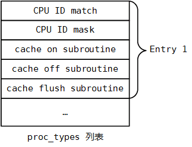

## Init - 2 Bootstrap Loader - ARM

系统初始化过程中 bootloader 在完成底层硬件的初始化、操作系统映像的加载等操作后，会将控制权转交给 Bootstrap Loader，此时 bootloader 已经设置

- MMU = off, D-cache = off, I-cache = dont care
- r0 = 0
- r1 = 架构 (machine type number)
- r2 = 存储内核参数列表的物理地址 (physical address of tagged list or dtb pointer)

同时 CPU 处于 SVC mode，FIQ/IRQ disabled，MMU disabled

Bootstrap Loader 的入口 head.o 是架构相关的，`arch/arm/boot/compressed/head.S` 中定义 arm32 架构下的 bootstrap loader


### entry point

0. entry

`arch/arm/boot/compressed/vmlinux.lds.in` 中定义 bootstrap loader 的 entry point 为 _start 地址处的代码，_start 地址处为各个 .o 文件的 .start section

```s
ENTRY(_start)
SECTIONS
{
  ...
  .text : {
    _start = .;
    *(.start)
    *(.text)
    *(.text.*)
    ...
  }
  ...
}
```


`arch/arm/boot/compressed/head.S` 中定义的 .start section 为

```s
		.section ".start", #alloc, #execinstr
/*
 * sort out different calling conventions
 */
		.align
		.arm				@ Always enter in ARM state
start:
		...
```

start label 处即为 bootstrap loader 的入口


1. start 

```s
start:
		.type	start,#function
		.rept	7
		mov	r0, r0
		.endr
   ARM(mov	r0, r0)
   ARM(b	1f)
 THUMB(adr	r12, BSYM(1f))
 THUMB(bx	r12)
```

一共执行 8 条 mov r0,r0 指令，即 nop 指令，每条指令为 32 bit 即 4 字节，因而这 8 条指令一共占用 32 字节，之后其中的 28 字节用于存储 arm 的中断向量表 vector (arm 处理器一共有 7 种工作模式，因而 vector 占用 28 字节)

`b	1f` 跳转到 1 label 处，f 表示向前寻找该 label (searching forward)


2. save parameter from bootloader

```s
1:
		mrs	r9, cpsr
#ifdef CONFIG_ARM_VIRT_EXT
		bl	__hyp_stub_install	@ get into SVC mode, reversibly
#endif
		mov	r7, r1			@ save architecture ID
		mov	r8, r2			@ save atags pointer
```

`mrs r9, cpsr` 将当前模式下的 CPSR 寄存器的值保存到 r9

`mov r7, r1` 将 r1 寄存器的值保存到 r7，bootloader 转换到 bootstrap loader 之前在 r1 中保存 machine number

`mov r8, r2` 将 r2 寄存器的值保存到 r8，bootloader 转换到 bootstrap loader 之前在 r1 中保存内核参数列表的物理地址（physical address of tagged list）


3. SVC mode

```s
		/*
		 * Booting from Angel - need to enter SVC mode and disable
		 * FIQs/IRQs (numeric definitions from angel arm.h source).
		 * We only do this if we were in user mode on entry.
		 */
		mrs	r2, cpsr		@ get current mode
		tst	r2, #3			@ not user?
		bne	not_angel
		mov	r0, #0x17		@ angel_SWIreason_EnterSVC
 ARM(swi	0x123456)	@ angel_SWI_ARM
 THUMB(svc	0xab)	@ angel_SWI_THUMB
not_angel:
		safe_svcmode_maskall r0
		msr	spsr_cxsf, r9	@ Save the CPU boot mode in SPSR
```

通过 CPSR 寄存器的值判断处理器当前是否处于 USR mode，CPSR M[4:0] 描述当前处理器的模式，当处理器处于 USR mode 时 CPSR 的 low 2 bit 为 0，此时不会跳转 not_angel label，而必须执行之后的 swi 指令进入 SVC mode，否则跳过 swi 指令跳转到 not_angel label 处


not_angel label 处，调用 safe_svcmode_maskall 宏，其中使处理器进入 SVC mode，并 disable IRQ/FIQ

`msr spsr_cxsf, r9` 将 r9 中保存的上一个模式的 CPSR 的值保存到 SPSR 中


> 3.1. safe_svcmode_maskall

`arch/arm/include/asm/assembler.h` 中定义 safe_svcmode_maskall 宏

```s
/*
 * Helper macro to enter SVC mode cleanly and mask interrupts. reg is
 * a scratch register for the macro to overwrite.
 *
 * This macro is intended for forcing the CPU into SVC mode at boot time.
 * you cannot return to the original mode.
 */
.macro safe_svcmode_maskall reg:req
#if __LINUX_ARM_ARCH__ >= 6
	mrs	\reg , cpsr
	eor	\reg, \reg, #HYP_MODE
	tst	\reg, #MODE_MASK
	bic	\reg , \reg , #MODE_MASK
	orr	\reg , \reg , #PSR_I_BIT | PSR_F_BIT | SVC_MODE
THUMB(orr	\reg , \reg , #PSR_T_BIT)
	bne	1f
	orr	\reg, \reg, #PSR_A_BIT
	adr	lr, BSYM(2f)
	msr	spsr_cxsf, \reg
	__MSR_ELR_HYP(14)
	__ERET
1:	msr	cpsr_c, \reg
2:
#else
/*
 * workaround for possibly broken pre-v6 hardware
 * (akita, Sharp Zaurus C-1000, PXA270-based)
 */
	setmode	PSR_F_BIT | PSR_I_BIT | SVC_MODE, \reg
#endif
.endm
```

- bic \reg , \reg , #MODE_MASK 将 CPSR M[4:0] 清空为 0
- orr	\reg , \reg , #PSR_I_BIT | PSR_F_BIT | SVC_MODE 设置 CPSR 以 disables IRQ/FIQ interrupts，设置处理器工作模式为 SVC mode


4. save ZRELADDR

```s
#ifdef CONFIG_AUTO_ZRELADDR
		@ determine final kernel image address
		mov	r4, pc
		and	r4, r4, #0xf8000000
		add	r4, r4, #TEXT_OFFSET
#else
		ldr	r4, =zreladdr
#endif
```

若 CONFIG_AUTO_ZRELADDR 配置项未定义，则将 zreladdr 的值保存到 r4 中

`arch/arm/boot/compressed/Makefile` 中定义

```
ifneq ($(CONFIG_AUTO_ZRELADDR),y)LDFLAGS_vmlinux += --defsym zreladdr=$(ZRELADDR)
endif
```

`arch/arm/boot/Makefile` 中定义

```
ZRELADDR    := $(zreladdr-y)
```

`arch/arm/mach-xxx/Makefile.boot` 中定义 zreladdr-y，例如 `arch/arm/mach-tegra/Makefile.boot` 中

```
zreladdr-y	:= 0x80008000
params_phys-y	:= 0x80000100
initrd_phys-y	:= 0x80800000
```

ZRELADDR 表示解压后的 kernel image 在内存中的 base physical address


```s
bl	cache_on
```

之后跳转到 cache_on label，开启缓存以及 MMU


### turn on MMU

```s
/*
 * Turn on the cache.  We need to setup some page tables so that we
 * can have both the I and D caches on.
 *
 * We place the page tables 16k down from the kernel execution address,
 * and we hope that nothing else is using it.  If we're using it, we
 * will go pop!
 *
 * On entry,
 *  r4 = kernel execution address
 *  r7 = architecture number
 *  r8 = atags pointer
 * On exit,
 *  r0, r1, r2, r3, r9, r10, r12 corrupted
 * This routine must preserve:
 *  r4, r7, r8
 */
		.align	5
cache_on:	mov	r3, #8		@ cache_on function
		b	call_cache_fn
```

跳转到 call_cache_fn label


1. call_cache_fn

```s
call_cache_fn:	adr	r12, proc_types
#ifdef CONFIG_CPU_CP15
		mrc	p15, 0, r9, c0, c0 @ get processor ID
#else
		ldr	r9, =CONFIG_PROCESSOR_ID
#endif
```

> 1.1 

`adr	r12, proc_types` 将 proc_types label 的地址保存到 r12

proc_types table 中存储所有 arm 处理器型号对应的 cache on handler、cache off handler 以及 cache flush handler



```s
/*
 * Table for cache operations.  This is basically:
 *   - CPU ID match
 *   - CPU ID mask
 *   - 'cache on' method instruction
 *   - 'cache off' method instruction
 *   - 'cache flush' method instruction
 *
 * We match an entry using: ((real_id ^ match) & mask) == 0
 *
 * Writethrough caches generally only need 'on' and 'off'
 * methods.  Writeback caches _must_ have the flush method
 * defined.
 */
		.align	2
		.type	proc_types,#object
proc_types:

		/* CPU ID match */
		.word	0x41000000		@ old ARM ID    
		
		/* CPU ID mask */
		.word	0xff00f000                      
		
		/* 'cache on' method instruction */
		mov	pc, lr
 THUMB(nop)
		
		/* 'cache off' method instruction */
		mov	pc, lr
 THUMB(nop)
 
 		/* 'cache flush' method instruction */
		mov	pc, lr
 THUMB(nop)

		.word	0x41007000		@ ARM7/710
		.word	0xfff8fe00
		mov	pc, lr
 THUMB(nop)
		mov	pc, lr
 THUMB(nop)
		mov	pc, lr
 THUMB(nop)
 
 ...
```


> 1.2

```s
#ifdef CONFIG_CPU_CP15
		mrc	p15, 0, r9, c0, c0	@ get processor ID
#else
		ldr	r9, =CONFIG_PROCESSOR_ID
#endif
```

如果定义了 CONFIG_CPU_CP15，则表明具有协处理器 CP15，那么将从 CP15 中获取处理器 ID，否则从 CONFIG_PROCESSOR_ID 中获取，获取的 processor ID 保存在 r9 寄存器中


> 1.3

```s
1:		ldr	r1, [r12, #0]		@ get value
		ldr	r2, [r12, #4]		@ get mask
		eor	r1, r1, r9		@ (real ^ match)
		tst	r1, r2			@       & mask
 ARM(addeq	pc, r12, r3) @ call cache function
 THUMB(addeq	r12, r3)
 THUMB(moveq	pc, r12) @ call cache function
		add	r12, r12, #PROC_ENTRY_SIZE
		b	1b
```

遍历 proc_types table，获取 proc_types table 中当前处理器对应的 entry，找到后 r12 中保存对应的 entry 的地址

- addeq	pc, r12, r3 r3 寄存器的值为立即数 8，此时 r12 加上 8 即为当前处理器对应的 entry 中的 cache on handler，之后将 cache on handler 的地址保存到 PC 寄存器，此时跳转执行对应的 cache on handler
- cache on handler 执行完毕后，跳转回 b 1b，即向后 (searching backward) 跳转到 1 label 处


> 1.4

以 ARMv7 为例，其 cache on handler 为 __armv7_mmu_cache_on

```s
		.word	0x000f0000		@ new CPU Id
		.word	0x000f0000
		W(b)	__armv7_mmu_cache_on
		W(b)	__armv7_mmu_cache_off
		W(b)	__armv7_mmu_cache_flush
```

```s
__armv7_mmu_cache_on:
		mov	r12, lr
#ifdef CONFIG_MMU
		mrc	p15, 0, r11, c0, c1, 4@ read ID_MMFR0
		tst	r11, #0xf		@ VMSA
		movne	r6, #CB_BITS | 0x02@ !XN
		blne	__setup_mmu
```

`mov	r12, lr` 在 r12 中保存 lr 寄存器的值

`mrc	p15, 0, r11, c0, c1, 4` 读取 ID_MMFR0 寄存器的值保存到 r11 中

- tst	r11, #0xf 判断 ID_MMFR0 寄存器的 bit[3~0] 是否为 0


VMSA support, bits[3:0] 的值有

0000 Not supported.
0001 Support for IMPLEMENTATION DEFINED VMSA.
0010 Support for VMSAv6, with Cache and TLB Type Registers implemented.
0011 Support for VMSAv7, with support for remapping and the Access flag. ARMv7-A profile.
0100 As for 0b0011, and adds support for the PXN bit in the Short-descriptor translation table format descriptors.
0101 As for 0b0100, and adds support for the Long-descriptor translation table format.

因而当支持 VMSA (Virtual Memory System Architecture) 时，ID_MMFR0 的 bit[3~0] 不为 0，此时跳转到 __setup_mmu label 处


2. __setup_mmu

> 2.1

```s
__setup_mmu:	sub	r3, r4, #16384 @ Page directory size
		bic	r3, r3, #0xff		@ Align the pointer
		bic	r3, r3, #0x3f00
```

`sub	r3, r4, #16384` r4 寄存器中保存 ZRELADDR，此时将 r4 的值减去 16384 并保存在 r3 中，即在 ZRELADDR 之后为 TLB entry 预留 16KB 的内存空间，之后执行 bic 指令使 r3 的值的低 14 bit 为 0，即使 first level translation table 的基地址按照 16 KB 对齐

32 位的寻址空间为 4GB，而每一个 first level page table entry 映射 1MB 的内存空间，则需要 4096 个页表项。同时每一个页表项的大小为 4Byte，那么就需要 4096 * 4Byte = 16384Byte = 16KB 的空间


> 2.2

```s
/*
 * Initialise the page tables, turning on the cacheable and bufferable
 * bits for the RAM area only.
 */
		mov	r0, r3
		mov	r9, r0, lsr #18
		mov	r9, r9, lsl #18	@ start of RAM
		add	r10, r9, #0x10000000 @ a reasonable RAM size
```

r3 中保存 first level translation table 的 base physical address，此时将该地址的 low 18 bits 清空为 0，即按照 256KB 对齐，此时 r9 即为 PHYS_OFFSET 即 memory start physical address


```s
		mov	r1, #0x12		   @ XN|U + section mapping
		orr	r1, r1, #3 << 10	@ AP=11
		add	r2, r3, #16384
1:		cmp	r1, r9			   @ if virt > start of RAM
		cmphs	r10, r1			   @   && end of RAM > virt
		bic	r1, r1, #0x1c		@ clear XN|U + C + B
		orrlo	r1, r1, #0x10		@ Set XN|U for non-RAM
		orrhs	r1, r1, r6		   @ set RAM section settings
		str	r1, [r0], #4		@ 1:1 mapping
		add	r1, r1, #1048576
		teq	r0, r2
		bne	1b
```

循环设置 first level translation table 中的 4096 项页表

- 将所有的 4096 个 table entry 的 bits[1:0] 设置为 0b10，即该 first descriptor 为 section descriptor
- 将所有的 4096 table entry 的 AP field 设置为 0b11，即 full access permission
- 将 PHYS_OFFSET 起始的 256MB 内存设置为 cacheable、bufferable


例如


```s
/*
 * If ever we are running from Flash, then we surely want the cache
 * to be enabled also for our execution instance...  We map 2MB of it
 * so there is no map overlap problem for up to 1 MB compressed kernel.
 * If the execution is in RAM then we would only be duplicating the above.
 */
		orr	r1, r6, #0x04		@ ensure B is set for this
		orr	r1, r1, #3 << 10
		mov	r2, pc
		mov	r2, r2, lsr #20
		orr	r1, r1, r2, lsl #20
		add	r0, r3, r2, lsl #2
		str	r1, [r0], #4
		add	r1, r1, #1048576
		str	r1, [r0]
		mov	pc, lr
```

最终跳回到 __armv7_mmu_cache_on 中


3. flush buffer

```s
		mov	r0, #0
		mcr	p15, 0, r0, c7, c10, 4 @ drain write buffer
		tst	r11, #0xf		@ VMSA
		mcrne	p15, 0, r0, c8, c7, 0 @ flush I,D TLBs
```

从 __setup_mmu 返回后，设置 CP15 register 7 以执行 Data Synchronization Barrier (formerly Drain Write Buffer) 操作


```s
		mrc	p15, 0, r0, c1, c0, 0 @ read control reg
		bic	r0, r0, #1 << 28	@ clear SCTLR.TRE
		orr	r0, r0, #0x5000	@ I-cache enable, RR cache replacement
		orr	r0, r0, #0x003c	@ write buffer
		bic	r0, r0, #2		@ A (no unaligned access fault)
		orr	r0, r0, #1 << 22	@ U (v6 unaligned access model) @ (needed for ARM1176)
#ifdef CONFIG_MMU
#ifdef CONFIG_CPU_ENDIAN_BE8
		orr	r0, r0, #1 << 25 @ big-endian page tables
#endif
		mrcne   p15, 0, r6, c2, c0, 2   @ read ttb control reg
		orrne	r0, r0, #1		@ MMU enabled
		movne	r1, #0xfffffffd	@ domain 0 = client
		bic     r6, r6, #1 << 31        @ 32-bit translation system
		bic     r6, r6, #3 << 0         @ use only ttbr0
		mcrne	p15, 0, r3, c2, c0, 0 @ load page table pointer
		mcrne	p15, 0, r0, c8, c7, 0 @ flush I,D TLBs
		mcr	p15, 0, r0, c7, c5, 4 @ ISB
		mcrne	p15, 0, r1, c3, c0, 0 @ load domain access control
		mcrne   p15, 0, r6, c2, c0, 2   @ load ttb control
#endif
		mcr	p15, 0, r0, c7, c5, 4 @ ISB
		mcr	p15, 0, r0, c1, c0, 0 @ load control register
		mrc	p15, 0, r0, c1, c0, 0 @ and read it back
		mov	r0, #0
		mcr	p15, 0, r0, c7, c5, 4 @ ISB
		mov	pc, r12
```

设置 CP15 register1 之后，通过 `mov pc, r12` 返回到 cache_on 中 `b cache_on` 的下一行，这是因为之前 r12 中保存 lr 寄存器的值，而当时 lr 寄存器的值即指向 `b cache_on` 的下一行


### decompress kernel image

1. prepare

```s
restart:	adr	r0, LC0
		ldmia	r0, {r1, r2, r3, r6, r10, r11, r12}
		ldr	sp, [r0, #28]
```

将 LC0 table 中的各项内容分别拷贝到 r1, r2, r3, r6, r10, r11, r12 寄存器中


LC0 table 的内容为

```s
		.align	2
		.type	LC0, #object
LC0:		.word	LC0			@ r1
		.word	__bss_start		@ r2
		.word	_end			@ r3
		.word	_edata			@ r6
		.word	input_data_end - 4 @ r10 (inflated size location)
		.word	_got_start		@ r11
		.word	_got_end		@ ip
		.word	.L_user_stack_end	@ sp
		.size	LC0, . - LC0
```

- r1 保存 LC0 table 的 virtual address
- r2 保存 bss section 的 base virtual address
- r3 保存 bss section 的 end virtual address 
- r6 保存 zImage 的 end virtual address
- r10 保存一个变量的地址，该变量描述解压后的 zImage 的大小
- r11 保存 GOT (Global Offset Table) 的 base virtual address
- r12 保存 L_user_stack_end 的 virtual address


```s
		.align
		.section ".stack", "aw", %nobits
.L_user_stack:	.space	4096
.L_user_stack_end:
```

L_user_stack_end 为临时分配的 user stack 的 stack bottom 的地址，4KB 大小


2. decompress_kernel

```s
bl	decompress_kernel
```

bl decompress_kernel 跳转到 decompress_kernel label 处解压缩内核映像，并重定位内核映像


3. __enter_kernel

```s
b	__enter_kernel
```

之后跳转到 __enter_kernel label 处


```s
__enter_kernel:
		mov	r0, #0			@ must be 0
 ARM(mov	pc, r4)		@ call kernel
 THUMB(bx	r4)		@ entry point is always ARM
```

之前 r4 寄存器中存储 kernel execution address，因而此时即跳转执行 kernel entry

kernel image 的 entry point 为 stext label

