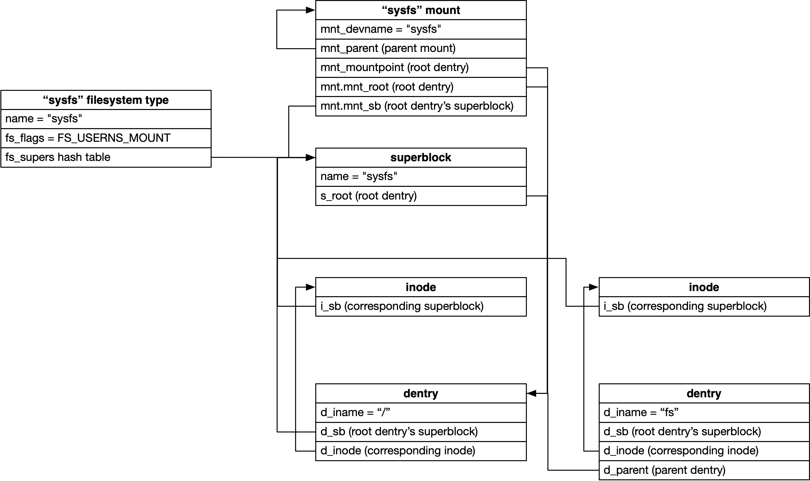
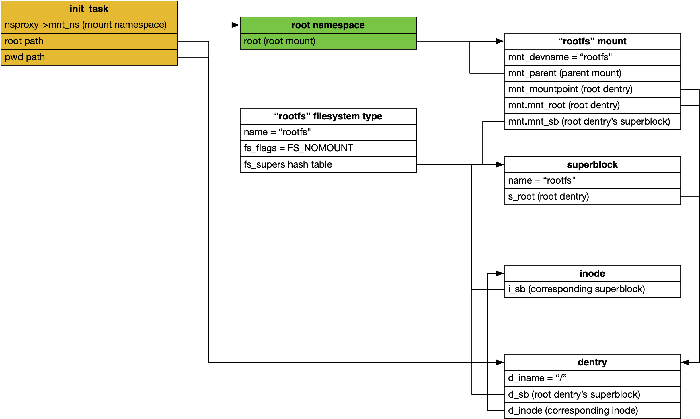

title:'Init - 6 rootfs'
## Init - 6 rootfs

系统初始化过程中需要挂载 root filesystem，VFS 支持多种形式的 root filesystem，例如 root filesystem 可以存储在

- ramdisk
- block device
- remote filesystem via NFS


root filesystem 的挂载分为以下两个步骤

- 首先挂载 special filesystem type 即 rootfs，此时 rootfs 只包含 empty directory
- 之后再挂载 real root filesystem


root filesystem 的挂载之所以分为以上两个步骤进行，是因为这样可以给 root filesystem 的挂载提供更多的灵活性，即在完成 rootfs 的挂载之后，VFS 可以多次挂载不同的 real root filesystem，例如

- 可以首先挂载 ramdisk root filesystem，ramdisk root filesystem 实际为一个 minimum filesystem，其中包含一些 block device 的驱动
- ramdisk 中的 block device 驱动加载之后，就可以识别并访问存储有真正的 root filesystem 的 block device，此时再挂载该 block device 中存储的 filesystem 作为真正的 root filesystem


### VFS init

系统初始化过程中，在 start_kernel() 中会调用 vfs_caches_init() 完成 VFS 的初始化，其中就会调用 mnt_init() 注册并挂载 sysfs 与 rootfs 文件系统

```sh
vfs_caches_init()
    |_ dcache_init()/* 创建并初始化目录 hash 表 dentry_hashtable */
    |_ inode_init() /* 创建并初始化索引节点 hash 表 inode_hashtable */
    |_ files_init() /* 设置内核可以打开的最大文件数 */
    |_ mnt_init()   /* 注册并挂载 sysfs 与 rootfs 文件系统 */
        |_ sysfs_init() /* 注册并挂载 sysfs 文件系统 */            
        |_ kobject_create_and_add("fs", NULL)   /* 在 sysfs 根目录下创建“fs”目录 */
        |_ init_rootfs()    /* 注册 rootfs 文件系统 */
        |_ init_mount_tree()/* 挂载 rootfs 文件系统 */

    |_ bdev_cache_init
    |_ chrdev_init
```


### sysfs init 

linux 设备模型中，sysfs 文件系统用于展示设备的层次结构，可将设备的层次结构反映到用户空间中，使得用户空间通过修改 sysfs 中的文件来修改设备的属性。

系统初始化过程中就会调用 sysfs_init() 注册并挂载 sysfs 文件系统。

```sh
sys_init()
    |_ register_filesystem()    /* 注册sysfs文件系统 */
    |_ kern_mount() /* 挂载sysfs文件系统 */
       |_ kern_mount_data()
           |_ vfs_kern_mount() /* 返回sysfs文件系统的挂载项（struct vfsmount） */
               |_ alloc_vfsmnt()   /* 创建并初始化挂载点（struct mount） */
               |_ mount_fs()   /* 返回sysfs文件系统的根目录 */
               |   |_ sysfs_mount()    /* 返回sysfs文件系统的根目录 */
               |       |_ sget()   /* 创建sysfs文件系统的块设备对应的超级块对象 */
               |       |   |_ alloc_super() /* 查找或创建超级块对象 */
               |       |_ sysfs_fill_super()
               |           |_ sysfs_get_inode()    /* 创建根目录的inode节点 */
               |           |_ d_make_root()    /* 创建sysfs文件系统的根目录 */
               |_ mnt->mnt.mnt_root = root; ... /* 初始化挂载项 */
            
```




### rootfs init

rootfs 的挂载分为两步进行

- init_rootfs() 注册 rootfs
- init_mount_tree() 初始化 VFS mount tree 同时挂载 rootfs filesystem

```sh
mnt_init()
    |_ init_rootfs()    /* 注册rootfs文件系统 */
    |   |_ register_filesystem()
    |_ init_mount_tree()    /* 挂载rootfs文件系统 */
        |_ vfs_kern_mount() /* 返回rootfs文件系统的挂载项（struct vfsmount） */
        |    |_ alloc_vfsmnt()   /* 创建并初始化挂载点（struct mount） */
        |    |_ mount_fs()   /* 返回rootfs文件系统的根目录 */
        |    |   |_ rootfs_mount()    /* 返回rootfs文件系统的根目录 */
        |    |      |_ mount_nodev   
        |    |          |_ sget()   /* 创建rootfs文件系统的块设备对应的超级块对象 */
        |    |          |_ fill_super()
        |    |           |_ new_inode()    /* 创建根目录的inode节点 */
        |    |           |_ d_make_root()    /* 创建rootfs文件系统的根目录 */
        |    |_ mnt->mnt.mnt_root = root; ... /* 初始化挂载项 */ 
        |_ create_mnt_ns()  /* 创建命名空间ns，其挂载点为rootfs文件系统的挂载点 */
        |_ init_task.nsproxy->mnt_ns = ns   /* 设置init_task的命名空间为ns */
        |_ set_fs_pwd() /* 设置init_task的当前目录为rootfs文件系统的根目录 */
        |_ set_fs_root()    /* 设置init_task的根目录为rootfs文件系统的根目录 */
```


此时只有 rootfs 文件系统处于当前进程即 process 0 即 init_task 的命名空间中，且进程的当前目录与根目录均指向 rootfs 文件系统的 "/" 根目录，此时进程可以进行文件操作和其他文件系统的挂载操作

此时 sysfs 并未挂载在 rootfs 的任何目录下，之后将由用户态 init 进程将 sysfs 重新挂载到 real root filesystem 的 /sys 目录下




