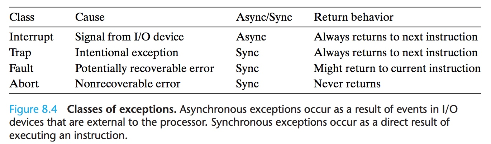
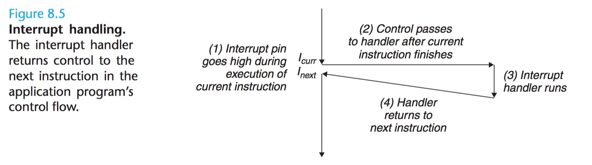
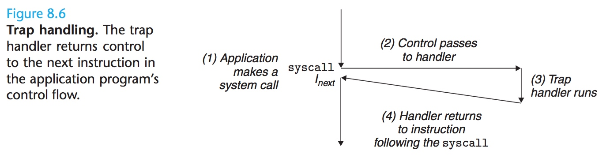
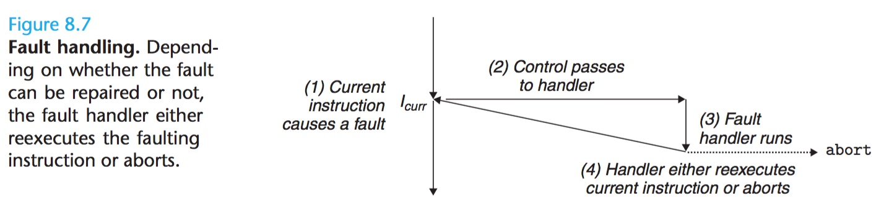
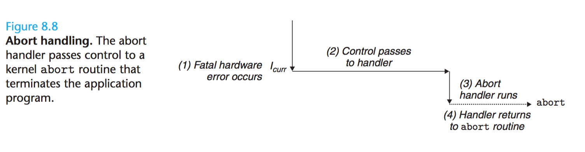

title:'Exception - 1 Base'
## Exception - 1 Base

异常是一些突然发生的处理器需要处理的事件

异常可分为中断（Interrupt）、陷阱（Trap）、错误（Fault）以及终止（Abort）四类

#### Interrupt

中断（Interrupt）通常是处理器外部的硬件为 IO 请求而发起的事件，中断是异步的异常事件，而其他异常事件均为同步的异常事件，即异常事件是指令执行的结果

当中断发生时，设备通过拉高处理器芯片的某一特定引脚以通知处理器中断事件的发生，同时将异常编号通过系统总线通知处理器。处理器执行完当前指令后，检测到该特定引脚处于高电平状态，并通过系统总线获取此次中断的异常编号，通过中断向量表执行相应的中断处理程序。当中断处理程序执行完毕后，处理器继续执行原程序的下一条指令

#### Trap

陷阱（Trap）是指令执行的结果，例如 ARM 架构中，当执行 swi 指令时发生 Trap 异常事件。Trap 异常通常用于系统调用，当异常处理程序执行完毕后，处理器继续执行原程序的下一条指令

#### Fault

错误（Fault）是当指令执行发生错误时发生的异常，如缺页异常。当错误异常发生时，异常处理程序试图修复该错误，若修复成功则返回原程序继续执行当条引发异常的指令，否则引发 Abort 异常。Fault 异常的例子是缺页异常，当指令试图访问某个虚拟地址，而该虚拟地址尚未与特定的物理页映射时，缺页异常发生。缺页异常的处理程序将分配对应的物理页，并实现该虚拟地址区域与分配的物理页的映射，之后返回原程序继续执行该条指令

#### Abort

终止（Abort）是指发生了不可修复的错误而导致系统终止运行的异常

