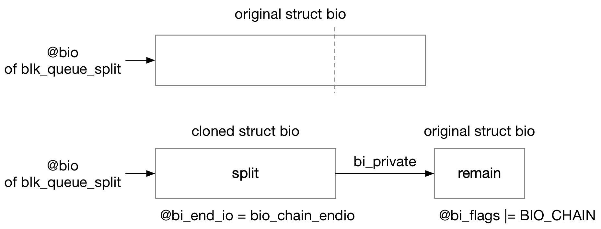

## bio Lifecycle


### bio

#### @__bi_cnt

```c
struct bio {
	atomic_t		__bi_cnt;	/* pin count */
	...
}
```

@__bi_cnt 计数维护 bio 的生命周期，当该计数变为 0 时，bio 结构体将被释放


> initial refcount

bio 刚刚创建的时候，@__bi_cnt 的初始计数为 1

```
bio_alloc_bioset
    bio_init
        atomic_set(&bio->__bi_cnt, 1);
```


> drop initial refcount

当 request 完成的时候，就会对该 request 中包含的每个 bio 依次调用 bio_endio()

```sh
blk_mq_end_request   
    blk_update_request
        # iterate bios of this request, for each bio
            req_bio_endio
                bio_endio(bio)
```


bio_endio() 中就会释放该 bio 结构

```sh
bio_endio
    bio->bi_end_io(), such as blkdev_bio_end_io() in blkdev direct IO
        bio_put(bio)
            bio_free(bio)
                mempool_free(bio, ...)
```


> get

此外如果其他子系统有引用该 bio，那么也可以调用 bio_get() 增加该 bio 的 @__bi_cnt 计数

例如 blkdev direct IO 中，在调用 submit_bio() 下发 bio 之前，就会调用 bio_get() 增加 @__bi_cnt 计数

```sh
__blkdev_direct_IO
    bio_get(bio)
        bio->bi_flags |= (1 << BIO_REFFED);
        atomic_inc(&bio->__bi_cnt);

    # submit_bio(bio);
```

> put

之前增加 @__bi_cnt 计数的用户可以调用 bio_put() 减小 @__bi_cnt 计数，当 @__bi_cnt 计数减为 0 时，就会释放 bio 结构体占用的内存

```sh
bio_endio
    bio->bi_end_io(), such as blkdev_bio_end_io() in blkdev direct IO
        bio_put(bio)
            if (atomic_dec_and_test(&bio->__bi_cnt))
                bio_free(bio);
                    mempool_free(bio, ...)
```


#### @__bi_remaining

此外 bio split 路径中，原本一个 bio 可以拆分为多个 split bio



此时拆分出来的 split bio 需要增加 parent bio 的 @__bi_remaining 计数

```c
struct bio {
	atomic_t		__bi_remaining;
	...
}
```

> initial refcount

bio 刚刚创建的时候，@__bi_remaining 的初始计数为 1

```
bio_alloc_bioset
    bio_init
        atomic_set(&bio->__bi_remaining, 1);
```


> get

bio chain 路径中，会增加 parent bio 的 @__bi_remaining 计数

```sh
bio_chain(bio, parent)
    bio->bi_private = parent;
    bio->bi_end_io	= bio_chain_endio;
    bio_inc_remaining(parent);
        bio_set_flag(bio, BIO_CHAIN);
        atomic_inc(&bio->__bi_remaining);
```

> put

bio chain 中 split bio 的 bi_end_io() 回调函数被设置为 bio_chain_endio()

```sh
bio_chain_endio
    __bio_chain_endio
        parent = bio->bi_private;
        bio_put(bio);
        return parent;
```

首先调用 bio_put(bio) 减小 split bio 本身的 @__bi_cnt 计数，这一过程中如果 split bio 的 @__bi_cnt 计数变为 0，就会释放该 split bio 结构体占用的内存

之后再次对 parent bio 调用 bio_endio()，其中会减小 parent bio 的 @__bi_remaining 计数

```sh
bio_chain_endio
    __bio_chain_endio
        parent = bio->bi_private;
        bio_put(bio);
        return parent;

    bio_endio(parent)
        bio_remaining_done
            atomic_dec_and_test(&bio->__bi_remaining)
```

由于 initial refcount 的存在，@__bi_remaining 计数不会减为 0，因而 split bio 触发的 bio_chain_endio() 到此就结束了


> drop initial refcount

如果 split bio 先于 parent bio 完成，那么当 split bio 完成的时候，parent bio 的 @__bi_remaining 计数恢复为 1

之后当这个 parent bio 完成的时候就会减去 @__bi_remaining 计数的 initial refcount，此时 @__bi_remaining 计数的值应该为 0

此时 bio_endio() 会继续执行 parent bio 的 completion 操作（具体操作见下文）

```sh
bio_endio(parent)
    bio_remaining_done
        atomic_dec_and_test(&bio->__bi_remaining) // @__bi_remaining is 0 now
        bio_clear_flag(bio, BIO_CHAIN)
        return true;
    
    # completion of parent bio
```

----

而如果 parent bio 先于 split bio 完成，那么 parent bio 完成的时候，只是减去 @__bi_remaining 计数的 initial refcount，此时 @__bi_remaining 计数的值应该为 1

此时 bio_endio() 到此就结束了

```sh
bio_endio(parent)
    bio_remaining_done
        atomic_dec_and_test(&bio->__bi_remaining) // @__bi_remaining is 1 now
        return false;
```

之后当 split bio 完成的时候，会对 parent bio 调用 bio_endio()，此时 parent bio 的 @__bi_remaining 计数减为 0

此时 bio_endio() 会继续执行 parent bio 的 completion 操作（具体操作见下文）

```sh
bio_chain_endio
    __bio_chain_endio
        parent = bio->bi_private;
        bio_put(bio);
        return parent;

    bio_endio(parent)
        bio_remaining_done
            atomic_dec_and_test(&bio->__bi_remaining) // @__bi_remaining is 0 now
            bio_clear_flag(bio, BIO_CHAIN)
            return true;
        
        # completion of parent bio
```


> completion of parent bio

上文介绍到，当 parent bio 的 @__bi_remaining 计数变为 0，即引用 parent bio 的 split bio 和 parent bio 本身都已经完成时，就会执行 parent bio 的 completion 操作

其实 parent bio 的 completion 操作也分为两条路径

----

如果这个 parent bio 本身也是 bio chain 当中的一环，也就是这个 parent bio 本身也有自己的 parent bio (记为 grandparent bio)，那么此时会对该 parent bio 调用 __bio_chain_endio() 减小 parent bio 的 @__bi_cnt 计数，这一过程中如果 parent bio 的 @__bi_cnt 计数减小为 0，就会释放这个 parent bio

之后重复对 grandparent bio 调用 bio_endio() 以减小 grandparent bio 的 @__bi_remaining 计数

```sh
# completion of parent bio

bio_endio(parent)
    if (parent->bi_end_io == bio_chain_endio):
    grandparent = __bio_chain_endio(parent);
    bio_put(parent)
    # call bio_endio() recursively

```

----

而如果这个 parent bio 本身是 bio chain 的最后一环，那么此时就会调用 parent bio 的 bi_end_io()，其中会调用 bio_put() 减小该 parent bio 的 @__bi_cnt 计数，这一过程中如果该 parent bio 的 @__bi_cnt 计数变为 0，就会释放这个 parent bio

```sh
# completion of parent bio

bio_endio(parent)
        bio->bi_end_io(parent), such as blkdev_bio_end_io() in blkdev direct IO
            bio_put(parent)
```
