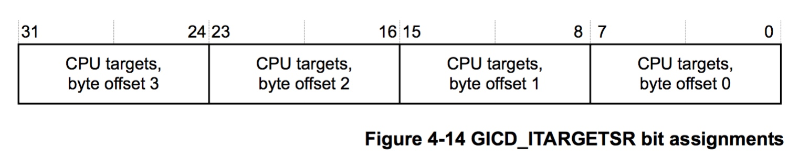

## Interrupt - 1 IRQ Chip - ARM GIC

每个产生中断信号的外设都输出一条或多条中断信号线 IRQ (Interrupt ReQuest)

同时每个 CPU 拥有输入引脚用于接收中断信号，ARM 架构下中断信号线实际通过电平信号传递中断事件，即引脚为低电平时表示有中断发生

ARM 架构下每个 CPU 拥有两个输入引脚用于接收两种不同的中断信号，即 IRQ (Interrupt Request) 与 FIQ (Fast Interrupt Request)，由于低电平有效，因而这两个引脚也称为 nIRQ 与 nFIQ

通常使用 可编程中断控制器 (PIC, Programmable Interrupt Controller) 将外部设备的中断信号线与 CPU 的输入引脚相连接，其中 PIC 的输入引脚与外设的中断信号线相连接，输出引脚与 CPU 的 nIRQ 与 nFIQ 引脚相连接

PIC 可以对输入的中断信号进行使能、禁止、设置中断类型（如 IRQ 或 FIQ）以及中断优先级等操作，并将输入的中断分发给 CPU 执行中断处理程序 (ISR, Interrupt Service Routine)

对于 UP 系统，通常只需要一个 PIC 对中断信号进行管理

而对于 SMP 系统，则需要更为高级的 PIC 来管理中断信号，对于 ARM 架构下的 SMP 系统，则使用 GIC (Generic Interrupt Controller) 管理系统中断

下文以基于 GIC Architecture Specification v2 的 GIC400 为例介绍 GIC v2 的硬件架构，该部分内容参考

> ARM Generic Interrupt Controller Architecture Specification version 2.0
> CoreLink GIC-400 Generic Interrupt Controller Technical Reference Manual

### Basic

GIC 的输入信号包括 Peripheral Interrupts 以及 AXI Interface，其输出信号为 Processor Interface

---

> AXI interface

其中 AXI Interface 为 GIC 的编程接口 (Programming Interface)，处理器通过 AXI 总线对 GIC 寄存器进行读写，其中 GIC 400 使用 AXI4 slave interface

---

> distributor

GIC 内部的 Distributor 接收来自 interrupt request line 的中断信号，并向每个 CPU interface 分配待处理的中断信号 (pending interrupt) 中，优先级最高的中断信号

---

> CPU interface

每个处理器都对应一个 CPU interface，每个 CPU interface 包括一组信号，包括 nIRQCPU、nFIQCPU、nIRQOUT 与 nFIQOUT，其中

- nIRQCPU 与 nFIQCPU 负责将一定优先级的中断信号 (pending interrupts) 传递给其对应的 CPU，并且接收来自 CPU 的 EOI (End Of Interrupt) 信号
- nIRQOUT 与 nFIQOUT 负责将 wakeup event 传递给对应的 CPU

通过每个 CPU interface 的 enable bit 可以 enable/disable CPU interface

当 disable CPU interface 时，相应的 CPU interface 的 nIRQCPU 与 nFIQCPU 不能向 CPU 传递中断信号，而 nIRQOUT 与 nFIQOUT 则不受影响

---

> interrupt signal

GIC 支持 3 种类型的中断信号

1. SGI

SGI (Software Generated Interrupt) 即处理器通过 AXI 接口写 GIC 的 GICD_SGIR (Software Generated Interrupt Register) 寄存器产生的中断信号

SGI 通常也称为 IPI (Inter Processor Interrupt)，在 SMP 系统中通常用于 inter-processor communication，每个 CPU interface 能够产生最多 16 个 SGI 中断信号，其 interrupt ID 为 ID0-ID15

2. PPI

PI (Peripheral Interrupt) 即为外部设备产生的中断，包括 PPI 与 SPI 两种类型

PI 信号的触发类型分为 Edge-triggered 以及 Level-sensitive，其中

- Edge-triggered 为上升沿触发，并且一直保持有效，直到相应的状态发生以清除该有效状态
- Level-sensitive 即为电平触发

PPI (Private Peripheral Interrupt) 即对应于特定处理器的中断信号，一般用于事件的传递，其中断 ID 为 ID16-ID31，所有的 PPI 信号均为低电平有效，每组 PPI 信号包括

- nLEGACYIRQ / nLEGACYFIQ
对于特定 CPU interface，当该 interface 处于 bypass mode (power management bypass functionality) 时，输入的 legacy IRQ 信号即为输出的 nIRQCPU/nFIQCPU 信号，即该 nLEGACYIRQ/nLEGACYFIQ 信号线直接与对应 CPU 的 nIRQCPU/nFIQCPU 信号线连接，此时该 CPU 只提供该 nLEGACYIRQ/nLEGACYFIQ 信号的中断服务，而不响应该 CPU 的其他 PI 中断

- nCNTPNSIRQ
Non-secure physical timer interrupt event

- nCNTPSIRQ
Secure physical timer interrupt event

- nCNTVIRQ
virtual timer interrupt event

- nCNTHPIRQ
physical timer in Hyp mode interrupt event

3. SPI

SPI (Shared Peripheral Interrupt) 即由 GIC 引脚直接产生的中断信号，其中断 ID 从 ID32 开始，GIC 的每个引脚对应一个 interrupt ID，SPI 可以被分发给任意处理器，通常指外部设备产生的中断

通过配置 GICD_TYPER (nterrupt Controller Type Register) 寄存器的 ITLinesNumber, bits [4:0] 字段可以配置 NUM_SPIS 的值，NUM_SPIS 表示该 GIC 支持的 SPI 的数量，该寄存器字段的值即为 NUM_SPIS/32，GIC 400 最多支持 480 个 SPI

---

> interrupt ID

- 每个 CPU interface 都对应一组 SGI 信号，使用共享的 ID0-ID15
- 每个 CPU interface 都对应一组 PPI 信号，使用共享的 ID16-ID31，其中 GIC 400 的 ID16-ID24 未使用
- GIC 的每个 SPI 信号都对应一个唯一的 interrupt ID 即 ID32-ID1019，其中 GIC 400 支持最多 480 个 SPI 信号

对于 SPI 信号，由于每个 SPI 信号都对应一个唯一的 interrupt ID，因而 CPU interface 在向 CPU 传递相关信息时只需传递中断对应的 interrupt ID

而对于 SGI 与 PPI 信号，由于这些信号使用共享的 interrupt ID，因而 CPU interface 在向 CPU 传递相关信息时需要同时传递中断对应的 interrupt ID 以及产生该中断的 CPU number

### Routine

#### interrpt state machine

GIC Distributor 为每个 CPU interface 的每个中断维护一个状态机，其状态有

- inactive
- pending
- active
- active and pending

在多处理器系统中，对于 SGI 与 PPI 信号，GIC 使用 GIC N-N model 模型管理中断信号，即每个 CPU interface 对于 SGI 与 PPI 信号的状态机都是独立的，这是因为每个 CPU interface 都具有各自独立的 SGI 与 PPI 信号，因而一个处理器对该中断信号的响应与处理并不会影响其他处理器对该中断信号的状态机的状态

而对于 SPI 信号，GIC 使用 GIC 1-N model 模型管理中断信号，由于所有的 CPU interface 共享同一组 SPI 信号，所有处理器都为该中断信号维护一个状态机，当一个处理器对该中断信号进行响应并且处理时，GIC 会移除其他处理器的状态机中的 pending 状态，从而确保每个 SPI 中断信号都只能被一个处理器响应并处理

#### generic routine

当 GIC 检测到中断信号时，该中断信号的状态为 pending，即等待处理

- GIC 通过 GICD_ISENABLERn (Distributor Interrupt Set-Enable Registers) 寄存器检查该中断信号是否使能
- 若该中断信号使能，则 distributor 根据 GICD_ITARGETSRn (Interrupt Processor Targets Registers) 寄存器决定将该中断信号分发给哪个处理器，该寄存器描述特定中断对应的 cpumask
- 上述 distributor 将中断信号分发给对应处理器的过程，实际上是将中断信号添加到对应处理器的 pending list 中，此时 distributor 在每个处理器的 pending list 即所有等待处理的中断信号中挑选其中优先级最高的中断信号，并将该中断信号传递给相应的 CPU interface
- CPU interface 决定该中断信号是否具有足够的优先级，若有则将该中断信号传递给处理器
- 处理器检测到中断发生，从而进入中断异常模式，处理器通过读取 GIC 的 GICC_IAR (Interrupt Acknowledge Register) 寄存器的值以回应该中断信号，同时获取该中断信号的 interrupt ID（若该中断为 SGI，同时获取产生该中断的 processor ID）
- 当 GIC 检测到 CPU 的这一读动作时改变该中断的状态机模型
    - 当该中断处于 active 状态时继续保持 pending 状态（通常指 level sensitive 的中断信号，例如中断信号线变为低电平并保持为低电平，直到处理器中运行的中断处理程序开始对该外设进行处理，通常为对外设的寄存器进行操作），或该中断处于 pending 状态时重复产生该中断，此时将该中断的状态机由 pending 变为 pending and active
    - 否则将该中断的状态机由 pending 变为 active
- 处理器通过 Interrupt Domain 将该中断信号的 interrupt ID 转变为 interrupt number，通过 interrupt number 获取并执行该中断注册的中断处理程序
- 中断处理完成后，处理器通过写 GIC 的 EOIR (End Of Interrupt Register) 寄存器以通知 GIC 中断处理完成
- 之后处理器对 GIC 的 GICC_DIR 寄存器进行写操作，以执行 Interrupt deactivation 操作，即将处理完成的中断信号的状态由 active and pending 变为 pending，或由 active 变为 idle

### Features

#### interrupt enable/disable

GIC 内部的中断信号传递分为两个步骤

1. Distributor 将中断信号传递给 CPU interface
2. CPU interface 将中断信号传递给处理器

因而对于中断信号的 enable/disable，分别需要配置两个寄存器以对应于中断信号传递的这两个步骤

##### global interrupt enable/disable

寄存器 GICD_CTLR (Distributor Control Register) 的 bit[0] 控制对于所有中断，distributor 是否将中断信号传递给 CPU interface，该 bit 为 1 表示 enable，0 表示 disable

寄存器 GICC_CTLR (CPU interface Control Register) 的 bit[0] 控制对于所有中断，CPU interface 是否将中断信号传递给处理器，该 bit 为 1 表示 enable，0 表示 disable

##### specific interrupt enable/disable

向寄存器 GICD_ISENABLERns (Distributor Interrupt Set-Enable Registers) 的相应 bit 写 1 以实现该特定中断的使能

向寄存器 GICD_ICENABLERns (Distributor Interrupt Clear-Enable Registers) 的相应 bit 写 1 以实现该特定中断的关闭

该 enable/disable 操作实际控制对于特定中断，distributor 是否将中断信号传递给 CPU interface

同时中断信号的 disable 只是阻止中断信号的传递，disable 状态下 GIC 可以继续接收来自外部设备的中断信号，并为每个中断信号维护一个状态机，此时每个未被处理的中断信号都处于 pending 状态，当 GIC 再次 enable 的时候可以对这些 disable 状态下触发的中断信号进行处理

> GICD_ISENABLERns 

寄存器 GICD_ISENABLERns (Distributor Interrupt Set-Enable Registers) 提供特定中断的 enable-bit，其中 GICD_ISENABLER0 的 bits [15:0] 对应 SGI ID15-0，bits [31:16]对应 PPI ID31-16，之后的 GICD_ISENABLERn 分别对应于 SPI

- 对于不支持的中断号，对 GICD_ISENABLERns 寄存器的相应 bit 的操作是 RAZ (Read-As-Zero)/WI (Write-Ignored)
- 对于永久支持的中断号，对 GICD_ISENABLERns 寄存器的相应 bit 的操作是 RAO (Read-As-One)/WI (Write-Ignored)
- 对于支持的中断号，对 GICD_ISENABLERns 寄存器的相应 bit 的读操作返回该 bit 的实际值，对该 bit 的写 1 实际对相应的中断号进行 enable 配置，即使能 Distributor 将相应的中断信号传递给 CPU interface

> GICD_ICENABLERs

寄存器 GICD_ICENABLERs (Distributor Interrupt Clear-Enable Registers) 提供所有中断的 disable-bit

- 对于不支持的中断号，对 GICD_ICENABLERs 寄存器的相应 bit 的操作是 RAZ (Read-As-Zero)/WI (Write-Ignored)
- 对于支持的中断号，对 GICD_ISENABLERns 寄存器的相应 bit 的读操作返回该 bit 的实际值，对该 bit 的写 1 实际对相应的中断号进行 disable 配置，即关闭 Distributor 将相应的中断信号传递给 CPU interface

##### query supported interrupt

当需要查询当前 GIC 支持的所有中断号时

- 对 GICD_TYPER 寄存器进行读操作，GICD_TYPER.ITLinesNumber 表示当前 GIC 支持的所有中断号的数量，从而表明了当前实现的 GICD_ISENABLERns 寄存器的数量
- 对 GICD_CTLR 寄存器进行写操作，以关闭 distributor 至 CPU interface 之间的信号传递
- 对相应的 GICD_ISENABLERns 寄存器写入 0xFFFFFFFF 值，之后读取该寄存器的值，其中为 1 的 bit 对应于支持的中断号

#### CPU affinity

distributor 在检测到 interrupt line 的一个中断信号之后，会决定将该中断分发给哪个 CPU interface

寄存器 GICD_ITARGETSRn (Interrupt Processor Targets Registers) 描述特定中断对应的 CPU targets field，也就是该中断的 cpumask

GIC 2 中 CPU targets field 的大小为 8-bit，即 GIC 2 最多只支持 8 core CPU

CPU targets field 描述对应中断的 cpumask，例如 bit 0 为 1，则说明该中断可以由 CPU 0 处理

当 GIC 检测到中断信号时，distributor 会根据 GICD_ITARGETSRn 寄存器决定将该中断信号分发给哪个处理器，即 distributor 会将该中断添加到绑定的 CPU interface 的 pending list 中，此时该中断信号的状态为 pending

当用户进程未显式设置特定中断的 CPU affinity 时，中断默认分发给所有的 CPU interface，即 distributor 会将该中断添加到所有 CPU interface 的 pending list 中

当一个中断被分发给多个 CPU interface 时，该中断同时处于多个 CPU interface 的 pending list 中，之后这些 CPU interface 会竞争该中断的处理，即当其中一个 CPU interface 决定将该中断信号传递给对应的处理器，该处理器对该中断信号进行响应并且处理时，GIC 会将该中断从其他 CPU interface 的 pending list 中移除，从而确保每个 SPI 中断信号都只能被一个处理器响应并处理

#### interrupt priority

GIC 使用 8 bit 的字段表示中断优先级，GIC 支持最小 16，最大 256 个优先级，其优先级的级数由具体的 GIC 实现决定，优先级的数字越小，其优先级越高

寄存器 GICD_IPRIORITYRn (Distributor Interrupt Priority Registers) 中的每个字节存储每个中断的优先级

- 对于不支持的中断号，对 GICD_IPRIORITYRn 寄存器的相应字节操作是 RAZ (Read-As-Zero)/WI (Write-Ignored)
- 对于支持的中断号，对 GICD_IPRIORITYRn 寄存器的相应字节的读操作返回该字节的实际值，对该字节的写操作实际对相应的中断号的优先级进行配置

GIC400 在安全模式下实现 32 级的中断优先级，而在非安全模式下实现 16 级的中断优先级

对于 Distributor 的 interrupt arbitration 过程中，当两个中断信号具有相同的优先级时，

- 对于 PPI、SPI 中断信号，distributor 优先处理 interrupt ID 较小的中断信号
- 对于 SGI 中断信号，distributor 优先处理 interrupt ID 较小的中断信号；而在多处理器系统中当需要处理同时具有相同优先级与 interrupt ID 的 SGI 信号时，distributor 优先处理 processor ID 较小的中断信号

#### interrupt preempt

GIC 支持中断的抢占或嵌套，当抢占的高优先级的中断信号满足以下条件时，GIC 将高优先级的中断信号传递给处理器，处理器需要保存当前未处理完成的低优先级中断信号的 context，转而执行新收到的高优先级的中断信号，当高优先级的中断信号处理完成后再恢复执行之前被抢占的低优先级的中断信号

1. 该中断信号的优先级高于该 CPU interface 的 priority mask

寄存器 GICC_PMR (Interrupt Priority Mask Register) 的 bit [7:0] 描述该 CPU interface 的 priority mask，只有中断信号的优先级高于该字段描述的优先级，CPU interface 才会将中断信号传递给对应的处理器

2. 该中断信号的 group priority 高于该 CPU interface 的 Running priority

Priority grouping 是指将 8 bit 的 priority field 分为两个部分，group priority 以及 subpriority，即一定范围内相邻优先级的中断信号具有相同的 group priority，group priority 主要用于中断抢占

CPU interface 的 Running priority 是指对应的处理器中运行的处于 active 状态的中断信号的 group priority；因而在中断抢占中，高 group priority 的中断信号才能抢占低 group priority 的中断信号

当 CPU interface 中的 active interrupt 处理完成时，处理器会写 GIC 的 EOIR (End Of Interrupt Register) 寄存器以通知 GIC 中断处理完成，在该写操作的同时，该 CPU interface 进行 Priority drop 操作

在 CPU interface 向处理器传递中断信号时，其 running priority 设置为对应的处理器中运行的处于 active 状态的中断信号的最高 group priority；而在中断处理完成后需要进行 Priority drop 操作，即将 CPU interface 的 running priority 设置为处理器中剩余的处于 active 状态的中断信号的最高 group priority，当处理器中没有 active 状态的中断信号时设置其 running priority 为 Idle priority

### Example

接下来以一个实例介绍 GIC 的中断处理过程，其中

- M 和 N 是两个 SPI 中断信号，level-sensitive，active-HIGH
- M 和 N 导向同一个处理器，同时 N 的优先级高于 M
- M 和 N 同属 Group 0，并被配置为 FIQ

中断处理的过程为

1. T1，Distributor 检测到 Group0 的中断信号 M
2. T2，Distributor 设置中断信号 M 的状态机的状态为 pending
3. T17，CPU interface 拉低对应的 nFIQCPU；中断信号的状态变为 pending 到 nFIQCPU 信号的拉低期间，Distributor 需要计算处于 pending 状态的所有中断信号中的最高优先级，其间通常存在 12 个时钟周期的延时，但其可能的延时为 10~20 个时钟周期；此时该 CPU interface 的 GICC_IAR (Interrupt Acknowledge Register) 寄存器的 Interrupt ID 字段被设置为该中断信号的 interrupt ID
4. T42，Distributor 检测到 Group0 的中断信号 N
5. T43，Distributor 设置中断信号 N 的状态机的状态为 pending，同时设置中断信号 N 为当前优先级最高的中断信号
6. T58，CPU interface 拉低对应的 nFIQCPU，由于 T17 时 nFIQCPU 已经被拉低，因而 nFIQCPU 继续保持低电平状态；同时该 CPU interface 的 GICC_IAR 寄存器的 Interrupt ID 字段被设置为中断信号 N 的 interrupt ID
7. T61，处理器读取 GIC 的 GICC_IAR 寄存器的值，获取当前最高优先级的 pending 状态的中断信号的 interrupt ID，此时 Distributor 设置中断信号 N 的状态为 pending and active
8. T61-T131，处理器执行中断信号 N 的中断服务程序
9. T64，在处理器对中断信号执行 ack 操作的 3 个时钟周期之后，该 CPU interface 的 nFIQCPU 信号恢复为高电平
10. T126，中断服务程序访问中断信号 N 对应的外围设备的控制寄存器之后，该设备将其 interrupt request line 的电平信号恢复为正常状态
11. T128，Distributor 设置中断信号 N 的状态为 active
12. T131，处理器向 CPU interface 的 GICC_EOIR (End of Interrupt Register) 寄存器的 EOIINTID 字段写入相应的 interrupt ID，以标识该中断信号的处理完成；此时 Distributor 设置中断信号 N 的状态为 idle
13. T146，Distributor 将该 CPU interface 的 GICC_IAR 寄存器的 Interrupt ID 字段设置为当前处于 pending 状态的最高优先级的中断信号，即中断信号 M 的 interrupt ID；同时拉低对应的 nFIQCPU
14. T211，处理器读取 GIC 的 GICC_IAR 寄存器的值，获取当前最高优先级的 pending 状态的中断信号的 interrupt ID，此时 Distributor 设置中断信号 M 的状态为 pending and active
15. T214，在处理器对中断信号执行 ack 操作的 3 个时钟周期之后，该 CPU interface 的 nFIQCPU 信号恢复为高电平

