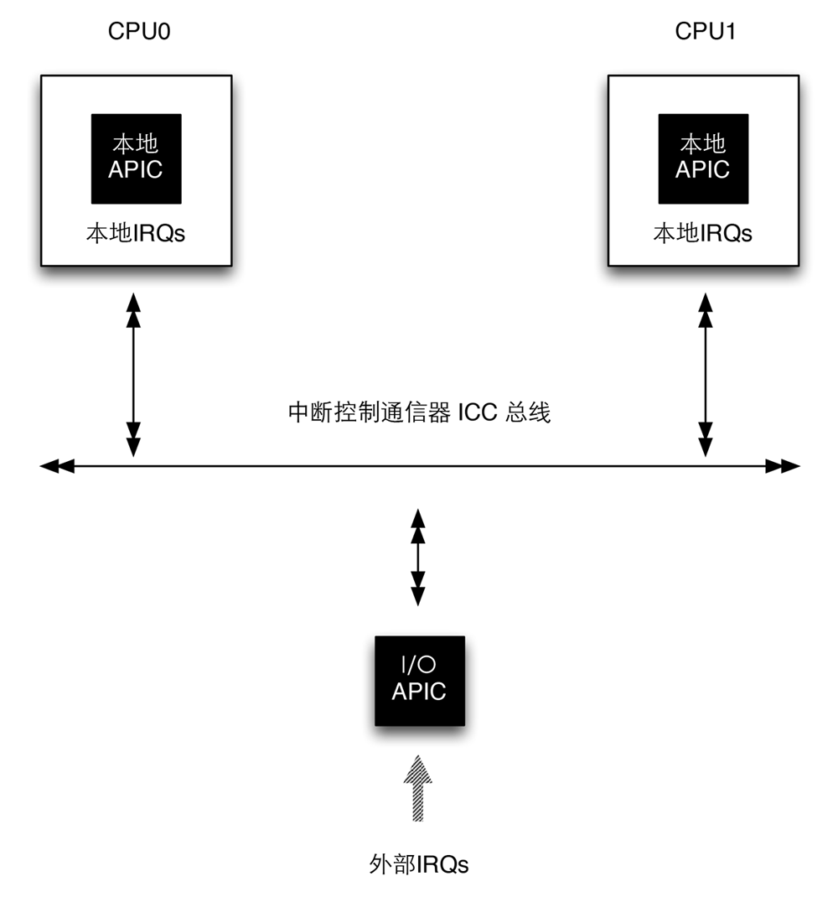

title:'Interrupt - 1 IRQ Chip - x86 APIC'
## Interrupt - 1 IRQ Chip - x86 APIC

对于 x86 架构下的 SMP 系统，使用 APIC (Advanced PIC) 架构管理系统中断，其中整个系统维护一个全局的 IO APIC，同时每个 CPU 内部都维护一个本地的 Local APIC，每个 Local APIC 与其对应的 CPU 的两个中断引脚相连接，IO APIC 与 Local APIC 之间通过 ICC(Interrupt Controller Communication)总线传递消息

IO APIC 与所有外设的中断信号线相连，当 IO APIC 接收到中断信号时将该中断信号翻译为总线 message，之后通过 ICC 总线通知 Local APIC

