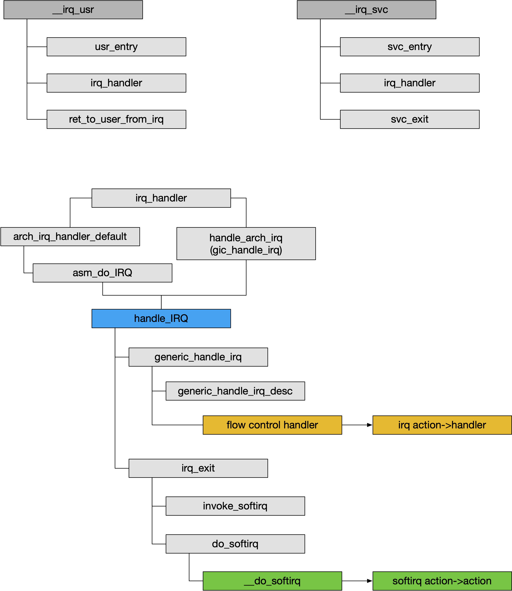

## Interrupt - 4 Routine


### IRQ Init

初始化阶段完成相应的 irq controller（包括 irq chip、irq domain）的初始化，其中调用 irq_create_mapping() 完成 interrupt ID 与 interrupt number 之间的映射关系


### IRQ Entry



irq routine 的入口为 \_\_irq_usr/__irq_svc，两者均为汇编函数

---

当中断发生在用户空间时执行 __irq_usr

```
__irq_usr
    |_ usr_entry
    |_ irq_handler
    |_ ret_to_user_from_irq
```

- usr_entry 宏用于保存中断现场
- irq_handler 宏用于中断处理
- ret_to_user_from_irq 宏用于恢复用户空间的中断现场

---

当中断发生在内核空间时执行 __irq_svc

```
__irq_svc
    |_ svc_entry
    |_ irq_handler
    |_ svc_exit
```

- svc_entry 宏用于保存中断现场
- irq_handler 宏用于中断处理
- svc_exit 宏用于恢复中断现场


### C irq routine

__irq_usr/__irq_svc 均调用 irq_handler()

irq_handler() 中可以调用 arch_irq_handler_default()，其中又调用 asm_do_IRQ() 开始进入 C irq routine

irq_handler() 中也可以直接调用 handle_arch_irq() 开始进入 C irq routine

ARM 架构下使用 GIC interrupt controller 时，irq_handler() 就是直接调用 handle_arch_irq() 的，其对应的 handle_arch_irq 函数实际为 gic_handle_irq()

```
irq_handler
    |_ handle_arch_irq/arch_irq_handler_default
        |_ handle_IRQ
            |_ irq_enter
            |
            |_ generic_handle_irq
            |   |_ generic_handle_irq_desc
            |      |_ flow control handler
            |
            |_ irq_exit
```


#### irq ID -> irq number map

handle_arch_irq() 中由相应的寄存器获取发生中断的 interrupt ID，并通过 irq domain 将 interrupt ID 映射为相应的 interrupt number

GIC 中读取 GICC_IAR 寄存器的值获取该中断的 interrupt ID，同时对该中断进行 ACK 操作，之后调用 irq_find_mapping()通过 interrupt domain 将 interrupt ID 映射为 interrupt number，之后调用 handle_IRQ() 进行相应的处理

APIC 中读取 IACK 寄存器的值获取该中断的 interrupt ID，同时对该中断进行 ACK 操作，之后调用 irq_find_mapping()通过 interrupt domain 将 interrupt ID 映射为 interrupt number，之后调用 handle_IRQ() 进行相应的处理


#### generic irq routine

handle_IRQ() 开始进入 generic irq routine

```
handle_IRQ
    |_ irq_enter
    |_ flow control handler
    |_ irq_exit
```

1. irq_enter() 中增加 HARDIRQ Count 计数，内核进入 HARDIRQ context

其中主要增加当前进程的 preempt_count 计数的 HARDIRQ Count 计数，标志当前进程进入 HARDIRQ context


2. flow control handler 用于通用中断处理逻辑的执行，包括中断嵌套、specific irq handler 调用等

中断处理函数最终调用该中断的中断描述符 irq_desc 的 handle_irq() 回调函数，即 high level flow control handler

GIC 中，对于 SGI 与 PPI 中断信号该 handler 为 handle_percpu_devid_irq()，对于 SPI 中断信号，该 handler 为 handle_fasteoi_irq()


```
flow control handler, e.g. handle_fasteoi_irq
    |_ handle_irq_event
        |_ handle_irq_event_percpu
            |_ action->handler(irq, action->dev_id)
```

handle_fasteoi_irq() 中遍历执行 irq descriptor 的 irq action 链表中的所有 specific irq handler


3. irq_exit() 中减小 HARDIRQ Count 计数，内核退出 HARDIRQ context，同时当有 SOFTIRQ 等待时发起相应的 SOFTIRQ 处理

这一过程中主要是减小当前进程的 preempt_count 计数的 HARDIRQ Count 计数，标志当前进程退出 HARDIRQ context

之后如果当前进程不处于 interrupt context 即当前已经处理完成所有的嵌套 HARDIRQ 或 SOFTIRQ，同时有 SOFTIRQ 等待，此时调用 invoke_softirq() 发起相应的 SOFTIRQ 处理

而如果当前进程仍处于 interrupt context，则说明当前处理的 HARDIRQ 嵌套执行，即当前 HARDIRQ 处理完成后还需要处理其他被嵌套的 HARDIRQ；或当前 HARDIRQ 与 SOFTIRQ 相嵌套，即当前 HARDIRQ 实际是抢占了之前的 SOFTIRQ；因而当前 HARDIRQ 处理完成后需要处理之前被抢占的 SOFTIRQ，这两种情况下都不能调用 invoke_softirq() 调度执行其他的 SOFTIRQ


### HARDIRQ Concurrency

1. 同一个 CPU 上 HARDIRQ 不会发生嵌套

这是因为大部分处理器在陷入 IRQ mode 之前，处理器硬件会自动关闭 HARDIRQ 中断，例如 ARM 处理器在陷入 IRQ mode 之前，处理器硬件会自动将 CPSR[7] = 1，也就是关闭 HARDIRQ 中断

2. 同一个 HARDIRQ 不会在多个 CPU 上并行运行

即同一个 HARDIRQ 同一时刻只能由一个 CPU 处理

这是由 IRQ chip 硬件决定的，例如 ARM 架构下 GIC 为每个 HARDIRQ 中断维护一个状态机，而对于一个 HARDIRQ 中断来说，所有 CPU 共用这个 HARDIRQ 中断的状态机，因而当一个 CPU 对该中断信号进行响应并且处理时，GIC 会移除该 HARDIRQ 中断在其他 CPU 中的 pending 状态，从而确保每个 HARDIRQ 中断都只能被一个 CPU 响应并处理
