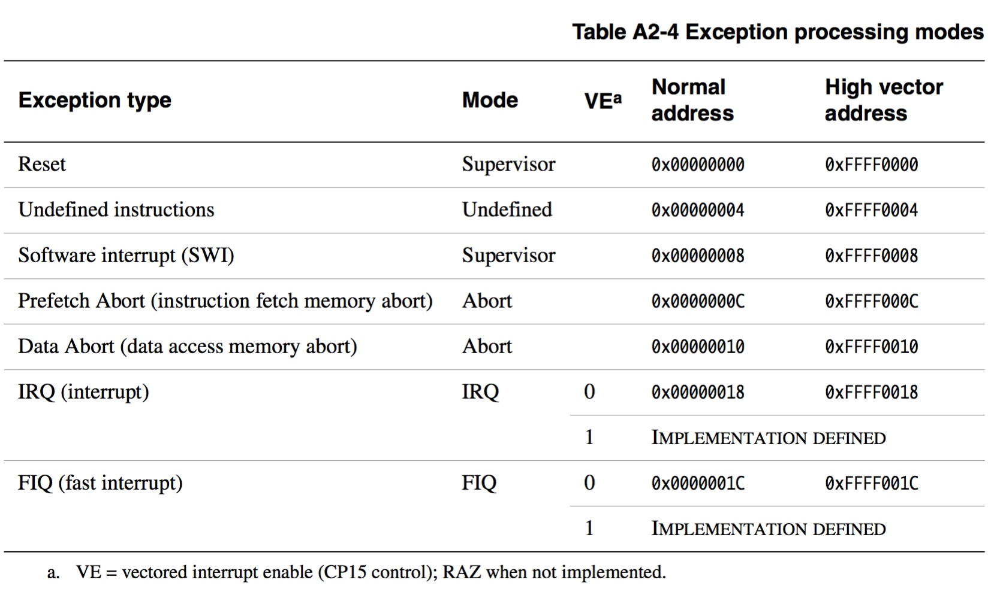
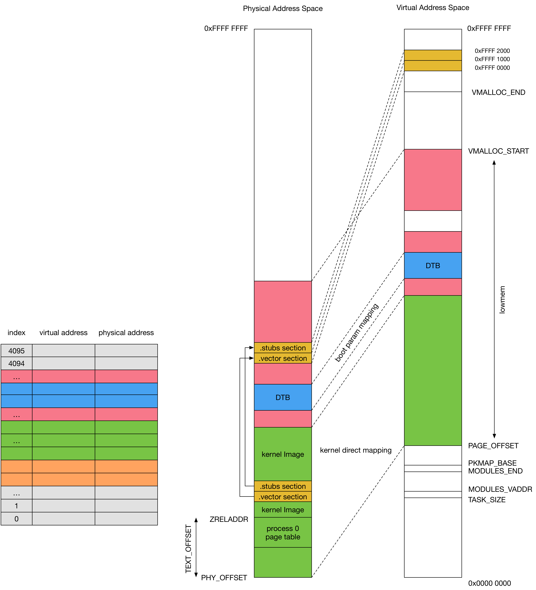

## Exception - 2 Vector Table - ARMv7

ARM 支持 7 种异常模式



每种异常的处理程序的入口地址存储在一起，就得到了一个 vector table

vector table 中有 4 字节是预留的，因而 ARM vector table 一共占用 32 字节


### physical address of vector table 

vector table 在 `arch/arm/kernel/entry-armv.S` 中静态定义

---

.vectors section 即为 vector table，一共占用 32 字节

```s
.section .vectors, "ax", %progbits
__vectors_start:
	W(b)	vector_rst
	W(b)	vector_und
	W(ldr)	pc, __vectors_start + 0x1000
	W(b)	vector_pabt
	W(b)	vector_dabt
	W(b)	vector_addrexcptn
	W(b)	vector_irq
	W(b)	vector_fiq
```

---

.stubs section 中存储各个 exception handler

```s
	.section .stubs, "ax", %progbits
__stubs_start:

/* reset exception handler */
	vector_rst:
	...

/* Interrupt dispatcher */
	vector_stub	irq, IRQ_MODE, 4
	...

/* Data abort dispatcher */
	vector_stub	dabt, ABT_MODE, 8
	...

/* Prefetch abort dispatcher */
	vector_stub	pabt, ABT_MODE, 4
	...

/* Undef instr entry dispatcher */
	vector_stub	und, UND_MODE
	...

/* Address exception handler */
vector_addrexcptn:
	...

/* FIQ dispatcher */
vector_fiq:
	...
```

---

`arch/arm/kernel/vmlinux.lds.S` 中将 .vectors section 与 .stubs section 依次置于程序中，因而 vector table 的 physical address 是由链接脚本决定的，是不确定的

```lds
SECTIONS
{
	...
	/*
	 * The vectors and stubs are relocatable code, and the
	 * only thing that matters is their relative offsets
	 */
	__vectors_start = .;
	.vectors 0 : AT(__vectors_start) {*(.vectors)
	}
	. = __vectors_start + SIZEOF(.vectors);
	__vectors_end = .;

	__stubs_start = .;
	.stubs 0x1000 : AT(__stubs_start) {*(.stubs)
	}
	. = __stubs_start + SIZEOF(.stubs);
	__stubs_end = .;
	...
}
```


### virtual address of vector table 

关于 vector table 的 virtual address

- vector table 可以存储在 32 bit 地址空间的底部 0x00000000-0x0000001F，即 normal vector
- 也可以存储在 32 bit 地址空间的顶部 0xFFFF0000-0xFFFF001F，即 high vector

coprocessor 15 register 1 ，即 CP15 register 1 (Control Register) 的 bit[13] 可以实现 normal vector 与 high vector 模式的切换，该标志位为 0 时使用 normal vector，标志位为 1 时使用 high vector

---

通常在使用 MMU 的系统中使用 high vector 模式

```sh
devicemaps_init
    # allocate 2 page frames
    
    early_trap_init
    
    # remapping vector table to high vector virtual address
```

1. allocate 2 page frames

首先分配 2 个 page frame

- 第一个 page frame 用于存储 .vectors section 中的 vectors table
- 第二个 page frame 用于存储 .stubs section 中的各个 exception handler

分配过程中会同时完成分配的 page frame 的 physical address 及其 virtual address 之间的映射，函数返回两个 page frame 映射的 base virtual address


2. copy vector table to allocated page frame

之后调用 early_trap_init() 完成异常向量表的初始化，即将 .vectors section 中的 vector table 及 .stubs section 中的 exception handler，由静态链接地址分别拷贝到这两个 page frame 中


3. remapping vector table to high vector

两个 page frame 的分配过程中其已经映射到对应的 virtual address，这里修改这两个 page frame 的映射关系，将其重新映射到 0xffff0000 地址，此时 vectors table 的地址即为 0xffff0000

如果 SCTLR.V 寄存器配置为 normal vectors，那么再次修改这两个 page frame 的映射关系，将其重新映射到 0 地址


### summary

ARM vector table 在程序中静态定义，包含 .vector section 与 .stubs section 两部分

在系统初始化过程中将这两个 section 分别拷贝到另外两个 page frame 中，并将这两个 page frame 分别映射到 0XFFFF 0000 以及 0XFFFF 1000 虚拟地址处



