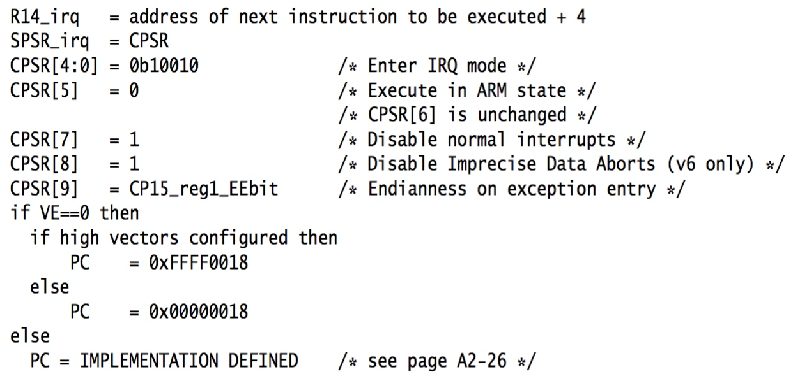
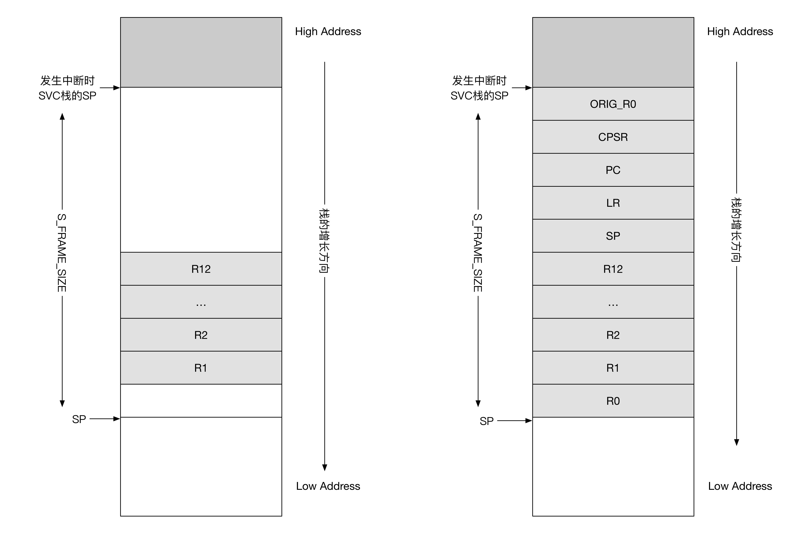

title:'Interrupt - 5 IRQ Entry - ARM'
## Interrupt - 5 IRQ Entry - ARM


### Hardware Entry

当处理器检测到 IRQ 中断时，硬件执行以下逻辑



- R14_irq = (当前执行指令的下一条指令 +4)，中断处理完成后 R14_irq 寄存器的值将赋给 PC 寄存器，以继续执行中断发生时被抢占的程序
- SPSR_irq = CPSR，以保存中断发生时的 CPSR 寄存器的值
- CPSR[4:0] = 0b10010，处理器进入 IRQ 模式
- CPSR[5] = 0，执行 ARM 指令集
- CPSR[7] = 1，disable IRQ
- CPSR[8] = 1，disable Imprecise Data Aborts (v6 and above)
- CPSR[9] = CP15_reg1_EEbit，设置大小端
- PC 寄存器被设置为 vector table 中 vector_irq 的地址
    - normal vector 模式时 PC = 0x00000018
    -   high vector 模式时 PC = 0xFFFF0018


### IRQ mode

当触发 IRQ exception 时，处理器硬件会自动将 PC 寄存器的值设置为 vector table 中 IRQ handler 的地址，此时处理器在 IRQ mode 下跳转执行 IRQ entry

IRQ mode 的主要任务就是判断当前 IRQ 中断发生时处理器运行在 USR mode 还是 SVC mode

- 当中断发生在用户空间即 USR mode 时执行 __irq_usr
- 当中断发生在内核空间即 SVC mode 时执行 __irq_svc

两者在进入和退出中断时是否进行用户栈和内核栈的切换、进程调度等方面存在差异，除此之外两者均最终调用 irq_handler 进入真正的中断处理

判断完成后 CPU 马上由 IRQ mode 切换为 SVC mode，并执行 __irq_usr/__irq_svc

---

> 0

vector table 中 IRQ entry 为

```s
	W(b)	vector_irq
```

---

> 1

vector_irq 定义在 .stubs section 中

```s
/*
 * Interrupt dispatcher
 */
	vector_stub	irq, IRQ_MODE, 4
```

vector_stub 是一个宏，以上指令展开后即为 vector_irq

---

> 2

```s
	.macro	vector_stub, name, mode, correction=0
	.align	5

vector_\name:
	.if \correction
	sub	lr, lr, #\correction
	.endif
```

在发生 IRQ exception 时，处理器硬件将 LR_irq 设置为 IRQ exception 发生时，当前执行指令的下一条指令再 +4

因而此时需要将 LR_irq 寄存器的值减去 4，这样 LR_irq 寄存器的值即为 IRQ exception 发生时，当前执行指令的下一条指令，同时也是中断返回后将要执行的指令；也就是说中断返回后，将执行 IRQ exception 发生时，当前执行指令的下一条指令

---

> 3

```s
	@
	@ Save r0, lr_<exception> (parent PC) and spsr_<exception>
	@ (parent CPSR)
	@
	stmia	sp, {r0, lr}		@ save r0, lr
	mrs	lr, spsr
	str	lr, [sp, #8]		@ save spsr
```

IRQ exception 发生后，内核需要判断 IRQ exception 发生在用户态还是内核态，两者在进入和退出中断时是否进行用户栈和内核栈的切换、进程调度等方面存在差异

CPSR.M 字段描述了 IRQ exception 发生时 CPU 的模式，内核根据该字段即可判断 IRQ exception 发生在用户态还是内核态，同时该判断只能在 IRQ mode 下执行。这是因为 IRQ exception 发生时 CPU 会进入 IRQ mode，如果将该判断推迟到之后的 svc mode，那么 CPSR.M 字段的值就会被修改（因为内核正是通过修改 CPSR.M 字段的值，使 CPU 由 IRQ mode 切换到 svc mode），从而无法获取 IRQ exception 发生时的 CPSR.M 字段的值

在 IRQ mode 下执行以上判断的过程中，需要执行相关的数值运算操作，因而会用到一定数量的寄存器，然而在使用这些寄存器之前必须进行现场保护，即将使用的寄存器的值保存到栈帧中

IRQ mode 下 LR_irq 与 SPSR_irq 为 banked register，内核最终选择 r0、LR_irq 与 SPSR_irq 这三个寄存器用于存储相关数值运算操作的中间值

因而以上这段代码即是将 r0、LR_irq、SPSR_irq 寄存器的值压入 IRQ 栈，即

- irq[0] 存储 IRQ mode r0
- irq[1] 存储 IRQ mode LR
- irq[2] 存储 IRQ mode SPSR

同时将 SPSR_irq 保存到 LR_irq 中

---

> 4

```s
	@
	@ Prepare for SVC32 mode.  IRQs remain disabled.
	@
	mrs	r0, cpsr
	eor	r0, r0, #(\mode ^ SVC_MODE | PSR_ISETSTATE)
	msr	spsr_cxsf, r0
```

修改 IRQ mode CPSR.M 为 SVC_MODE，并将修改后的值保存到 IRQ mode SPSR 中

---

> 5

```s
	@
	@ the branch table must immediately follow this code
	@
	and	lr, lr, #0x0f
```

此时 LR_irq 寄存器保存中断发生时 CPSR 寄存器的值，通过 AND 操作获取 CPSR.M[3:0] 的值

- 若中断发生在用户空间，则此时 LR_irq 寄存器的值为 0
- 若中断发生在内核空间，则此时 LR_irq 寄存器的值为 3

----

> 6

```s
	mov	r0, sp
```

将 SP_irq 寄存器的值赋值给 r0 寄存器，即将 SP_irq 通过 r0 传递给之后跳转执行的函数

---

> 7

```s
	ldr	lr, [pc, lr, lsl #2]
	movs	pc, lr			@ branch to handler in SVC mode
ENDPROC(vector_\name)

	.align	2
	@ handler addresses follow this label
1:
	.endm
```

```s
/*
 * Interrupt dispatcher
 */
	vector_stub	irq, IRQ_MODE, 4

	.long	__irq_usr			@  0  (USR_26 / USR_32)
	.long	__irq_invalid			@  1  (FIQ_26 / FIQ_32)
	.long	__irq_invalid			@  2  (IRQ_26 / IRQ_32)
	.long	__irq_svc			@  3  (SVC_26 / SVC_32)
	.long	__irq_invalid			@  4
	...
```

LR_irq = PC + LR_irq*4，执行这条指令时 PC 寄存器的值为 __irq_usr 的地址，因而当中断发生在用户空间时 LR_irq = PC，之后执行 __irq_usr；当中断发生在内核空间时 LR_irq = PC+12，之后执行 __irq_svc

将 LR_irq 寄存器的值赋值给 PC 寄存器，即 PC 指向 __irq_usr 或 __irq_svc，同时将之前修改的 SPSR_irq 的值赋值给 CPSR，从而使处理器切换为 SVC 模式


### SVC mode

IRQ exception 发生时，处理器短暂地进入 IRQ mode 执行 vector table 中的 IRQ entry，IRQ mode 的任务只是判断 IRQ exception 发生时，CPU 是处于 usr mode 还是 svc mode，判断完成后 CPU 马上切换为 SVC mode，并执行 __irq_usr/__irq_svc

#### __irq_usr

当在用户空间即 USR mode 发生 IRQ 中断时，在 SVC mode 下调用 __irq_usr

```s
	.align	5
__irq_usr:
	usr_entry
	kuser_cmpxchg_check
	irq_handler
	get_thread_info tsk
	mov	why, #0
	b	ret_to_user_from_irq
 UNWIND(.fnend)
ENDPROC(__irq_usr)
```

```
__irq_usr
    |_ usr_entry
    |_ irq_handler
    |_ ret_to_user_from_irq
```

- usr_entry 宏用于保存用户空间的中断现场
- irq_handler 宏用于中断处理
- ret_to_user_from_irq 宏用于恢复用户空间的中断现场


##### usr_entry

usr_entry 宏用于保存用户空间的中断现场

---

> 1

```s
	.macro	usr_entry
 UNWIND(.fnstart)
 UNWIND(.cantunwind)	@ don't unwind the user space
	sub	sp, sp, #S_FRAME_SIZE
```

中断处理程序使用的 SVC 栈（kernel stack）实际为中断发生时被抢占的进程的 SVC 栈，此时在该 SVC 栈中预留 S_FRAME_SIZE 大小的空间用于保存被抢占进程的栈帧

---

> 2

```s	
	stmibsp, {r1 - r12}
```

首先将中断现场的 r1~r12 压入 SVC 栈，之前在 IRQ entry 中 r0 被设置为指向 IRQ 栈的栈顶

---

> 3


```s
	ldmia	r0, {r3 - r5}
```

之后分别将 IRQ 栈中的 r0、LR_irq、SPSR_irq 的值复制到 r3、r4、r5 中，即此时 r3 为中断现场的 USR mode r0，r4 为中断现场的 PC，r5 为中断现场的 CPSR

---

> 4

```s
	add	r0, sp, #S_PC		@ here for interlock avoidance
	mov	r6, #-1			@  """"""        ""str	r3, [sp]		@ save the"real" r0 copied from the exception stack
```

之后分别将中断现场的 r0、PC、CPSR 压入 SVC 栈，同时将 orig_r0 赋值为 -1 压入 SVC 栈

---

> 5

```s	
	stmia	r0, {r4 - r6}
	stmdb	r0, {sp, lr}^	

	alignment_trap r0
	zero_fp

	ct_user_exit save = 0
	.endm
```

最后将中断现场的 SP、LR 压入 SVC 栈

---

> orig_r0

struct pt_regs 结构定义了中断现场即发生中断时各寄存器的值，以及其在栈中的保存方式及顺序，共包括 r0~r15 以及 CPSR 寄存器加上 orig_r0

在系统调用时，r0~r7 用于参数的传递，当系统调用完成后 r0 用于结果的返回，这样会覆盖掉之前保存在 r0 中的参数，而有些应用需要同时保存 r0 中的参数以及返回结果（如 ptrace、system call restart 等），因而内核在栈结构中为 r0 提供冗余的 ARM_r0 与 ARM_ORIG_r0，当系统调用时 ARM_r0 用于保存参数，同时复制一份备份保存在 ARM_ORIG_r0 中，当调用返回时 ARM_r0 保存返回结果，而 ARM_ORIG_r0 仍保存系统调用时 r0 的值

在中断处理中将 ARM_ORIG_r0 赋值为 -1，以防止 system call restart 异常情况




##### ret_to_user_from_irq

ret_to_user_from_irq 宏用于恢复用户空间的中断现场

---

> 1

`arch/arm/kernel/entry-common.S` 中定义
```s
ENTRY(ret_to_user_from_irq)
	ldr	r1, [tsk, #TI_FLAGS]
	tst	r1, #_TIF_WORK_MASK
	bne	work_pending
```

首先检查该进程的 thread_info 的 flags 标志位中是否设置 _TIF_NEED_RESCHED、_TIF_SIGPENDING、_TIF_NOTIFY_RESUME 标志（是否需要调度、有信号需要处理、返回用户空间之前需要调用相应的 callback 回调函数），若存在则跳转执行 work_pending

---

> 2

```s
no_work_pending:

	/* perform architecture specific actions before user return */
	arch_ret_to_user r1, lr
	ct_user_enter save = 0

	restore_user_regs fast = 0, offset = 0
ENDPROC(ret_to_user_from_irq)
```

否则执行 restore_user_regs，通过之前保存的 stack frame 恢复用户空间的中断现场的各寄存器的值


#### __irq_svc

当在内核空间即 SVC mode 发生中断时，在 SVC mode 下调用 __irq_svc

```s
	.align	5
__irq_svc:
	svc_entry
	irq_handler

#ifdef CONFIG_PREEMPT
	get_thread_info tsk
	ldr	r8, [tsk, #TI_PREEMPT] @ get preempt count
	ldr	r0, [tsk, #TI_FLAGS]   @ get flags
	teq	r8, #0				@ if preempt count != 0
	movne	r0, #0				@ force flags to 0
	tst	r0, #_TIF_NEED_RESCHED
	blne	svc_preempt
#endif

	svc_exit r5, irq = 1			@ return from exception
 UNWIND(.fnend)
ENDPROC(__irq_svc)
```

```
__irq_svc
    |_ svc_entry
    |_ irq_handler
    |_ svc_exit
```

- svc_entry 宏用于保存内核空间的中断现场
- irq_handler 宏用于中断处理
- svc_exit 宏用于恢复内核空间的中断现场

当执行完相应的中断现场保护以及中断处理后，当定义 CONFIG_PREEMPT 宏时还需要判断当前进程是否可以被抢占，若该进程的 thread_info 的 preempt_count 成员不为 0，则当前进程不能被抢占，则直接进行恢复现场的工作；若 preempt_count 为 0，同时 thread_info 的 flags 的 _TIF_NEED_RESCHED 标志位被设置，则当前进程可以被抢占，此时跳转执行 svc_preempt


##### svc_entry

svc_entry 宏用于保存内核空间的中断现场

```s
	.macro	svc_entry, stack_hole=0
 UNWIND(.fnstart)
 UNWIND(.save {r0 - pc}		)sub	sp, sp, #(S_FRAME_SIZE + \stack_hole - 4)
	stmia	sp, {r1 - r12}

	ldmia	r0, {r3 - r5}
	add	r7, sp, #S_SP - 4	@ here for interlock avoidance
	mov	r6, #-1			@  """"""       ""
	add	r2, sp, #(S_FRAME_SIZE + \stack_hole - 4)
	str	r3, [sp, #-4]!		@ save the "real" r0 copied from the exception stack

	mov	r3, lr

	@
	@ We are now ready to fill in the remaining blanks on the stack:
	@
	@  r2 - sp_svc
	@  r3 - lr_svc
	@  r4 - lr_<exception>, already fixed up for correct return/restart
	@  r5 - spsr_<exception>
	@  r6 - orig_r0 (see pt_regs definition in ptrace.h)
	@
	stmia	r7, {r2 - r6}

	.endm
```


##### svc_exit

svc_exit 宏用于恢复内核空间的中断现场

`arch/arm/kernel/entry-header.S` 中定义

```s
#ifndef CONFIG_THUMB2_KERNEL
	.macro	svc_exit, rpsr, irq = 0
	.if	\irq != 0
	@ IRQs already off
	.else
	@ IRQs off again before pulling preserved data off the stack
	disable_irq_notrace
	.endif
	msr	spsr_cxsf, \rpsr
#if defined(CONFIG_CPU_V6)
	ldr	r0, [sp]
	strex	r1, r2, [sp]			@ clear the exclusive monitor
	ldmib	sp, {r1 - pc}^			@ load r1 - pc, cpsr
#elif defined(CONFIG_CPU_32v6K)
	clrex					@ clear the exclusive monitor
	ldmia	sp, {r0 - pc}^			@ load r0 - pc, cpsr
#else
	ldmia	sp, {r0 - pc}^			@ load r0 - pc, cpsr
#endif
	.endm
```


### irq_handler

irq_handler 宏用于中断处理

```s
	.macro	irq_handler
#ifdef CONFIG_MULTI_IRQ_HANDLER
	ldr	r1, =handle_arch_irq
	mov	r0, sp
	adr	lr, BSYM(9997f)
	ldr	pc, [r1]
#else
	arch_irq_handler_default
#endif
9997:
	.endm
```

CONFIG_MULTI_IRQ_HANDLER 宏允许在运行时指定 IRQ handler，当该宏定义时板级文件需要定义 handle_arch_irq() 函数，在将当前的 SP 寄存器的值保存到 r0 以传递参数，并设置 LR 寄存器的值以保存函数返回的地址之后，将 PC 赋值为该函数指针，内核开始执行板级文件特定的 IRQ handler

ARM GIC 即使用这种方式，其中 handle_arch_irq 为 gic_handle_irq()

当该宏未定义时 IRQ handler 即为默认的 arch_irq_handler_default


#### arch_irq_handler_default

`arch/arm/include/asm/entry-macro-multi.S` 中定义

```s
	.macro	arch_irq_handler_default
	get_irqnr_preamble r6, lr
1:	get_irqnr_and_base r0, r2, r6, lr
	movne	r1, sp
	@
	@ routine called with r0 = irq number, r1 = struct pt_regs *
	@
	adrne	lr, BSYM(1b)
	bne	asm_do_IRQ
9997:
	.endm
```

arch_irq_handler_default 宏用于执行中断处理

- get_irqnr_preamble/get_irqnr_and_base 在板级文件中定义，用于从中断控制器获取发生中断的 interrupt ID
- 调用 asm_do_IRQ() 执行通用的中断处理，其中实际调用 handle_IRQ()


#### handle_arch_irq

当 ARM 架构下使用 GIC 作为中断控制器时，其 handle_arch_irq 被设置为 gic_handle_irq()

```sh
gic_handle_irq
    # read GICC_IAR register to get IRQ ID
    
    # maps IRQ ID to IRQ number by IRQ domain
    irq_find_mapping() // for SPI/PPI interrupt
    
    handle_IRQ()
```


gic_handle_irq() 中首先读取 GIC 的 GICC_IAR 寄存器的值以获取该中断的 interrupt ID，同时对该中断进行 ACK 操作

对于 SPI 与 PPI 中断信号，调用 irq_find_mapping() 通过该 GIC 的 interrupt domain 将 interrupt ID 翻译为 interrupt number，之后调用 handle_IRQ() 处理该中断

对于 SGI 中断信号 (SGI 也称为 IPI (Inter Processor Interrupt))，将中断的 interrupt ID 写到 GIC 的 EOI 寄存器，之后调用 handle_IPI() 处理该中断
