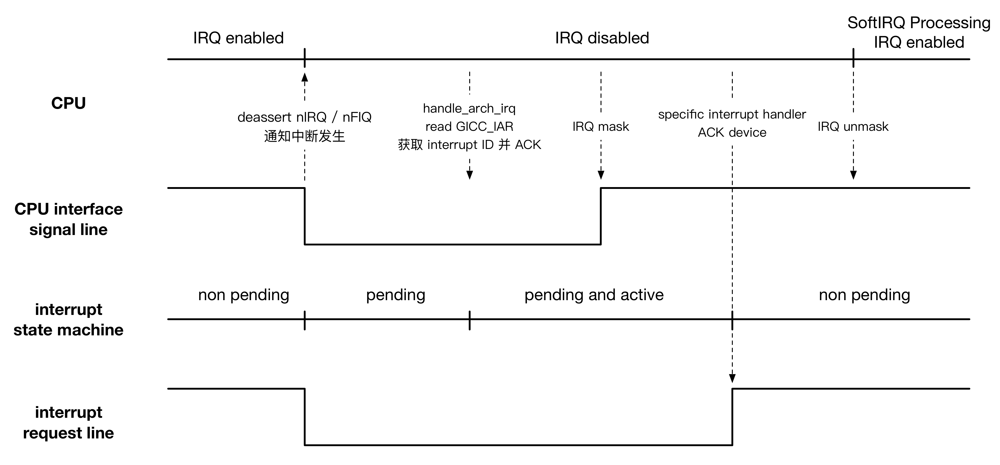
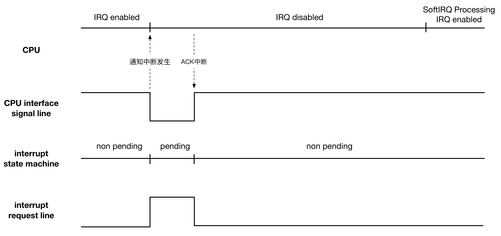

title:'Interrupt - 6 Flow Control'
## Interrupt - 6 Flow Control


IRQ flow control handler 抽象中断处理的通用流程即 generic handler，其将 high level generic irq flow 与 specific irq chip details 相结合，在 irq chip details 部分根据中断的不同电气特性如 level/edge triggered 等使用不同的 flow control handler


### Entry

IRQ routine 中，最终会调用 handle_IRQ() 开始进入 generic irq routine

handle_IRQ() 的输入是 irq ID，因而其中首先通过 interrupt domain 实现 irq ID 到 irq number 的映射，之后获取到该 irq number 对应的 irq descriptor，最终调用该irq_desc 的 handle_irq() 回调函数，也就是 high level flow control handler

```sh
handle_IRQ
    irq_enter
    generic_handle_irq
        generic_handle_irq_desc
            desc->handle_irq(irq, desc); //flow control handler
    irq_exit
```


flow control handler 用于通用中断处理逻辑的执行，包括中断嵌套、specific irq handler 调用等

GIC 中，对于 SGI 与 PPI 中断信号该 handler 为 handle_percpu_devid_irq()，对于 SPI 中断信号，该 handler 为 handle_fasteoi_irq()


```
handle_fasteoi_irq
    |_ handle_irq_event
        |_ handle_irq_event_percpu
            |_ action->handler(irq, action->dev_id)
```

handle_fasteoi_irq() 中遍历执行 irq descriptor 的 irq action 链表中的所有 specific irq handler


### Flow Control Handlers

上文介绍到，IRQ routine 中最终会调用对应的 irq descriptor 的 handle_irq() 回调函数，也就是 high level flow control handler

flow control handler 对各个 irq chip 中断信号的不同电气特性例如 level/edge triggered 进行了封装，因而不同的 interrupt controller 通常会为其下的 irq descriptor 设置与其电气特性相匹配的 flow control handler

中断子系统就针对中断信号线的不同电气特性，预先定义了对应的 flow control handler


#### handle_simple_irq

simple interrupt flow control handler 适用于 CPU 与硬件设备直连的场景，因而并不需要进行任何的 flow control 操作

- 若该中断的 state_use_accessors 标志位包含 IRQD_IRQ_INPROGRESS，即该中断正在被其他 CPU 处理，则函数直接返回
- 清除中断的 istate 标志位中的 IRQS_REPLAY、IRQS_WAITING 标志
- 若该中断的 action 链表为空，或处于 disable 状态，则将中断的 istate 标志位添加 IRQS_PENDING 标志，之后函数直接返回
- 调用 handle_irq_event() 进行具体的中断处理


#### handle_level_irq



对于 level sensitive interrupt，例如低电平有效，当设备发生中断时

1. 其对应的 interrupt request line 变为低电平
2. GIC 检测到低电平时该 interrupt ID 对应的 interrupt state machine 由 idle 状态变为 pending 状态
3. distributor 将该中断分发给相应的 CPU interface，CPU interface 将该中断传递给对应的 CPU，即对应的 nIRQ/nFIQ 变为低电平
4. CPU 检测到 nIRQ/nFIQ 的低电平状态，CPU 依次进入 IRQ、SVC mode 进行中断处理
5. 在 handle_arch_irq（对于 GIC 为 gic_handle_irq()）中，CPU 读取 GIC 的 GICC_IAR 寄存器从而获取发生中断的 interrupt ID，完成中断的 ACK 操作，此时该 interrupt ID 对应的 interrupt state machine 由 pending 状态变为 pending and active 状态
6. 仅管已经完成 CPU 对 GIC 的 ACK 操作，由于此时中断的 state machine 保持为 pending and active 状态，nIRQ/nFIQ 继续保持为低电平状态，此时必须对该中断进行 mask 操作，否则该中断将重复触发
7. flow control handler 中令 GIC 对该中断进行 mask 操作，此时 GIC 将相应 CPU interface 的 nIRQ/nFIQ 恢复为高电平状态
8. CPU 调用 handle_irq_event() 开始执行 specific interrupt handler，当 handler 对触发该中断的硬件设备进行相关操作以 ACK 该中断时，该硬件设备的 interrupt request line 恢复为高电平
9. specific interrupt handler 执行完毕
10. flow control handler 中令 GIC 对该中断进行 unmask 操作
11. 该 interrupt ID 对应的 interrupt state machine 恢复为 idle 状态


- 调用 mask_ack_irq() 向 interrupt controller 进行该中断的 mask 操作
- 若该中断的 state_use_accessors 标志位包含 IRQD_IRQ_INPROGRESS 标志，同时中断的 istate 标志位不包含 IRQS_POLL_INPROGRESS 标志，即该中断已经由其他 CPU 处理，此时该函数直接返回
- 清除中断的 istate 标志位的 IRQS_REPLAY 与 IRQS_WAITING 标志
- 若该中断的 specific interrupt handler 不存在，或其 state_use_accessors 标志位包含 IRQD_IRQ_DISABLED 标志，则向中断的 istate 标志位增加 IRQS_PENDING 标志，并返回
- 调用 handle_irq_event() 完成中断的具体处理
- 调用 cond_unmask_irq() 完成该中断的 unmask 操作


#### handle_edge_irq



对于 edge sensitive interrupt，例如上升沿触发，当设备发生中断时

1. 其对应的 interrupt request line 由低电平变为高电平，同时一直保持为高电平
2. interrupt controller 将该上升沿锁存到寄存器中，该 interrupt ID 对应的 interrupt state machine 由 idle 状态变为 pending 状态
3. CPU interface signal line 变为低电平，interrupt  controller 将该中断分发给相应的 CPU
4. 由于中断触发时上升沿 / 下降沿的时间很短，因而 CPU 必须尽快对该中断进行 ACK 操作，以 reenable 该中断，防止中断处理时间过长而错失下一次触发的中断；执行完 ACK 操作后，interrupt request line 恢复为低电平，CPU interface signal line 恢复为高电平，同时该 interrupt ID 对应的 interrupt state machine 由 pending 状态恢复为 idle 状态
5. CPU 调用 handle_irq_event() 开始执行 specific interrupt handler，执行过程中该中断可能再次被触发，此时该中断被分发给其他 CPU 进行处理，其他 CPU 检测到该中断当前正在被处理，因而只是将中断标记为 IRQS_PENDING 状态，之后随即退出处理过程；当前 CPU 在中断处理过程中当中断存在 IRQS_PENDING 标记时，需要循环执行中断的 specific interrupt handler，即其他 CPU 只是将中断标记为 IRQS_PENDING 状态，之后委托当前 CPU 执行中断的 specific interrupt handler，并且在该中断被当前 CPU 委托受理之前需要 mask 中断，以防止中断再次发生并重复设置 IRQS_PENDING 标记而丢失上一次的中断，因而当前 CPU 在受理其他 CPU 委托的中断时需要 unmask 中断，以 reenable 该中断


- 清除中断的 istate 标志位的 IRQS_REPLAY 与 IRQS_WAITING 标志
- 若该中断的 state_use_accessors 标志位包含 IRQD_IRQ_DISABLED 或 IRQD_IRQ_INPROGRESS 标志，即该中断已经被 disable 或正在被其他 CPU 处理，或该中断的 specific interrupt handler 为空，则将该中断的 istate 标志位添加 IRQS_PENDING 标志，同时调用 mask_ack_irq() 对该中断进行 mask 操作，之后函数直接返回
- 调用 interrupt controller 的 irq_ack() 回调函数，对该中断进行 ACK 操作，该操作执行结束后该中断可以再次被触发并由其他 CPU 进行处理
- 之后只要该中断的 istate 标志位包含 IRQS_PENDING 标志，同时该中断未被 disable，则循环调用 handle_irq_event() 进行具体的中断处理
    - 循环中，该中断可能在其他 CPU 上处理完毕，因而其 action 列表可能为空，此时调用 mask_irq()调用 interrupt controller 的 irq_mask() 回调函数以对该中断进行 mask 操作
    - 若循环过程中该中断再次被触发，其他 CPU 将该中断的 istate 标志位添加 IRQS_PENDING 标志，并委托本 CPU 对该中断进行处理时，被中断可能在之前对该中断进行 mask 操作，因而此时需要 unmask 该中断


#### handle_fasteoi_irq

一些 modern interrupt controller 已经在硬件中实现 flow control，因而内核在中断处理完毕后只需调用 interrupt controller 的 irq_eoi() 回调函数进行 EOI(End Of Interrupt) 处理，以通知 interrupt controller CPU 已经完成该中断的处理

- 若中断的 state_use_accessors 标志位包含 IRQD_IRQ_INPROGRESS 标志，即该中断当前正在被其他 CPU 处理，则函数直接返回
- 清除中断的 istate 标志位的 IRQS_REPLAY 与 IRQS_WAITING 标志
- 若中断的 action 链表为空或中断处于 disable 状态，则将该中断标记为 IRQS_PENDING 状态，并调用 mask_irq() 以 mask 该中断，之后函数直接返回
- 调用 preflow_handler()，其中调用中断描述符的 preflow_handler() 回调函数
- 调用 handle_irq_event() 进行具体的中断处理
- 调用 interrupt controller 的 irq_eoi() 回调函数进行 EOI 处理，以通知 interrupt controller CPU 已经完成该中断的处理


#### handle_edge_eoi_irq

handle_edge_eoi_irq() 与 handle_fasteoi_irq() 相类似，只是无需执行 mask/unmask 操作


#### handle_percpu_irq

handle_percpu_irq() 适用于 SMP 系统中特定中断只由特定 CPU 处理的情形，因而此时无需处理中断的嵌套或进行同步保护


#### handle_percpu_devid_irq

handle_percpu_devid_irq() 与 handle_percpu_irq() 相类似，同时 irq action 的 percpu_dev_id 字段存储触发中断的 device id


### Generic Flow Control Handling

上述介绍的 flow control handler 都是对 irq chip 的电气特性进行封装，但它们最终都会调用 handle_irq_event()/handle_irq_event_percpu() 完成中断的具体处理

这两个函数也就是封装了 flow control handler 中的通用逻辑，也就是 generic flow control handling


#### handle_irq_event

handle_irq_event() 完成中断的具体处理

- 清除中断的 istate 标志位的 IRQS_PENDING 标志
- 将该中断的 state_use_accessors 标志位添加 IRQD_IRQ_INPROGRESS 标志
- 调用 handle_irq_event_percpu()完成具体的处理
- 中断处理完成后，清除中断的 state_use_accessors 标志位的 IRQD_IRQ_INPROGRESS 标志


#### handle_irq_event_percpu

handle_irq_event_percpu() 完成中断的具体处理

- 遍历该中断描述符的 action 链表中的每个 irqaction，并对其中的每个 irqaction
    - 调用该 irqaction 的 specific interrupt handler
    - 调用 irqs_disabled() 检查 irqaction 执行过程中是否重新开启本地全局中断，若是则调用 local_irq_disable() 重新关闭当前 CPU 的本地全局中断
    - 若 noirqdebug 标志位为 0，则调用 note_interrupt() 进行 unhandled interrupt 与 spurious interrupt 的处理
- 对 HARDIRQ handler 的返回值进行检查
    - 若返回值为 IRQ_HANDLED，则说明之前执行的 specific irq handler 已经完成相应的中断处理
    - 若返回值为 IRQ_WAKE_THREAD，说明使用 threaded irq handler 继续完成中断的处理，则调用 irq_wake_thread() 唤醒该中断对应的 irq handler kthread，在该内核线程中继续完成接下来的中断处理
    - 若返回值为 IRQ_NONE，说明该中断并不属于之前执行的 specific irq handler


