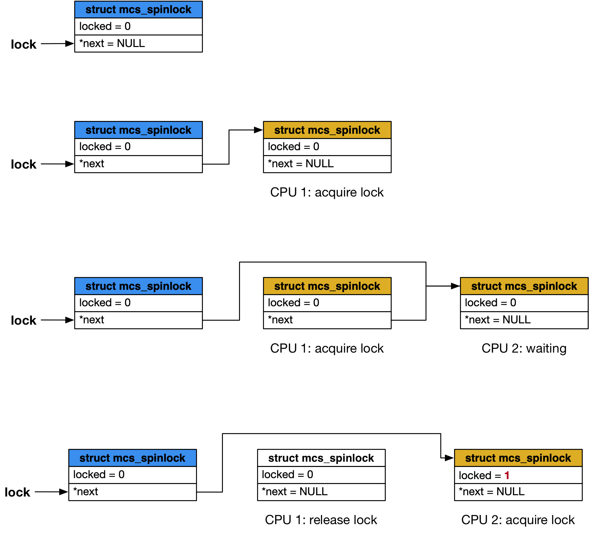

title:'Lock - 02 MCS Lock'
## Lock - 02 MCS Lock


ticket spinlock 中，每次锁的 owner 释放锁时会更新内存中 owner 的值，此时根据 cache 一致性协议，所有试图获取该锁的 CPU 都需要执行 cache line 的刷新操作，即执行一次读内存操作，以更新 cache line 中 owner 的值

虽然每个试图获取该锁的 CPU 都需要执行 cache line 的刷新操作，但实际上只有其中一个 CPU 的操作是有意义的，因为只有一个 CPU 最终能够获取锁，而其他 CPU 在每次锁释放时都需要重复地执行 cache line 刷新操作，这种频繁的 cache line 刷新操作会给总线带来压力，从而影响性能


这种 cache-line bouncing 的本质是所有 CPU 访问一个共享的变量（即 spinlock），其中一个 CPU 修改该变量的值时，其他 CPU 中包含该变量的 cache line 都会失效，必须执行一次 cache line 刷新操作

一种解决办法就是将本来共享的变量，扩展成一个 per-CPU 的变量，相当于在每个 CPU 都维护一份 owner 的拷贝，只有当本地 CPU 上 owner 的值变化时，才需要刷新对应 CPU 上的 cache line

该算法由 Mellor􏰀Crummey 和 Scott 提出，因而称为 MCS spinlock，在 v3.15 版本进入 linux 主线


MCS lock 的定义

```c
struct mcs_spinlock {
	struct mcs_spinlock *next;
	int locked; /* 1 if lock acquired */
	int count;  /* nesting count, see qspinlock.c */
};
```


### routine




#### init

每个 MCS lock 都有一个头部，使用 struct mcs_spinlock 来描述

刚初始化时，其 @next 字段为 NULL

通常使用一个 struct mcs_spinlock **lock 指针来描述这个头部，但是这个指针实际指向这个 struct mcs_spinlock 结构的 next 字段


#### CPU 1 lock

之后当调用 mcs_spin_lock() 时，每个 CPU 都需要分配一个节点，同样由 struct mcs_spinlock 来描述，同时将当前分配的节点的地址保存到头部的 @next 字段中

例如当 CPU 1 调用 mcs_spin_lock() 时，会通过 xchg() 将其对应的节点的地址保存到头部的 @next 字段中，同时获取 @next 字段在赋值之前的值

此时获取的 @next 字段在赋值之前的值实际就是 NULL，也就代表了该 MCS lock 空闲，此时该 CPU 就会获取锁


#### CPU 2 lock

之后当另一个 CPU 2 调用 mcs_spin_lock() 时，同样会分配一个节点，同时调用 xchg() 将其分配的节点的地址保存到头部的 @next 字段中，并获取 @next 字段在赋值之前的值

同时会将当前分配的节点添加到整个链表的尾部 (链表头的 @next 字段指向链表的尾部，因而实际上就是将当前分配的节点添加到 @next 字段指向的节点后面)

此时获取的 @next 字段在赋值之前的值，实际上是 CPU 1 的节点，由于获取的 @next 字段的旧值不为 NULL，说明该锁此时被其他 CPU 占用，因而当前 CPU 需要进入自旋状态，其过程是循环读取自身节点的 @locked 字段

节点分配之后，其 @locked 字段的初始值为 0，0 说明当前 CPU 还不能获取这个锁，因而当前 CPU 需要继续自旋


#### CPU 1 unlock

接下来当最初获得锁的 CPU（CPU 1）释放锁的时候，会将当前 CPU 对应的节点的下一个节点（CPU 2）的 @locked 字段置为 1，此时 CPU 2 正处于自旋状态，当检测到其对应节点的 @locked 字段为 1 时，就说明当前 CPU 获取了这个锁


#### summary

MCS lock 实际是基于链表的 spinlock，通过一个链表头来描述一个 MCS lock，每个尝试获得锁的 CPU 都需要分配一个节点，并依次添加到链表的尾部

所有 CPU 的节点会构成一个单向链表，而链表头的 @next 字段则指向这个链表尾部的最后一个节点，这样是为了方便将新加入的节点添加到链表的尾部

在锁释放的时候，只会将下一个节点的 @locked 字段的值更新为 1，因而也只有这个节点对应的 CPU 才需要执行 cache line 的刷新操作，从而可以减轻 ticket spinlock 的 cache bouncing 负担


