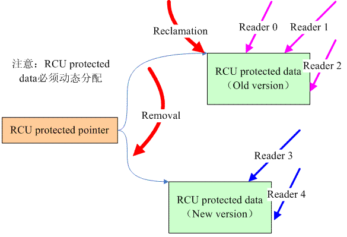

title:'RCU - 1 Base'
## RCU - 1 Base


RCU (Read-Copy Update) 实际上是一种读写同步机制

在 RCU 之前，内核实际已经实现两种读写锁，即

- rwlock，更倾向于 reader，即 writer 存在饥饿问题
- seqlock，更倾向于 writer，但会牺牲 reader 的性能，即 reader 会存在多次读取的情况，从而降低 reader 的性能，增大 reader 的延时

根据以上两种读写锁的缺点，内核引入 RCU 同步机制，RCU 实际倾向于 reader，其中 reader 的性能好，延时低，但是会牺牲 writer 的性能


### RCU Design

#### Base

RCU 只适用于对动态分配的内存进行同步保护，此时 RCU 需要对两部分的数据进行保护

1. pointer to dynamic allocated memory，以下简称为 pointer
2. dynamic allocated memory，以下简称为 object


RCU 的原理是

- writer 与 writer 之间是互斥的
- 多个 reader 可以并行运行
- reader 与 writer 也可以并行运行，当 writer 需要对 object 进行修改，而当前存在 reader 正在读取 object 时，writer 需要维护一份 object 的拷贝，writer 对该拷贝进行修改，在修改完成后更新 pointer，使其指向修改后的拷贝，最后等待使用原先 object 的 reader 全部完成操作离开临界区之后，再由 writer 释放原先的 object
- 由于 writer 对 pointer 的更新操作是原子的，这样 reader 看到的 pointer 要么指向原先的 object，要么指向修改后的 object 的拷贝，因而在 writer 修改过程中，reader 读取的内容可能是修改前的数据，也可能是修改后的数据，但至少 reader 读取的内容具有一致性，同时 writer 运行过程中，reader 也可以并行运行，从而提高 reader 的性能



以上过程中，writer 在更新 pointer 之后，还需要同步等待使用原先 object 的 reader 全部完成操作离开临界区后，再释放原先的 object，因而 writer 的性能会降低

因而 RCU 适用于 reader 性能要求较高，而 writer 性能要求不高，同时 reader 对读取的新旧数据不敏感的情景

此外 RCU 实际是 lock-free 的，即其中并不采用锁来实现同步，因而当 CPU core 增加时，RCU 的性能并不会随着竞争程度的加剧而下降，即 RCU 具有很好的 scalability


#### RCU API

> reader 使用的 API 有

- rcu_read_lock()

标记 reader 进入临界区，即 reader 开始访问 pointer 与 object


- rcu_read_unlock()

标记 reader 离开临界区


- rcu_dereference()

该接口通过 pointer 获取 object 的地址，其实际对指针的取值操作进行封装，同时增加 memory barrier 保护

---

> writer 使用的 API 有

- rcu_assign_pointer()

writer 对 object 的拷贝修改完成后，调用该接口更新 pointer 的值，使其指向 object 的拷贝


- synchronize_rcu()

writer 在更新 pointer 之后，需要调用该接口同步等待在旧版本的 object 上的所有 reader 离开临界区


- call_rcu()

writer 在更新 pointer 之后，一般需要调用 synchronize_rcu() 接口同步等待在旧版本的 object 上的所有 reader 离开临界区

但是在有些情况下，writer 不允许阻塞，此时 writer 可以通过该接口注册一个回调函数，之后 writer 即返回；之后当系统检测到旧版本的 object 上的所有 reader 离开临界区时，即会调用该回调函数通知 writer

即 writer 使用该接口异步地等待旧版本的 object 上的所有 reader 离开临界区

---

> RCU 的使用方法为

```c
/* reader */
rcu_read_lock();
p = rcu_dereference(gp);
if (p != NULL) {
    do_something_with(p->a, p->b, p->c);
}
rcu_read_unlock();


/* writer */
copy = malloc(...);
modify_new_allocated_memory();
rcu_assign_pointer(p, copy);
synchronize_rcu();
```


#### RCU Implementation

writer 在更新 pointer 之后，还需要同步等待使用原先 object 的 reader 全部完成操作离开临界区后，再释放原先的 object，那么 writer 怎么知道使用原先的 object 的 reader 已经全部离开临界区了呢？


最直观的一种实现方法是使用 reference count，即为 object 维护一份 reference count，每次 reader 进入临界区访问该 object 时都增加该 reference count 计数，reader 离开临界区时则减小该计数，这样当 reference count 计数为 0 时，则表明当前不存在 reader 引用该 object，那么 writer 也就可以安全释放该 object

然而通常需要使用相应的同步机制对 reference count 本身进行保护，无论是使用 lock 机制，还是 atomic type + memory barrier 的机制，其同步机制带来的时延都与 CPU core 的数量呈线性关系，因而当系统中 CPU core 的数量很多时，其带来的时延并不能实现 RCU 低时延的目标


Linux kernel 中实际使用一种非常巧妙的方式实现这一特性

假设所有 CPU 都是非抢占的，即运行进程不会被抢占，只有当进程主动让出 CPU 使用权时才会调度进程，在这样的情况下，当 writer 更新 pointer 并进入等待状态后，如果此时其他 CPU 上运行有 reader 正处于临界区之中，那么之后当该 CPU 发生调度时，则可以间接证明之前运行的 reader 已经离开临界区


> 怎样检测 reader 已经离开临界区呢

在 schedule() 函数中都会设置相关的标志位，从而通知等待的 writer，当前 CPU 已经经历至少一次调度，即该 CPU 上的 reader 已经不再引用旧版本的 object

此外如果某个 CPU 上只运行有一个进程，该进程是一个用户进程，该进程进入内核态时成为一个 RCU reader，之后该进程离开临界区并返回到用户态，由于该 CPU 上只有这一个进程需要调度，因而一直没有机会调用 schedule() 函数，此时需要使用其他机制检测该 CPU 上的 reader 是否已经离开临界区

针对以上情况，实际在 tick timer 中断处理程序中还会执行其他检查，例如当检测到 tick timer 中断发生前，上一个调度的进程实际运行在用户态时，则就说明之前运行的 RCU reader 已经离开临界区


> 怎样确保 CPU 非抢占呢

以上描述都是建立在 CPU 不能抢占的前提下，但是 Linux kernel 是支持内核抢占的，因而为了确保 CPU 非抢占的前提，reader 在进入临界区时都需要关闭抢占

那么在关闭抢占的情况下，为了防止死锁，reader 在临界区内是不能阻塞睡眠的


> UP

因而在 UP 系统中，由于系统中只存在一个 CPU，那么等到 writer 调度时，之前调度的 reader 肯定已经离开了临界区，因而 UP 系统中 writer 并不需要任何操作来检测该 CPU 上的 reader 是否已经离开临界区


> SMP

而在 SMP 系统中，只要 writer 进入等待状态后，监测到所有其他 CPU 都经历了至少一次调度，则可以证明当前已经没有 reader 引用旧版本的 object，此时 writer 就可以安全释放该 object


这样通过 CPU 是否发生调度，来判断 reader 是否离开临界区的机制，由于其并不采用相关同步机制，因而具有非常好的 scalability 特性，即系统中 CPU 数量很多时，其时延依然与 UP 系统中的时延相近


