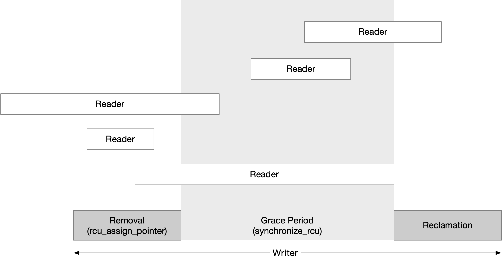

title:'RCU - 2 Classic RCU'
## RCU - 2 Classic RCU


### History

1. classic RCU

Linux v2.6.27 之前的 RCU 实现称为 classic RCU，这种命名规则自然是因为从 v2.6.27 开始，RCU 的实现开始向 tree RCU 演进并延续至今；因而将之前的实现称为 classic RCU，之后的实现称为 tree RCU

RCU 实现的核心在于 synchronize_rcu()的实现，即等待所有 reader 退出临界区；在 RCU 的实现中，writer 在更新 pointer 之后，需要调用 synchronize_rcu() 接口等待在旧版本的 object 上的所有 reader 离开临界区

classic RCU 的实现中使用一个全局的 cpumask 来进行跟踪，当 writer 调用 synchronize_rcu()接口的时候，该 cpumask 的所有 bit 被初始化为 1，之后其他每个 CPU 在退出临界区的时候都将 cpumask 中对应的 bit 清为 0；最后当 cpumask 的所有 bit 都清为 0 时，就说明所有 reader 都已经离开了临界区，此时 synchronize_rcu() 接口返回

由于 cpumask 是一个全局变量，所有 CPU 会对其进行并发修改，因而需要使用一个全局的自旋锁对 cpumask 进行保护，但此时就会引入对这个全局自旋锁的竞争，也就是说 classic RCU 的 scalability 特性受到挑战


2. tree RCU

从 v2.6.27 开始，RCU 的实现开始向 tree RCU 演进，tree RCU 具有 hierarchical tree 结构，其核心原理是将 cpumask 在空间上分散开来，拆分为一个树状结构，树状结构中的每个节点维护一个 bitmask，所有节点的 bitmask 合在一起就是原先的全局 cpumask

此时树状结构中的每个节点仍然需要一个自旋锁，对节点中的 bitmask 进行保护，但是由于此时每个节点的并发访问的压力大为下降，因而 tree RCU 具有更好的 scalability 特性，因而通常使用于 SMP 系统


3. tiny RCU

classic RCU 在向 tree RCU 演进的同时，内核开发者对 classic RCU 进行精简，保留了全局 cpumask 的实现，但是移除 SMP 实现部分，只保留 UP 实现部分，得到一个专用于 UP 系统的 RCU 实现，称为 tiny RCU，适用于 UP 的嵌入式环境

所以说 tiny RCU 和 tree RCU 同源于 classic RCU，只是两种演化方向的产物，其中 tiny RCU 适用于 UP 的嵌入式环境，而 tree RCU 适用于大规模 SMP 的服务器场景


### Concept

之前介绍过，从 v2.6.27 开始 RCU 的实现开始向 tree RCU 演进，但其实最经典的 classic RCU 实现应该参考 v2.6.16 版本，本文就以这个版本介绍 classic RCU 的实现

#### grace period

如下图所示，writer 在调用 synchronize_rcu() 等待所有 reader 退出临界区的这一段时间称为 grace period




#### batch

classic RCU 中，我们将一次 synchronize_rcu() 调用称为一个同步请求 (synchronize request)

synchronize_rcu() 中需要等待所有 reader 退出临界区，我们将这一操作称为“进入 grace period”

每个 CPU 上每时每刻都在产生新的同步请求，实际上 classic RCU 是按照批处理的方式，让之前提交的一批同步请求统一进入 grace period 状态，也就是以 batch 为单位执行 RCU 的同步请求，这样可以提升效率


> request lists

实际上每个 CPU 都维护有 3 个链表管理该 CPU 上提交的同步请求

```c
struct rcu_data {
	...
	struct rcu_head *nxtlist;
	struct rcu_head *curlist;
	struct rcu_head *donelist;
};
```

调用 synchronize_rcu() 提交的请求都会暂时缓存在 @nxtlist 链表中，而不会立刻进入 grace period 状态

在合适的条件下，缓存在 @nxtlist 链表中的这些之前提交的同步请求会统一进入 grace period 状态，此时这些同步请求也会由 @nxtlist 链表转移到 @curlist 链表，该链表实际上就组织了所有正处于 grace period 状态的同步请求

之后当 @curlist 链表中的这一批同步请求完成 grace period 检查（即所有 reader 都已经退出临界区）时，这些同步请求就会由 @curlist 链表转移到 @donelist 链表，该链表实际上就组织了所有已经度过 grace period 的同步请求

此外这个时候也会再次将 @nxtlist 链表中的请求转移到 @curlist 链表中，以发起新一轮 batch 的处理


> batch number

classic RCU 中是按照 batch 为单位处理 RCU 同步请求的，每个 batch 都有自己的编号

classic RCU 中维护两个全局的计数

```c
struct rcu_ctrlblk {
	long	cur;		/* Current batch number. */
	long	completed;	/* Number of the last completed batch */
	...
};
```

@completed 计数描述上一轮已经完成 grace period 阶段的 batch ID
@cur 计数描述当前正在处理的 batch ID

- 如果 @cur == @completed，那就说明 @cur 计数描述的 batch 当前已经完成了 grace period 阶段
- 如果 @cur > @completed，那就说明 @cur 计数描述的 batch 当前正处于 grace period 阶段，但尚未完成


#### start new batch

> refill @curlist

之前介绍过，synchronize_rcu() 下发的同步请求会暂时缓存在 @nxtlist 链表中，之后在合适的条件下，缓存在 @nxtlist 链表中的这些同步请求会统一进入 grace period 状态

这里说的“合适的条件”，实际上就是上一轮 batch（也就是之前 @curlist 链表中的所有请求）完成 grace period 阶段的时候

```sh
timer_interrupt
    update_process_times
        rcu_check_callbacks
            # schedule tasklet, that is, rcu_process_callbacks
                __rcu_process_callbacks
                    # move requests in @nxtlist to @curlist
                    # @batch = @cur + 1;
```


这一过程中，CPU 将新一轮的 batch 进入 grace period 状态时，会使用 (@cur + 1) 作为当前这个 batch 的编号，并保存在各自 CPU 的 @batch 字段

```c
struct rcu_data {
	long  	       	batch;  /* Batch # for current RCU batch */
	...
};
```


> global - start new batch

需要注意的是，上一步操作还没有真正地开始新一轮的 batch，接下来还会判断 @cur、@completed 全局计数的情况


此时如果全局计数 @cur > @completed，这种情况是，在当前 CPU 上 @cur 编号描述的 batch 已经完成了 grace period 阶段，转而发起了新一轮也就是下一轮的 batch，但是 @cur != @completed 说明在其他 CPU 上 @cur 编号描述的 batch 还没有完成 grace period 阶段

之后会介绍 classic RCU 中使用全局的 cpumask 来辅助 grace period 阶段的判断，由于所有 CPU 共用这个 cpumask，因而所有的 CPU 也必须共享相同的 @cur 计数 

因而在当前这种情况下，由于存在其他 CPU 上 @cur 编号的 batch 还没有完成 grace period 阶段，因而当前 CPU 实际上还不能发起新一轮的 batch


而如果 @cur == @completed，说明 @cur 编号的 batch 当前已经完成了 grace period 阶段（在一开始初始化的时候，也是 @cur == @completed），那么就会更新 @cur 全局计数，也就是 (@cur++)，也就相当于发起新一轮的 batch

```sh
timer_interrupt
    update_process_times
        rcu_check_callbacks
            # schedule tasklet, that is, rcu_process_callbacks
                __rcu_process_callbacks
                    # move requests in @nxtlist to @curlist
                    # @batch = @cur + 1;
                    rcu_start_batch
                        # cur++;
                        # reset @cpumask, all bits set
```


> local - start new batch

在上一小节中介绍，在发起新一轮 batch 的时候，会将全局的 @cpumask 全部设置为 1

之后会判断 CPU 本地的 @quiescbatch 计数与全局的 @cur 计数的情况

CPU 本地的 @quiescbatch 计数描述当前 CPU 上正处于 grace period 阶段的 batch 编号，其初始值与全局的 @completed 计数相等

```c
struct rcu_data {
	long		quiescbatch;     /* Batch # for grace period */
	...
}
```

此时如果 @quiescbatch != @cur，说明全局已经发起了新一轮的 batch，当前 CPU 的 @quiescbatch 编号的 batch 已经完成了 grace period 阶段，因而此时在当前 CPU 上可以发起新一轮的 batch，也就是将本地的 @quiescbatch 计数，更新为全局的 @cur 计数

```sh
timer_interrupt
    update_process_times
        rcu_check_callbacks
            # schedule tasklet, that is, rcu_process_callbacks
                __rcu_process_callbacks
                    rcu_check_quiescent_state
                        if @quiescbatch != @cur:
                            @quiescbatch = @cur;
                            @passed_quiesc = 0;
                            @qs_pending = 1;
```


这里为什么将 start new batch 描述为 global 与 local 两个阶段？

因为如果 @quiescbatch == @cur，同时本地的 @qs_pending 标志位为 0，那么说明在当前 CPU 上 @quiescbatch 编号的 batch 实际上已经完成了 grace period 阶段，但是由于上文介绍的，在当前 CPU 上 @cur 编号的 batch 已经完成了 grace period 阶段，但是在其他 CPU 上 @cur 编号的 batch 还没有完成 grace period 阶段，这就导致 @cur 计数无法向前递增，从而导致本地的 @quiescbatch 无法更新，也就是当前 CPU 不能发起新一轮的 batch


#### quiescent states

synchronize_rcu() 是 RCU 实现的核心，其核心任务就是如何判断其他 CPU 上的 reader 都已经离开临界区

> quiescent states

classic RCU 中使用 CPU 本地的 @passed_quiesc 标志位来描述，自从 @cur 编号的 batch 进入 grace period 状态以来，在该 CPU 上的 reader 是否已经离开了临界区

```c
struct rcu_data {
	int		passed_quiesc;	 /* User-mode/idle loop etc. */
	...
}
```

在上一小节中介绍到，当本地 CPU 开始新一轮 batch 的时候，会将本地的 @passed_quiesc 标志位置为 0；之后如果检查到本地 CPU 上的 reader 已经离开了临界区，就可以重新设置上 @passed_quiesc 标志位


回到原来的话题，grace period 阶段的核心任务是如何判断其他 CPU 上的 reader 都已经离开临界区

我们将 reader 处于临界区之中的状态称为是 active state，reader 离开临界区的状态称为是 quiescent state

如果我们能判断其他 CPU 上的进程处于 quiescent state，那么我们就能通过这种间接的方式，判断该 CPU 上的 reader 已经离开了临界区；实际上 classic RCU 正是通过判断 quiescent state 的方式，来间接判断其他 CPU 上的 reader 是否都已经离开临界区的

1. schedule

假设所有 CPU 都是非抢占的，即运行进程不会被抢占，只有当进程主动让出 CPU 使用权时才会调度进程，在这样的情况下，当 writer 更新 pointer 并进入等待状态后，如果此时其他 CPU 上运行有 reader 正处于临界区之中，那么之后当该 CPU 发生调度时，则可以间接证明之前运行的 reader 已经离开临界区

```
schedule
    rcu_qsctr_inc
        @passed_quiesc = 1;
```


当然这里的前提是内核是非抢占的，为了实现这一点，reader 在进入临界区的时候就必须关闭内核抢占

```c
#define rcu_read_lock()     preempt_disable()
#define rcu_read_unlock()   preempt_enable()
```


2. never schedule

如果一个 CPU 上只有一个进程等待运行，那么这个 CPU 就会一直运行着一个进程而不会发生 schedule 调度，这种情况下就不能再使用之前描述的第一点来实现判断

2.1. switch to user space

针对以上情况，会依赖于 tick timer 中断处理程序来执行相关的检查，此时如果检测到 tick timer 中断发生时，被抢占的进程实际运行在用户态时，那么就说明之前运行的 reader 实际上已经离开临界区

```sh
timer_interrupt
    update_process_times
        rcu_check_callbacks
            if interrupt from user mode:
                rcu_qsctr_inc
                    @passed_quiesc = 1;
```


2.2. idle thread loop

如果这个一直运行的进程实际上是 idle 内核线程，那么在 tick timer 中断处理程序中，也会直接判定当前 CPU 已经切换到 quiescent state，因为 idle 内核线程不会调用 RCU 同步

```sh
timer_interrupt
    update_process_times
        rcu_check_callbacks
            if interrupt from idle kthread:
                rcu_qsctr_inc
                    @passed_quiesc = 1;
```


2.3. kthread

还剩下一种情况就是，这个一直运行的进程是内核线程，但不是 idle 内核线程，这种情况下实际上就没有办法判断该 CPU 是否已经切换到 quiescent state


---

> clear cpumask

已经切换到 quiescent state 的 CPU，会将全局的 @cpumask 中该 CPU 对应的 bit 清为 0

```sh
timer_interrupt
    update_process_times
        rcu_check_callbacks
            # schedule tasklet, that is, rcu_process_callbacks
                __rcu_process_callbacks
                    rcu_check_quiescent_state
                        if @passed_quiesc != 0:
                            @qs_pending = 0;
                            if @quiescbatch == @cur:
                                cpu_quiet
                                    cpu_clear(cpu, @cpumask);
```


#### check grace period

之前介绍到，全局发起新一轮 batch 的时候，会将全局的 @cpumask 全部设置为 1

同时本地发起新一轮 batch 的时候，会将本地的 @qs_pending 标志设置为 1，以标志本地 CPU 发起了新一轮的 batch


接下来按照上一节描述的，在各个 CPU 上当检测到 quiescent state 时，就会将当前 CPU 本地的 @passed_quiesc 标志位设置为 1

同时在这个 CPU 的 tick timer 中断处理程序中，会将 @cpumask 中当前 CPU 对应的 bit 清为 0，以表示该 CPU 上已经发生过了 quiescent state

```sh
timer_interrupt
    update_process_times
        rcu_check_callbacks
            # schedule tasklet, that is, rcu_process_callbacks
                __rcu_process_callbacks
                    rcu_check_quiescent_state
                        if @passed_quiesc != 0:
                            @qs_pending = 0;
                            if @quiescbatch == @cur:
                                cpu_quiet
                                    if cpus_empty(@cpumask):
                                        @completed = @cur
```

最终如果 @cpumask 的全部 bit 都清为 0，就说明自 @cur 编号的 batch 进入 grace period 状态以来，所有 CPU 上都发生过 quiescent state，也就是所有 reader 都已经离开了临界区，此时会将全局的 @completed 计数更新为 @cur 计数，以表明 @cur 编号的 batch 已经完成了 grace period 阶段


#### reclamation (leave grace period)

最终当检测到全局的 @completed 计数与本地的 @batch 计数相等时，说明 @batch 编号描述的 batch，也就是此时 @curlist 链表中的所有同步请求都已经完成 grace period 阶段，此时就会将这些请求从 @curlist 链表转移到 @donelist 链表中

接下来就会依次处理 @donelist 链表中的所有同步请求，也就是调用每个同步请求对应的 RCU callback 回调函数

```sh
timer_interrupt
    update_process_times
        rcu_check_callbacks
            # schedule tasklet, that is, rcu_process_callbacks
                __rcu_process_callbacks
                    if @completed >= @batch:
                        # move requests from @curlist to @donelist 
                    if @donelist:
                        rcu_do_batch
```


### Example

#### 1. init

在初始状态下

- 全局的 cur 与 completed 计数的初始值均为 -300

- 各个 CPU 本地的
    - batch 为 0
    - passed_quiesc 为 0
    - qs_pending 为 0
    - quiescbatch 的初始值与 completed 相同，即 -300


rcu_ctrlblk     | CPU 0 rcu_data    | CPU 1 rcu_data
----            | ----              | ----
cur(-300)       | quiescbatch(-300) | quiescbatch(-300)
completed(-300) | qs_pending(0)     | qs_pending(0)
next_pending(0) | passed_quiesc(0)  | passed_quiesc(0)
cpumask(0, 0)   | batch(0)          | batch(0)
                | nextlist()| nextlist() 
                | curlist()| curlist() 
                | donelist()| donelist()


#### 2.1 CPU 0 call synchronize_rcu()

CPU 0 中 writer 调用 synchronize_rcu() 时，会将该 RCU 同步请求添加到 CPU 0 的 @nxtlist 链表中

之后 CPU 0 中另一个 writer 又一次调用 synchronize_rcu()，同样将对应的 RCU 同步请求添加到 CPU 0 的 @nxtlist 链表中

此时

rcu_ctrlblk     | CPU 0 rcu_data    | CPU 1 rcu_data
----            | ----              | ----
cur(-300)       | quiescbatch(-300) | quiescbatch(-300)
completed(-300) | qs_pending(0)     | qs_pending(0)
next_pending(0) | passed_quiesc(0)  | passed_quiesc(0)
cpumask(1, 1)   | batch(0)          | batch(0)
                | nextlist(==)      | nextlist()
                | curlist()         | curlist()
                | donelist()        | donelist()


#### 2.2 CPU 0 start new batch

之后 CPU 0 的 tick timer 产生中断，在中断处理程序中，由于当前 CPU 的 @curlist 链表为空，而 @nxtlist 链表不为空，即存在等待处理的 RCU 同步请求需要处理，因而此时会调用 rcu_check_callbacks()

```sh
timer_interrupt
    update_process_times
        # because @curlist empty, while @nxtlist not empty
            rcu_check_callbacks
                # schedule tasklet, that is, rcu_process_callbacks
                    __rcu_process_callbacks
                        # move requests in @nxtlist to @curlist
                        # @batch = @cur + 1;
                        rcu_start_batch
                            # because @completed == @cur
                            # cur++;
                            # reset @cpumask, all bits set
                        rcu_check_quiescent_state
                            if @quiescbatch != @cur:
                                @quiescbatch = @cur;
                                @passed_quiesc = 0;
                                @qs_pending = 1;
```

> refill @curlist

其中就会将 @nxtlist 链表中的所有 RCU 同步请求转移到 @curlist 链表中

同时为这一批 batch 分配对应的 batch ID 即 (@cur + 1)，并保存在本地的 @batch 字段；由于此时全局的 @cur 计数的值为 -300，因而当前这批 batch 分配的 batch ID 即为 -299

> global - start new batch

接下来在 rcu_start_batch() 中检查到 @completed == @cur (两者都是初始值 -300)，即全局的 @cur 编号的 batch 已经完成了 grace period 阶段，因而当前可以将 @cur 计数向前递增 (更新为 -299)，以描述在全局范围内开启新一轮 batch 的 grace period 阶段，此时会初始化全局的 @cpumask 字段，其中当前所有运行的 CPU 对应的 bit 置为 1

> local - start new batch

接下来在 rcu_check_quiescent_state() 中，检查到 @quiescbatch != @cur (@quiescbatch 为 -300，@cur 为 -299)，此时会将 @quiescbatch 计数更新为 @cur 计数的值，也就是 -299

同时将本地的 @qs_pending 标志位设置为 1，从而标志着本地 CPU 开启新一轮 batch 的 grace period 阶段，之后函数即返回


上述 CPU 0 tick timer 中断处理程序执行结束后，状态为

rcu_ctrlblk     | CPU 0 rcu_data    | CPU 1 rcu_data
----            | ----              | ----
cur(-299)       | quiescbatch(-299) | quiescbatch(-300)
completed(-300) | qs_pending(1)     | qs_pending(0)
next_pending(0) | passed_quiesc(0)  | passed_quiesc(0)
cpumask(1, 1)   | batch(-299)       | batch(0)
                | nextlist()        | nextlist() 
                | curlist(==)       | curlist()
                | donelist()        | donelist()


#### 3.1 CPU 1 call synchronize_rcu()

接下来如果 CPU 1 上调用 synchronize_rcu()，这个请求会被缓存到 @nxtlist 链表中

rcu_ctrlblk     | CPU 0 rcu_data    | CPU 1 rcu_data
----            | ----              | ----
cur(-299)       | quiescbatch(-299) | quiescbatch(-300)
completed(-300) | qs_pending(1)     | qs_pending(0)
next_pending(0) | passed_quiesc(0)  | passed_quiesc(0)
cpumask(1, 1)   | batch(-299)       | batch(0)
                | nextlist()        | nextlist(=) 
                | curlist(==)       | curlist()
                | donelist()        | donelist()


#### 3.2 CPU 1 start new batch

之后 CPU 1 上发生 tick timer 中断的时候，@nxtlist 链表中缓存的请求就会被转移到 @curlist 链表中

```sh
timer_interrupt
    update_process_times
        # because @curlist empty, while @nxtlist not empty
            rcu_check_callbacks
                # schedule tasklet, that is, rcu_process_callbacks
                    __rcu_process_callbacks
                        # move requests in @nxtlist to @curlist
                        # @batch = @cur + 1;
                        rcu_start_batch
                            # because @completed != @cur
                            # return;
                        rcu_check_quiescent_state
                            if @quiescbatch != @cur:
                                @quiescbatch = @cur;
                                @passed_quiesc = 0;
                                @qs_pending = 1;
```

> refill @curlist

@nxtlist 链表中缓存的所有 RCU 同步请求会被转移到 @curlist 链表中

同时为这一批 batch 分配对应的 batch ID 即 (@cur + 1) 即 -298，并保存在本地的 @batch 字段

> global - start new batch

接下来在 rcu_start_batch() 中由于 @completed != @cur (@completed 为 -300，@cur 为 -298)，因而此时不需要再将 @cur 计数向前递增

> local - start new batch

接下来在 rcu_check_quiescent_state() 中，检查到 @quiescbatch != @cur (@quiescbatch 为 -300，@cur 为 -299)，此时会将 @quiescbatch 计数更新为 @cur 计数的值，也就是 -299

同时将本地的 @qs_pending 标志位设置为 1，从而标志着本地 CPU 开启新一轮 batch 的 grace period 阶段，之后函数即返回


rcu_ctrlblk     | CPU 0 rcu_data    | CPU 1 rcu_data
----            | ----              | ----
cur(-299)       | quiescbatch(-299) | quiescbatch(-299)
completed(-300) | qs_pending(1)     | qs_pending(1)
next_pending(0) | passed_quiesc(0)  | passed_quiesc(0)
cpumask(1, 1)   | batch(-299)       | batch(-299)
                | nextlist()        | nextlist() 
                | curlist(==)       | curlist(=)
                | donelist()        | donelist()


#### 4.1 CPU 1 switch to quiescent state

接下来当判定 CPU 1 已经切换到 quiescent state 时，就会将 CPU 1 本地的 @passed_quiesc 标志位设置为 1

例如当 CPU 1 上发生进程切换的时候，

```
schedule
    rcu_qsctr_inc
        @passed_quiesc = 1;
```

或者 CPU 1 上运行的进程实际上是 idle 内核线程，或运行的进程实际上已经回到用户态的时候，

```sh
timer_interrupt
    update_process_times
        rcu_check_callbacks
            if interrupt from user mode:
                rcu_qsctr_inc
                    @passed_quiesc = 1;
```

都可以判定 CPU 1 已经切换到 quiescent state

已经切换到 quiescent state 的 CPU，会将全局的 @cpumask 中该 CPU 对应的 bit 清为 0

```sh
timer_interrupt
    update_process_times
        rcu_check_callbacks
            # schedule tasklet, that is, rcu_process_callbacks
                __rcu_process_callbacks
                    rcu_check_quiescent_state
                        if @passed_quiesc != 0:
                            @qs_pending = 0;
                            if @quiescbatch == @cur:
                                cpu_quiet
                                    cpu_clear(cpu, @cpumask);
```


此时状态为

rcu_ctrlblk     | CPU 0 rcu_data    | CPU 1 rcu_data
----            | ----              | ----
cur(-299)       | quiescbatch(-299) | quiescbatch(-299)
completed(-300) | qs_pending(1)     | qs_pending(1)
next_pending(0) | passed_quiesc(0)  | passed_quiesc(1)
cpumask(1, 0)   | batch(-299)       | batch(-299)
                | nextlist()        | nextlist() 
                | curlist(==)       | curlist(=)
                | donelist()        | donelist()         


#### 4.2 CPU 0 switch to quiescent state

类似地，当 CPU 0 也已经切换到 quiescent state 时，就会将 CPU 0 本地的 @passed_quiesc 标志位设置为 1，同时将全局的 @cpumask 中该 CPU 对应的 bit 清为 0

此时状态为

rcu_ctrlblk     | CPU 0 rcu_data    | CPU 1 rcu_data
----            | ----              | ----
cur(-299)       | quiescbatch(-299) | quiescbatch(-299)
completed(-300) | qs_pending(1)     | qs_pending(1)
next_pending(0) | passed_quiesc(1)  | passed_quiesc(1)
cpumask(0, 0)   | batch(-299)       | batch(-299)
                | nextlist()        | nextlist() 
                | curlist(==)       | curlist(=)
                | donelist()        | donelist()
              

#### 5.1 CPU 1 check grace period

之后 CPU 1 tick timer 中断再次到来时，在 rcu_check_quiescent_state() 中会检查当前 CPU 的 @quiescbatch 编号的 batch 是否已经完成 grace period 阶段

```sh
timer_interrupt
    update_process_times
        rcu_check_callbacks
            # schedule tasklet, that is, rcu_process_callbacks
                __rcu_process_callbacks
                    rcu_check_quiescent_state
                        if @passed_quiesc != 0:
                            @qs_pending = 0;
                            if @quiescbatch == @cur:
                                cpu_quiet
                                    if cpus_empty(@cpumask):
                                        @completed = @cur
```

由于本地的 @passed_quiesc 标志位为 1，即当前 CPU 已经切换到 quiescent state，接下来由于 @quiescbatch == @cur (两者皆为 -299)，因而会继续检查到 @cpumask 已经为空，说明自从 @cur 编号的 batch 进入 grace period 阶段以来，所有 CPU 都已经切换到 quiescent state，也就意味着 @cur 编号的 batch 已经完成 grace period 阶段，此时就会将全局的 @completed 计数更新为 @cur 计数的值

rcu_ctrlblk     | CPU 0 rcu_data    | CPU 1 rcu_data
----            | ----              | ----
cur(-299)       | quiescbatch(-299) | quiescbatch(-299)
completed(-299) | qs_pending(1)     | qs_pending(0)
next_pending(0) | passed_quiesc(1)  | passed_quiesc(1)
cpumask(0, 0)   | batch(-299)       | batch(-299)
                | nextlist()        | nextlist() 
                | curlist(==)       | curlist(=)
                | donelist()        | donelist()


#### 5.1 CPU 1 reclamation

接下来 CPU 1 中检测到全局的 @completed 计数与本地的 @batch 计数相等时，说明 @batch 编号描述的 batch，也就是此时 @curlist 链表中的所有同步请求都已经完成 grace period 阶段，此时就会将这些请求从 @curlist 链表转移到 @donelist 链表中

接下来就会依次处理 @donelist 链表中的所有同步请求，也就是调用每个同步请求对应的 RCU callback 回调函数

```sh
timer_interrupt
    update_process_times
        rcu_check_callbacks
            # schedule tasklet, that is, rcu_process_callbacks
                __rcu_process_callbacks
                    if @completed >= @batch:
                        # move requests from @curlist to @donelist 
                    if @donelist:
                        rcu_do_batch
```


rcu_ctrlblk     | CPU 0 rcu_data    | CPU 1 rcu_data
----            | ----              | ----
cur(-299)       | quiescbatch(-299) | quiescbatch(-299)
completed(-299) | qs_pending(1)     | qs_pending(0)
next_pending(0) | passed_quiesc(1)  | passed_quiesc(1)
cpumask(0, 0)   | batch(-299)       | batch(-299)
                | nextlist()        | nextlist() 
                | curlist(==)       | curlist()
                | donelist()        | donelist(=)


#### 6.1 CPU 0 reclamation

类似地 CPU 0 中检测到全局的 @completed 计数与本地的 @batch 计数相等时，说明 @batch 编号描述的 batch 都已经完成 grace period 阶段，此时就会将这些请求从 @curlist 链表转移到 @donelist 链表中

接下来就会依次处理 @donelist 链表中的所有同步请求，也就是调用每个同步请求对应的 RCU callback 回调函数

rcu_ctrlblk     | CPU 0 rcu_data    | CPU 1 rcu_data
----            | ----              | ----
cur(-299)       | quiescbatch(-299) | quiescbatch(-299)
completed(-299) | qs_pending(1)     | qs_pending(0)
next_pending(0) | passed_quiesc(1)  | passed_quiesc(1)
cpumask(0, 0)   | batch(-299)       | batch(-299)
                | nextlist()        | nextlist() 
                | curlist()         | curlist()
                | donelist(==)      | donelist()


#### 6.2 CPU 0 check grace period

由于 __rcu_process_callbacks() 函数中将请求从 @curlist 链表转移到 @donelist 链表的操作，在 rcu_check_quiescent_state() 之前，因而这里是请求转移到 @donelist 链表之后，再执行 check grace period 阶段

这里会将本地的 @qs_pending 标志位清为 0，并将全局的 @completed 计数更新为 @cur 计数的值 (还是 -299)

```sh
timer_interrupt
    update_process_times
        rcu_check_callbacks
            # schedule tasklet, that is, rcu_process_callbacks
                __rcu_process_callbacks
                    rcu_check_quiescent_state
                        if @passed_quiesc != 0:
                            @qs_pending = 0;
                            if @quiescbatch == @cur:
                                cpu_quiet
                                    cpu_clear(cpu, @cpumask);
                                    if cpus_empty(@cpumask):
                                        @completed = @cur
```

rcu_ctrlblk     | CPU 0 rcu_data    | CPU 1 rcu_data
----            | ----              | ----
cur(-299)       | quiescbatch(-299) | quiescbatch(-299)
completed(-299) | qs_pending(0)     | qs_pending(0)
next_pending(0) | passed_quiesc(1)  | passed_quiesc(1)
cpumask(0, 0)   | batch(-299)       | batch(-299)
                | nextlist()        | nextlist() 
                | curlist()         | curlist()
                | donelist(==)      | donelist(=)


这里相当于是重复更新 @completed 计数的值，因为之前 CPU 1 已经更新过 @completed 计数了，但是这是安全的，因为如果 CPU 1 更新 @completed 计数之后，@cur 计数往前递增了 (更新为 -298)，那么此时 CPU 0 在执行到 rcu_check_quiescent_state() 的时候，就会发现 @quiescbatch != @cur (@quiescbatch 为 -299，@cur 为 -298)，那么 CPU 0 实际上就会执行 local - start new batch 的操作，之后函数直接返回，而不会执行更新 @completed 计数的操作

```sh
timer_interrupt
    update_process_times
        rcu_check_callbacks
            # schedule tasklet, that is, rcu_process_callbacks
                __rcu_process_callbacks
                    rcu_check_quiescent_state
                        if @passed_quiesc != 0:
                            @qs_pending = 0;
                            if @quiescbatch != @cur:
                                @qs_pending = 1;
                                @passed_quiesc = 0;
                                @quiescbatch = @cur;
```
