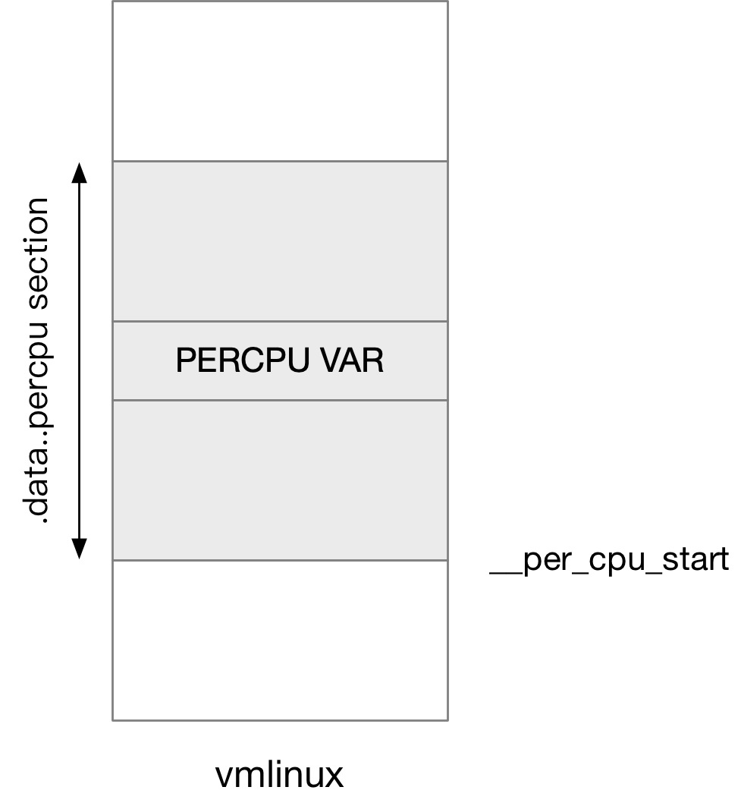
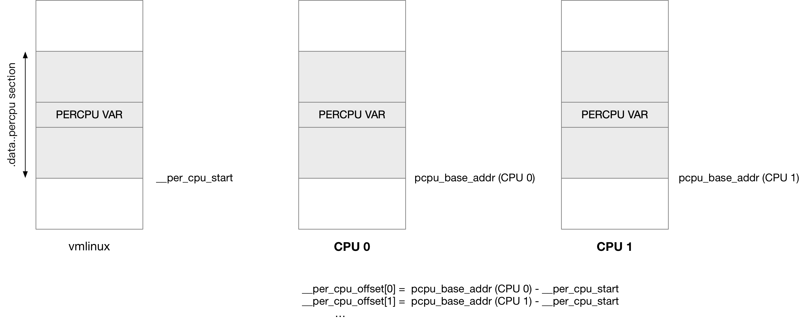

title:'Atomic - PERCPU'
## Atomic - PERCPU


当多个 CPU 需要并发访问同一个内存时，必须使用锁机制对访问的内存进行保护，但是锁本身的竞争会严重影响这种设计的 scalability

内核中通常可以使用 PERCPU 变量来解决这一问题，其原理是为每个 CPU 维护一份内存的拷贝，每个 CPU 都只是访问各自 CPU 对应的那一份内存，这是典型的空间换时间，通过内存的冗余来换取性能


### compile phase

```c
DEFINE_PER_CPU(type, name)
```

在编译阶段，DEFINE_PER_CPU() 定义 PERCPU 变量的时候，实际上是在相应的 section 存储了一份变量

 | UP section | SMP section | Alignment
 ---- | ---- | ---- | ----
built-in kernel | .data | .data..percpu | none
defined-in module | .data | .data..percpu | none


需要注意的是，此时相应的 section 中该变量实际上只有**一份**，此时还没有相应的拷贝




### load phase

为什么在编译阶段，定义的变量还是只有一份，为什么不直接定义一个 NR_CPUS 大小的数组呢？

首先 NR_CPUS 定义的是理论上系统的最大 CPU 数量，如果实际运行过程中，实际运行的 CPU 数量远小于 NR_CPUS 的值，那么定义的 NR_CPUS 大小的数组就会极大地浪费内存

其次通过数组分配的内存在地址上是连续的，在 UMA 系统 (即系统中只有一个 NUMA node) 中自然没有问题，但是在 NUMA 系统中，就可能导致对于某个 CPU 来说，PERCPU 变量存储在 remote NUMA node 中，这就会导致内存访问效率的极大下降


基于以上种种原因，PERCPU 变量的拷贝实际上是在内核初始化过程中，由内存子系统专门分配的，每个 online CPU 都会在离自己最近的 NUMA node 分配一块内存，之后将 vmlinux 镜像中 .data..percpu section 中的数据拷贝到这块内存中

```sh
start_kernel
    setup_per_cpu_areas
        # allocate percpu memory area
        # copy .data..percpu section to allocated memory area
        
        for_each_possible_cpu(cpu):
		      per_cpu_offset(cpu) = pcpu_base_addr - __per_cpu_start;
```




此外还维护有一个 @__per_cpu_offset[] 数组，描述每个 CPU 存储 PERCPU data 的内存，到 vmlinux 中 .data..percpu section 的偏移

```c
extern unsigned long __per_cpu_offset[NR_CPUS];
```

其计算公式即为

```
__per_cpu_offset[N] = pcpu_base_addr (CPU N) - __per_cpu_start
```

其中 pcpu_base_addr (CPU N) 表示 CPU N 分配的专门用于存储 PERCPU data 的内存的基地址，__per_cpu_start 描述 vmlinux 镜像中 .data..percpu section 的基地址


### access

之后系统运行过程中，就可以使用 per_cpu() 接口访问 PERCPU 变量

```c
#define per_cpu(var, cpu)  (*per_cpu_ptr(&(var), cpu))
```

per_cpu_ptr(ptr, cpu) 实际上就等价于

```
var + __per_cpu_offset[N]
```

也就是计算得出该 PERCPU 变量在当前 CPU 下的一份拷贝的内存地址

