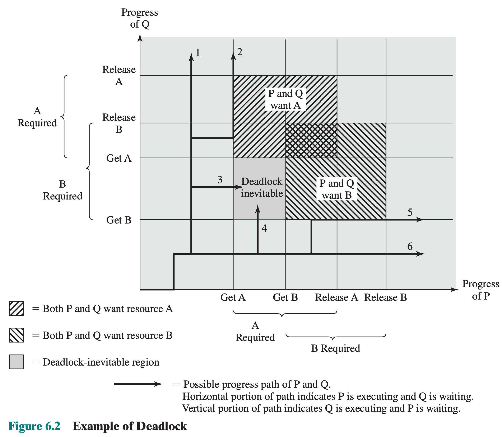
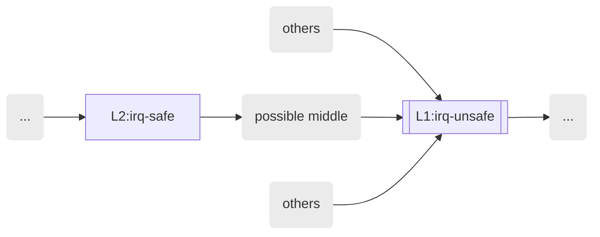
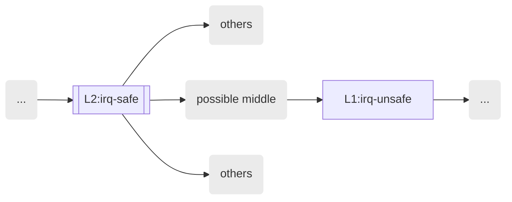
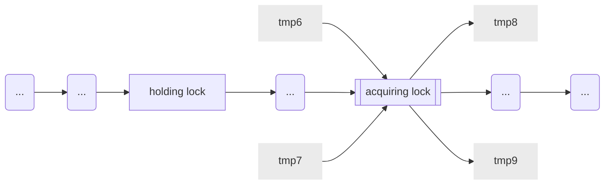
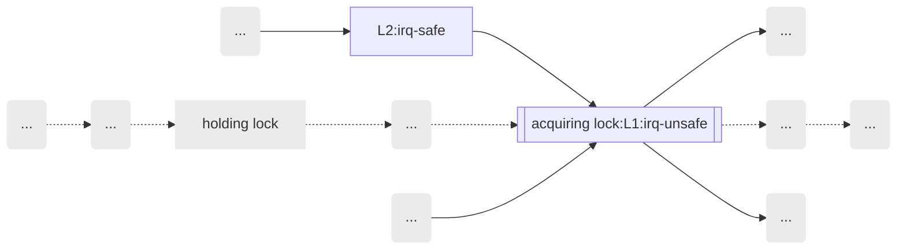
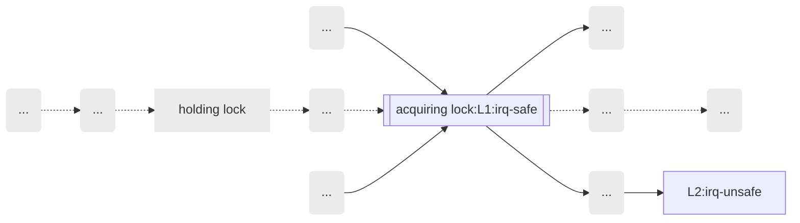
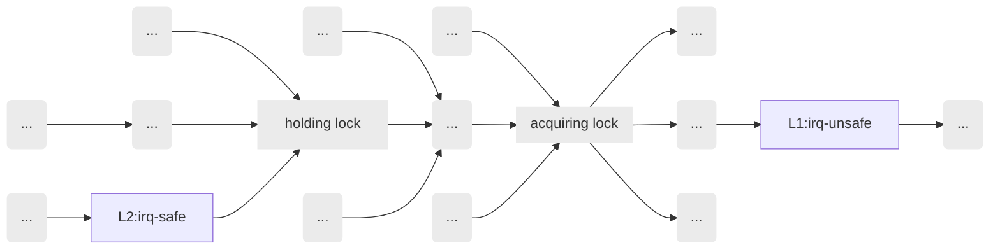

## Lockdep - 3 Multi Lock

multi lock 的 deadlock 在本质上都可以归纳为 ABBA 死锁

> Operating systems : internals and design principles, William Stallings, Chaper 6 Principles of Deadlock

ABBA 是一种典型的死锁，假设两个进程 P、Q 都需要获取两种资源 A、B

Process P | Process Q
---- | ----
Get A | Get B
Get B | Get A
Release A | Release B
Release B | Release A


下图展示了这两个进程所有可能的执行路径，其中路径 3、4 就会导致死锁




### possible circular locking dependency detected

最为简单的 ABBA 死锁类型称为 "possible circular locking dependency detected"

```
        CPU0                    CPU1
        ----                    ----
        [ L1 ]
                                [ L2 ]
                                [ L1 ]
        [ L2 ] <- trigger lockdep
        *** DEADLOCK ***
```

> 1. header

```
======================================================
WARNING: possible circular locking dependency detected
------------------------------------------------------
<comm> is trying to acquire lock:
ffffa0c869a7dac0 (&fs_info->qgroup_rescan_lock){+.+.}-{3:3}, at: qgroup_rescan_init+0x43/0xf0 [btrfs]

but task is already holding lock:
ffffa0c892ebd3a0 (btrfs-quota-00){++++}-{3:3}, at: __btrfs_tree_read_lock+0x27/0x120 [btrfs]

which lock already depends on the new lock.
```


> 2. dependency circular

接下来会打印 lock loop

```
 Possible unsafe locking scenario:

       CPU0                    CPU1
       ----                    ----
  lock(btrfs-quota-00);
                               lock(&fs_info->qgroup_rescan_lock);
                               lock(btrfs-quota-00);
  lock(&fs_info->qgroup_rescan_lock);

 *** DEADLOCK ***
```

像这种触发 lockdep 的一般都是 dependency chain 的最后一环，例如上例中的 CPU 0


> 3. dependency chain

接下来会打印 dependency chain 的具体信息

```
the existing dependency chain (in reverse order) is:

-> #1 (btrfs-quota-00){++++}-{3:3}:
       lock_acquire+0xd8/0x490
       down_read_nested+0x45/0x220
       __btrfs_tree_read_lock+0x27/0x120 [btrfs]
       btrfs_read_lock_root_node+0x41/0x130 [btrfs]
       btrfs_search_slot+0x514/0xc30 [btrfs]
       update_qgroup_status_item+0x72/0x140 [btrfs]
       btrfs_qgroup_rescan_worker+0xde/0x680 [btrfs]
       btrfs_work_helper+0xf1/0x600 [btrfs]
       process_one_work+0x24e/0x5e0
       worker_thread+0x50/0x3b0
       kthread+0x153/0x170
       ret_from_fork+0x22/0x30

-> #0 (&fs_info->qgroup_rescan_lock){+.+.}-{3:3}:
       check_prev_add+0x91/0xc60
       __lock_acquire+0x1740/0x3110
       lock_acquire+0xd8/0x490
       __mutex_lock+0xa3/0xb30
       qgroup_rescan_init+0x43/0xf0 [btrfs]
       btrfs_read_qgroup_config+0x43a/0x550 [btrfs]
       open_ctree+0x1228/0x18a0 [btrfs]
       btrfs_mount_root.cold+0x13/0xed [btrfs]
       legacy_get_tree+0x30/0x60
       vfs_get_tree+0x28/0xe0
       fc_mount+0xe/0x40
       vfs_kern_mount.part.0+0x71/0x90
       btrfs_mount+0x13b/0x3e0 [btrfs]
       legacy_get_tree+0x30/0x60
       vfs_get_tree+0x28/0xe0
       path_mount+0x2d7/0xa70
       do_mount+0x75/0x90
       __x64_sys_mount+0x8e/0xd0
       do_syscall_64+0x33/0x80
       entry_SYSCALL_64_after_hwframe+0x44/0xa9
```

---

> lock chain

有时候检测到的死锁并不是 AB-BA 锁，而是 AB-BCDEA 锁，例如

```
WARNING: possible circular locking dependency detected
------------------------------------------------------
test_progs/246 is trying to acquire lock:
0000000094160d1d (tracepoints_mutex){+.+.}, at: tracepoint_probe_register_prio+0x2d/0x300

but task is already holding lock:
00000000d663ef86 (bpf_event_mutex){+.+.}, at: bpf_probe_register+0x1d/0x60

which lock already depends on the new lock.
```

```
 Possible unsafe locking scenario:
       CPU0                    CPU1
       ----                    ----
  lock(bpf_event_mutex);
                               lock(&cpuctx_mutex);
                               lock(bpf_event_mutex);
  lock(tracepoints_mutex); <- trigger lockdep
```

这里是说进程在持有 bpf_event_mutex 锁的情况下，再去获取 tracepoints_mutex 锁，即 AB，但是 lockdep 之前检测到“持有后者的情况下再去获取前者”的情况，即 BA，从而触发死锁


我们将触发 lockdep 的 CPU (即 AB) 称为 CPU A，另外一个 CPU (即 BA) 称为 CPU B

```
Chain exists of:
  tracepoints_mutex --> &cpuctx_mutex --> bpf_event_mutex
```

这个 dependency chain 实际上就描述了 CPU B 上的时序，这里实际上是

```
<source> -> <parent of target> -> <target>
```

- <source> 就是 CPU A 上当前正在获取的锁，也就是触发 lockdep 的那个锁，也就是 ABBA 中的那个 "A"
- <target> 是对应的 ABBA 中的那个 "B"

这个 dependency chain 描述的是 CPU B 上的时序，也就是所谓的 BA 时序，需要注意的是这里打印出来的 dependency chain 有可能不是完整的，这里中间的部分只打印了 <parent of target> 也就是这一时序中 <target> 依赖的上一个锁，也就是这里的 "E"，而省略了其他的环节


完整的 dependency chain 还是要看下面的部分

```
the existing dependency chain (in reverse order) is:

-> #4 (bpf_event_mutex){+.+.}:
       perf_event_query_prog_array+0x9b/0x130
       _perf_ioctl+0x3aa/0x830
       perf_ioctl+0x2e/0x50
       do_vfs_ioctl+0x8f/0x6a0
       ksys_ioctl+0x70/0x80
       __x64_sys_ioctl+0x16/0x20
       do_syscall_64+0x4a/0x180
       entry_SYSCALL_64_after_hwframe+0x49/0xbe

-> #3 (&cpuctx_mutex){+.+.}:
       perf_event_init_cpu+0x5a/0x90
       perf_event_init+0x1b2/0x1de
       start_kernel+0x2b8/0x42a
       secondary_startup_64+0xa4/0xb0

-> #2 (pmus_lock){+.+.}:
       perf_event_init_cpu+0x21/0x90
       cpuhp_invoke_callback+0xb3/0x960
       _cpu_up+0xa7/0x140
       do_cpu_up+0xa4/0xc0
       smp_init+0xcd/0xd2
       kernel_init_freeable+0x123/0x24f
       kernel_init+0xa/0x110
       ret_from_fork+0x24/0x30

-> #1 (cpu_hotplug_lock.rw_sem){++++}:
       static_key_slow_inc+0xe/0x20
       tracepoint_probe_register_prio+0x28c/0x300
       perf_trace_event_init+0x11f/0x250
       perf_trace_init+0x6b/0xa0
       perf_tp_event_init+0x25/0x40
       perf_try_init_event+0x6b/0x90
       perf_event_alloc+0x9a8/0xc40
       __do_sys_perf_event_open+0x1dd/0xd30
       do_syscall_64+0x4a/0x180
       entry_SYSCALL_64_after_hwframe+0x49/0xbe

-> #0 (tracepoints_mutex){+.+.}:
       __mutex_lock+0x86/0x970
       tracepoint_probe_register_prio+0x2d/0x300
       bpf_probe_register+0x40/0x60
       bpf_raw_tracepoint_open.isra.34+0xa4/0x130
       __do_sys_bpf+0x94f/0x1a90
       do_syscall_64+0x4a/0x180
       entry_SYSCALL_64_after_hwframe+0x49/0xbe
```

这个就描述了 CPU B 上完整的 dependency chain 时序为

```
B -> C -> D -> E -> A

A = bpf_event_mutex
E = cpuctx_mutex
D = pmus_lock
C = cpu_hotplug_lock.rw_sem
B = tracepoints_mutex
```

在看这一部分打印时需要注意，CPU B 上的 dependency chain 时序为

```
#0 -> #1 -> #2 -> ...
```


最后是 CPU A 上触发 lockdep 时，也就是获取 "B" 锁时的栈

```
1 lock held by test_progs/246:
 #0: 00000000d663ef86 (bpf_event_mutex){+.+.}, at: bpf_probe_register+0x1d/0x60

Call Trace:
 dump_stack+0x5f/0x8b
 print_circular_bug.isra.37+0x1ce/0x1db
 __lock_acquire+0x1158/0x1350
 lock_acquire+0x98/0x190
 __mutex_lock+0x86/0x970
 tracepoint_probe_register_prio+0x2d/0x300
 bpf_probe_register+0x40/0x60
 bpf_raw_tracepoint_open.isra.34+0xa4/0x130
 __do_sys_bpf+0x94f/0x1a90
 do_syscall_64+0x4a/0x180
 entry_SYSCALL_64_after_hwframe+0x49/0xbe
```


### possible irq lock inversion dependency detected

#### irq-safe -> irq-unsafe

该报错是在获取到一个锁的时候，在这个锁**本身**的 dependency graph 中找到 irq-safe -> irq-unsafe 场景，这其实是另外一种形式的 ABBA 死锁

```
CPU1:   <hardirq-safe>   ->  <hardirq-unsafe>
CPU1:   <softirq-safe>   ->  <softirq-unsafe>
```

irq-safe 是指在 IRQ context 中会获取锁，也就是使用 spin_lock_irq/spin_lock_bh 版本获取锁，因而称作是 irq-safe 的

irq-unsafe 是指不会在对应的 IRQ context 中获取锁，此时只是使用 spin_lock 版本获取锁，因而称作是 irq-unsafe 的


> why irq-safe -> irq-unsafe will cause deadlock?

为什么 irq-safe -> irq-unsafe 场景会导致 ABBA 死锁呢？考虑以下场景

```
        CPU0                    CPU1
        ----                    ----
        [ L1 ]
                                [ L2 (irq-safe)]
                                [ L1 (irq-unsafe)] <- trigger lockdep
        <Interrupt>
          [ L2 ]
        *** DEADLOCK ***
```

我们在某个 CPU (CPU1) 上检测到在获取 irq-safe lock (L2) 之后，再获取 irq-unsafe lock (L1)，那么在另一个 CPU 上完全有可能发生 "L1 -> L2" 时序

因为 L1 是 irq-unsafe 的，也就是上锁的时候并不会 disable IRQ，而 L2 是 irq-safe 的，也就是可能在 IRQ context 中获取锁，所以在获取 L1 锁之后，完全有可能发生中断，接下来在对应的 IRQ context 下再去获取 L2 锁，这样也就形成了 loop dependency


> difference with "circular locking dependency"

这一原则与之前介绍的 "possible circular locking dependency detected" 原则，本质上都是 ABBA 死锁，两者的区别在于

"possible circular locking dependency detected" 场景下，触发 lockdep 打印的是下图示例中的 CPU 0，此时已经切实地检测到了 loop dependency

```
        CPU0                    CPU1
        ----                    ----
        [ L1 ]
                                [ L2 ]
                                [ L1 ]
        [ L2 ] <- trigger lockdep
        *** DEADLOCK ***
```


而 irq-safe -> irq-unsafe 场景下，触发 lockdep 打印的是下图示例中的 CPU 1，此时并没有检测到 loop dependency，只是检测到 “在获取 irq-safe lock 之后，再获取 irq-unsafe lock” 这一事实而已

```
        CPU0                    CPU1
        ----                    ----
        [ L1 ]
                                [ L2 (irq-safe)]
                                [ L1 (irq-unsafe)] <- trigger lockdep
        <Interrupt>
          [ L2 ]
        *** DEADLOCK ***
```

需要注意的是，以上关于另一个 CPU0 上 "L1 -> L2" 时序的描述，完全是 lockdep 的推断，而不是真的检测到了这一时序，尽管这个推断在大部分情况下都是合乎逻辑的

因而 irq-safe -> irq-unsafe 是可能存在误报的，此时如果能够分析 CPU0 上不存在 "L1 -> IRQ -> L2" 的时序，就能判断实际上并不存在 loop dependency


#### triggered when acquiring irq-unsafe lock

触发 "possible irq lock inversion dependency detected" 报错有两个场景，首先介绍在获取 irq-unsafe 锁时触发的场景



在 CPU1 上获取 L1 锁，L1 锁本身是 irq-unsafe 的 (在 irq-enable 的情况下获取的 L1 锁)，此时通过 L1 锁的 dependency graph (@before_list 链表) 发现，L1 曾经依赖的 L2 锁是 irq-safe 的，从而构成了 irq-safe -> irq-unsafe 场景

```
        CPU0                    CPU1
        ----                    ----
        [ L1 (irq-unsafe)]
                                [ L2 (irq-safe)]
                                [ L1 (irq-unsafe)] <- trigger lockdep
        <Interrupt>
          [ L2 (irq-safe)] 
        *** DEADLOCK ***
```

此时会报错

```
WARNING: possible irq lock inversion dependency detected
--------------------------------------------------------
<comm> just changed the state of lock:
...
but this lock was taken by another, HARDIRQ-safe lock in the past:
...
```


因而 lockdep 在每次获取到一个新的 irq-unsafe lock class 的时候，都需要执行以下检查

- if a new hardirq-unsafe lock is discovered, we check whether any hardirq-safe lock took it in the past.
- if a new softirq-unsafe lock is discovered, we check whether any softirq-safe lock took it in the past.


> example

```
========================================================
WARNING: possible irq lock inversion dependency detected
--------------------------------------------------------
a.out/1421 just changed the state of lock:
ffff888111396b38 (&f->f_owner.lock){.+..}-{2:2}, at: f_getown+0x20/0xc0
but this lock was taken by another, HARDIRQ-safe lock in the past:
 (&ctx->completion_lock){-...}-{2:2}


and interrupts could create inverse lock ordering between them.
```


```
other info that might help us debug this:
Chain exists of:
  &ctx->completion_lock --> &new->fa_lock --> &f->f_owner.lock
```

这个描述了 irq-safe -> irq-unsafe 的具体时序，即

```
irq-safe -> middle ->irq-unsafe
```

这里 middle 实际上是 irq-unsafe 的上一级依赖，因而当 irq-safe -> irq-unsafe 时序很长时，这里打印出来的时序实际上是不完整的


```
 Possible interrupt unsafe locking scenario:

       CPU0                    CPU1
       ----                    ----
  lock(&f->f_owner.lock);
                               local_irq_disable();
                               lock(&ctx->completion_lock);
                               lock(&new->fa_lock);
  <Interrupt>
    lock(&ctx->completion_lock);

 *** DEADLOCK ***
```


接下来才是完整的 irq-safe -> irq-unsafe 时序，顺序打印，即先打印 irq-safe 锁，最后打印 irq-unsafe 锁

```
no locks held by a.out/1421.

the shortest dependencies between 2nd lock and 1st lock:
  -> (&ctx->completion_lock){-...}-{2:2} ops: 8 {
     IN-HARDIRQ-W at:
                        lock_acquire+0x1e3/0x9a0
                        _raw_spin_lock_irqsave+0x3b/0x60
                        io_link_timeout_fn+0xbf/0x420
                        __hrtimer_run_queues+0x1b8/0xcc0
                        hrtimer_interrupt+0x2f0/0x760
                        __sysvec_apic_timer_interrupt+0xf1/0x400
                        asm_call_irq_on_stack+0xf/0x20
                        sysvec_apic_timer_interrupt+0x89/0xb0
                        asm_sysvec_apic_timer_interrupt+0x12/0x20
                        _raw_spin_unlock_irq+0x2c/0x30
                        io_queue_linked_timeout+0x6e/0x90
                        __io_queue_sqe+0x112/0xdf0
                        io_queue_sqe+0x5d1/0xbe0
                        io_submit_sqes+0x17c4/0x2630
                        __x64_sys_io_uring_enter+0x8fc/0xf30
                        do_syscall_64+0x2d/0x40
                        entry_SYSCALL_64_after_hwframe+0x44/0xa9
     INITIAL USE at:
                       lock_acquire+0x1e3/0x9a0
                       _raw_spin_lock_irqsave+0x3b/0x60
                       __io_req_complete.part.0+0x4b/0x90
                       io_queue_sqe+0x66b/0xbe0
                       io_submit_sqes+0x175f/0x2630
                       __x64_sys_io_uring_enter+0x8fc/0xf30
                       do_syscall_64+0x2d/0x40
                       entry_SYSCALL_64_after_hwframe+0x44/0xa9
   }
   ... key      at: [] __key.80208+0x0/0x40
   ... acquired at:
   __lock_acquire+0xc77/0x1c00
   lock_acquire+0x1e3/0x9a0
   _raw_read_lock+0x5d/0x70
   kill_fasync+0x170/0x4e0
   io_commit_cqring+0x353/0x8e0
   __io_req_complete.part.0+0x64/0x90
   io_queue_sqe+0x66b/0xbe0
   io_submit_sqes+0x175f/0x2630
   __x64_sys_io_uring_enter+0x8fc/0xf30
   do_syscall_64+0x2d/0x40
   entry_SYSCALL_64_after_hwframe+0x44/0xa9

 -> (&new->fa_lock){....}-{2:2} ops: 1 {
    INITIAL READ USE at:
                          lock_acquire+0x1e3/0x9a0
                          _raw_read_lock+0x5d/0x70
                          kill_fasync+0x170/0x4e0
                          io_commit_cqring+0x353/0x8e0
                          __io_req_complete.part.0+0x64/0x90
                          io_queue_sqe+0x66b/0xbe0
                          io_submit_sqes+0x175f/0x2630
                          __x64_sys_io_uring_enter+0x8fc/0xf30
                          do_syscall_64+0x2d/0x40
                          entry_SYSCALL_64_after_hwframe+0x44/0xa9
  }
  ... key      at: [] __key.47531+0x0/0x40
  ... acquired at:
   __lock_acquire+0xc77/0x1c00
   lock_acquire+0x1e3/0x9a0
   _raw_read_lock_irqsave+0x72/0x90
   send_sigio+0x29/0x3d0
   kill_fasync+0x22a/0x4e0
   io_commit_cqring+0x353/0x8e0
   __io_req_complete.part.0+0x64/0x90
   io_queue_sqe+0x66b/0xbe0
   io_submit_sqes+0x175f/0x2630
   __x64_sys_io_uring_enter+0x8fc/0xf30
   do_syscall_64+0x2d/0x40
   entry_SYSCALL_64_after_hwframe+0x44/0xa9

-> (&f->f_owner.lock){.+..}-{2:2} ops: 2 {
   HARDIRQ-ON-R at:
                    lock_acquire+0x1e3/0x9a0
                    _raw_read_lock+0x5d/0x70
                    f_getown+0x20/0xc0
                    do_fcntl+0xb51/0x1050
                    __x64_sys_fcntl+0x16a/0x1e0
                    do_syscall_64+0x2d/0x40
                    entry_SYSCALL_64_after_hwframe+0x44/0xa9
   INITIAL READ USE at:
                        lock_acquire+0x1e3/0x9a0
                        _raw_read_lock_irqsave+0x72/0x90
                        send_sigio+0x29/0x3d0
                        kill_fasync+0x22a/0x4e0
                        io_commit_cqring+0x353/0x8e0
                        __io_req_complete.part.0+0x64/0x90
                        io_queue_sqe+0x66b/0xbe0
                        io_submit_sqes+0x175f/0x2630
                        __x64_sys_io_uring_enter+0x8fc/0xf30
                        do_syscall_64+0x2d/0x40
                        entry_SYSCALL_64_after_hwframe+0x44/0xa9
 }
 ... key      at: [] __key.51397+0x0/0x40
 ... acquired at:
   mark_lock.part.0+0x51c/0x1420
   __lock_acquire+0x1279/0x1c00
   lock_acquire+0x1e3/0x9a0
   _raw_read_lock+0x5d/0x70
   f_getown+0x20/0xc0
   do_fcntl+0xb51/0x1050
   __x64_sys_fcntl+0x16a/0x1e0
   do_syscall_64+0x2d/0x40
   entry_SYSCALL_64_after_hwframe+0x44/0xa9
```

这里会打印每个 lock class 在各个场景下的调用栈，例如 IN-HARDIRQ-W/IN-SOFTIRQ-W，这里的 INITIAL USE 就对应 LOCK_USED


最后是触发当前 lockdep 报错的栈

```
Call Trace:
 dump_stack+0x107/0x163
 mark_lock_irq+0x304/0x11f0
 mark_lock.part.0+0x51c/0x1420
 __lock_acquire+0x1279/0x1c00
 lock_acquire+0x1e3/0x9a0
 _raw_read_lock+0x5d/0x70
 f_getown+0x20/0xc0
 do_fcntl+0xb51/0x1050
 __x64_sys_fcntl+0x16a/0x1e0
 do_syscall_64+0x2d/0x40
 entry_SYSCALL_64_after_hwframe+0x44/0xa9
```


#### triggered when acquiring irq-safe lock

触发该报错的另一种场景是



在 CPU1 上获取 L2 锁，L2 锁本身是 irq-safe 的 (在 irq-disable 的时候获取的 L2 锁)，此时通过 L2 锁的 dependency graph (@after_list 链表) 发现，曾经在获取 L2 锁的基础上又获取了 L1 锁，而 L1 锁是 irq-unsafe 的，从而构成了 irq-safe -> irq-unsafe 场景

```
        CPU0                    CPU1
        ----                    ----
        [ L1 (irq-unsafe)]
                                [ L2 irq-safe)] <- trigger lockdep
                                [ L1 (irq-unsafe)] 
        <Interrupt>
          [ L2 (irq-safe)] 
        *** DEADLOCK ***
```

此时会报错

```
possible irq lock inversion dependency detected
---------------------------------------------------------
<comm> just changed the state of lock:
  L2 ...
but this lock took another, HARDIRQ-unsafe lock in the past:
 L1 ...
and interrupts could create inverse lock ordering between them.
```


因而 lockdep 在每次获取到一个新的 irq-safe lock class 的时候，都会执行以下检查

- if a new hardirq-safe lock is discovered, we check whether it took any hardirq-unsafe lock in the past.
- if a new softirq-safe lock is discovered, we check whether it took any softirq-unsafe lock in the past.


> example

```
=========================================================
[ INFO: possible irq lock inversion dependency detected ]
---------------------------------------------------------
systemd-udevd/1827 just changed the state of lock:
 (policy_rwlock){.?.?..}, at: [<c0757a5f>] security_compute_av+0x1f/0x2b0
but this lock took another, HARDIRQ-unsafe lock in the past:
 (&(&list->lock)->rlock#2){+.-...}

and interrupts could create inverse lock ordering between them.


other info that might help us debug this:
 Possible interrupt unsafe locking scenario:

       CPU0                    CPU1
       ----                    ----
  lock(&(&list->lock)->rlock#2);
                               local_irq_disable();
                               lock(policy_rwlock);
                               lock(&(&list->lock)->rlock#2);
  <Interrupt>
    lock(policy_rwlock);

 *** DEADLOCK ***

11 locks held by systemd-udevd/1827:
 #0:  (&(ptlock_ptr(page))->rlock){+.+...}, at: [<c05d938a>] unmap_single_vma+0x30a/0x770
 #1:  (&serio->lock){-.-...}, at: [<c0a089c2>] serio_interrupt+0x22/0x80
 #2:  (&(&dev->event_lock)->rlock){-.-...}, at: [<c0a0ee5f>] input_event+0x3f/0x70
 #3:  (rcu_read_lock){......}, at: [<c0a0e050>] input_pass_values.part.5+0x0/0x280
 #4:  (rcu_read_lock){......}, at: [<c0a128f0>] evdev_events+0x0/0x1f0
 #5:  (&(&client->buffer_lock)->rlock){-.....}, at: [<c0a120cd>] evdev_pass_values+0x4d/0x1d0
 #6:  (rcu_read_lock){......}, at: [<c0632d88>] kill_fasync+0x18/0x200
 #7:  (&(&new->fa_lock)->rlock){-.....}, at: [<c0632e0c>] kill_fasync+0x9c/0x200
 #8:  (&f->f_owner.lock){.-....}, at: [<c0632cbb>] send_sigio+0x1b/0xd0
 #9:  (tasklist_lock){.?.+..}, at: [<c0632cdf>] send_sigio+0x3f/0xd0
 #10:  (rcu_read_lock){......}, at: [<c0632280>] send_sigio_to_task+0x0/0x280

the shortest dependencies between 2nd lock and 1st lock:
 -> (&(&list->lock)->rlock#2){+.-...} ops: 23168 {
    HARDIRQ-ON-W at:
                      [<c04d7a36>] __lock_acquire+0x756/0x1400
                      [<c04d8f67>] lock_acquire+0xb7/0x1b0
                      [<c0c0f218>] _raw_spin_lock_bh+0x48/0x80
                      [<c0b0a284>] netlink_poll+0x84/0x1d0
                      [<c0ab1787>] sock_poll+0x87/0xa0
                      [<c066f8b8>] SyS_epoll_ctl+0x598/0x920
                      [<c0403b57>] do_fast_syscall_32+0xa7/0x240
                      [<c0c0fee1>] sysenter_past_esp+0x42/0x69
    IN-SOFTIRQ-W at:
                      [<c04d79fa>] __lock_acquire+0x71a/0x1400
                      [<c04d8f67>] lock_acquire+0xb7/0x1b0
                      [<c0c0fbb6>] _raw_spin_lock_irqsave+0x56/0x90
                      [<c0abaee7>] skb_dequeue+0x17/0x60
                      [<c0abcd7c>] skb_queue_purge+0x1c/0x30
                      [<c0b07b45>] netlink_sock_destruct+0x55/0x180
                      [<c0ab963c>] sk_destruct+0x1c/0x1d0
                      [<c0ab9827>] __sk_free+0x37/0xa0
                      [<c0ab98ad>] sk_free+0x1d/0x20
                      [<c0b08912>] deferred_put_nlk_sk+0x22/0x30
                      [<c04fae95>] rcu_process_callbacks+0x2d5/0x7b0
                      [<c048107e>] __do_softirq+0xce/0x420
                      [<c041bbf8>] do_softirq_own_stack+0x28/0x30
                      [<c04815b5>] irq_exit+0xc5/0xd0
                      [<c0456519>] smp_apic_timer_interrupt+0x39/0x50
                      [<c0c109b5>] apic_timer_interrupt+0x39/0x40
                      [<c06a2308>] kernfs_get_active+0x58/0x80
                      [<c06a399f>] kernfs_fop_open+0x2f/0x370
                      [<c061c05c>] do_dentry_open+0x1ec/0x2d0
                      [<c061d424>] vfs_open+0x54/0x60
                      [<c062dab1>] path_openat+0x371/0x1aa0
                      [<c0630658>] do_filp_open+0x68/0xe0
                      [<c061d7b2>] do_sys_open+0x112/0x1f0
                      [<c061d8b2>] SyS_open+0x22/0x30
                      [<c0403b57>] do_fast_syscall_32+0xa7/0x240
                      [<c0c0fee1>] sysenter_past_esp+0x42/0x69
    INITIAL USE at:
                     [<c04d767e>] __lock_acquire+0x39e/0x1400
                     [<c04d8f67>] lock_acquire+0xb7/0x1b0
                     [<c0c0fbb6>] _raw_spin_lock_irqsave+0x56/0x90
                     [<c0abafe9>] skb_queue_tail+0x19/0x40
                     [<c0b08e5d>] __netlink_sendskb+0x29d/0x2d0
                     [<c0b0c914>] netlink_unicast+0x224/0x280
                     [<c0b0d002>] netlink_ack+0xb2/0x130
                     [<c0b0d102>] netlink_rcv_skb+0x82/0xb0
                     [<c0ae4b03>] rtnetlink_rcv+0x23/0x30
                     [<c0b0c8b8>] netlink_unicast+0x1c8/0x280
                     [<c0b0cddd>] netlink_sendmsg+0x46d/0x5e0
                     [<c0ab2aaf>] sock_sendmsg+0x2f/0x40
                     [<c0ab3434>] SYSC_sendto+0xe4/0x130
                     [<c0ab4d02>] SYSC_socketcall+0x652/0xa90
                     [<c0ab5233>] SyS_socketcall+0x13/0x20
                     [<c0403b57>] do_fast_syscall_32+0xa7/0x240
                     [<c0c0fee1>] sysenter_past_esp+0x42/0x69
  }
  ... key      at: [<c1b66a9c>] __key.26209+0x0/0x8
  ... acquired at:
   [<c04d8f67>] lock_acquire+0xb7/0x1b0
   [<c0c0fbb6>] _raw_spin_lock_irqsave+0x56/0x90
   [<c0abafe9>] skb_queue_tail+0x19/0x40
   [<c0b08e5d>] __netlink_sendskb+0x29d/0x2d0
   [<c0b090d8>] netlink_broadcast_filtered+0x248/0x360
   [<c0b0921e>] netlink_broadcast+0x2e/0x40
   [<c0537dc3>] audit_log_end+0x2a3/0x2b0
   [<c05384ff>] audit_log+0x2f/0x40
   [<c0759224>] security_set_bools+0xe4/0x1e0
   [<c074a93b>] sel_commit_bools_write+0xab/0x110
   [<c061e29f>] __vfs_write+0x2f/0x110
   [<c061effa>] vfs_write+0x8a/0x1b0
   [<c061fd07>] SyS_write+0x57/0xc0
   [<c0403b57>] do_fast_syscall_32+0xa7/0x240
   [<c0c0fee1>] sysenter_past_esp+0x42/0x69

-> (policy_rwlock){.?.?..} ops: 96293 {
   IN-HARDIRQ-R at:
                    [<c04d7a8d>] __lock_acquire+0x7ad/0x1400
                    [<c04d8f67>] lock_acquire+0xb7/0x1b0
                    [<c0c0f5a2>] _raw_read_lock+0x42/0x70
                    [<c0757a5f>] security_compute_av+0x1f/0x2b0
                    [<c073e797>] avc_compute_av+0x77/0x2c0
                    [<c073f3f6>] avc_has_perm_noaudit+0x106/0x240
                    [<c073f578>] avc_has_perm+0x48/0xd0
                    [<c0747d82>] selinux_file_send_sigiotask+0xe2/0x180
                    [<c073ba9c>] security_file_send_sigiotask+0x3c/0x60
                    [<c063234f>] send_sigio_to_task+0xcf/0x280
                    [<c0632d21>] send_sigio+0x81/0xd0
                    [<c0632e35>] kill_fasync+0xc5/0x200
                    [<c0a121aa>] evdev_pass_values+0x12a/0x1d0
                    [<c0a12a62>] evdev_events+0x172/0x1f0
                    [<c0a0b60c>] input_to_handler+0x9c/0x120
                    [<c0a0e254>] input_pass_values.part.5+0x204/0x280
                    [<c0a0e905>] input_handle_event+0x65/0x580
                    [<c0a0ee74>] input_event+0x54/0x70
                    [<c0a15687>] atkbd_interrupt+0x4b7/0x7f0
                    [<c0a089de>] serio_interrupt+0x3e/0x80
                    [<c0a095a0>] i8042_interrupt+0x1e0/0x3b0
                    [<c04edc21>] handle_irq_event_percpu+0x51/0x320
                    [<c04edf1e>] handle_irq_event+0x2e/0x50
                    [<c04f11fd>] handle_edge_irq+0x6d/0x130
                    [<c041bca3>] handle_irq+0xa3/0xd0
                    [<c041b264>] do_IRQ+0x54/0x120
                    [<c0c10678>] common_interrupt+0x38/0x40
                    [<c05da3f3>] unmap_vmas+0x53/0xa0
                    [<c05e21bf>] exit_mmap+0x7f/0x140
                    [<c0478736>] mmput+0x56/0xe0
                    [<c047ec75>] do_exit+0x275/0xbd0
                    [<c047f647>] do_group_exit+0x37/0x90
                    [<c047f6b6>] SyS_exit_group+0x16/0x20
                    [<c0403b57>] do_fast_syscall_32+0xa7/0x240
                    [<c0c0fee1>] sysenter_past_esp+0x42/0x69
   HARDIRQ-ON-R at:
                    [<c04d7622>] __lock_acquire+0x342/0x1400
                    [<c04d8f67>] lock_acquire+0xb7/0x1b0
                    [<c0c0f5a2>] _raw_read_lock+0x42/0x70
                    [<c0757a5f>] security_compute_av+0x1f/0x2b0
                    [<c073e797>] avc_compute_av+0x77/0x2c0
                    [<c073f3f6>] avc_has_perm_noaudit+0x106/0x240
                    [<c073f578>] avc_has_perm+0x48/0xd0
                    [<c0744c14>] selinux_sb_kern_mount+0x94/0xa0
                    [<c073abdc>] security_sb_kern_mount+0x3c/0x60
                    [<c0622bb5>] mount_fs+0x75/0x170
                    [<c0642b9c>] vfs_kern_mount+0x4c/0x140
                    [<c1008865>] mnt_init+0x142/0x1cc
                    [<c10085a2>] vfs_caches_init+0x54/0x63
                    [<c0fdcb7b>] start_kernel+0x3ca/0x437
                    [<c0fdc2f6>] i386_start_kernel+0x91/0x95
   IN-SOFTIRQ-R at:
                    [<c04d79fa>] __lock_acquire+0x71a/0x1400
                    [<c04d8f67>] lock_acquire+0xb7/0x1b0
                    [<c0c0f5a2>] _raw_read_lock+0x42/0x70
                    [<c075a146>] security_netlbl_sid_to_secattr+0x36/0xb0
                    [<c075ce0e>] selinux_netlbl_inet_conn_request+0x5e/0xe0
                    [<c074145f>] selinux_inet_conn_request+0x5f/0xa0
                    [<c0739bdc>] security_inet_conn_request+0x3c/0x60
                    [<c0b33d7f>] tcp_conn_request+0x33f/0xa40
                    [<c0b42edc>] tcp_v4_conn_request+0x6c/0xa0
                    [<c0b38f61>] tcp_rcv_state_process+0x1a1/0xea0
                    [<c0b43d0c>] tcp_v4_do_rcv+0x9c/0x1f0
                    [<c0b44f85>] tcp_v4_rcv+0x8c5/0x9c0
                    [<c0b1b395>] ip_local_deliver_finish+0xd5/0x490
                    [<c0b1c03f>] ip_local_deliver+0x5f/0xd0
                    [<c0b1b802>] ip_rcv_finish+0xb2/0x6d0
                    [<c0b1c45c>] ip_rcv+0x3ac/0x570
                    [<c0acff2b>] __netif_receive_skb_core+0x1bb/0xcb0
                    [<c0ad0a36>] __netif_receive_skb+0x16/0x60
                    [<c0ad0af2>] process_backlog+0x72/0x220
                    [<c0ad241a>] net_rx_action+0x1da/0x3b0
                    [<c048107e>] __do_softirq+0xce/0x420
                    [<c041bbf8>] do_softirq_own_stack+0x28/0x30
                    [<c0480435>] do_softirq.part.15+0x55/0x60
                    [<c04804ff>] __local_bh_enable_ip+0xbf/0xd0
                    [<c0b20d6b>] ip_finish_output2+0x21b/0x6f0
                    [<c0b220bc>] ip_finish_output+0x19c/0x380
                    [<c0b2303c>] ip_output+0xec/0x1a0
                    [<c0b2240c>] ip_local_out+0x3c/0x80
                    [<c0b22809>] ip_queue_xmit+0x1c9/0x5f0
                    [<c0b3bfa6>] tcp_transmit_skb+0x4f6/0x8e0
                    [<c0b3dd67>] tcp_connect+0x637/0xa70
                    [<c0b426ee>] tcp_v4_connect+0x2fe/0x540
                    [<c0b5dc52>] __inet_stream_connect+0xa2/0x330
                    [<c0b5df0f>] inet_stream_connect+0x2f/0x50
                    [<c0ab332b>] SYSC_connect+0xbb/0xe0
                    [<c0ab4912>] SYSC_socketcall+0x262/0xa90
                    [<c0ab5233>] SyS_socketcall+0x13/0x20
                    [<c0403b57>] do_fast_syscall_32+0xa7/0x240
                    [<c0c0fee1>] sysenter_past_esp+0x42/0x69
   SOFTIRQ-ON-R at:
                    [<c04d7a5a>] __lock_acquire+0x77a/0x1400
                    [<c04d8f67>] lock_acquire+0xb7/0x1b0
                    [<c0c0f5a2>] _raw_read_lock+0x42/0x70
                    [<c0757a5f>] security_compute_av+0x1f/0x2b0
                    [<c073e797>] avc_compute_av+0x77/0x2c0
                    [<c073f3f6>] avc_has_perm_noaudit+0x106/0x240
                    [<c073f578>] avc_has_perm+0x48/0xd0
                    [<c0744c14>] selinux_sb_kern_mount+0x94/0xa0
                    [<c073abdc>] security_sb_kern_mount+0x3c/0x60
                    [<c0622bb5>] mount_fs+0x75/0x170
                    [<c0642b9c>] vfs_kern_mount+0x4c/0x140
                    [<c1008865>] mnt_init+0x142/0x1cc
                    [<c10085a2>] vfs_caches_init+0x54/0x63
                    [<c0fdcb7b>] start_kernel+0x3ca/0x437
                    [<c0fdc2f6>] i386_start_kernel+0x91/0x95
   INITIAL USE at:
                   [<c04d767e>] __lock_acquire+0x39e/0x1400
                   [<c04d8f67>] lock_acquire+0xb7/0x1b0
                   [<c0c0f5a2>] _raw_read_lock+0x42/0x70
                   [<c0757a5f>] security_compute_av+0x1f/0x2b0
                   [<c073e797>] avc_compute_av+0x77/0x2c0
                   [<c073f3f6>] avc_has_perm_noaudit+0x106/0x240
                   [<c073f578>] avc_has_perm+0x48/0xd0
                   [<c0744c14>] selinux_sb_kern_mount+0x94/0xa0
                   [<c073abdc>] security_sb_kern_mount+0x3c/0x60
                   [<c0622bb5>] mount_fs+0x75/0x170
                   [<c0642b9c>] vfs_kern_mount+0x4c/0x140
                   [<c1008865>] mnt_init+0x142/0x1cc
                   [<c10085a2>] vfs_caches_init+0x54/0x63
                   [<c0fdcb7b>] start_kernel+0x3ca/0x437
                   [<c0fdc2f6>] i386_start_kernel+0x91/0x95
 }
 ... key      at: [<c0f65cf4>] policy_rwlock+0x14/0x40
 ... acquired at:
   [<c04d5edb>] check_usage_forwards+0x12b/0x130
   [<c04d6b92>] mark_lock+0x392/0x580
   [<c04d7a8d>] __lock_acquire+0x7ad/0x1400
   [<c04d8f67>] lock_acquire+0xb7/0x1b0
   [<c0c0f5a2>] _raw_read_lock+0x42/0x70
   [<c0757a5f>] security_compute_av+0x1f/0x2b0
   [<c073e797>] avc_compute_av+0x77/0x2c0
   [<c073f3f6>] avc_has_perm_noaudit+0x106/0x240
   [<c073f578>] avc_has_perm+0x48/0xd0
   [<c0747d82>] selinux_file_send_sigiotask+0xe2/0x180
   [<c073ba9c>] security_file_send_sigiotask+0x3c/0x60
   [<c063234f>] send_sigio_to_task+0xcf/0x280
   [<c0632d21>] send_sigio+0x81/0xd0
   [<c0632e35>] kill_fasync+0xc5/0x200
   [<c0a121aa>] evdev_pass_values+0x12a/0x1d0
   [<c0a12a62>] evdev_events+0x172/0x1f0
   [<c0a0b60c>] input_to_handler+0x9c/0x120
   [<c0a0e254>] input_pass_values.part.5+0x204/0x280
   [<c0a0e905>] input_handle_event+0x65/0x580
   [<c0a0ee74>] input_event+0x54/0x70
   [<c0a15687>] atkbd_interrupt+0x4b7/0x7f0
   [<c0a089de>] serio_interrupt+0x3e/0x80
   [<c0a095a0>] i8042_interrupt+0x1e0/0x3b0
   [<c04edc21>] handle_irq_event_percpu+0x51/0x320
   [<c04edf1e>] handle_irq_event+0x2e/0x50
   [<c04f11fd>] handle_edge_irq+0x6d/0x130
   [<c041bca3>] handle_irq+0xa3/0xd0
   [<c041b264>] do_IRQ+0x54/0x120
   [<c0c10678>] common_interrupt+0x38/0x40
   [<c05da3f3>] unmap_vmas+0x53/0xa0
   [<c05e21bf>] exit_mmap+0x7f/0x140
   [<c0478736>] mmput+0x56/0xe0
   [<c047ec75>] do_exit+0x275/0xbd0
   [<c047f647>] do_group_exit+0x37/0x90
   [<c047f6b6>] SyS_exit_group+0x16/0x20
   [<c0403b57>] do_fast_syscall_32+0xa7/0x240
   [<c0c0fee1>] sysenter_past_esp+0x42/0x69


stack backtrace:
CPU: 0 PID: 1827 Comm: systemd-udevd Not tainted 
Call Trace:
 [<c07c27af>] dump_stack+0x48/0x69
 [<c05a235a>] print_irq_inversion_bug.part.41+0x178/0x181
 [<c04d5edb>] check_usage_forwards+0x12b/0x130
 [<c04d6b92>] mark_lock+0x392/0x580
 [<c04d7a8d>] __lock_acquire+0x7ad/0x1400
 [<c04d8f67>] lock_acquire+0xb7/0x1b0
 [<c0c0f5a2>] _raw_read_lock+0x42/0x70
 [<c0757a5f>] security_compute_av+0x1f/0x2b0
 [<c073e797>] avc_compute_av+0x77/0x2c0
 [<c073f3f6>] avc_has_perm_noaudit+0x106/0x240
 [<c073f578>] avc_has_perm+0x48/0xd0
 [<c0747d82>] selinux_file_send_sigiotask+0xe2/0x180
 [<c073ba9c>] security_file_send_sigiotask+0x3c/0x60
 [<c063234f>] send_sigio_to_task+0xcf/0x280
 [<c0632d21>] send_sigio+0x81/0xd0
 [<c0632e35>] kill_fasync+0xc5/0x200
 [<c0a121aa>] evdev_pass_values+0x12a/0x1d0
 [<c0a12a62>] evdev_events+0x172/0x1f0
 [<c0a0b60c>] input_to_handler+0x9c/0x120
 [<c0a0e254>] input_pass_values.part.5+0x204/0x280
 [<c0a0e905>] input_handle_event+0x65/0x580
 [<c0a0ee74>] input_event+0x54/0x70
 [<c0a15687>] atkbd_interrupt+0x4b7/0x7f0
 [<c0a089de>] serio_interrupt+0x3e/0x80
 [<c0a095a0>] i8042_interrupt+0x1e0/0x3b0
 [<c04edc21>] handle_irq_event_percpu+0x51/0x320
 [<c04edf1e>] handle_irq_event+0x2e/0x50
 [<c04f11fd>] handle_edge_irq+0x6d/0x130
 [<c041bca3>] handle_irq+0xa3/0xd0
 <IRQ>  [<c041b264>] do_IRQ+0x54/0x120
 [<c0c10678>] common_interrupt+0x38/0x40
 [<c05da3f3>] unmap_vmas+0x53/0xa0
 [<c05e21bf>] exit_mmap+0x7f/0x140
 [<c0478736>] mmput+0x56/0xe0
 [<c047ec75>] do_exit+0x275/0xbd0
 [<c047f647>] do_group_exit+0x37/0x90
 [<c047f6b6>] SyS_exit_group+0x16/0x20
 [<c0403b57>] do_fast_syscall_32+0xa7/0x240
 [<c0c0fee1>] sysenter_past_esp+0x42/0x69
```


### %s-safe -> %s-unsafe lock order detected

与之前介绍的 "possible irq lock inversion dependency detected" 类似，该报错也是指发生了 irq-safe -> irq-unsafe 场景

```
        CPU0                    CPU1
        ----                    ----
        [ L1 ]
                                [ L2 (irq-safe)]
                                [ L1 (irq-unsafe)] <- trigger lockdep
        <Interrupt>
          [ L2 ]
        *** DEADLOCK ***
```


两者都是在获取锁的时候，在 dependency graph 中找到 irq-safe -> irq-unsafe 场景，其区别主要有

从 acquiring lock 出发，一个完整的 dependency graph 应该是这样的



其中 acquiring lock 表示进程当前正在获取的锁

我们把中间紫色标识的这条路径称为是 lock chain，也就是当前进程已经获取但尚未释放的 lock stack，在获取锁的时候会进行入栈操作，在释放锁的时候会进行出栈操作

其余灰色标识的路径表示普通的 dependency graph，dependency graph 表示各个锁之间依赖关系的历史信息，在释放锁的时候并不会将对应的依赖关系从 dependency graph 中移除，因而 dependency graph 实际上描述了一个锁曾经依赖于另一个锁；lock chain 当然也属于 dependency graph 的一部分


> "possible irq lock inversion dependency detected"

在执行 "possible irq lock inversion dependency detected" 检查的时候，当前的 lock chain 还没有合入 dependency graph，因而只是在除开 lock chain 的这部分 dependency graph 中查找是否存在 irq-safe -> irq-unsafe 场景，同时这里会要求 acquiring lock 本身就是 irq-safe -> irq-unsafe 场景中的 irq-safe 锁或 irq-unsafe 锁



或者




> "%s-safe -> %s-unsafe lock order detected"

而 "%s-safe -> %s-unsafe lock order detected" 检查的范围则是扩大到包含了 lock chain 之后的 dependency graph，此外 acquiring lock 本身不一定是 irq-safe -> irq-unsafe 场景中的 irq-safe 锁或 irq-unsafe 锁



在 "%s-safe -> %s-unsafe lock order detected" 场景下，irq-safe -> irq-unsafe 时序实际上是

```
(irq-safe lock) -> holding lock -> acquiring lock -> (irq-unsafe lock)
```

- 将当前申请获取的锁记为 acquiring lock
- lock chain 中之前已经获取的锁记为 holding lock
- holding lock **曾经** 依赖于 irq-safe lock，或者 irq-safe lock 就是 holding lock
- irq-unsafe lock **曾经** 依赖于 acquiring lock，或者 irq-unsafe lock 就是 acquiring lock


> example

```
===================================================== 
WARNING: HARDIRQ-safe -> HARDIRQ-unsafe lock order detected 
----------------------------------------------------- 
kworker/0:1H/100 [HC0[0]:SC0[0]:HE0:SE1] is trying to acquire: 
(&(&session->frwd_lock)->rlock){+.-.}, at: [<0000000097d8de0f>] iscsi_eh_cmd_timed_out+0x3d/0x2b0 

and this task is already holding: 
(&(&q->__queue_lock)->rlock){-.-.}, at: [<00000000a105bf06>] blk_timeout_work+0x22/0x120 
which would create a new lock dependency: 
(&(&q->__queue_lock)->rlock){-.-.} -> (&(&session->frwd_lock)->rlock){+.-.} 
```

描述当前的 "holding lock -> acquiring lock" 场景，导致了以下的 "irq-safe -> irq-unsafe" 场景

```
but this new dependency connects a HARDIRQ-irq-safe lock: 
(&(&q->__queue_lock)->rlock){-.-.} 

... which became HARDIRQ-irq-safe at: 
_raw_spin_lock_irqsave+0x3c/0x4b 
cfq_idle_slice_timer+0x2f/0x100 
__hrtimer_run_queues+0xdc/0x440 
hrtimer_interrupt+0xb1/0x210 
smp_apic_timer_interrupt+0x6d/0x260 
apic_timer_interrupt+0xac/0xc0 
native_safe_halt+0x2/0x10 
default_idle+0x1f/0x180 
do_idle+0x166/0x1e0 
cpu_startup_entry+0x6f/0x80 
start_secondary+0x186/0x1e0 
secondary_startup_64+0xa5/0xb0 

to a HARDIRQ-irq-unsafe lock: 
(&(&session->frwd_lock)->rlock){+.-.} 

... which became HARDIRQ-irq-unsafe at: 
... 
_raw_spin_lock_bh+0x34/0x40 
iscsi_conn_setup+0x166/0x220 
iscsi_tcp_conn_setup+0x10/0x40 
iscsi_sw_tcp_conn_create+0x1b/0x160 
iscsi_if_rx+0xf9f/0x1580 
netlink_unicast+0x1f7/0x2f0 
netlink_sendmsg+0x2c9/0x3c0 
sock_sendmsg+0x30/0x40 
___sys_sendmsg+0x269/0x2c0 
__sys_sendmsg+0x51/0x90 
entry_SYSCALL_64_fastpath+0x25/0x9c 
```


```
other info that might help us debug this: 

Possible interrupt unsafe locking scenario: 

CPU0                CPU1 
----                ---- 
lock(&(&session->frwd_lock)->rlock); 
                    local_irq_disable(); 
                    lock(&(&q->__queue_lock)->rlock); 
                    lock(&(&session->frwd_lock)->rlock); 
  <Interrupt> 
    lock(&(&q->__queue_lock)->rlock); 

*** DEADLOCK *** 

3 locks held by kworker/0:1H/100: 
#0: ((wq_completion)"kblockd"){+.+.}, at: [<00000000bab60c8d>] process_one_work+0x1a1/0x640 
#1: ((work_completion)(&q->timeout_work)#2){+.+.}, at: [<00000000bab60c8d>] process_one_work+0x1a1/0x640 
#2: (&(&q->__queue_lock)->rlock){-.-.}, at: [<00000000a105bf06>] blk_timeout_work+0x22/0x120 
```


其中 "irq-safe lock -> holding lock" 时序为

```
the dependencies between HARDIRQ-irq-safe lock and the holding lock: 
-> (&(&q->__queue_lock)->rlock){-.-.} ops: 5426 { 
IN-HARDIRQ-W at: 
_raw_spin_lock_irqsave+0x3c/0x4b 
cfq_idle_slice_timer+0x2f/0x100 
__hrtimer_run_queues+0xdc/0x440 
hrtimer_interrupt+0xb1/0x210 
smp_apic_timer_interrupt+0x6d/0x260 
apic_timer_interrupt+0xac/0xc0 
native_safe_halt+0x2/0x10 
default_idle+0x1f/0x180 
do_idle+0x166/0x1e0 
cpu_startup_entry+0x6f/0x80 
start_secondary+0x186/0x1e0 
secondary_startup_64+0xa5/0xb0 

IN-SOFTIRQ-W at: 
_raw_spin_lock_irqsave+0x3c/0x4b 
scsi_end_request+0xea/0x1e0 
scsi_io_completion+0x22f/0x610 
blk_done_softirq+0xa4/0xd0 
__do_softirq+0xc5/0x4a4 
irq_exit+0xf1/0x100 
do_IRQ+0x89/0x100 
ret_from_intr+0x0/0x22 
native_safe_halt+0x2/0x10 
default_idle+0x1f/0x180 
do_idle+0x166/0x1e0 
cpu_startup_entry+0x6f/0x80 
start_kernel+0x44a/0x46a 
secondary_startup_64+0xa5/0xb0 

INITIAL USE at: 
_raw_spin_lock_irq+0x31/0x40 
blkcg_init_queue+0x85/0x1a0 
blk_alloc_queue_node+0x2dd/0x340 
blk_mq_init_queue+0x1b/0x60 
loop_add+0x122/0x310 
loop_init+0x12d/0x167 
do_one_initcall+0x4b/0x18c 
kernel_init_freeable+0x1fb/0x296 
kernel_init+0xa/0x100 
ret_from_fork+0x3a/0x50 
} 
... key at: [<000000006e6fba44>] __key.54024+0x0/0x8 
... acquired at: 
_raw_spin_lock+0x25/0x30 
iscsi_eh_cmd_timed_out+0x3d/0x2b0 
scsi_times_out+0x6e/0x200 
blk_rq_timed_out+0x1b/0x50 
blk_timeout_work+0xd4/0x120 
process_one_work+0x21d/0x640 
worker_thread+0x2e/0x380 
kthread+0x111/0x130 
ret_from_fork+0x3a/0x50 
```

这里会顺序打印 "irq-safe lock -> holding lock" 时序，即先打印 irq-safe lock，最后打印 holding lock


"acquiring lock -> irq-unsafe lock" 依赖的时序为

```
the dependencies between the lock to be acquired 
and HARDIRQ-irq-unsafe lock: 
-> (&(&session->frwd_lock)->rlock){+.-.} ops: 2734 { 
HARDIRQ-ON-W at: 
_raw_spin_lock_bh+0x34/0x40 
iscsi_conn_setup+0x166/0x220 
iscsi_tcp_conn_setup+0x10/0x40 
iscsi_sw_tcp_conn_create+0x1b/0x160 
iscsi_if_rx+0xf9f/0x1580 
netlink_unicast+0x1f7/0x2f0 
netlink_sendmsg+0x2c9/0x3c0 
sock_sendmsg+0x30/0x40 
___sys_sendmsg+0x269/0x2c0 
__sys_sendmsg+0x51/0x90 
entry_SYSCALL_64_fastpath+0x25/0x9c 

IN-SOFTIRQ-W at: 
_raw_spin_lock+0x25/0x30 
iscsi_check_transport_timeouts+0x21/0x1a0 
call_timer_fn+0x96/0x300 
run_timer_softirq+0x450/0x560 
__do_softirq+0xc5/0x4a4 
irq_exit+0xf1/0x100 
smp_apic_timer_interrupt+0x8e/0x260 
apic_timer_interrupt+0xac/0xc0 
native_safe_halt+0x2/0x10 
default_idle+0x1f/0x180 
do_idle+0x166/0x1e0 
cpu_startup_entry+0x6f/0x80 
start_secondary+0x186/0x1e0 
secondary_startup_64+0xa5/0xb0 

INITIAL USE at: 
_raw_spin_lock_bh+0x34/0x40 
iscsi_conn_setup+0x166/0x220 
iscsi_tcp_conn_setup+0x10/0x40 
iscsi_sw_tcp_conn_create+0x1b/0x160 
iscsi_if_rx+0xf9f/0x1580 
netlink_unicast+0x1f7/0x2f0 
netlink_sendmsg+0x2c9/0x3c0 
sock_sendmsg+0x30/0x40 
___sys_sendmsg+0x269/0x2c0 
__sys_sendmsg+0x51/0x90 
entry_SYSCALL_64_fastpath+0x25/0x9c 
} 
... key at: [<00000000926a7aad>] __key.69241+0x0/0x8 
... acquired at: 
_raw_spin_lock+0x25/0x30 
iscsi_eh_cmd_timed_out+0x3d/0x2b0 
scsi_times_out+0x6e/0x200 
blk_rq_timed_out+0x1b/0x50 
blk_timeout_work+0xd4/0x120 
process_one_work+0x21d/0x640 
worker_thread+0x2e/0x380 
kthread+0x111/0x130 
ret_from_fork+0x3a/0x50 
```

这里会逆序打印 "acquiring lock -> irq-unsafe lock" 时序，即先打印 acquiring lock，最后打印 irq-unsafe lock


最后是触发当前 lockdep 报错的栈

```
Workqueue: kblockd blk_timeout_work 
Call Trace: 
dump_stack+0x85/0xc5 
check_usage+0x4b3/0x4c0 
__lock_acquire+0x1062/0x1310 
lock_acquire+0x9f/0x1e0 
_raw_spin_lock+0x25/0x30 
iscsi_eh_cmd_timed_out+0x3d/0x2b0 
scsi_times_out+0x6e/0x200 
blk_rq_timed_out+0x1b/0x50 
blk_timeout_work+0xd4/0x120 
process_one_work+0x21d/0x640 
worker_thread+0x2e/0x380 
kthread+0x111/0x130 
ret_from_fork+0x3a/0x50 
```


