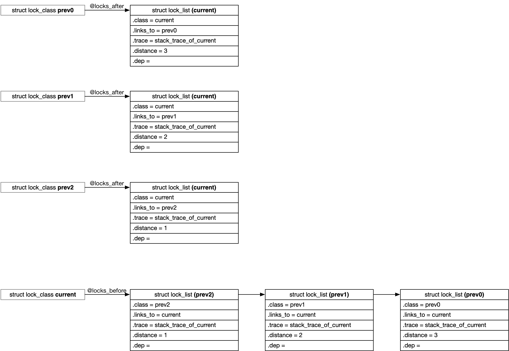

## Lockdep - 4 Internal

### lock class

lockdep 中使用 lock class 的概念来抽象一类锁，例如 struct inode 中的 @i_lock 就是一个 lock class，虽然 inode->i_lock 可能有很多实例，但是所有 inode->i_lock 的实例都属于同一个 lock class

```c
struct inode {
spinlock_t		i_lock;
...
}
```


> lock_class_key

通常在锁的初始化函数中会定义一个 static 的 lock_class_key 变量，例如 spinlock 的初始化函数中就定义了一个 static 的 lock_class_key 变量

```c
# define spin_lock_init(lock) \
do {								\
	static struct lock_class_key __key; \
	...
} while (0)
```


例如对于 inode->i_lock 来说，相当于在 inode_init_always() 中定义了一个 static 的 lock_class_key 变量

```
iget_locked
    alloc_inode
        inode_init_always
            spin_lock_init(&inode->i_lock);
```


> bind all lock instances to single lock_class_key

之后在锁初始化的时候，每个锁实例的 @lock->rlock->dep_map 字段就会指向对应的 lock_class_key

```
spin_lock_init
    __raw_spin_lock_init
        lockdep_init_map_wait
```

```c
struct lockdep_map {
	struct lock_class_key	*key;
	...
}
```


例如对于 inode->i_lock 来说，所有 inode->i_lock 实例的 @lock->rlock->dep_map 字段都会指向 inode_init_always() 中定义的 static lock_class_key 变量

```
inode1->i_lock -----+
                    |
inode2->i_lock -----+---->  static struct lock_class_key __key
                    |       (defined in inode_init_always())
inode3->i_lock -----+
```


> init lock class

需要注意的是，锁初始化之后还只是有一个 lock_class_key，此时尚未分配对应的 lock class，在第一次 lock 操作过程中才会分配对应的 lock class

```
spin_lock
    raw_spin_lock
        __raw_spin_lock
            spin_acquire(&lock->dep_map, ...)
                lock_acquire(&lock->dep_map, ...)
```

lockdep 框架使用一个全局的 classhash_table hash table 来管理所有的 lock class，在之后的 lock 操作过程中就可以在这个 hash table 中找到当前锁对应的 lock class

lock class 在这个全局 hash table 中的 hash 值由 __classhashfn() 描述，实际上就是对 lock_class_key 的地址作 hash 运算得到的一个 hash 值

```c
#define __classhashfn(key)	hash_long((unsigned long)key, CLASSHASH_BITS)
#define classhashentry(key)	(classhash_table + __classhashfn((key)))
```

而由于同一类锁的不同实例会共享同一个 lock_class_key，因而同一类锁的不同实例实际上也就会共用同一个 lock class


### single lock - inconsistent lock state

> usage_mask

lock class 的 @usage_mask bitmask 描述当前这个锁在过往的历史中，曾经在哪些状态下上过锁

```c
struct lock_class {
	/* IRQ/softirq usage tracking bits: */
	unsigned long			usage_mask;
	...
}
```

所有的状态包括

```c
enum lock_usage_bit {
	LOCK_USED_IN_HARDIRQ,
	LOCK_USED_IN_HARDIRQ_READ,
	LOCK_ENABLED_HARDIRQ,
	LOCK_ENABLED_HARDIRQ_READ,
	
	LOCK_USED_IN_SOFTIRQ,
	LOCK_USED_IN_SOFTIRQ_READ,
	LOCK_ENABLED_SOFTIRQ,
	LOCK_ENABLED_SOFTIRQ_READ,

	LOCK_USED,
	LOCK_USED_READ,
}
```

例如 LOCK_USED_IN_HARDIRQ 表示在 HARDIRQ context 下上过锁 (writelock)，LOCK_USED 则只是表示曾经上过锁


例如对于 spinlock 来说

- 在 HARDIRQ context 中调用 spin_lock() 就会置位 LOCK_USED_IN_HARDIRQ、LOCK_USED bit
- 在 SOFTIRQ context 中调用 spin_lock() 就会置位 LOCK_USED_IN_SOFTIRQ、LOCK_ENABLED_HARDIRQ、LOCK_USED bit
- 在 PROCESS context 中调用 spin_lock() 就会置位 LOCK_ENABLED_HARDIRQ、LOCK_ENABLED_SOFTIRQ、LOCK_USED bit

---

> check for "inconsistent lock state"

上锁过程中就会检查当前的状态是否与 @usage_mask 中记录的历史状态

```
lock_acquire
    __lock_acquire
        mark_usage
            mark_lock
                mark_lock_irq
                    valid_state
```

例如当前是在 HARDIRQ context 即 LOCK_USED_IN_HARDIRQ 中上锁，而 @usage_mask 中 LOCK_ENABLED_HARDIRQ bit 被置位，即这个锁在 LOCK_ENABLED_HARDIRQ 状态下也会上锁，此时就会报错 "inconsistent lock state"


### single lock - recursive locking

> lock chain

每个进程的 @held_locks[] 数组维护该进程获取的 lock stack，@lockdep_depth 描述该 lock stack 的深度

例如 @held_locks[0] 描述进程获取的第一个锁，@held_locks[1] 描述进程在持有以上锁的基础上获取的第二个锁，...

```c
struct task_struct {
	u64				curr_chain_key;
	int				lockdep_depth;
	struct held_lock		held_locks[MAX_LOCK_DEPTH];
	...
}
```


struct held_lock 描述进程在获取这个锁时的上下文信息

```c
struct held_lock {
	unsigned long			acquire_ip;
	struct lockdep_map		*instance;

	/*
	 * class_idx is zero-indexed; it points to the element in
	 * lock_classes this held lock instance belongs to. class_idx is in
	 * the range from 0 to (MAX_LOCKDEP_KEYS-1) inclusive.
	 */
	unsigned int			class_idx:MAX_LOCKDEP_KEYS_BITS;
	...
}
```

@class_idx 描述对应的 lock class

之前描述过，锁第一次执行 lock 操作时会分配对应的 lock class，这个 lock class 实际上是从 @lock_classes[] 全局数组分配的；@class_idx 就描述了当前获取的锁对应的 lock class 在 @lock_classes[] 数组中的 index，即当前获取的锁对应的 lock class 即为 @lock_classes[@class_idx]

@acquire_ip 描述进程获取该锁时的指令地址，例如 "i915_reset_trylock+0x0/0x310"

@instance 描述对应的锁实例，即进程当前需要获取的锁的 @lock->rlock->dep_map 字段


- push to lock chain

上锁过程中会将当前获取的锁封装为对应的 struct held_lock 结构，之后添加到当前进程的 lock chain

```sh
lock_acquire
    __lock_acquire
        hlock = curr->held_locks + curr->lockdep_depth;
        # init hlock
        curr->lockdep_depth++
```


- pop from lock chain

释放锁过程中会将当前获取的锁封装为对应的 struct held_lock 结构，之后添加到当前进程的 lock chain

```sh
lock_release
    __lock_release
        curr->lockdep_depth--
```

----

> check for "recursive locking"

上锁过程中会遍历当前进程的 lock chain，如果 lock chain 的其中一环与当前获取的锁具有相同的 lock class，就说明可能对同一个锁重复上锁，此时会报错 "recursive locking"

```sh
lock_acquire
    __lock_acquire
        validate_chain
            check_deadlock
                # iterate lock chain of current task
                    if (hlock_class(prev) != hlock_class(this))
                        "recursive locking"
```


### multi lock - circular locking

> dependency graph

每个 lock class 维护该锁的 dependency graph

```c
struct lock_class {
	/*
	 * These fields represent a directed graph of lock dependencies,
	 * to every node we attach a list of "forward" and a list of
	 * "backward" graph nodes.
	 */
	struct list_head		locks_after, locks_before;
	...
}
```

在某一个上锁的路径中

```
prev0 -> prev1 -> prev2 -> [current]
```

current 会被添加到该路径中所有 prev 的 @locks_after 链表中，同时该路径中的所有 prev 会被添加到 current 的 @locks_before 链表中




@locks_after/@locks_before 链表中的元素都是 struct lock_list

@locks_after 链表中的一个元素就描述，@class 锁依赖于 @links_to 锁，@trace 描述获取 @class 锁时的调用栈

@locks_before 链表中的一个元素就描述，@links_to 锁依赖于 @class 锁，@trace 描述获取 @links_to 锁时的调用栈

```c
struct lock_list {
	struct list_head		entry;
	struct lock_class		*class;
	struct lock_class		*links_to;
	const struct lock_trace *trace;
	u16				distance;
	/* bitmap of different dependencies from head to this */
	u8				dep;
	...
};
```

@distance 描述锁路径中 @links_to 锁与 @class 锁的距离，例如上述路径中 current 与 prev2 的距离为 1，与 prev1 的距离为 2

@dep 描述 @links_to 与 @class 之间的依赖关系，其取值有

```c
#define DEP_SR_BIT (0 + (0 << 1)) /* 0 */
#define DEP_ER_BIT (1 + (0 << 1)) /* 1 */
#define DEP_SN_BIT (0 + (1 << 1)) /* 2 */
#define DEP_EN_BIT (1 + (1 << 1)) /* 3 */
```

```
SR: @prev is shared reader (->read != 0) and @next is recursive reader (->read == 2)
ER: @prev is exclusive locker (->read == 0) and @next is recursive reader
SN: @prev is shared reader and @next is non-recursive locker (->read != 2)
EN: @prev is exclusive locker and @next is non-recursive locker

Note that we define the value of DEP_*_BITs so that:
   bit0 is prev->read == 0
   bit1 is next->read != 2
```


上锁过程中就会维护 @locks_after/@locks_before 链表，从而构建 dependency graph

```sh
lock_acquire
    __lock_acquire
        validate_chain
            check_prevs_add
                check_prev_add
                    # add to @locks_after/@locks_before

```

需要注意的是，@locks_after/@locks_before 链表维护了 lock class 之间的 dependency graph，释放锁的过程中并不会将对应的元素从 @locks_after/@locks_before 链表中移除


> check for "circular locking"

上锁过程中会遍历当前进程的 lock chain，检查当前申请获取的锁是否与 lock chain 中已经获取的锁存在 ABBA 的情况，若存在就会报错 "circular locking"

```sh
lock_acquire
    __lock_acquire
        validate_chain
            check_prevs_add
                check_prev_add
                    check_noncircular
```


例如当前进程的 lock chain 为

```
prev0 -> prev1 -> prev2 -> [current]
```

那么会依次检查历史中 prev2 会不会依赖于 current、prev1 会不会依赖于 current、prev0 会不会依赖于 current

这一过程中是通过 BFS (Breadth First Search) 算法在 dependency graph 中搜索是否可能存在 current -> prev0/1/2 的路径，如果存在这样的路径，就会报错 "circular locking"


### multi lock - irq lock inversion

上锁过程中会通过 BFS (Breadth First Search) 算法在当前申请获取的锁 (acquiring lock) 的 dependency graph 中查找是否存在以下这种情况：

1. acquiring lock 本身是 irq-safe lock，同时 acquiring lock 之后 (@after_list 链表) 存在 irq-unsafe lock
2. 或者 acquiring lock 本身是 irq-unsafe lock，同时 acquiring lock 之前 (@before_list 链表) 存在 irq-safe lock

```sh
lock_acquire
    __lock_acquire
        mark_usage
            mark_lock
                mark_lock_irq
                    check_noncircular
```


### multi lock - safe->unsafe lock order

上锁过程中会遍历当前进程的 lock chain，检查当前申请获取的锁是否与 lock chain 中已经获取的锁存在 "safe->unsafe lock order" 情况

为方便叙述，将当前申请获取的锁记为 acquiring lock，lock chain 中任一个已经获取的锁记为 holding lock

检查过程中会通过 BFS (Breadth First Search) 算法在 dependency graph 中查找是否存在以下这种情况：holding lock 之前存在 irq-safe lock，同时 acquiring lock 之后存在 irq-unsafe lock，也就是说 holding lock -> acquiring lock 连通之后，导致 irq-safe lock -> irq-unsafe lock 连通

```
(irq-safe lock) -> holding lock -> acquiring lock -> (irq-unsafe lock)
```

```sh
lock_acquire
    __lock_acquire
        validate_chain
            check_prevs_add
                check_prev_add
                    check_irq_usage
```

