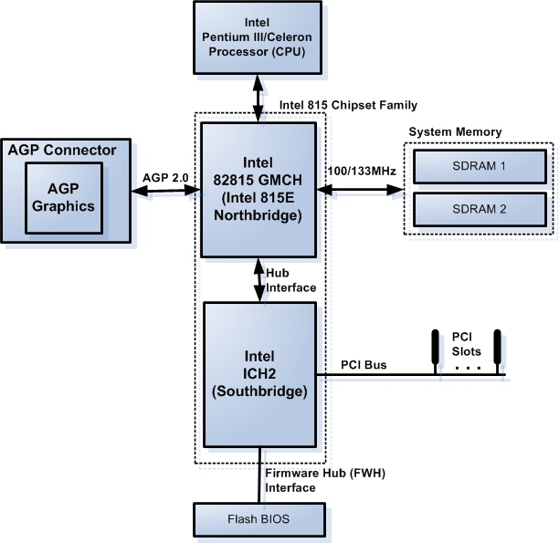
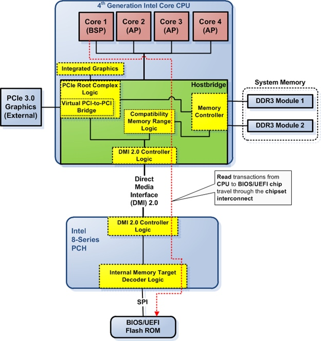

title:'Bus Hierarchy'
## Bus Hierarchy

Reference
[Column 2: A brief history of the PC](https://lennartb.home.xs4all.nl/coreboot/col2.html)


1. original system bus

```
                                        expansion slots
+----------+    +----------+        +---+   +---+   +---+
| 8088 CPU |    |    RAM   |        |   |   |   |   |   |
+----------+    +----------+        +---+   +---+   +---+
      |              |                |       |       |  system bus
==================================================================
      |              |                     |
+----------+    +----------+        +-------------+
| BIOS ROM |    |   DMA    |        | on-board IO |
+----------+    +----------+        +-------------+
```

在 PC 最初的架构中，只是使用一条 system bus 连接所有的 CPU、ROM、RAM、IO 单元，外部的 IO 设备可以通过 expansion bus 接入


2. local bus + expansion bus

```
                                          expansion slots
+-----------+    +----------+          +---+   +---+   +---+
| 80386 CPU |    |    RAM   |          |   |   |   |   |   |
+-----------+    +----------+          +---+   +---+   +---+
      |              |                   |       |       |
      |   local bus  |     +--------+    |       |       | ISA bus
===========================|  ISA   |===============================
      |                    | bridge |          |
      |                    +--------+          |
      |                                        |
+----------+                            +-------------+
| chipset  |                            | on-board IO |
+----------+                            +-------------+
```

之后 PC 架构的一大变化是，随着 CPU 主频的不断提升，CPU 和外部 IO 的时钟频率的差距逐渐拉大，例如当时的 80386 CPU 的时钟频率可以达到 25 MHz，而当前外设普遍使用的 ISA (Industry Standard Architecture) 总线的时钟频率则只有 8MHz

因而原来的 system bus 保留为 local bus，只是用于实现 CPU 与 RAM 之间的连接；ISA bus 实现外部 IO 的连接，ISA bus 与 local bus 之间通过 ISA bridge 实现桥接


此外架构的另一个变化是，随着硬件逻辑逐渐变得越来越复杂，板上的 DMA 控制器、中断控制器、时钟这些设备逐渐集合封装为一个 chipset


3. north bridge + south bridge

```
+-------------+
| Pentium CPU |
+-------------+
       |
       | local  bus
       |
+--------------+    +---------+
| north bridge | -- |   RAM   |
+--------------+    +---------+
       |                                PCI slots
       |                +---+   +---+   +---+
       |                |   |   |   |   |   |
       |                +---+   +---+   +---+
+--------------+          |       |       |
| south bridge | -----------------------------  PCI bus
+--------------+          |
                          | 
                    other IO bus (SPI, ISA, ...)
```

随着 CPU 主频与外部 IO 设备的时钟频率的差距进一步拉大，local bus + expansion bus 的架构设计得到保留

此时原先的 chipset 演变为 north bridge，其中就包含了原先的 DMA 控制器、中断控制器、内存控制器、时钟等设备，Intel 也将 north bridge 称为 MCH (Memory Controller Hub)

此外 PCI 总线逐渐取代原先的 ISA 总线，成为外部 IO 设备的连接总线，原先的 ISA bridge 也演变为 north bridge，其中就包含了 PCI 控制器，Intel 也将 south bridge 称为 ICH (IO Controller Hub)




4. south bridge

```
+---------+    +------------+    
|   RAM   | -- |  Core CPU  | ------------------------ PCIe Gen3.0
+---------+    +------------+     |       |       |
                     |          +---+   +---+   +---+
                     |          |   |   |   |   |   |
                     |          +---+   +---+   +---+
             +--------------+                   PCIe slots
             | south bridge |
             +--------------+
                     | 
                other IO bus (PCIe Gen 2.0, SATA, USB, ...)
```

随后 PCIe 总线开始取代原先的 PCI 总线，成为高速 IO 设备的接入总线，同时 north bridge 被封装到 CPU 内部，称为 host bridge，由于 host bridge 内部集成了内存控制器、PCIe 控制器，因而此时内存和 PCIe 可以直接与 CPU 连接

此时外部 IO 设备还是通过 south bridge 进行接入，此时 Intel 将 south bridge 称为 PCH (Platform Controller Hub)


